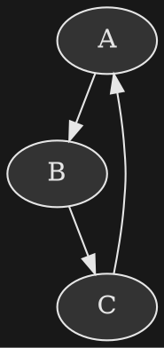

+++
title = "A Basic Graphviz Dark Theme Config"
date = "2024-06-20T16:14:03-07:00"
+++

I regularly use Graphviz to generate... graph visualizations.  Since my website and blog are all dark-themed, I usually want to set it up so that the generated SVG is dark-themed as well.

Here's the basic config I use to make graphviz produce outputs with dark backgrounds and light content:

That results in an output that looks like this:

You can of course tweak the hex color to your liking.  There may be some fancy elements you can add that this doesn't cover, but it should be all you need for most cases.
