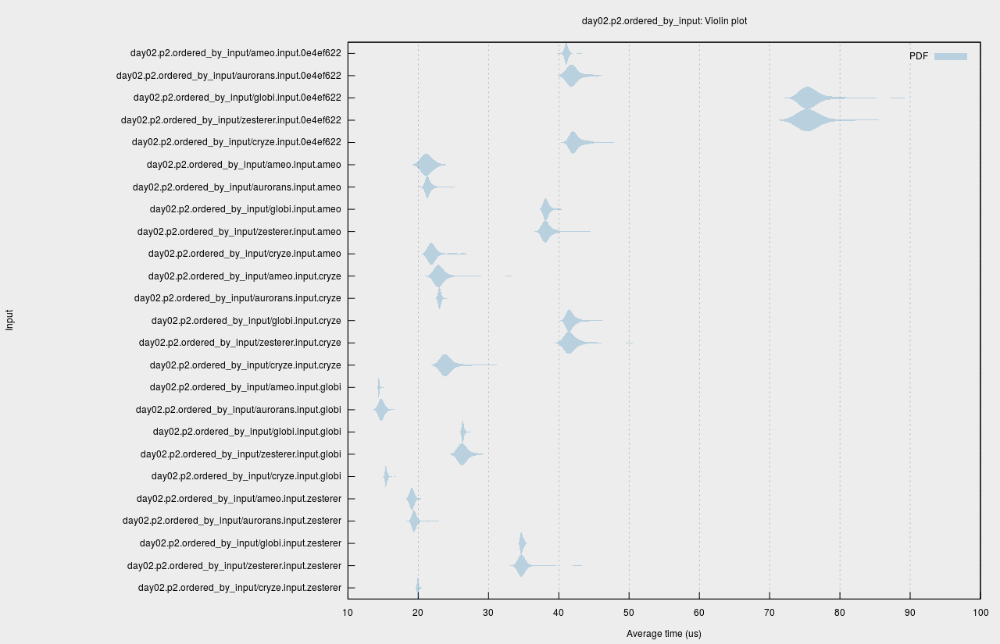

For the first time, I took part in the [Advent of Code](https://adventofcode.com/) this year. If you haven't heard of it, it's a daily programming challenge that can be solved in any programming language. People compete to be in the first 100 to make it on the leaderboard, or just use it as an opportunity to learn a new programming language.

I used Rust for every day's challenges. On the unofficial Rust programming language Discord server, a dedicated channel was created and dozens of people took part. I did my best to compete for the global leaderboard as well as the private leaderboard for the Discord server. Although it's clear that Rust is at a significant disadvantage compared to languages like Python when competing for raw coding speed, I (and others) still managed to make it to the global leaderboard on multiple occasions.

My main goal going into this was to improve my Rust programming skills, get to know some other people in the Rust community better, and have fun. What I didn't anticipate was the large amount of friendly meta-competition that would emerge on the Discord server, trying to create the solutions that ran the fastest as well. Every day, there were active discussions going on there with people comparing solutions, asking for or giving help, and just hanging out. The daily ritual of getting my cup of coffee and settling down to work on the new AOC was very comfortable, and I was happy to have it a part of my advent routine.

Rust was very present in the Advent of Code community with people contributing a ton of Rust-related content. In the daily solutions thread on the [/r/aoc subreddit](https://reddit.com/r/adventofcode), there were always several Rust solutions posted. Advent of Code really helps show off the things that make Rust shine, demonstrating the power and utility of many community-created crates as well as the language itself.

## Highlights

There were a couple days in particular that I found especially interesting, either showing off some Rust feature or library especially well or posing a challenge that was a unique experience to tackle in Rust. Although each day brought something new, here were some of my favorites:

### Day 2 Part 2: SIMD using `packed-simd`

The first one was [Day 2](https://adventofcode.com/2018/day/2), which involved finding the differing characters between a large set of strings. In particular, the goal was to find which strings differed by exactly one character and then return the letters that were common between them.

At this point, everyone in the Rust Discord server was excited and motivated to find _the_ most optimal solution to the problem. Since the challenge itself was pretty simple (mostly just a loop comparing ASCII strings and counting characters), low-level optimization techniques became applicable. Eventually, it got to the point where the only way to make further progress was to use SIMD.

Coincidentally, Rust has support for safe (staticly verified by the compiler) SIMD via the `packed-simd` library. I'd never before worked with SIMD directly before and only had a surface level understanding of SIMD programming, but I decided to take the dive and try it out on the problem.

I dug through the library's documentation for a while, learning about how it was structured and finding some operations that I thought would be useful for the problem. The `packed-simd` library presented a variety of SIMD data types as normal Rust structs. For example, a vector containing 4 `i32` vars was named `i32x4`. I eventually settled on a solution that involved converting the input ASCII into 32-byte wide vectors padded with zeroes at the end, making them 256 bits wide. The code that I came up with for doing that looks like this (`get_shift_mask` is a function that returns a SIMD bitmask equivalent to `11111111111111111111111111100000`):

```rust
let shift_mask: m8x32 = get_shift_mask();

let mut parsed_input: [u8x32; LINE_COUNT] = unsafe { mem::uninitialized() };
for (i, slot) in parsed_input.iter_mut().enumerate() {
    let input_offset = i * LINE_LENGTH_WITH_NEWLINE;
    let p = slot as *mut packed_simd::Simd<[u8; 32]>;

    let line_slice =
        unsafe { slice::from_raw_parts((&INPUT_BYTES as *const u8).add(input_offset), 32) };
    let packed_line = unsafe { u8x32::from_slice_unaligned_unchecked(line_slice) };
    // replace the last 5 bits with zeroes
    let packed_shifted_line = shift_mask.select(packed_line, u8x32::splat(0));

    unsafe { p.write(packed_shifted_line) };
}
```

Once the input strings were packed into SIMD registers, it was possible to compare them with each other using a byte-wise equality operation, which returned a mask representing if each of the individualy bytes (ASCII characters) were equal or not. So, let's say that we had the following input strings to compare:

```
qysdtiklcagnpfozlwedmhqbvx\n
qjsdtiklcagnpfozubejmhrbvq\n
```

These would get padded with zeroes on the right and packed into 256-bit vectors that look like this:

```
71 79 73 64 74 69 6b 6c 63 61 67 6e 70 66 6f 7a 6c 77 65 64 6d 68 71 62 76 78 0a 00 00 00 00 00
71 6a 73 64 74 69 6b 6c 63 61 67 6e 70 66 6f 7a 75 62 65 6a 6d 68 72 62 76 71 0a 00 00 00 00 00
```

After performing the byte-wise comparison between them, the following bitmask would be produced:

```
 1  0  1  1  1  1  1  1  1  1  1  1  1  1  1  1  0  0  1  0  1  1  0  1  1  0  1  1  1  1  1  1
```

This mask now represents which characters are equal between the two strings being tested, with equal characters represented by a `1` and differing characters represented by a `0`. The next step was to expand this bitmask into a 32-byte vector of bytes, with each binary `1` turning into a binary `0x00` and each binary `0` turning into a `0x01`. The result looks like this:

```
00 01 00 00 00 00 00 00 00 00 00 00 00 00 00 00 01 01 00 01 00 00 01 00 00 01 00 00 00 00 00 00
```

The final step to determine how many characters differ between the two strings is to do a horizontal sum of the entire vector. Each individual byte is added to each adjascent byte in order like `0x00 + 0x01 + 0x00 + 0x00 ...` to get a final result of `0x06` or 6 differing characters between the two strings.

This was repeated for each of the combinations of input strings until one was found that differed by exactly one character, at which point the common characters were printed out and the function returned. Although results varied depending on the individual inputs of different users, this SIMD-based approach clearly beat any competing solutions that attempted to rely on compiler auto-vectorization or other tricks.

---

When I shared the results in the Discord server, several other users took my initial solution and optimized it in various ways. I compiled a [Reddit comment](https://www.reddit.com/r/adventofcode/comments/a2hhw1/manually_vectorizing_d2p2/eayfbif/?context=3) on the AOC subreddit which went over the individual contributions of different users, which I've copied in part here:

> We've been having a friendly competition over in the Rust programming language community discord all night, comparing solutions and trying to come up with the all around fastest implementation.
>
> ...
>
> [/u/Aurorans_Solis](https://www.reddit.com/u/Aurorans_Solis) did a bunch of optimization off of [my initial SIMD solution], lifting things into constants and creating the compile-time packing macro. They also did a bunch of experimentation with reversing the directions in which the iterators are consumed, yielding considerable gains for some inputs due to the variety of different inputs.
>
> [/u/CryZe92](https://www.reddit.com/u/CryZe92) optimized the iterators in order to avoid re-checks in reverse order by using a triangular iterator (although Aurorans also did this independently). They also did a bunch of assembly analysis to see what effect various tweaks had, seeing the different code produced by AVX-512, and just helping everyone with tons of info in general. They also created a completely safe version (most of the others made extensive use of `unsafe` code in an attempt to make things that bit faster) which ended up being almost exactly as fast as the best unsafe version.
>
> [/u/Globinette](https://www.reddit.com/u/Globinette) set up and ran a Rust benchmarking library called [`criterion`](https://github.com/japaric/criterion.rs) to produce really pretty [benchmark results](http://glo.bi/AoC/2018/day02.p2.ordered_by_input/report/) for the implementations of several different users.
>
> [/u/zesterer](https://www.reddit.com/u/zesterer) created a solution using wrapping subtraction and .min() that seems to be the new best of the Rust implementations with an inner loop that looks like this:
>
> ```rust
> for i in 0..250 {
>     for j in i + 1..250 {
>         if (rail[i] - rail[j]).min(u8x32::splat(1)).wrapping_sum() == 1 {
>             return i;
>         }
>     }
> }
> ```
>
> All in all, it's been a really fun time learning about and playing with SIMD in Rust and going so in-depth optimizing something. Idk if we'll end up putting this much effort into future days, but it's been a really great time working with everyone on this one.

[Globi](https://github.com/globidev) was kind enough to create and host benchmarks for the various implementations of different users. They made use of the [`criterion`](https://github.com/japaric/criterion.rs) benchmarking suite to generate very nice visualizations of the performance of different users' solutions on various inputs, creating a [report](http://glo.bi/AoC/2018/day02.p2.ordered_by_input/report/) and this violin plot for Day 2 Part 2:



`criterion` was included as part of the [`cargo-aoc`](https://github.com/gobanos/cargo-aoc) library created by [gobanos](https://github.com/gobanos) which included functionality for automatic input downloading, challenge organization, executing, and benchmarking. I didn't make use of `cargo-aoc` myself, but I know that several others in the Discord server did.

[CryZe](https://github.com/CryZe), popular around the Rust community for his WebAssembly work including [LiveSplit](https://github.com/LiveSplit/LiveSplit) (a utility for video game speedrunners) and his [wasm-to-rust](https://github.com/CryZe/wasm-to-rust) compiler, created what I feel is the culmination of our collective efforts with this clear, succinct, and fully safe implementation:

```rust
pub fn part2_simd<'a>(lines: impl Iterator<Item = &'a str>) -> Option<String> {
    #[repr(align(32))]
    #[derive(Copy, Clone)]
    struct Line([u8; 32]);

    let mut storage = [u8x32::splat(0); 250];
    let mut buf = Line([0; 32]);
    for (storage, line) in storage.iter_mut().zip(lines) {
        let line = line.trim_end();
        buf.0[..line.len()].copy_from_slice(line.as_bytes());
        *storage = u8x32::from_slice_aligned(&buf.0);
    }

    for (i, &a) in storage.iter().enumerate() {
        for &b in &storage[i + 1..] {
            if a.eq(b).select(u8x32::splat(1), u8x32::splat(0)).wrapping_sum() == 31 {
                let mut buf = String::with_capacity(25);
                let a: [u8; 32] = a.into();
                let b: [u8; 32] = b.into();
                for (&a, &b) in a.iter().zip(&b) {
                    if a == b {
                        buf.push(a as char);
                    }
                }
                return Some(buf);
            }
        }
    }

    None
}
```

The performance is equivalent within the margin of error to any other solution using `unsafe` code, and the whole thing fits into just 30 lines of understandable code. I think that Rust's strengths are really demonstrated here; low-level SIMD logic is represented in an intuitive manner with self-explanatory data types like `u8x32` and operations like `.wrapping_sum()`. Everything is type-checked by the compiler, and Rust's iterators make both parsing the input and looping over it during comparison very explicit. The generated assembly is also [downright beautiful](https://gist.github.com/CryZe/5895306177cc351b43e50ac7481bec90).

---

After sharing these results on the AOC subreddit, [/u/askalski](https://www.reddit.com/u/askalski) (an AOC user famous for contributing extreme solutions to the challenges) contributed a C++17 solution using raw SIMD intrinsics which optimizes the result even further:

```cpp
// clang++ -O3 -march=native -std=c++17 simd.cpp
#include <cstdio>
#include <vector>
#include <x86intrin.h>

int main() {
    std::vector<__m256i> v;

    // Assumes all input lines are exactly 26 characters long
    char buf[32] = {};
    while (fgets(buf, sizeof(buf), stdin)) {
        buf[26] = 0; // For safety
        v.push_back(*reinterpret_cast<__m256i*>(buf));
    }

    for (auto x = v.begin(); x != v.end(); x++) {
        for (auto y = x + 1; y != v.end(); y++) {
            // Parallel compare 8x32 vector, convert to bitmask of differences
            auto cmp_ne = ~_mm256_movemask_epi8(_mm256_cmpeq_epi8(*x, *y));
            // Get lowest bit in difference mask
            auto diff1 = _blsi_u32(cmp_ne);
            // Was it the only difference?
            if (diff1 == cmp_ne) {
                auto s = reinterpret_cast<char *>(&*x);
                // Get the index of the difference
                auto diff_idx = _bit_scan_forward(diff1);
                // Output all but the difference
                printf("Part 2: %.*s%s\n", diff_idx, s, s + diff_idx + 1);
                return 0;
            }
        }
    }

    printf("Part 2 solution not found\n");

    return 0;
}
```

Some of these operations such as the `_blsi_u32` (Extract Lowest Set Isolated Bit) and `_bit_scan_forward` (find the index of the first `1` bit) seem to not be available using `packed-simd`, but are probably available using the intrinsics in a similar manner to the C++ solution. If anyone knows how to make use of these operations using `packed-simd` or otherwise in Rust, I'd love to see it and include it here!

### Days 5 and 15: Free Performance Boosts with `rayon`

A trend that some other AOC participants noticed was that most of the challenges were very stateful and riddled with serial dependencies that made them difficult to multi-thread or implement in purely functional languages. However, there were several instances where the goal was to find the first instance where some situation occurs. Using a binary search to find the first number where it happens was viable for some, but invalid for others.

In these situations, there was really no reason not to use [`rayon`](https://github.com/rayon-rs/rayon) to get a free performance boost via multi-threading. Using a dead-simple `.into_par_iter()` followed by `.find_first()` worked for both Day 5 and Day 15, serving as a reminder of just how nice `rayon` is. Here's my Day 15 Part 2 solution for context:

```rust
fn part2() -> usize {
    (0..100usize)
        .into_par_iter()
        .map(|cur_elf_attack_power| solve(cur_elf_attack_power, true, false, false))
        .find_first(|opt| opt.is_some())
        .unwrap()
        .unwrap()
}
```

### Day 20: Parsing with `nom`

[Day 20](https://adventofcode.com/2018/day/20) was based around parsing a regular expression that encoded a map via individual movement directions on a square grid. The input looked like this (taken from the given example; the actual input looked like this but waaay longer):

```
^ENWWW(NEEE|SSE(EE|N))$
```

This Regex encodes the directions to all reachable rooms in a 2D building, creating a map that looks like this:

```
#########
#.|.|.|.#
#-#######
#.|.|.|.#
#-#####-#
#.#.#X|.#
#-#-#####
#.|.|.|.#
#########
```

Parsing this was tricky. Since all of the different `|`-separated paths inside of parenthesis could be thought of as branches in a tree and each of those branches could in turn have branches, the resulting structure seemed to be best represented by a tree. I came up with this data structure to represent the instructions:

```rust
enum MovementDirection {
    N,
    S,
    E,
    W,
    /// A branch contains a collection of alternate paths that can be taken
    /// along with a flag for if the branch can be skipped entirely.
    Branch(Vec<Vec<MovementDirection>>, bool),
}
```

I originally didn't know how to approach parsing this. I tried hand-coding a recursive parser that pulled characters off of the input, returning what it parsed along with the rest of the unparsed input, but I soon got lost in a sea of recursion. Since any chances of getting on the leaderboard were long gone, I decided to give [`nom`](https://github.com/Geal/nom) a try. If you're unfamiliar, `nom` is a parser combinator framework that uses a macro-based approach for creating parsers and processing files byte by byte.

I'd not used `nom` before myself. I'd read a few blog posts and checked out its repo on more than one occasion, but I never actually used it in a project. After a while spent reading through some examples and exploring the documentation (along with the master [parser combinator list](https://github.com/Geal/nom/blob/master/doc/choosing_a_combinator.md)), I managed to create a parser that looks like this:

```rust
fn movement_direction_from_c(c: char) -> MovementDirection {
    match c {
        'N' => MovementDirection::N,
        'S' => MovementDirection::S,
        'E' => MovementDirection::E,
        'W' => MovementDirection::W,
        _ => unreachable!(),
    }
}

named!(branch<&[u8], MovementDirection>, do_parse!(
    tag!("(") >>
    path_list: separated_list!(tag!("|"), many0!(direction)) >>
    has_empty: opt!(char!('|')) >>
    tag!(")") >>
    (MovementDirection::Branch(path_list, has_empty.is_some()))
));

named!(
    direction<&[u8], MovementDirection>,
    alt!(map!(one_of!("NSEW"), movement_direction_from_c) | branch)
);

named!(all_directions<&[u8], Vec<MovementDirection> >, do_parse!(
    tag!("^") >>
    directions: many0!(direction) >>
    tag!("$") >>
    (directions)
));

pub fn parse_input(raw: &[u8]) -> Vec<MovementDirection> {
    all_directions(raw).expect("Failed to parse input").1
}
```

Once I figured out the unique macro system that `nom` uses to do its work and found the right parsers for the job, the rest pretty much just fell into place. The process starts by matching a `^` character and then uses the `direction` sub-parser to parse individual `MovementDirection` elements. The `branch` sub-parser recursively calls back to the `direction` parser to handle sub-paths, handling every situation nicely.

I was really impressed with how `nom` managed to let me create this non-trivial parser without encountering any lifetime or borrowing-related issues. The fact that all of the parser components were stateless no doubt helped, and the fact that `nom` took care of all of the details of keeping track of the remaining input etc. was really nice as well.

### Day 22: Memoization using the `cached` crate

On Day 22 Part 1, I managed to rank #47 on the global leaderboard. Day 22's instructions provided an algorithm for generating a 2D world that relied on recursively called functions. I recognized that it was a situation where memoization could be readily applied, so I pulled in the [`cached`](https://docs.rs/cached/0.8.0/cached/) crate and memoized one of the inner functions:

```rust
cached_key! {
    EROSION: UnboundCache<(isize, isize), isize> = UnboundCache::new();
    Key = { (x, y) };

    fn erosion_level(x: isize, y: isize, target_x: isize, target_y: isize, depth: isize) -> isize = {
        (get_geologic_index(x, y, target_x, target_y ,depth) + depth) % 20183
    }
}
```

This was enough to make the solution run almost instantly, and got me my placement.

Although memoization is something that Rust is usually bad at due to lifetime complications involving the cache, the `cached` crate takes care of all of the boilerplate behind the `cached_key!` macro. You just specify a cache type (bounded, time-limited, unbounded) and a key type based on the function's arguments and let it do the rest.

For part 2, the challenge required the optimal path between two coordinates in the world to be found. What complicated the situation was the face that the cost of moving from one square to the next was determined by some state that changed over time. This initially seemed very daunting, but I eventually figured out a solution using a custom coordinate type and the [`pathfinding`](https://docs.rs/pathfinding/1.1.10/pathfinding/) crate.

Rather than keeping track of the secondary state somewhere else, I encoded it into the coordinates themselves. This produced, in essence, a 3D world, where the third dimension was the possible states that the traveling entity could be at on any given coordinate. `pathfinding` allowed this to be represented seamlessly:

```rust
pub fn part2() -> usize {
    let ((target_x, target_y), depth) = parse_input();

    astar(
        &(0, 0, Some(Tool::Torch)),
        |&(x, y, tool)| iter_neighbors(x, y, target_x, target_y, tool, depth),
        |&(x, y, _tool)| manhattan_distance(x, y, target_x, target_y) as usize,
        |&(x, y, tool)| x == target_x && y == target_y && tool == Some(Tool::Torch),
    )
    .unwrap()
    .1
}
```

Day 22 (along with several of the other later challenges) were where external crates really shone. So much of the heavy lifting was handled for me, allowing for very succinct code to be written. Having crates.io as a centralized package repository presents a distinct advantage over languages like C++ where I'd have to search Github or wherever, download the dependency myself, and deal with any setup scripts that they might entail manually. With Rust, it was as easy as adding a line to `Cargo.toml` and `main.rs`.

### Day 23: Using the Z3 SMT Solver

[Day 23](https://adventofcode.com/2018/day/23) Part 2 was, in my opinion, the hardest one out of them all. 1000 nanobots were scattered out in a 3D world, each with a radius of effect as determined by the Manhattan distance, and the goal was to find the point in the world that 1) was within the radius of influence of the maximum number of nanobots and 2) was closest to the origin `(0, 0, 0)`.

Solving this with brute-force was out of the question - the nanobots had coordinates like `<33185729,39147641,8791322>` and radiuses like `57429174`. Maybe it would be feasible to do it on a GPU, but certainly not on the CPU. My initial attempt to solve it by iterating over a coarse grid and periodically refining it was met with little success, and I largely gave up on it.

One of the moderators of the Discord server, [`tinaun`](https://github.com/tinaun), managed to come up with a [mathematical solution](https://gist.github.com/tinaun/d1cab9a048f88fbfb11d020adc703f96) (I really don't know how/why it works; something to do with solving for the equations of virtual planes), but aside from recursive partitioning the most common way to solve this among other AOC participants seems to have been using the [Z3 SMT Solver](https://github.com/Z3Prover/z3).

I'd heard about Z3 in the past under the context of [a research paper](http://soarlab.org/publications/atva2018-bhr.pdf) where they used it to verify Rust programs as well as various blog posts that I happened across and vaguely understood, but it always seemed very academic and out of reach. I had pretty much given up on solving this one until I saw this [solution](https://gitlab.com/KonradBorowski/advent-of-code-2018/blob/master/src/day23/mod.rs) created by [xfix](https://gitlab.com/KonradBorowski/) in the Discord server. In addition to using some really nice tricks like `.ok_or("No nanobots")?;`, they used the [`z3`](https://docs.rs/z3/0.3.0/z3/) crate which wraps Z3 with Rust bindings to solve it.

SMT (standing for [Satisfiability Modulo Theories](https://en.wikipedia.org/wiki/Satisfiability_modulo_theories)) are logic statements that are expressed as equalities. Similarly to [SAT](https://en.wikipedia.org/wiki/Boolean_satisfiability_problem), many NP-complete problems can be converted into this form. You express your model in terms of logic including quantifiers, mathematical operations, and comparisons and then pass it into Z3. Z3 allows problems of this form to be encoded and solved using a variety of statistics, heuristics, and other advanced algorithms, all of which is set up and run auto-magically inside of Z3. In addition, recent versions include support for optimization, minimizing or maximizing variables with regards to some function.

I was very impressed, and decided to create my own solution (heavily based on theirs). Here's the gist of it:

```rust
#[allow(clippy::let_and_return)]
fn part2() -> i64 {
    let nanobots = parse_input().collect::<Vec<_>>();

    let z3_conf = z3::Config::new();
    let ctx = z3::Context::new(&z3_conf);
    let optimizer = z3::Optimize::new(&ctx);

    let x = ctx.named_int_const("x");
    let y = ctx.named_int_const("y");
    let z = ctx.named_int_const("z");

    fn abs<'ctx, 'a>(
        ctx: &'ctx z3::Context,
        x: &'a z3::Ast<'ctx>,
    ) -> z3::Ast<'ctx> {
        x.lt(&ctx.from_i64(0)).ite(&ctx.from_i64(-1).mul(&[&x]), &x)
    }

    let mut in_range = ctx.from_i64(0);
    for bot in nanobots {
        let bot_x = ctx.from_i64(bot.pos.0 as i64);
        let bot_y = ctx.from_i64(bot.pos.1 as i64);
        let bot_z = ctx.from_i64(bot.pos.2 as i64);
        let bot_radius_plus_1 = ctx.from_i64(bot.radius as i64 + 1);

        let dist_x = abs(&ctx, &bot_x.sub(&[&x]));
        let dist_y = abs(&ctx, &bot_y.sub(&[&y]));
        let dist_z = abs(&ctx, &bot_z.sub(&[&z]));
        let distance_to_bot = dist_x.add(&[&dist_y, &dist_z]);
        let is_in_range_of_bot = distance_to_bot.lt(&bot_radius_plus_1);
        in_range = in_range.add(
            &[&is_in_range_of_bot.ite(&ctx.from_i64(1), &ctx.from_i64(0))]
        );
    }
    optimizer.maximize(&in_range);

    let dist_x = abs(&ctx, &x);
    let dist_y = abs(&ctx, &y);
    let dist_z = abs(&ctx, &z);
    let distance_to_origin = dist_x.add(&[&dist_y, &dist_z]);
    optimizer.minimize(&distance_to_origin);

    optimizer.check();
    let model = optimizer.get_model();
    let res = model.eval(&distance_to_origin).unwrap().as_i64().unwrap();
    res
}
```

There's a lot to unpack here (it took me a good while to understand what was even going on in xfix's example; Z3's documentation was very sparse, and that of the `z3` crate was even more so). The basis is that you build up an expression (represented by the `Ast` type) which represents the system that you're modeling.

The implementation starts out by defining the variables that can be manipulated, the three coordinates of the point:

```rust
let x = ctx.named_int_const("x");
let y = ctx.named_int_const("y");
let z = ctx.named_int_const("z");
```

It is Z3's job to find the values for these variables which 1) satisfy the constraints of the model and 2) maximize/minimize a provided expression.

The next step is to encode the nanobots' positions and radiuses into the expression, allowing Z3 to reason about them mathematically. This is done by building up the `in_range_of` sub-expression, accumulating `1` for each in-range nanobot. This was the trickiest part to understand for me, but you can think of it as similar to this Rust code:

```rust
let in_range = if in_range(x, y, z, nanobots[0]) { 1 } else { 0 } +
    if in_range(x, y, z, nanobots[1]) { 1 } else { 0 } +
    if in_range(x, y, z, nanobots[2]) { 1 } else { 0 } +
    ...
```

The absolute value function along with the manhattan distance function both had to be encoded into the expression as well, making use of ternary logic via `.ite()` (if-then-else). Once the expression was constructed, it was simple to instruct Z3 to optimize the values of `x`, `y`, and `z` to maximize its value with:

```rust
optimizer.maximize(&in_range);
```

Since there were multiple possible points which satisfied this goal, the challenge specified that the Manhattan distance from point closest to the origin should be used as the result. It turns out that you can easily provide Z3 a second expression to optimize for, which is done here to minimize the distance to the origin:

```rust
let dist_x = abs(&ctx, &x);
let dist_y = abs(&ctx, &y);
let dist_z = abs(&ctx, &z);
let distance_to_origin = dist_x.add(&[&dist_y, &dist_z]);
optimizer.minimize(&distance_to_origin);
```

The final step is to extract the result (the `let` binding is necessary to get around lifetime issues):

```rust
optimizer.check();
let model = optimizer.get_model();
let res = model.eval(&distance_to_origin).unwrap().as_i64().unwrap();
res
```

I encountered a segfault for my solution on MacOS and only when building with `--release` which I couldn't track down; I don't know if it was an issue with the Rust library or Z3 itself.

In any case, I'm _extremely_ impressed with Z3. Even though it's not a directly Rust-related thing, working with and learning about Z3 was one of my favorite parts of AOC. Running the program, waiting 20 seconds, and then seeing a correct result get spit out was rather surreal. Even more than machine learning or anything else I've seen, Z3 really feels like magic. I spent a while time trying to read through some slides and other material about Z3, but couldn't remotely keep up with the advanced terminology and techniques that were discussed.

---

All in all, AOC was an amazing experience. I had a ton of fun, deepened my understanding of and skills with Rust, and got to know other members of the Rust community better. I'm not 100% sure if I'll participate next year (or at least as extensively) due to the large time commitment that it ended up requiring, but in any case I highly suggest that you at least take a look at AOC and give a few of the first challenges a try.

A big thanks to [Eric Wastl](https://twitter.com/ericwastl) for creating + managing AOC and making all of this possible!

I think it would be great to hear about other peoples' advent of code experiences with Rust. According to the survey, there were hundreds of people who participated in AOC that used it; I'd love to compare code and stories with other community members who also took part!

# Disclaimer

I completed the challenges without any outside help with a few exceptions:

- On Day 21 Part 1, I used an [ElfCode Decompiler](https://github.com/ttencate/aoc2018/blob/master/src/vm/decompiler.rs) written in Rust that the AOC participant [ttencate](https://github.com/ttencate/) created. That being said, I did the actual solving myself, using the decompiled ElfCode as a guide.
- On Day 21 Part 2, I ~~pretty much~~ just stole the algorithm for solving it from [/u/Morganmilo](https://www.reddit.com/r/adventofcode/comments/a86jgt/2018_day_21_solutions/ec8g4h2) on Reddit. My eyes just glazed over when staring at that ElfCode (even the decompiled version) and I just wanted it over with.
- On Day 23 Part 2, I based my solution using the Z3 SMT solver largely off that of the user [xfix](https://gitlab.com/KonradBorowski/advent-of-code-2018/blob/master/src/day23/mod.rs). I originally tried to do some kind of rough search with slowly increasing granularity, but early results weren't looking promising so I abandonded it. I'm glad I did this though, because learning about Z3 and the incredible power it has was very valuable.
- There were probably a few instances where users talking in the Discord server mentioned things while I was solving the challenges that helped me, but any full-blown spoilers were generally contained and I did my best to avoide them anyway.

You can find all of my solutions here: [https://github.com/ameobea/advent-of-code-2018](https://github.com/ameobea/advent-of-code-2018). I used the [`structopt`](https://docs.rs/structopt/0.2.14/structopt/) crate to build a simple CLI around it, allowing for individual days to be executed by runnning commands like `cargo run --release -- --day 13`. Note that you'll need to have Z3 installed on your system in order to build it.
