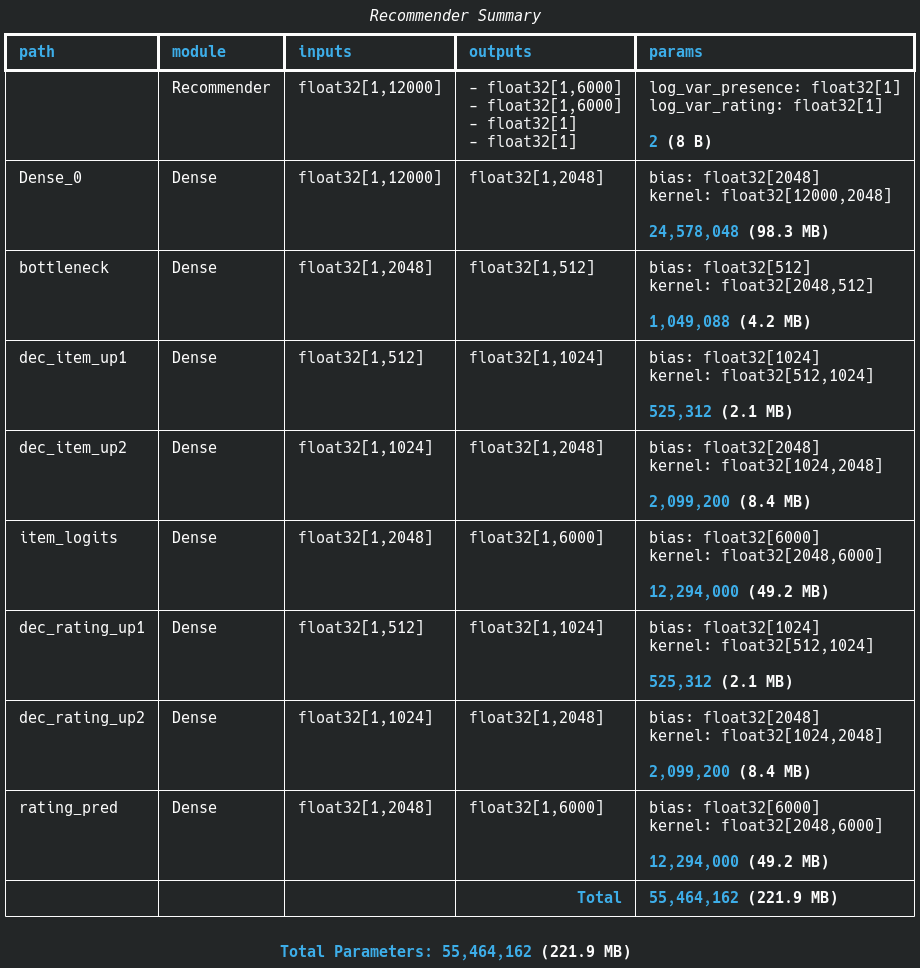
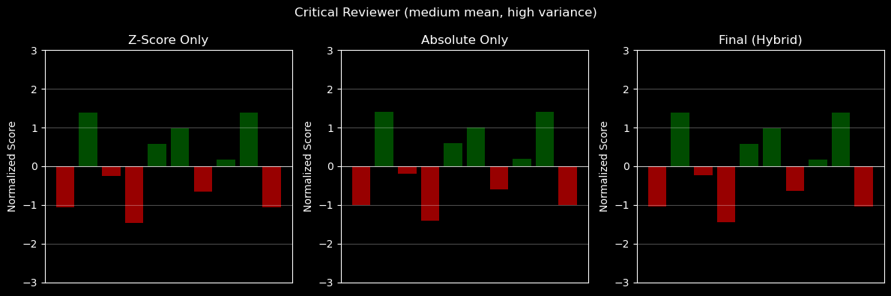

<div style="height: 20px"></div>

## Background

I've recently finished developing, training, and deploying a neural network-based recommender model.  It takes a user profile (consisting of a set of entities and optionally ratings for those entities) and outputs values that can be used to create an ordered list of recommendations based on it.

It does this by learning patterns across both different users as well as different entities at the same time.  The technical term for this is [Collaborative Filtering](https://developers.google.com/machine-learning/recommendation/collaborative/basics).

This model is the second iteration of the engine that powers [Sprout](https://anime.ameo.dev/) - an anime recommendation web app.  Although that use case is specific to anime, the underlying architecture is generic and can be applied to any kind of entity recommendation use case where users can also rate the entities on a liked/disliked scale.

Although I can't say I invented anything completely new for this model, I did a lot of research and pulled in a pretty big variety of tricks and useful techniques that I believe created a unique and effective result.  Based on my own anecdotal experience and some feedback from testers, it seems to be working quite well and generating high-quality, well-tailored recommendations.

## Model Architecture

The model follows the high-level design of a **Denoising Autoencoder**.  It uses user profiles as input (what shows the user watched and what they rated them) and holds out some percentage of its entries during training.  The model is then trained to re-construct the full profile, including the held-out entries.

Like all autoencoders, the model also has a bottleneck layer which is significantly smaller than the input.  This forces the model to learn to effectively compress the input into a more efficient internal representation rather than just passing it through or memorizing it.

Here's a diagram of the model's full architecture:

<div style="text-align: center">
  
</div>

It's a pretty small model as far as modern neural networks go, having a bit over 55 million parameters in total.  This is partially intentional in order to make the model efficient to serve on CPU, but it also turns out that smaller + simpler ends up just being better for this model in a lot of cases.



The model has a fixed-size corpus of 6000 shows that it knows about and can recommend.  This is acceptable for the anime recommendation case; the vast majority of shows that most people watch fit into that range.

As input, the model takes two sets of data concatenated together: 0/1 flags for not watched/watched and hybrid-normalized ratings for all the shows for which the user has supplied explicit ratings.  This is a richer representation than the previous model which just included normalized ratings, filling the rest in with zeroes.

I collected over 1.5 million public MyAnimeList profiles from real users to use as training data.  I used the official MyAnimeList API to collect it and applied some basic filtering to only retain users which have rated a show in the past 5 years and have some minimum number of entries total (30 iirc).

As output, the model is trained to predict both the probability of each show being in the user's profile as well as what the user would rate it if they were to watch it.  Both of these outputs are predicted separately from the same internal representation (the output of the bottleneck layer).

<div class="good padded">
This multi-task design is one of the model's most unique characteristics, and it's key to improving both the quality and tunability of the generated recommendations.
</div>

## Notable Details + Neat Tricks

With the exception of the cool multi-head decoder, the base model architecture is really quite simple.  However, there are a lot of crucial details and nuance that go into giving the model the ability to learn effectively and generate high-quality recommendations.  Some of these are drawn from prior art and some are unique solutions I developed for this specific use case.

Here's a selection of some of the most important and/or interesting ones, in no particular order.

### Multinomial Negative Log-Likelihood Loss for Presence

That name is admittedly very abstruse, but the reality of what it actually does is much simpler.

This is the loss function which is used for the presence head.  Essentially, it trains the model to predict the probability of each show being in the user's profile relative to all the other shows as a whole rather than individually.

Here's how it works:

1. Apply softmax to the output presence logits.  This makes it so that the values all sum up to 1, allowing them to be treated as a probability distribution.
2. Apply `-log` to all of the softmax outputs.  This is a mathematical trick which makes it so that smaller probabilities are mapped into larger values.  For the true-positive classes that are actually in the user's profile, we want the model to predict a probability as high as possible, so this method produces higher loss values for lower probabilities.
3. Sum up the negative log losses for all of the true-positive entities in the user profile being trained.  Then, take the average of that as the final loss value.  This ensures that the loss magnitude stays similar regardless of how large the user's profile is.

This method was introduced in the 2018 paper [Variational Autoencoders for Collaborative Filtering](https://arxiv.org/pdf/1802.05814), which is commonly referred to as "Mult-VAE".

One thing that surprised me about this approach was that only the losses for the true-positive cases are considered.  My initial intuition was that doing this would cause the model to be unconstrained in its outputs for the other entities, resulting in problems.

However, this is not the case.  The softmax function inherently penalizes the model for false-positive predictions.  This is due to the fact that if the model outputs a higher probability for one show, all of the other shows' probabilities must get lower as a result since the outputs of softmax sum to 1.

In the old recommender model I was using previously, I was just using simple mean-squared-error loss.  This resulted in the model heavily skewing towards recommending very popular shows for almost all users.  I had to do extensive post-processing of the model outputs as a result, heavily boosting the scores of less-popular shows so that they would show up more often in the generated recommendations.

The negative log-likelihood part of this new loss function helps with that as well.  `-log(0.2)` is ~1.6, `-log(0.02)` is ~3.9, and `-log(0.002)` is ~6.2.  Taking the log makes it so that the loss increases linearly as the probability goes down exponentially which makes for much more stable training and more consistent results.  The model is penalized less for false-positives overall as well which is great for recommendation use cases.

### Huber Loss for Ratings

For the ratings head, I used Huber loss.  Huber loss is kind of like a hybrid between mean squared error and mean absolute error.  There's a configurable delta parameter (I used delta=1 here) at which point the loss switches from increasing quadratically to linearly.

This is very useful for the rating prediction use case.  Part of the reason for this is that there's just a really large amount of user-to-user variation in ratings.  It's quite a noisy signal, so preventing the loss from shooting up dramatically helps to avoid big gradient spikes during training.

Also, my rating feature uses a semi-normalized scale based on each user's unique rating distribution.  This can result in the encoded rating value being dramatically different for a rating of 6/10 compared to 8/10 for some users.  Huber loss also helps in this case, guiding the model to learn overall patterns in ratings across the whole user population without penalizing it extremely hard for outliers.

### Custom Hybrid-Normalized Ratings Feature

Speaking of the ratings feature, I believe that this is actually one of the most crucial additions I made for the model, and I'm quite proud of it.

One of the most common pieces of feedback I got from users for the old model was that it used a fixed mapping for converting the 1-10 scale of MyAnimeList ratings to inputs for the model.  I created a lookup table which mapped possible rating value to a number from -1 to 1 using my own estimate of what the typical MAL user's rating distribution was.

<div class="note padded">
As it turns out, there's a LOT of variety in the ways that real users rate shows.
</div>

Most users rate almost everything they watch pretty highly, with a mean of 7 or 8 stars, and then have a few outlier shows with low ratings.  However, other users will try to use a more objective scale where 5 is good and higher ratings are reserved for their very favorite shows.  Still other users use truly unique or exotic rating schemes, such as rating all shows either 1 or 10 for liked/disliked for example.

To deal with this, I compute z-scores for all the users' ratings.  This centers ratings at the mean and spreads out ratings more.

<div class="warning padded">
Although using z-score is the mathematically "correct" way to normalize user ratings, I found that using it resulted in worse recommendation quality compared to the original method.
</div>

Since many (most?) users have a pretty low variance in their rating distribution, using pure z-scores for the ratings feature would sometimes make it so that a rating of 7 stars looked "bad" to the model (got a negative value) even though it's something that they actually enjoyed.

<div class="good padded">
To counteract this, I devised a hybrid rating feature that dynamically combines z-scores and absolute scores, weighing between them based on user-specific variation in ratings.
</div>

If the user has a very low variance in their ratings, we tend more towards using the absolute scale in order to avoid fully washing out the overall positive/negative bias of their ratings.  If the user already has a high variance, we weight more towards the z-score, and it acts mostly as a scale-and-shift operation.

Here are some examples of how the ratings for a set of example users are transformed using this approach:





So to summarize, this approach serves to help smooth over variation in user-to-user rating schemes as well as expand the range between ratings for users with low variance, all while preserving a portion of the absolute high/low signal from the original 1-10 scale.  I've found that it works very well for this recommender model and serves as an excellent feature for it to learn.

### Homoscedastic Uncertainty Weighting for Multi-Task Objective

Since the model is being trained to predict both presence and rating, there are two separate loss values that are computed.  It's possible to just add them together during training and use that to compute gradients, but a more sophisticated approach exists which is referred to as "Homoscedastic Uncertainty Weighting".

It was introduced in a 2017 research paper called [Multi-Task Learning Using Uncertainty to Weigh Losses for Scene Geometry and Semantics](https://arxiv.org/pdf/1705.07115).  It's another jargon-heavy name, but again the underlying idea isn't all that difficult to grasp once you make it past the math jargon.

Its main premise is that certain objectives are harder for the model to learn (more uncertain) than other objectives.  "Homoscedastic" refers to the uncertainty being treated as task-dependent rather than sample-dependent.

We want to give the model a way to scale the losses in such a way that the noisier/less-certain objectives are turned down wrt. the more certain losses.  This guides the model to balance between learning each of the objectives while also minimizing perturbations in the gradient from the noisier losses during training.

It also helps the case where losses from different objectives have different magnitudes due to different loss functions or data characteristics.  It's possible to manually pick loss scale factors which bring them mostly in line with each other, but uncertainty weighting does it automatically while also providing other benefits.

To achieve this, a learnable scalar parameter is added to the model for each loss being weighted.  These params are used to scale the losses for each of the objectives, and the model optimizes the value of those parameters during training like all the other params.

The uncertainty weighting method uses a clever method to keep the model from just turning all the losses down to zero, which is what would happen if we just computed the losses as `presence_scale * presence_loss + rating_scale * rating_loss`.  It penalizes the model for turning the loss down and rewards it for turning it up, encouraging it to put the loss as high as it can for each task.

My actual implementation looks like this:

```py
# `log_var_presence` and `log_var_rating` are the learnable parameters
precision_p = jnp.exp(-log_var_presence)
precision_r = jnp.exp(-log_var_rating)

weighted_loss = (precision_p * presence_loss + log_var_presence) + (
    precision_r * rating_loss + log_var_rating
)
```

Since these parameters evolve during training, the model is free to nudge them to optimal values as the individual objective losses reduce over time.

<div class="good padded">
After introducing this uncertainty weighting to my model, I found that the model attained a significantly lower loss on the rating objective while preserving an almost identical loss for the presence objective.
</div>

I believe that the main reason for that is the magnitude of the huber loss for ratings is ~2 orders of magnitude smaller than the multinomial loss for presence, so the loss weighting just helps the gradient for the rating loss show up more overall.

However, I found that the uncertainty weighting offers better results overall than just using a pre-scaled loss.  It could be a coincidence based on the way the training dynamics work out (prioritizing presence higher early in training, and then shifting to be more balanced as the scale params settle to optimal values) or something else.

In any case, this is a pretty simple method to implement and it seems to me that it's almost universally a net positive for multi-objective learning tasks like this.

### Swish Activation Function

In my original model and early versions of this new model, I used the `tanh` activation function for all the interior layers.  My intuition was that `tanh` is a solid default and appropriate for shallow models, while `ReLU` was a good choice for deep networks.

<div class="note padded">
While doing some research, I heard that the Swish/SiLU activation function is largely considered to be a better modern choice compared to tanh, and can usually be dropped-in with no other changes required.
</div>

I was a bit dubious since `tanh` and Swish seemed dramatically different to me, but when I tried it the results were clear:

<div class="good padded">
Swish improved both the speed at which the model learned as well as reduced the final loss at the end of training with no visible downsides.
</div>

I'll be using Swish as my default activation function for all models going forward, and I highly recommend trying it out for your own models as well.

### Automatic Learning Rate Scheduling

It's often a good idea to taper off the learning rate as training progresses, and most serious models implement some form of learning rate scheduling as far as I could tell.

In the past, I'd usually just implement it manually like this:

```py
if step < 10_000:
    learning_rate = 0.05
else if step < 25_000:
    learning_rate = 0.01
else:
    learning_rate = 0.001
```

This worked well enough, but I discovered an even better option that comes pre-built with JAX: [`optax.contrib.reduce_on_plateau`](https://optax.readthedocs.io/en/latest/api/optimizer_schedules.html#optax.contrib.reduce_on_plateau).

<div class="note padded">
This is an automatic learning rate scheduler that looks at the average loss of recent batches and turns down the learning rate when it stagnates.
</div>

It's a bit of a more intelligent way of doing learning-rate scheduling, and it worked very well for my case.  As an added bonus, you can use it to cut off training early if the learning rate gets small enough, which indicates that the model has converged.

### Custom Unified Scoring Algorithm

One of the final but very crucial problems I had to solve for this whole setup was a way of converting the model outputs (presence probabilities and predicted ratings) into a single unified score that could be used to order the final output recommendations.  A challenge for this was the fact that the magnitudes of the probabilities and ratings were very different, as well as the fact that negative ratings don't necessarily translate to a "bad recommendation" overall.

My solution for this was to use a geometric mean to weight between the presence probability and estimated rating, and to add a flat 1.0 to all of the predicted ratings before computing it (with a clamped minimum of 0.001).  I tuned the presence/rating weight to a value that seemed optimal from testing on a variety of users, and I also expose it in the advanced settings of the recommender UI for users who want to play with it.

### Loss Masking for Unrated Shows

MyAnimeList doesn't require users to submit a rating when they add a show to their profile.  In fact, many users only rate a very small percentage of their profile, and some don't rate any at all.

To work around this, I populate unrated shows with the mean of all of the user's rated entries.  I'm not thrilled with this solution, but I couldn't think of a better way to do it.  Dropping unrated shows during training would leave out massive swaths of useful data, and we have to put _something_ in the input vector for the shows.

<div class="note padded">
One trick I came up with to help alleviate these inferred ratings from influencing the model's learning too much was to mask off the loss for watched but unrated shows from the rating head during training.
</div>

The model will still create its predictions using the inferred ratings, but the loss won't include the difference between whatever the model predicted for unrated shows' ratings and our inferred rating.

When I introduced this change, the rating loss reporting during training did go down.  However, this is probably just due to the fact that we're summing together less rating losses overall rather than the model producing significantly more accurate estimates.  I can't tell if this change improved or even changed the model's behavior much overall, but it seems more correct to me so I left it in.

### Noise Injection to the Bottleneck Layer

In addition to the dropout applied to the inputs, I also add some light noise to the outputs of the bottleneck layer during training.  The idea is to make the model more robust and avoid it becoming too sensitive to tiny variations in specific neurons in the bottleneck layer.

Aside from slowing down training a bit, this added noise didn't seem to impact the model's losses much at all.  The noise I'm adding is quite light anyway (normal distribution with 0.1 standard deviation), which is fine because the dropout applied to the inputs is way, way more aggressive.

### Explainability via Holdout Analysis

This is actually something I developed for the old model.  I wanted to give users some insight into why a particular recommendation showed up for them.

To facilitate this, I run inference with the user's profile many times, holding out a different one of their entries each time.  I then compare the resulting scores for each of the recommendations before and after and use that to derive the three most impactful ratings for each recommendation, which are then displayed to the user in the details for that recommendation.

This works pretty well most of the time.  There are some cases where the results are unintuitive, especially when a strongly negative rating for some seemingly unrelated show tends to show up as being very impactful for causing a particular recommendation to be generated.  This might just be the model working correctly and finding that to be an informative signal, but it does look weird from the users' perspective.

For the new model, I added some additional recommendation stats that are derived from this holdout analysis and displayed to users on the site:


The "Most Impactful" ratings are determined by looking at which entry causes the greatest change to score across the whole set of generated recommendations.  The "Most Surprising" table and lists entries with the largest difference between the model's estimated rating for it and the user's actual rating.

## What Didn't Work

### VAE / KL Divergence

When I first started off with this new model, I targeted an architecture that was very similar to that from the Mult-VAE paper.  I incorporated the full VAE design with the [Reparameterization trick](https://en.wikipedia.org/wiki/Reparameterization_trick) and [KL divergence](https://en.wikipedia.org/wiki/Kullback%E2%80%93Leibler_divergence) (enforces that the latent space/bottleneck is normally distributed).

<div class="bad padded">
Although the model was able to learn with this design, I found that the recommendations it generated were quite poor overall and tended heavily towards popular shows - just like the old model.
</div>

VAEs map the autoencoder inputs into a probability distribution within the latent space rather than a single value.  The goal of this is to make it useful for generative use cases, so it can do things like generate a whole collection of user profiles that look similar to some input or interpolate smoothly between two different user profiles for recommendations.  VAEs are incorporated in image generation models like Stable Diffusion for this reason.

For my case, I had no need for that generative ability or interpolation.  The VAE architecture just served to make it harder for the model to learn by adding regularization to the bottleneck layer which isn't necessary or valuable.

I did try annealing the KL divergence factor over the course of training like the Mult-VAE paper suggests as well as setting a very low value for it, but no matter what I did the results were worse overall than the simpler vanilla autoencoder design.  So, I dropped the VAE components entirely from my model.

### Single-Head Decoder

Although my model does predict two different things simultaneously, the multi-head decoder architecture isn't strictly necessary to facilitate this.  It's possible to use a single-head design where the predicted presence probabilities and ratings are just side by side in a single output layer.

In fact, this is the design I started out with.  I tested out the multi-head design on a whim, and it turned out to significantly improve the model's learning.

My main guess for why this happens is that the gradients from the two different losses aren't as tangled up in the decoder layers.  The model doesn't have to choose between optimizing some parameter in the decoder layers to be better for the presence or for ratings, and the layers in each decoder head can specialize for each task.  The gradients for both objectives both still flow up and impact the bottleneck and encoder layers in both designs.

### Pre-Initializing Loss Weights

During training, I noticed that the values for each of the uncertainty weights tended to converge towards similar values across different runs.  I had the idea to try to pre-initialize those params at those values, which seemed to me like it might help training by getting the loss weights to where they wanted to be faster.

On the contrary, this resulted in slightly higher losses overall at the end of training - especially for the presence head.  My best guess is that this is a sort of coincidence or quirk of the way training dynamics work out, and having the loss weights vary over time allows for a more balanced internal representation to be developed.

### Deeper Architecture

I originally had an extra layer in the encoder, so the model would take the inputs (12k) -> hidden 1 (4096) -> hidden 2 -> (2048) -> bottleneck (512).  I also tried out some variations in those layer sizes, both larger and smaller.

I figured that this would give the model the ability to learn more sophisticated patterns in the data, but it turned out to have the opposite effect.  The model learned worse overall, and it also made it more sensitive to learning rate, requiring a lower learning rate in order to prevent the losses from exploding during training.

I'm not 100% sure why this happens.  Maybe the extra layers cause gradients to become too small or something like that.  In any case, the shallower architecture seemed to just work better in all cases I tried, so that's what I stuck with.

## Results

<div class="good padded">
Overall, this new model works very well and produces high-quality ratings for all users I've tested.
</div>

You can try out the live model yourself using this embed of the new version of the Sprout site below:

<iframe src="https://anime-preview.ameo.dev/interactive-recommender" title="Interactive anime recommender demo" loading="lazy" style="width: 100%;aspect-ratio: 2/3;max-height:calc(max(500px, 80vh));overflow:hidden;display: block;outline:none;border:none;box-sizing:border-box; margin-left: auto; margin-right: auto"></iframe>

<div style="height: 20px"></div>

## Other Notes and Observations

### JAX is Great

This project was the first time that I used the JAX framework.  I've used a variety of other frameworks in the past including TensorFlow, PyTorch, and Tinygrad.

<div class="good padded">
Overall, I find JAX to be an extremely high-quality ML framework.
</div>

Almost everything worked out of the box, almost everything I needed was available pre-built, its API is simple and intuitive, and the docs are excellent as well.  It's also the framework that Google seems to be using for all their recent AI efforts which is a very positive flag to me.  I highly suggest it, and it will probably be my go-to framework going forward.

One quirk with my setup was that I did my training on an AMD GPU.  In the past, I've had huge issues with this: horrific driver problems, random GPU hangs and kernel panics, and bad performance to boot.

For training this model, I made use of the [pre-built JAX Docker image](https://rocm.docs.amd.com/projects/install-on-linux/en/latest/install/3rd-party/jax-install.html#using-docker-with-jax-pre-installed) which contains all of the drivers, Python environment, and all other necessary dependencies included.  This is the approach recommended by JAX and AMD in their docs, and it's definitely the best way to do it.  It only required a few tweaks and Google searches to get it working, compared to the hours of headache and frustration I've had in the past when trying to install ROCm natively on my machine.

Training was quite smooth and I encountered virtually no crashes or driver hangs like in the past.  The one exception was a GPU hang when I tried to boot Factorio while a training run was in progress.

The only other issue I really ran into with JAX was that I needed to set up sharding manually in order to parallelize inference when serving on the CPU.  TensorFlow, the framework I used for the old model, handles this out of the box with no manual setup required.

### Loss Rate + Other Hyperparam Sensitivity

<div class="warning padded">
Compared to other models I've trained in the past, this model seems to be especially sensitive to learning rate and requires an especially low learning rate to prevent the loss from exploding during training.
</div>

I start out with a learning rate of 0.0003 at the start of training, and that gets scaled down even further due to the loss rate scheduler as training progresses.  This is, like, 2 orders of magnitude lower than learning rates I've used in the past.

My best guess is that the high level of masking applied to the losses due to the sparse nature of user profiles contributes to this instability and necessitates the lower learning rates.  It also could be something about the way autoencoders work overall, or the multi-head architecture.

## Conclusion + Takeaways

The full source code for this model as well as supporting pieces like the data collectors and recommendation website are available [on Github](https://github.com/Ameobea/sprout/tree/main/notebooks).

<div class="note padded">
One thing that struck me while working on this project was how many of the choices I made boiled down to what felt right in the final outputs rather than some absolute figure like training loss.
</div>

There are SO many knobs to tune at all levels of the model.  The custom rating feature, the input data filtering, the model architecture and loss functions, training hyperparams, the unified rating function...  Each of these things and more have the potential to dramatically impact the recommendation quality of the model as a whole.

As for future work, I think there's some room to improve the way that the unified ranking score is computed.  The method I have currently with the geometric mean works alright, but I feel like there's some better/more elegant alternative approach I could use.

Another thing I'd like to look into is the fact that inference seems to be slower for this new model than it was for the old one despite the param count being almost 50% less.  It's possible that my manual sharding implementation isn't optimal, or there could be a performance bottleneck in my non-JAX model server code.

Now that I think about it, the inference portion of this model is simple enough that it might be feasible to implement it in Rust or something, which would give me fine-grained control to maximize performance.  Having this model compiled down to a nice SIMD-accelerated, multi-threaded Rust binary sounds really appealing...

----

I often put out updates and little demos of this kind of work as I do it.  If you're interested, you can subscribe to my blog via RSS at the top of the page, or follow me on [Twitter](https://twitter.com/ameobea10), [Mastodon](https://mastodon.ameo.dev/@ameo), or [Bluesky](https://bsky.app/profile/ameo.dev).
