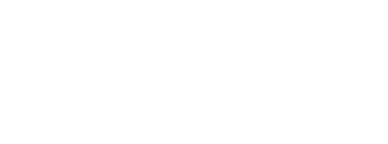

Recently, I was experimenting with building small neural networks for sequence-to-sequence use cases.  My goal was to create a visualization of how the inner state of a RNN changes as it processes inputs - similar to the [browser-based neural network visualization](https://cprimozic.net/blog/neural-network-experiments-and-visualizations/) I built previously.  Along the way, I TODO TODO TODO TODO very exciting and inspiring stuff

I was inspired to explore this area after reading a very interesting blog post called [Differentiable Finite State Machines](https://google-research.github.io/self-organising-systems/2022/diff-fsm/) which gave an overview of using gradient descent to learn FSMs to operate on one-bit strings.  The state machines that were learned by their approach were impressively concise and managed to find optimal solutions in many cases.

For my own work, I wanted to step things up a bit further in terms of complexity.  I wanted to try learning things that would be able to make better use of the greater power and generality of full-fledged neural networks like multiple input/multiple output networks, logic circuits, and maybe even some text generation or signal generation.

RNNs are more than capable of doing all of these things, but I had a constraint of keeping the model small/simple enough that a visualization of it will be intelligible and have a discernable method of action rather than just appear as a random mass of blinking lights.

## Trying to Learn Logic with RNNs

My initial trails were working quite well.  After some tuning of hyperparameters like learning rate, optimizer, and activation function, I was able to pretty consistently train networks to solve very simple problems like `out[i] = in[i - 1]` or `out[i] = in[i] && in[i - 1]` and do so in the minimum number of parameters (layer counts and sizes) for the network architecture.

Here's an example of an RNN that correctly models `out[i] = in[i] && in[i - 1]`:

![A diagram showing the architecture of a recurrent neural network that models `out[i] = in[i] && in[i - 1]`.  The flow of data and the operations applied to values are indicated by arrows and signs.  It shows the weights, inputs, and outputs for two steps of a sequence.](./images/neural-networks-boolean-logic/very_basic_rnn.png)

It consists of two trees: one for computing the next state and one for computing the current output.  In practice, these trees could each consist of multiple layers with many neurons in each layer, but we only need a single layer with 1 neuron in each for this case.

In case you're not familiar, here's the function for an artificial neuron:

```ts
function neuron(
  inputs: number[],
  weights: number[],
  bias: number,
  activationFn: (x: number) => number
): number {
  let sum = 0;
  for (let i = 0; i < inputs.length; i++) {
    sum += inputs[i] * weights[i];
  }

  return activationFn(sum + bias);
}
```

The recurrent tree has learned to populate the next state with the current input.  Since we're using a linear/identity activation function, all we have to do is set the weight to 1 for the input.  The previous state is completely ignored by setting its weight to 0.  It has the following truth table:

| Input 1 | Input 2 | Output | Rounded Output |
|---------|---------|--------|----------------|
| 0       | 0       | 0      | 0              |
| 1       | 0       | 1      | 1              |
| 0       | 1       | 0      | 0              |
| 1       | 1       | 1      | 1              |

The output tree takes the current state and emulates a boolean AND with the current input, passing the result to the current output.  Since the outputs of our network can be any number not just 0 and 1 like the inputs, we round outputs < 0.5 to 0 and >= 0.5 to 1.  Our output neuron takes advantage of that fact by setting the weights for each of the inputs to 1/3.  That produces the following truth table:

| Input 1 | Input 2 | Output | Rounded Output |
|---------|---------|--------|----------------|
| 0       | 0       | 0      | 0              |
| 1       | 0       | 0.333  | 0              |
| 0       | 1       | 0.333  | 0              |
| 1       | 1       | 0.666  | 1              |

So this neuron has modeled a binary AND gate!  Given this architecture and parameter values, the network will always make correct classifications for all inputs, assuming they all consist of only ones and zeros.

Here's an output plot for the output tree neuron with those weights:

<iframe src="http://localhost:3040/classificationDemo" loading="lazy" style="display: block;outline:none;border:1px solid #888;box-sizing:border-box; width: 328px; height: 468px; margin-left: auto; margin-right: auto"></iframe>

Each corner of the plot represents a different combination of inputs, and the color at that corner represents the output of the activation function with red representing negative classes and green representing positive.

The tiny patch of bright red in the top left corner represents regions of the function where outputs are very nearly 0, close to perfectly representing the negative class.  The white stripe is the decision boundary where the classification switches between negative and positive.

## Linear Separability

Given the fact that our activation is linear/the identity function, this proves that the binary boolean AND function is **linearly separable**.  The decision boundary is a single straight line that that separates the trues from the falses.

There are a total of 16 binary boolean functions.  OR, NAND, and the simple ones like "constant true" can be created by tweaking the weight and bias params; give it a try if you'd like.

As it turns out, 14/16 of them are linearly separable and can be solved by neural networks that have no activation functions (these are called perceptrons).  The exception is XOR and its complement XNOR.  This fact is widely known and featured in machine learning teaching material, often called the "XOR Problem".  In order to train a neural network that has no activation functions, you need to have hidden layers.

This is a fascinating idea to me.  Why is XOR "harder" to compute than the other logic gates?  These unique properties of XOR are often used in cryptography to encode information or in hash functions to compress/destroy it.  I don't myself have an answer for this.  Perhaps there is some math research out there that looks into it more closely.

Another thing to note, is that although 14/16 of the functions can be linearly separated perfectly with no activation function, the solutions aren't perfect in that the values are exactly true or false at the corners.  Some functions can be perfectly represented like `NOT Y` which is achievable by setting `xWeight = 0, yWeight = -1, bias = 1`.  For most of the others, however, no perfect solution exists and the outputs will be inexact for at least some inputs.

## Solving the XOR Problem

So far, we've been working without activation functions.  What if we add one of those in?

Dozens of activation functions have been used over time in artificial neural networks with the popular functions changing over time.  They have a wide range of origins in research and other areas of study like statistics and electronics.  Despite that, most of them can solve XOR.

In order to solve XOR, the function needs to have more than one linear decision boundary.  One example of a type of function that has this property is called GCU which stands for Growing Cosine Unit.  It was found to be quite successful when used in image classification networks, improving both the speed at which the networks train as well increasing their accuracy.  Also, in the [research paper](https://arxiv.org/pdf/2108.12943.pdf) presenting the function, the authors prominently state that it can solve the XOR problem in a single neuron.

<iframe src="http://localhost:3040/activationPlot?gcu=1" class="iframe-mobile-scale" loading="lazy" style="display: block;outline:none;border:1px solid #888;box-sizing:border-box; width: 430px; overflow: hidden; height: 325px; margin-left: auto; margin-right: auto"></iframe>

This additionally gives it the ability to have more than one linear decision boundary which is evident in its 2D neuron response plot:

<iframe src="http://localhost:3040/classificationDemo?gcu=1" loading="lazy" style="display: block;outline:none;border:1px solid #888;box-sizing:border-box; width: 328px; height: 468px; margin-left: auto; margin-right: auto"></iframe>

As you can see above, this activation function does indeed allow the XOR gate to be modeled in a single neuron!  The oscillatory nature of the function causes it to change direction and cross the decision boundary an infinite number of times, providing everything needed to solve the XOR problem.  Just `y = cos(x)` as an activation function works just fine, too, but GCU has the benefit of preserving at least some of the information about the magnitude of input signals.

These functions do have some problems for my particular use case though.  Although they can model all the logic gates, they do so with considerable error.  The function doesn't saturate, so there are only single points where they are equal to the target values.  In addition, they are not bounded so both their maximum value and maximum derivative in the case of GCU are infinite.

## Designing a New Activation Function

I wondered if it was possible to create an activation function that fixed all of these issues - perfectly modeling all of the binary boolean functions with zero error.  I also wanted it to be as simple as possible so that it would work well for my RNN visualization and be efficient during training.

I knew that the function would need to change direction at least once so that it crossed the decision boundary at least two times - a requirement for modeling XOR.  As a starting point, I used variations of simple functions like `|x|` which indeed solved the XOR problem but failed to model the others with low error.

Along the way, I realized that having the function saturate at the target classes made it much easier to represent solutions since there was more freedom in the parameter choices.

After some much trial and error, I arrived at a function which did the job:

<iframe src="http://localhost:3040/activationPlot" class="iframe-mobile-scale" loading="lazy" style="display: block;outline:none;border:1px solid #888;box-sizing:border-box; width: 430px; overflow: hidden; height: 325px; margin-left: auto; margin-right: auto"></iframe>

This function (which I will refer to as the Ameo activation function for the remainder of this writeup) has several characteristics that make it capable of doing so and suitable for use in neural networks:

 * It changes direction 2 times and crosses the decision boundary (y=0) two times meaning that it is able to model XOR and XNOR
 * It saturates at both the positive and the negative ends of its range, very useful for modeling AND and NAND
 * Both its range and derivative are finite which helps prevent the [exploding gradient problem](https://deepai.org/machine-learning-glossary-and-terms/exploding-gradient-problem)
 * It crosses through the origin meaning that an input of 0 outputs zero as well
 * It is symmetrical across x=[-∞,∞] and has an average output of 0 across that domain
 * It is very straightforward to implement as a piecewise function:



<!-- \color{White} \text{Ameo}(x) = \begin{cases}
  -1 & \text{if } x < -3 \\
  x + 2 & \text{if } x \in [-3, -1] \\
  -x & \text{if } x \in (-1, 1] \\
  x - 2 & \text{if } x \in [1, 3] \\
  1 & \text{if } x > 3 \\
\end{cases} -->

I don't know if there are simpler functions that work for modeling binary boolean functions gates in artificial neurons with zero error, but this particular function has some additional properties that make it useful for some other things which I'll detail later on.

### Improvements

The function did have some issues though:

 * It has regions where the gradient is zero which makes it vulnerable to the [Vanishing Gradient Problem](https://en.wikipedia.org/wiki/Vanishing_gradient_problem)
 * It had areas where it only touched the target values (y=-1 and y=1) at single points, making parameters that solve it perfectly difficult to find

To resolve these issues, I created a modified version of the Ameo function which is created out of scaled, shifted, and reflected segments of `y = x^4` instead of `y = x`.  I also changed it from having a gradient of 0 at its edges to being "leaky" in the same way as the [Leaky ReLU](https://paperswithcode.com/method/leaky-relu) activation function.  The leakyness does introduce a very small amount of imprecision for some functions, though, and it is negligible.

One new issue it causes, though, is that it creates regions where the gradient is very close to 0 in some small points of the domain.  This can cause gradient descent to get "stuck" at those points.  As a solution, I created a final version of the function which interpolates between the `y=x^4` and `y=x` version with a configurable mix factor:

<iframe src="http://localhost:3040/activationPlot?interpolatedAmeo=1" class="iframe-mobile-scale" loading="lazy" style="display: block;outline:none;border:1px solid #888;box-sizing:border-box; width: 430px; overflow: hidden; height: 370px; margin-left: auto; margin-right: auto"></iframe>

The nice thing is that the solutions for all the binary boolean functions are identical between all the variants.  Here's the 2D response plots for the different versions of the Ameo function:

<iframe src="http://localhost:3040/classificationDemo?softLeakyAmeo=1&fnPicker=1" loading="lazy" style="display: block;outline:none;border:1px solid #888;box-sizing:border-box; width: 328px; height: 525px; margin-left: auto; margin-right: auto"></iframe>

If you play with it, you can find parameters to losslessly model all of the binary digital functions.  One hint is that for every solution, all parameters are integer values.

## The Next Dimension

TODO :)

## The Ameo Activation Function in Practice

TODO

## Learning Binary Addition

TODO
