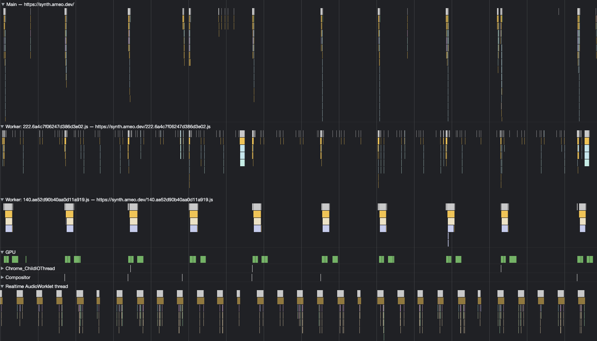

I've been working on a [web-based digital audio workstation](https://github.com/ameobea/web-synth) on and off for the past few years.  It started as a collection of experiments with audio synthesis in the browser, and it has slowly grown into a more cohesive platform for working with audio and producing music.

I've built up a pretty substantial collection of modules for generating and manipulating audio, but one thing that was lacking was the ability to visualize audio and other signals within the app.  Specifically, I wanted to build a module that contained a combined oscilloscope and spectrogram.  That would allow combined time and frequency domain views into signals.

Besides being useful for debugging during development, these tools are important when mixing and mastering tracks.  As the platform is maturing, these parts of the music-making process have been growing in importance.

Here's what the signal analyzer module ended up looking like when integrated into the main web synth app:


It's nothing fancy, but it works well and is very usable. This kind of UI might look familiar to anyone with a background in digital signal processing or music production.

The white visualization on top is the **spectrogram**.  It plots the power of the input signal at different frequencies, and it updates live as the signal changes over time.  It's a very useful tool when mixing multiple signals together or when performing heavy processing on signals since it helps identify imbalances in the spectrum, spot artifacts or undesired frequencies, and things like that.

The pink visualization on the bottom is the **oscilloscope**.  It plots the actual waveform of the audio signal as it is played, essentially creating a live line plot of the signal's samples.  It's very useful for debugging issues with synthesizer modules or other audio generators, and it's also useful for analyzing phase relationships between different signals.

## Tech Stack

The exciting part of this work is the usage of very modern web tech to power them.  With the recent release of [Safari 16.4](https://developer.apple.com/documentation/safari-release-notes/safari-16_4-release-notes), many new browser features were made available to a much larger chunk of the online audience.  This was my first time trying out some of these features, and I was extremely impressed with the new patterns and capabilities they unlock for building rich, complex, and interactive web applications.

I really believe that this latest round of new APIs and capabilities enables whole swaths of new functionality for the web that were either impossible, difficult, or inefficient before.  Here are some of the new features and patterns I made use of and development patterns they facilitated while building the project:

## Multi-Threaded Rendering

One of the main limitations of JavaScript and the browser is that all work that touches the DOM has to happen on the main thread.  All your event listeners, DOM mutation, as well as interactions with the Web Audio API (adding/removing nodes, creating/removing connections, updating params, etc.) have to happen on the main thread.

For this signal analyzer, almost all of the actual rendering and other heavy lifting is performed off the main thread.  Even though the core audio processing code of the application runs on a dedicated audio rendering thread via Web Audio, it's still important to keep the UI responsive so that user inputs aren't delayed and interacting with the app is smooth and jank-free.

Here's a screenshot of the Chrome dev tools showing the spectrum viz in action:



As you can see, the work is spread across 4 different threads, plus the GPU.  The main thread is at the top (not expanded) and has an extremely light load - less than 5% of one core.  All the heavy lifting is done by the dedicated worker threads for the visualizations and by the web audio rendering thread itself.

### Web Workers

The main way to run work on multiple threads on the web is **Web Workers**.  They can be used to run arbitrary JavaScript and are limited in that they can't manipulate or access the DOM or some other things.  They can communicate with other threads, including the main thread, using a message-passing interface as well as some other new methods which we'll get into later.

For the signal analyzer, both the spectrogram as well as the oscilloscope each run in their own web worker.  Web Workers actually have been around for a while and have some nice tooling built up around them.  However, making use of them could be a pain in the past.

When I tried out web workers in the past, I had to install special Webpack plugins and use other hacks to get them to work.  Even then, I could never get TypeScript support working properly either.  I ran into issues where importing other code in my project from a worker would cause them to not work in some browsers and other weird things like that as well.

However, it was a very different setting up web workers for the signal analyzer.

<div class="good">
The JS ecosystem has come a very long way with their web workers support, and they're now quite easy to set up and use without hacks or browser-dependent bugs
</div>

A big part of this improvement is a great library I discovered called [Comlink](https://github.com/GoogleChromeLabs/comlink).  It makes initializing and communicating with the workers very easy by wrapping the message channel in a TypeScript-enabled RPC interface.

Another big change is that web workers are now natively supported by popular bundlers like Webpack, which I use for web synth.  It allows you to write workers in TypeScript, share types between the worker and other files in the project seamlessly, and import workers from other files directly:

```ts
const worker = new Worker(new URL('./Spectrogram.worker', import.meta.url))
```

It's a whole different story compared to when I first used them.  They feel much more like a mature feature that can be depended on rather than an experiment only applicable to some niche use cases.

### `SharedArrayBuffer`

This is another case of a feature that's been around for a long time but improved recently.  `SharedArrayBuffer` is JavaScript's solution for sharing memory between threads.  It works just like a regular `ArrayBuffer`, but you can send it to other threads via message ports and similar methods.

For this use case, it provides a few key benefits over sending data asynchronously between threads via message passing.  The first is performance

### Atomics

TODO

### `OffscreenCanvas`

TODO

### Wasm + Wasm SIMD

## Architectures

TODO

### Spectrum Viz

TODO

Here's a diagram showing how the web worker for the spectrogram initializes and communicates with the main thread:

![This diagram illustrates the signal analyzer module's workflow in a web-based digital audio workstation. The workflow is divided into two major threads: the Main Thread and the Web Worker Thread. The Main Thread handles initialization, running a recursive driver loop for data collection and rendering, building an OffscreenCanvas, and handling various events. The Web Worker Thread, on the other hand, is responsible for rendering the data received from the Main Thread and managing the state of the visualization. The two threads communicate through signals and message passing, ensuring smooth interaction between UI events, data collection, and rendering.](https://i.ameo.link/b28.svg)

TODO

### Oscilloscope

TODO

## Seamless Integration of Rendering Methods

TODO

### Device-Specific Handling

TODO
