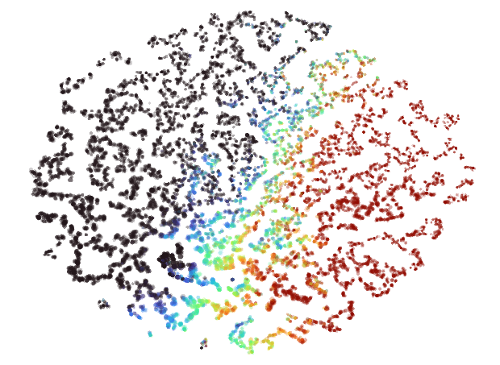

Over the past few years, I've built several different interactive embedding visualizations.  I have a big interest in exploring and understanding things in a free-form manner, and these kinds of tools feel to me like an extremely effective way of facilitating that sort of experience.

My work in this area started out as an experiment using data I collected for a different project.  I then repeated it for other similar projects, tweaking the implementation based on the good/bad parts of the earlier efforts.

<div class="good padded">After completing my most recent attempt, I believe I've come up with a solid process for building high-quality interactive embedding visualizations for a variety of different kinds of entity relationship data.</div>

I've compiled details about the whole process from start to finish along with my personal observations about what works and what doesn't here.  My hope is that it will be interesting or useful to anyone looking to build similar kinds of tools themselves.

## Background on Embeddings + Embedding Visualizations

Embeddings are, at their core, a way of representing entities as points in N-dimensional space.  These entities can be things such as words, products, people, tweets - anything that can be related to something else.  The idea is to pick coordinates for each entity such that similar/related entities are near each other and vice versa.

Much of the time when embeddings are referred to, it's in the context of deep learning.  Word embeddings are a critical piece of LLMs and as such they've gotten a decent amount of attention recently.  These embeddings are usually quite high-dimensional with hundreds or thousands of dimensions, meaning that each entity gets assigned a coordinate with up to thousands of values.

These large numbers of dimensions provide embeddings the ability to encode complicated relationships between entities other than just similar/dissimilar.  If two things share some abstract quality with each other but are otherwise dissimilar, they can be close to each other in some dimensions while remaining distant in others.  This enables some of the very cool examples like the famous [king + man - woman = queen](https://www.ed.ac.uk/informatics/news-events/stories/2019/king-man-woman-queen-the-hidden-algebraic-struct) and makes embeddings so useful for encoding rich information about things.

The human brain doesn't do well with intuitively understanding high-dimensional data like this.  For this reason, when visualizing embeddings, it's common practice to "project" embeddings down to 3 or 2 dimensions in order to be able to visually interpret their structure and understand the relationships between the entities it represents.

Through my work and experiments in this area, I've discovered that there's a fair amount of nuance to doing this in a way that produces a useful and interpretable visualization at the end.

## Why Embedding Visualizations

The "algorithm" is a ubiquitous concept on the modern internet.  Everything around us online is trying to optimize our experience (or more accurately our engagement) by giving us content that it thinks we're most likely to have interest in or interact with.

Behind the scenes, it's very likely that the recommendation models are using embeddings or something very similar to them to achieve this.  Embedding visualizations allow for a self-led and exploratory method for finding new things compared to the one-dimensional and opaque view given by "for you" lists or recommendation engines.

<div class="note padded">I have a lot of interest in breaking through the black box of these kinds of opaque systems and piecing together the hidden relationships between things — and I've found embedding visualizations to be ideal tools for this.</div>

Besides being useful for targeted searches, I also just find it fun to browse around and explore embedding visualizations.  It feels really natural and enjoyable to move around and manipulate a "space".  It reminds me a lot of flying around Google Earth and just checking out and exploring random cool places.

## My Embedding Visualization Projects

To give a bit of background on the kinds of things that you can get with this technique, here's what I've built so far:

### Spotify Music Galaxy


This was the first one I created, and it's 3D!  I built it using data I collected from the Spotify public API that takes the form of "Users who listened to artist X also listened to artist Y".

It's implemented as [web application](https://galaxy.spotifytrack.net/) built with Three.JS.  I give users the ability to fly around using video game-like controls as well as the ability to connect their Spotify account to see which parts of the galaxy their favorite artists are in.

### Anime Atlas


This one as mostly a case of I happened across the data and thought it would be cool to try.  I downloaded the MyAnimeList profiles of a few hundred thousand users and used those to embed all the different anime listed on the site.

I wanted to create something a bit easier to engage with, so this one is 2D.  I [embedded it](https://anime.ameo.dev/pymde_4d_40n) (lol) within an anime stats and recommendations site I built alongside it.

### osu! Beatmap Atlas

This one I just finished recently, and is featured in the header image for this post.

For almost a decade now (holy shit), I've run a [stats tracker](https://ameobea.me/osutrack/) website for the popular rhythm game [osu!](https://osu.ppy.sh/).  In this game, you play different maps for songs (called beatmaps) and your best plays can be retrieved from a public API.

I used the data I've collected from that project to embed these beatmaps in a very similar way to the Anime Atlas project.  This project is especially cool to me since there is a lot of really detailed numeric metrics associated with each of these beatmaps that directly relates to gameplay, making the resulting visualization very rich and interesting to explore.

It's currently hosted on a [standalone website](https://osu-atlas.ameo.dev/), but I plan to integrate it with osu!track somehow in the future.

## Data Collection + Preparation

<div class="note padded">The main question you need to be able to answer with the data you collect is "how similar are these two given entities?"</div>

For the Spotify Music Galaxy this came directly from Spotify's API where they did the hard work themselves.  For the other two, this data came in the form of "This user had all of these entities in their profile".  Each entity in that profile was treated as related to each other entity with a domain-specific weighting.

Any data you're working with will probably have its own caveats and peculiarities, but as long as you have some way of taking it and creating some metric for how related/similar two entities are, it should work fine.

### Pre-Filtering

Depending on how much data you have, you may need to do some initial filtering to reduce its cardinality to a size that's manageable for visualization.  A common thing I did when creating mine was to drop very rarely seen or otherwise "uninteresting" entities from the set completely before anything else.

If you have a huge amount of low-degree, loosely-connected data points, it can result in a cluttered and uninteresting visualization.  Having a massive number of entities will also make the embedding-building process slower as well as potentially making the visualization itself slower for users.

<div class="note padded">I've personally found that the sweet spot is somewhere between ~10k-50k entities for the kinds of visualizations I make.</div>

You can probably get away with more if you use an efficient rendering method and maybe provide some ways for the users to slice + filter the visualization itself.

### Indices vs. IDs

Most of the tools and processes you're going to be doing to produce the embedding will refer to entities by index rather than any kind of domain-specific ID.

<div class="note padded">Once you have a collection of entities you're ready to embed, I'd recommend creating an ID to index mapping as early as possible that can be referred to throughout the rest of the process.</div>

This also makes things easier when joining the embedded points back with metadata at the end of the process.

## Building the Co-Occurrence Matrix

The foundation of the embedding-building process involves creating a **co-occurrence matrix** out of the raw source data.  This is a square matrix where the size is equal to the number of entities you're embedding.  The idea is that every time you find `entity_n` and `entity_m` in the same collection, you increment `cooc_matrix[n][m]`.

For some types of entities, you may have some additional data available that can be used to determine to what degree two entities are related.  For my osu! beatmap embedding, for example, I weighted the amount of added value based on how close the two beatmaps were in amount of performance points awarded.  This served to stratify the embedding and prevent beginner and advanced maps from appearing related to each other.

If your entities have an associated timestamp for when they were added to the collection, you could also weight the similarity by how close they are.  Although embeddings will likely encode some of this temporal relationship naturally, this can be useful in some cases.

_If you're interested in looking at some code, you can check out the Python notebook which handles this and the next few steps for my osu! beatmap embedding here_: [embed.ipynb](https://github.com/Ameobea/osu-beatmap-atlas/blob/main/notebooks/embed.ipynb)

### Memory Considerations

Since co-occurrence matrices are square, they grow exponential with the number of entities being embedded.  For 50k entities and a 32-bit data format, a dense matrix will already be at 10GB.  100k entities puts it at 40GB.

If you are trying to embed even more entities than that or have limited RAM available, you may need to use a sparse representation for the matrix.  I've found good success using the `coo_matrix` and `csc_matrix` types from the `scipy.sparse` Python library for this.  As an added bonus, many of the downstream libraries used for building the embeddings can work with these sparse matrices directly.

### Performance Considerations

The main loop for constructing this co-occurrence matrix will probably look something like this:

```py
cooc_matrix = np.ndarray((n_entities, n_entities))

for collection in collections:
  for i in range(len(collection) - 1):
    entity_i_ix = entity_ix_by_id[collection[i].id]

    for j in range(i + 1, len(collection)):
      entity_j_ix = entity_ix_by_id[collection[j].id]

      cooc_matrix[i][j] += 1
```

This is `O(n^2)` wrt. the size of each of the collections being processed.

<div class="warning padded">Because of this, if you have even modestly large collections, the process of generating the co-occurrence matrix can be quite computationally intensive.</div>

Since Python is far from the fastest language, this means that generating the matrix can be extremely slow.  While I was iterating on my process and experimenting with different data and setups, I often found myself waiting for hours for the matrix to be computed.

As a solution for this, I used the excellent `numba` library for Python.  `numba` JIT-compiles Python on the fly to allow it to run many times faster.  If you're lucky, it can be as easy as just adding a `@jit(nopython=True)` decorator on top of your function and enjoying vastly improved performance.  It can even automatically parallelize loops in some case with `parallel=True`.

`numba` is aware of and compatible with some common Python data libraries like `numpy`, but for others (including the sparse matrices from `scipy`) it won't work.  For this case, I ended up having to do some manual data chunking and shuffling to make it work, but it was worth it in the end.

## Building a Sparse Entity Relationship Graph

Once you've built your co-occurrence matrix, you have all the data that you need to create the embedding.  In fact, it's possible to go ahead and directly embed that matrix - treating it as a weighted graph.

I've tried this - but the results were not good.  The embeddings that come out look like elliptical galaxies:


There is a dense mass of high-degree entities grouped at the center and little other discernable structure.  It's not interesting to look at and doesn't convey much useful information other than which entities are the most popular.

I believe the reason for this is two-fold:

 * The co-occurrence graph is simply far too dense
 * Edge weights for popular high-degree nodes are far too large in comparison to the vast majority of other edges

To make this graph ready for embedding, both of these points need to be addressed.

### PyMDE Pre-Processing

Now's a good time to introduce [PyMDE](https://pymde.org/).

PyMDE is a Python library implementing an algorithm called [Minimum Distortion Embedding](https://web.stanford.edu/~boyd/papers/min_dist_emb.html).  It's the main workhorse of the embedding-generation process and very powerful + versatile.  It can embed high-dimensional vectors or graphs natively, the latter of which we'll be using.

We'll get into more later, but one of the things this library provides is a set of [preprocessing routines](https://pymde.org/preprocess/index.html) - one of which does exactly what we're looking for.  It's called [`pymde.preserve_neighbors`](https://pymde.org/api/index.html#pymde.preserve_neighbors).

This routine takes a graph as input and returns another sparser graph as output.  It addresses both points above by sparsifying as well as un-weighting all the edges.

Internally, it achieves this by computing k-nearest neighbors for each node in the graph.  It drops all but the `k` top edges for each node and sets their weights to 1.  It also traverses the graph to fill in edges for nodes with less than `k` edges which can be useful for some data sets.

One thing to note is that this function interprets edge weights as _distances_: bigger weights are treated as being more dissimilar rather than more similar.

To work around this, I apply `1 / log(x)` to all of the values in the co-occurrence matrix before passing it to `pymde.preserve_neighbors`.  This in effect converts it from a similarity matrix into a dissimilarity matrix.

In addition to the dissimilarity matrix, `pymde.preserve_neighbors` accepts a few parameters that are very impactful to the generated embedding.

### `n_neighbors`

This defines the `k` used for the KNN computation.  The bigger this value, the denser the resulting graph will be.

The best value for this variable depends pretty heavily on your data.  The size of your collections, the number of entities you're embedding, and the popularity distribution of your entities all play a role.

<div class="note padded">This <code>n_neighbors</code> parameter is one of the things I highly suggest experimenting with and trying different values for to see what works best for your data.</div>

That being said, for the data sets I've worked with, I've found that values from ~10-40 work best.  Smaller honestly seems to be better than larger for encouraging embeddings with interesting structure to emerge.

### `embedding_dim`

Although this isn't directly used by the pre-processing code, it is used to configure the PyMDE instance that is returned and will be used when actually generating the embedding later on.

<div class="note padded"><code>embedding_dim</code> is probably the most important parameter for this pre-processing - and perhaps the most impactful parameter for the whole embedding process.</div>

You might think that this should obviously be set to 2 if you're building a 2D visualization.  And you're right: setting this to 2 will indeed configure PyMDE to generate 2-dimensional coordinates for each entity.  You could then use those directly in whatever visualization you end up building if you wanted.

<div class="warning padded">However, I've found that low-dimensional embeddings produced by PyMDE directly don't look very visually appealing.</div>

The library does a terrific job preserving the relationships and information encoded in the input graph in its output, but those outputs aren't designed for direct viewing by humans.  They're great for use as feature vectors for machine learning though, for example.

So I've actually found that it's best to embed into a higher dimension as an intermediary step and then use a different algorithm to project _that_ embedding down to 2 dimensions.

Pretty low values for that intermediate embedding dimension tend to work best, so I'd start with 3 or maybe 4 and see how it works for you.  Using higher dimensions leads to too much information loss when projecting down to 2.

### Performance Considerations

In the past, I've observed this pre-processing step taking an extremely long time.  So long that I gave up on it ever finishing.

It turns out that PyMDE tries to compute a "quadratic initialization" during some part of the pre-processing procedure.  Given that name, I imagine it's another instance of `O(n^2)` time complexity coming into play.

I found that you can disable that by passing `init="random"` to the `pymde.preserve_neighbors` function.  I imagine that this slightly reduces the quality of some part of the process, but I didn't notice anything myself.

There's also an option to move this to the GPU by setting `device='cuda'`.  I tried this with some success, but I did run into issues with my GPU running out of memory in some cases.  Feel free to give that a shot if you have a CUDA-enabled GPU on hand.

### PyMDE vs. Alternatives

There are other libraries available other than PyMDE for generating embeddings from graphs.  When I was first working with embeddings, I tried some of them.

One of these is called [`ggvec`](https://github.com/VHRanger/nodevectors).  It seems to be specialized for extremely large data sets and optimized for speed.  Some of their examples show use cases of embedding graphs with >500k nodes.

Although it was indeed very fast and worked pretty well, I found the embeddings it produced to be sub-par compared to those created by PyMDE.  It might be a great option if you have a huge embedding corpus, though.
## Generating the Initial Embedding

Once `preserve_neighbors` finishes running, it returns a `MDE` object.  This contains the configuration parameters provided earlier along with the generated KNN graph from the pre-processing.

Once you've made it this far, generating an embedding is actually super easy:

```py
embedding = mde.embed(verbose=True, max_iter=2000, print_every=50)
```

It doesn't even take that long to run.  You can then create a quick visualization of the result with this:

```py
mde.plot(colors=['black'])
plt.show()
```

PyMDE will automatically project the embedding down into 3D if you chose a higher embedding dimension than that.  Here's an example of what you could see if things worked well:


### Evaluating Embedding Quality

At this point, even just based on this tiny crude plot, it's usually possible to tell pretty confidently if the embedding is decent or not.

The main thing you want to look for is _structure_.  Notice how in the image above there are lots of variations in density and shape while still maintaining a cohesive form.  I'd consider that to be an excellent result.

Here's an example of an embedding that I'd consider to be low-quality, taken from my experiments while building the Music Galaxy project:


And here's one that's much better:


Just look at all that _topology_!  There are bulbs, fronds, lobes, clusters — so much cool stuff to look at.  Besides visual appeal, I've also found that embeddings that look like this tend to more accurately reflect the source data as well.

If you're not sure at this point whether things worked well, remember that this is just a crude projection for eyeballing your output so far.  That being said, in my experience it's usually pretty obvious when something failed badly.  And there's a much better method available for digging into the generated embedding which I'll introduce next.

## Projecting Down to 2D

So at this point, we have a N-dimensional embedding produced by PyMDE for our entities.  That means that each entity has been assigned its own N-dimensional coordinate.  Now, we have to project that embedding down to 2D so it can be used for the final visualization

As I mentioned before, PyMDE is great but it doesn't do a good job at producing visually appealing and easily interpretable low-dimensional embeddings.  Other algorithms like UMAP seem to have been designed with data visualization in mind and do a much better job.

### Emblaze

At some point, I happened across a piece of software called [Emblaze](https://dig.cmu.edu/emblaze/emblaze/).  It's a Jupyter Notebook widget that lets you easily create, visualize, and compare embeddings using a variety of different algorithms.

<div class="good padded">I really can't praise Emblaze highly enough.  It's literally the perfect tool for the job of picking the right algorithm and parameters to generate an embedding that's perfect for your use case.</div>

You load in your data, specify a bunch of algorithms and parameters to run, and then get a really nice UI to explore and compare them with.

Here's what that UI looks like:

![A screenshot of the Emblaze UI embedded in a Jupyter notebook running in the web browser.  The screenshot shows a 2D embedding visualization showing many circles of various colors and sizes arrayed across a white background.  There are minimap previews on the left side showing small images of alternative embedding versions that can be switched between.  The right side shows details about the hovered point and the IDs of its nearest neighbors.  There are small blue lines extending out from the selected point to those neighbors in the embedding.](./images/building-embedding-vizs/emblaze_ui.png)

Emblaze allows you to set metadata for your points and use it to control the color, size, labels, opacity, and more for all of your entities.  This is extremely useful for verifying the quality of the embedding and making sure that the locations of points makes sense.

### Algorithms

The main two embedding algorithms that I found to be effective for projecting points down from the intermediate PyMDE-generated embedding to 2D are **UMAP** and **t-SNE**.  Both have their own pros, cons, and "personality" and the best one depends on your personal needs and preferences.

Emblaze includes built-in support for both of them, so there's no reason not to try them both out and see which one works better for you.

#### UMAP

UMAP is probably the most well-known embedding algorithm and for good reason:

<div class="good">UMAP does a very good job of generating accurate embeddings that preserve both local and global structure well.</div>

In my experience, embeddings produced by UMAP tend to have a big Pangea that separates out into thinner regions towards its outer edges.  Here's what a UMAP embedding looks like when rendered in Emblaze:


There are a couple of key parameters for UMAP that you should definitely take a look at:

##### `n_neighbors`

> This parameter controls how UMAP balances local versus global structure in the data.

I used a value of 200 for my most recent embedding and that worked pretty well for me.

Check out more info in the well-written [official UMAP docs](https://umap-learn.readthedocs.io/en/latest/parameters.html#n-neighbors)

##### `min_dist`

> `min_dist`, quite literally, provides the minimum distance apart that points are allowed to be in the low dimensional representation.

This parameter provides a level of density normalization which is very important for visualizations because it helps prevent a ton of points from piling up on top of each other in high-density areas.

Avoid setting this too high, though, because doing that can result in "homogenized" embeddings and wash out all that structure that we worked so hard to preserve earlier.

#### t-SNE

t-SNE seems to have a lot more "personality" than UMAP.  Here's the same data as the image above embedded with t-SNE:



Instead of a big Pangea, you get a big archipelago of little islands all arranged into a neat ellipse.  These can be very fun to zoom in and explore, and all the points on the same island usually end to be quite closely related.

<div class="note">t-SNE does a great job at exaggerating local structure, but at the cost of somewhat compromising global structure.</div>

Emblaze offers the ability to hover over points to see where their nearest neighbors in the higher-dimensional space are in the 2D result.  I find that it's pretty common for some amount of the nearest neighbors to wind up very distant from each other in the embedding when using t-SNE.  When using UMAP, this is rarely the case.

## Building the Visualization UI

At this point, we have generated a 2D coordinate for each entity in the set.  Now, all that's left is to build the visualization itself!

...

OK of course there's a ton of work and nuance that goes into building a complicated UI for a data-intensive application like this.  But at the same time, the core of this UI really can be as sample as "just render a bunch of circles".

I'm going to avoid going into too much detail about the technical implementation of the visualizations I've made in the past (that could be a lengthy writeup all of its own), but I'll provide some highlights.

<div class="note padded">I've always built my visualizations as static web applications.</div>

I'm a big proponent of web apps because they provide so many benefit out of the box.  You get cross-platform support for free while still getting access to GPU acceleration via WebGL or WebGPU.  Anyone can use your viz with just a link on any device.

<div class="note padded">I like to join my generated 2D embedding coordinates with entity metadata and then dump the entire thing into a single static file.</div>

This makes it quite simple to distribute the data and load it in the visualization.  I've used both plain JSON and a custom binary format in the past, but honestly JSON is probably good enough.

Just make sure the webserver hosting it has gzip or better yet brotli compression enabled to make downloads quick for users and to reduce bandwidth usage for mobile clients.

<div class="good padded">WebGL or WebGL/WebGPU-powered libraries like Pixi.JS are great choices for building these kinds of visualizations.</div>

For one of my 2D embedding visualizations in the past, I started off trying to render it all with SVG.  It started off quite well and was very easy to set up - being able to use native browser event handlers and styling was extremely nice - but I quickly ran into problems.

<div class="bad padded">SVG-based visualizations run into serious performance problems when building large (>10k entities) interactive embedding visualizations.</div>

I would get bad stuttering and input delay when doing things like zooming or hovering over points that stemmed from layout calculations and similar browser-level things.  Despite hours of effort trying to optimize it, I was ultimately unsuccessful.  The browser DOM just doesn't do well when you have that many nodes.

Comparatively, rendering even hundreds of thousands of circles on the GPU is a breeze even for relatively weak devices.  This may sound like a big jump in complexity, but that's where [Pixi.JS](https://pixijs.com/) comes in.

Pixi is a library that I've used on several projects in the past with great success every time.  It exposes a nice high-level API for rendering 2D graphics and uses WebGL or WebGPU to do it.  It takes care of all the hard parts like scene layering, hit testing, animation, zooming/panning, etc. and lets you focus on building your tool

With some tuning, I was able to get my entire visualization to render in a single draw call when using Pixi.JS.  It's a great choice and I highly recommend it.

<div class="note padded">That being said, if you're willing to get your hands dirty and write some shaders, doing everything "by hand" is definitely viable as well.</div>

For the osu! Beatmap Atlas, I did just that.  I used a lightweight WebGL wrapper library called [`regl`](https://github.com/regl-project/regl) to render the embedding as native `gl.POINTS`.  I then wrote a vertex and fragment shader from scratch to style them.

To be honest, it was probably overkill and Pixi.JS would have served my needs just fine, but it was very fun and is definitely a realistic + viable option for this kind of thing.  The performance you get from building it all yourself from scratch is hard to beat as well.

## Conclusion

OK let's run it all back from the top one more time:

 1. Collect data
 2. Build co-occurrence matrix
 3. Sparsify the co-occurrence matrix into a k-nearest-neighbors graph
 4. Embed that into an intermediate high(er)-dimensional embedding with PyMDE
 5. Project that intermediate embedding down into 2D using UMAP or t-SNE
 6. Render the result using WebGL or WebGPU

That's the process I've honed in on over ~3 years and multiple projects, and it's worked well every time so far.

I'll avoid waxing poetic any further about how useful embeddings are and how cool I think embedding visualizations can be.  My opinions feelings should be obvious given how much time and effort I've devoted to learning about and building them.

Next time you spot some good data, give an embedding viz a try!

\- and please let me know if you use any of my process here to do it.  I'd be very eager to hear how it works for you.
