<a target="_blank" href="https://galaxy.spotifytrack.net/">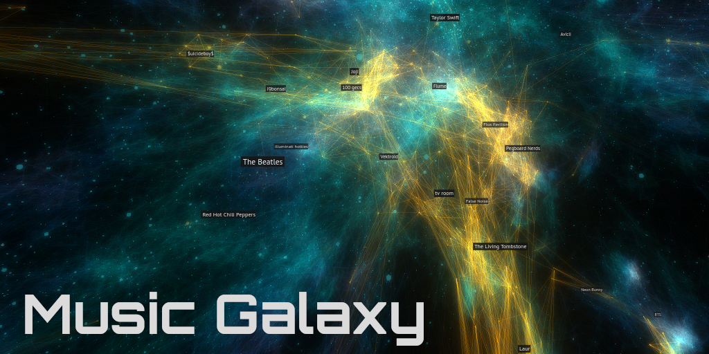</a>

Music Galaxy is is the culmination of several months of work with artist relationship data from Spotify.  It is an interactive 3D visualization of the relationships between over 70,000 artists, positioning them in such a way that artists with similar audiences are closer together in space.  It also supports connecting to users' Spotify accounts to visualize where their personal favorite artists exist in context of the greater musical universe.

**Give it a try for yourself**: <https://galaxy.spotifytrack.net/>

It runs completely in the web browser and is designed to work well on both mobile and desktop.  The full source code is also [on Github](https://github.com/Ameobea/spotifytrack/tree/main/frontend/src/musicGalaxy).

My goal for the project is to provide a beautiful and intuitive method for discovering new music + artists without using genres.  When I read tweets from musicians and artists, I often see the sentiment that they resent being boxed into genres or having their style lumped in under a label.  I also hope to provide a visual way to perceive the data that machine learning models and recommendation engines used by modern music platforms use - shedding some light into the black box.

## Background + Past Work

As a part of their [public API](https://developer.spotify.com/documentation/web-api/), Spotify provides a list for each artist of up to 20 other artists that it deems are most related to it.  This data is used to populate the "Fans also like" section in the Spotify app.

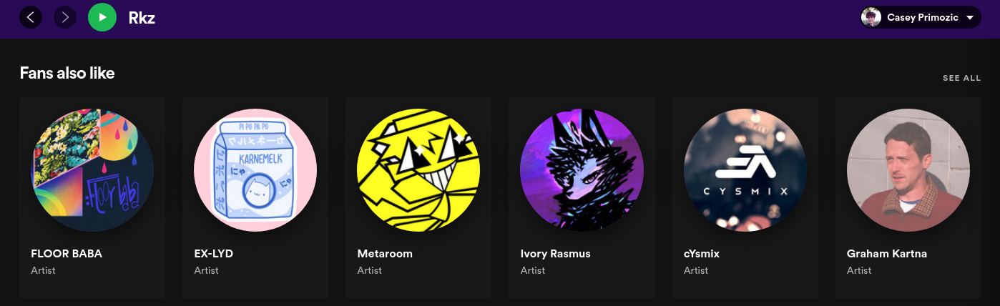

I've worked with this data before, incorporating it into my broader [Spotifytrack](https://spotifytrack.net) project in the form of a 2D graph visualization of the relationships between a user's personal top artists.  I have a [blog post](/blog/speeding-up-webcola-with-webassembly/) on that as well if you care to check it out.

Music Galaxy builds on that same idea but takes it to the next level - and next dimension.

I scraped the artist relationship network using that API endpoint and built up a graph of over 1.4 million different artists on Spotify by crawling connections in the same manner as a web spider.  Although many of these artists have 0 plays or 0 uploaded tracks, the end result was a graph of relationships between virtually all artists on Spotify.

### Word and Graph Embeddings

Building the Music Galaxy wasn't my original idea with this data.  I was inspired by a post I head read about word embeddings - a process in natural language processing and machine learning to convert words into numbers (vectors) which can then be used to train neural networks in order to generate text, process natural speech, and many other diverse applications.  This involves taking a corpus of words and generating vectors - fixed-length sequences of numbers - that represent each one of them.  One of the most popular ways of doing this is a set of tools called [`word2vec`](https://www.tensorflow.org/tutorials/text/word2vec), and it's used very extensively in this space to generate word embeddings.

There's a ton of exciting stuff in that area and I'm not going to try to explain it here (there are tons of resources for learning it online), but one example that really resonated with me was that you could actually do things like analogies just by performing simple arithmetic operations on the generated vectors.  A famous one is [king - man + woman = queen](https://www.ed.ac.uk/informatics/news-events/stories/2019/king-man-woman-queen-the-hidden-algebraic-struct).  Just by adding and subtracting the vectors of the embedded words, you can get what feels really close to "meaning".

This method of generating embeddings has been generalized and adapted for many other use-cases outside of NLP.  Words can be thought of as nodes in a graph of sentences where each word is a node and connects to the word before and after it.  A framework called [`node2vec`](https://snap.stanford.edu/node2vec/) (along with several other derivatives and similar alternatives) was developed which facilitates generating embeddings for arbitrary graphs, interfacing with popular Python graph libraries and making use of `word2vec` under the hood.

Since the artist relationship data from Spotify is at its core a big graph, I saw that it would be possible to generate an embedding with artists as nodes and their relationships as connections.  Working in [a python notebook](https://github.com/Ameobea/spotifytrack/blob/main/research/spotify_related_artists_embedding.ipynb), I used `node2vec` to generate a variety of different embeddings from the raw relationship data.  I experimented with a variety of different settings such as the number of artists in the embedding, vector size (which equates to the number of dimensions of the vector space) as well as a variety of other tunable `word2vec` hyperparameters.

I used a 3D scatter plot to get a rough idea for how embeddings looked by plotting the positions of a bunch of widely differing artists.

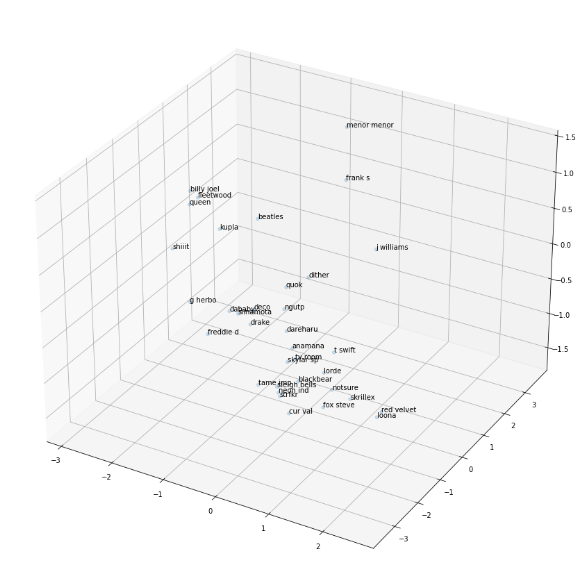

### Artist Averager

Playing around with the generated embeddings led me to realize that interesting results can be had by taking the vectors of two different artists and averaging them together, finding artists which best represent a kind of middle-ground between them.  This is very easy to do - just take the arithmetic average of each of the vectors' components and then scan through the embedding looking for which vectors which are most similar to the average.

It turns out that this is enough to come up with some very interesting results by itself!  I applied some fine-tuning to the approach, scoring matches based on how "lopsided" the similarity is (less points if the candidate is much closer to artist A than to artist B) and other stuff like that and created a simple web interface for it:

https://spotifytrack.net/artist-averager.html

I've personally found a few artists that I really like just by trying different combinations of artists I already know from different styles and genres.  For example, I put in two artists I listen to: PinocchioP (a Japanese Vocaloid producer) and ssshhhiiittt! (a Russian punk/rock band) and the result was an artist called Never Get Used To People (a Russian experimental electronic artist) which I really like and have listened to extensively since finding them through the tool.

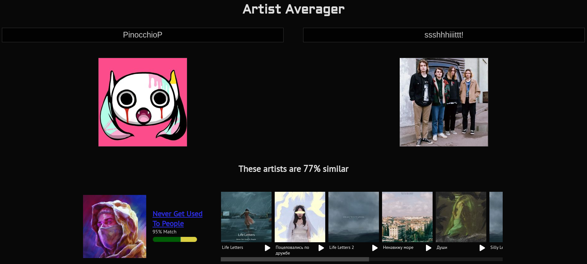

Via trial and error, I found that a vector size of 8 was best for the artist averager.  8 is a very low dimensionality for most embeddings you'll hear about, but the source data has some problems that need to be worked around.  The main issue is that connections lack weights and are capped at 20 related artists.  Also, the data set is much smaller than many that are used for these kinds of embeddings.  Having weighted edges (differentiating if two artists are only slightly related or extremely closely related) would add to the quality of the embedding, but that information isn't available through Spotify's API.

Using higher number of dimensions than 8 provided too much space in between artists to the point where nothing was really similar to anything else except for first-order connections.  The vector that was most similar to most midpoints of artist A and artist B was usually a directly connected neighbor of either artist A or artist B, 90% similar to artist A and 2% similar to artist B, but it was the best that was available.

Using lower numbers of dimensions provided noisier results that I felt were lower-quality.  It still gave decent results - especially between artists within the same genre or community - but performed worse when comparing drastically different artists.  There is simply less information available in that case to describe the relationships between artists.

### Birth of the Galaxy

Once the artist averager was mostly complete, I had the idea to create a 3D scatter plot showing the positions of the artists the user selected as well as the positions of the generated "averaged" artists to provide some visual context to the math going on behind the scenes.  I planned to project down the 8D vectors into 3D in order to display them on the scatter plot.

At that point, I thought it might be cool to plot several other artists from widely varying styles and genres in order to give users a feel for the broader context that they were searching.  I kept getting more and more ideas for things I could add to this "scatter plot" and ways that users could interact with it until I realized that it would make for a pretty sweet project on its own.  And that's how Music Galaxy was born.

## Generating the Galaxy Embedding

The first step in creating the galaxy was generating the 3D embedding.  This was largely a process of trial and error.  Like the artist averager, it was important to generate an embedding that preserved as much of the information from the relationship graph as possible so that the positions of artists have actual meaning.  At the same time, it was necessary for the generated embedding to look aesthetically pleasing and visually tractable as well.  When I say visually tractable, I mean that when you look at it or fly around in it, it should be easy to identify the structure and patterns that it represents: clusters or closely related artists, thin filaments of artists that bridge the gaps between different styles, etc.

Luckily, there were plenty of knobs to turn to tune the embedding's generation.  I cut down the number of artists included in it to roughly 70,000.  Although this may seem extreme from the original 1.4 million, it's important to note that the majority of those are ghost accounts that haven't uploaded any songs or have 0 monthly plays.  However, it was necessary to shave a little further as well, pruning artists with the lowest popularities (<~2500 monthly plays) so that the visualization would run decently even on smartphones.

The next thing to figure out was how many dimensions to include in the vectors and how to project that down to 3 for the visualization.  I tried a variety of different configurations, eventually settling on generating an embedding with 4 dimensions and then projecting down to 3 using simple principal component analysis.  When I tried generating a 3D embedding directly with `node2vec`, it kept producing one where all artists existed on a big "bowl", almost like a 2D plane that was placed into 3D and warped into a bowl shape.  I'm not sure why it happened - perhaps some caveat of the `node2vec` implementation I used or similar - but in any case it looked very bad.

Generating higher-dimensional embeddings and projecting down to 3D via PCA had too much information loss; the whole embedding looked very "fuzzy", had little defined structure, and often had blatantly unrelated artists in close proximity.

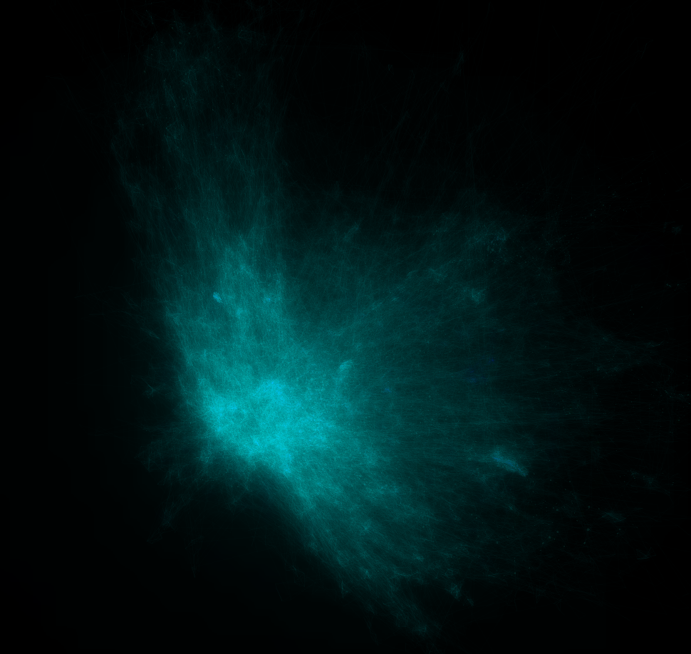

4 -> 3 dimensions was the sweet spot; `word2vec` had enough space to lay things out well and the information loss from shaving just one dimension off was manageable.  In fact, I've found that the bit of noise that is added by the PCA is actually desirable; it helps to facilitate exploration and discovery by mixing in things you might not have seen normally.  This is a strategy used by some AI-powered recommendation engines; some percentage of their recommendations will be either partially or entirely random in order to expose users to fresh content and keep the model from over-saturating in one specific groove.

### Tweaking `node2vec` Hyperparameters

The final key to generating a great embedding for the galaxy were two `node2vec` hyperparameters which are descriptively named `p` and `q`.  You can read about them in [the official research paper](https://arxiv.org/pdf/1607.00653.pdf) if you want, but essentially they boil down to this:

`node2vec` uses random walks through the source graph to create "sentences" which are then fed to `word2vec` under the hood to generate the embedding.

 * `p` is the "Return parameter" which "controls the likelihood of immediately revisiting a node in the walk".
 * `q` is the "In-out parameter"; it controls whether the random walk is "more DFS-like" in that it is biased towards visiting nodes further away or "BFS-like" in that it is more likely to visit closer nodes.

Together, these two parameters have a dramatic effect on the structure of the generated embedding.  It was difficult to anticipate what those effects would be, though, so I set up a rather extensive hyperparameter search with different `p` and `q` values for the 4D embedding.  Once they all generated, I PCA'd them all down to 3 dimensions and loaded them up to see what they looked like.

I kept [a log](https://github.com/Ameobea/spotifytrack/blob/main/research/comparisons.md) of the different variations I tried along with screenshots of them from inside an early version of the visualization.

The findings were that having a high `p` and a relatively low `q` produced the best embeddings.  A high `p` (~2.5) means that walks were more likely to loop back on themselves and visit the same nodes again.  I believe this helped to produce more tightly-defined clusters and neighborhoods and prevent everything from looking like a big blob.  A relatively low `q` (~0.5) means that the the walk is "more DFS-like" and will wander further away from the starting node by default.  These two parameters also interact with each other; setting `q` low by itself or `p` high by itself wasn't as good as when both were changed.

The improvement in the quality of the generated galaxy was dramatic and obvious:

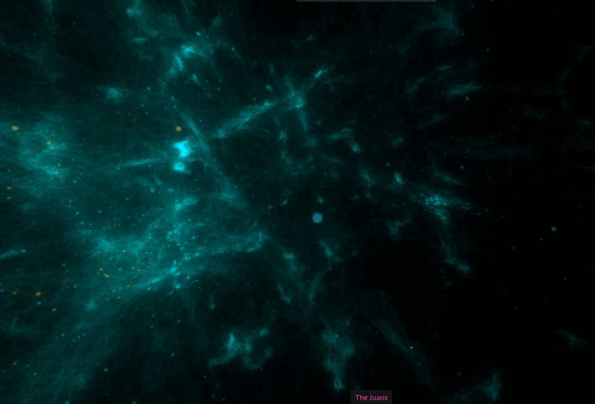

I found that embeddings with high variations in density were the most visually pleasing and that they additionally provided the most information about the underlying artist relationships.

Once I'd settled on good embedding hyperparameters, I was able to tweak some other settings such as the scale of the galaxy, the speed the user flies through it, coloring, opacity, and things like that.

### Validating Embedding Quality

Although it looked good, it was important to make sure that the embedding still carried the artist relationship information accurately.  Flying around and exploring, it was apparent that it does.  For example, "K/DA" is a virtual music group created for the online game League of Legends to create music inspired by the game.  Some of the singers from the group are from popular K-Pop groups and much of the music's style aligns with K-Pop.

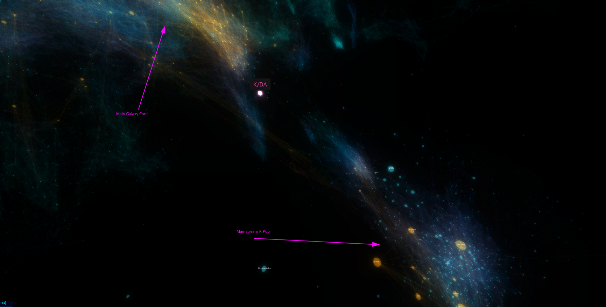

Looking at the position generated for it in the embedding, it is situated outside of the core K-Pop cluster in the space towards the galaxy's center and various electronic music.  This position makes complete sense since the group draws an audience from both K-Pop listeners as well as League of Legends players who might not previously have listened to much or any K-Pop.

Additionally, I checked that the average connection length between related artists was relatively low compared to the size of the galaxy.  This ensures that on average, artists were being positioned close to other artists they were related to.  There are cases where some artists have many long connections due to them serving as bridges between disparate genres or musical communities, but they make sense given the context.

## Building the Visualization

The visualization itself is built with [three.js](https://threejs.org/), a powerful JavaScript 3D framework built on top of WebGL.  It provides high-level abstractions and lots of pre-built functionality for getting things rendering and simplifying many tasks used by 3D visualizations, games, and more.

At its core, the viz is actually quite simple.  The embedding is loaded in binary form from the server and processed into data structures in memory.  Not surprisingly, it doesn't compress very well and the artist positions alone for the ~70k artists weighs in at over 1MB over the wire.  Artist relationship data is similarly large and poorly compressible, so I load + render it incrementally in chunks so that the visualization itself can initialize and start rendering while the connection data is fetched.

Not every connection is rendered.  In fact, the majority of connections are completely hidden.  This for both performance as well as aesthetic reasons.  Due to the sheer number of connections between artists in the embedding, rendering them all (even at extremely low opacities) results in an unmanageable amount of visual noise.  I opt to probabilistically render connections with the probability depending on the length of the connection; longer connections have less of a chance to be included.  This allows for the galaxy's core structure to shine through and for local details to stand out from background noise.

### Cache-Friendly Data + CDN

The artist position data as well as all of the connection data chunks are produced as static, cacheable binary files.  These are served through a CDN to allow the galaxy to load quickly and reduce load on the webserver.  I originally had a connection loading system where the client crawled the relationship graph in real time and built up the galaxy incrementally from a few seed artists.  However, for a variety of performance and efficiency reasons, loading the connections in pre-built chunks is much better.

Including all assets (JS code, Wasm, embedding data, and artist relationships) the entire visualization transfers just over 6.1MB over the wire; 9MB uncompressed.  Once the CDN cache is warmed up, the whole thing can load up for the first time to fully interactive in just a couple of seconds.

### Labels

Rendering labels for artists within the galaxy is very important, but implementing it was quite a challenge.

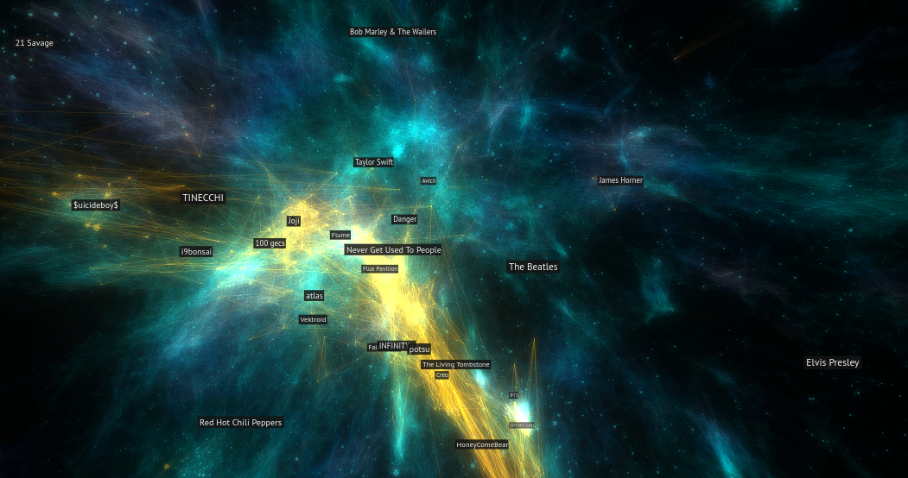

I implemented label rendering using a transparent canvas on top of the canvas used by the WebGL visualization.  The IDs of the artists which should have rendered labels are computed periodically based off position of the camera and other factors.  Then, every frame, the location of each of those artists on the screen is computed and properly positioned + scaled labels is rendered.

Although Three.JS provides some extremely useful built-in functions like [projecting a 3D point into camera space](https://threejs.org/docs/?q=vector3#api/en/math/Vector3.project), there were still a lot of annoying linear algebra that I needed to do manually like figure out if a point is in front of or behind the camera.

In addition to that, I set up dynamic size scaling of labels so that further away labels look smaller and get bigger as they approach.  There were a bunch of other small tweaks that needed to be made to make sure things looked good like adjusting label size based on artist popularity, rendering opaque labels in order of furthest to closest so that z-indices worked out properly, culling off-screen labels for performance, and stuff like that.  I spent at least two full days just getting the special "currently playing artist" labels to properly glue to the side of the screen when the currently playing artist was not in the field of view.

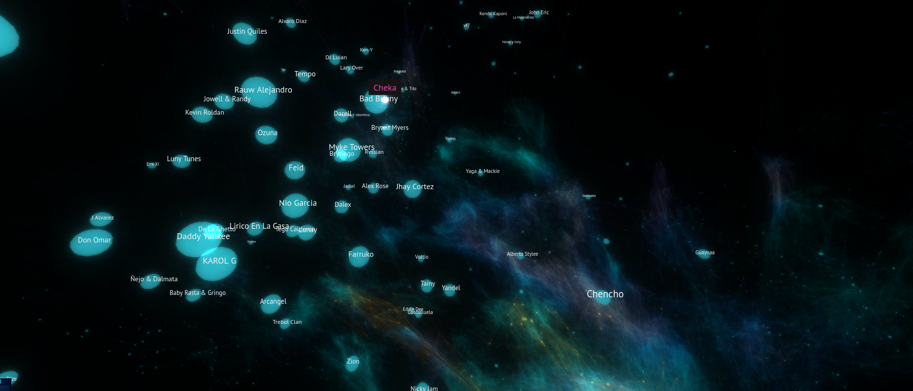

### Spatialized Audio

One neat feature of the music galaxy is that short samples of tracks (furnished by Spotify) will play from nearby artists as you fly around the galaxy.  The Web Audio API (with which I've worked [extensively](/blog/fm-synth-rust-wasm-simd/) in the past) has built-in support for [audio spatialization](https://developer.mozilla.org/en-US/docs/Web/API/Web_Audio_API/Web_audio_spatialization_basics).  This means you can change the balance of played audio to simulate the sound source being in different positions relative to the listener.

Since Three.JS already has built-in concepts of an observer (the camera) as well as 3D coordinates for all entities in the galaxy, setting this up was pretty easy.  The spatialized audio not only provides a more immersive experience by making it feel a bit more like the user is "inside" the galaxy, but it also makes it easier to orient oneself within the galaxy and find which artist's music is playing.

## Visual Design

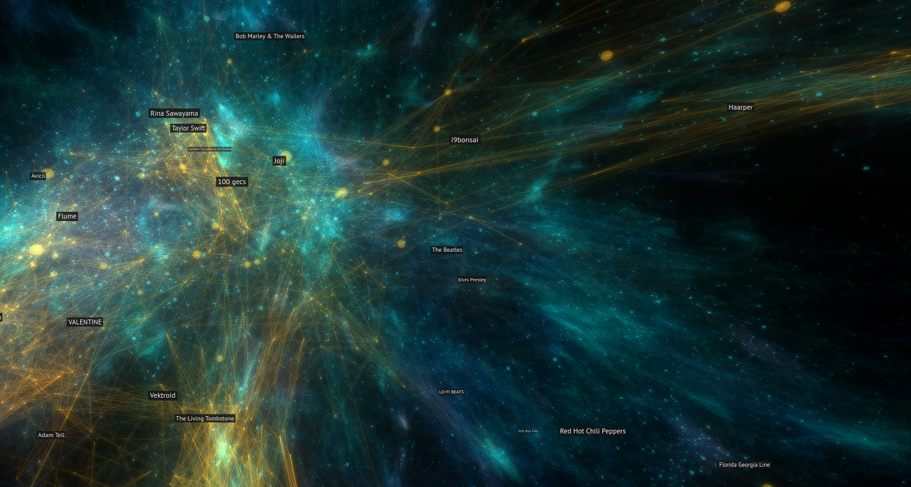

The majority of the galaxy's structure is made up of over 200,000 rendered connections between related artists.  Artists themselves are also rendered, but for performance reasons not all are always visible.  The opacity of the rendered connections is extremely low which provides the basis for the ethereal, space-like vibe.  The finishing touch is the addition of bloom post-processing which is vital for making the galaxy look like it's glowing and giving it more volume.

If a user opts to link their Spotify account, their top artists will be loaded and displayed in yellow/gold in the galaxy.  This can create structures that look like constellations, furthering the galaxy theme.

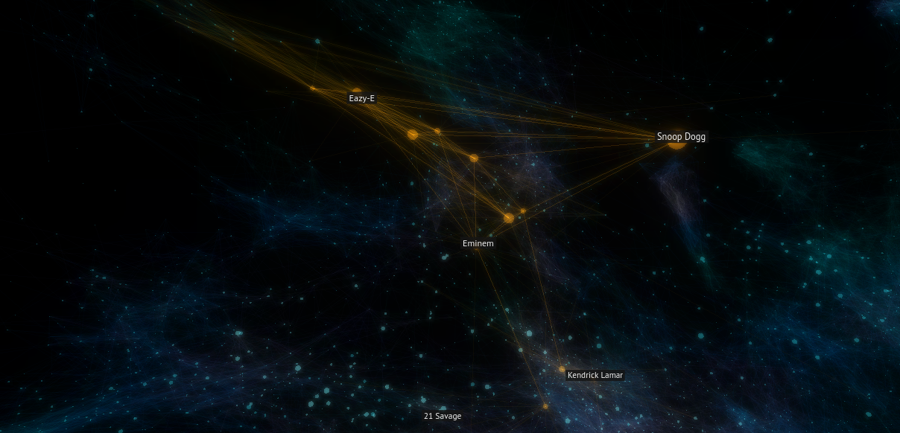

The color of the other and connections is varied using a 3D noise function.  This improves the galaxy by providing contrast and intrigue (especially if the user hasn't linked their Spotify) and making it easier to differentiate between the foreground and background.

When example music is played for artists while flying around the galaxy, I set the playing artist's sphere to pulse with the music.  This effect was achieved by using an `AnalyserNode` from WebAudio to look at raw samples as they streamed from the playing audio, find the sample with the largest value (highest gain/volume), and use that to determine the scale of the sphere.  The sphere size was low-pass filtered to prevent it from being too jumpy.

<video style="display: flex; margin-left: auto; margin-right: auto; width: 500px; height: 500px;" controls src="https://ameo.link/u/9gz.mp4"></video>

## Performance Tuning

My goal from the beginning was for Music Galaxy to run smoothly on as many different devices as possible, even smartphones.  That goal was largely achieved, but it took some creative methods to get there.

Starting off, the visualization is almost entirely GPU-bound:

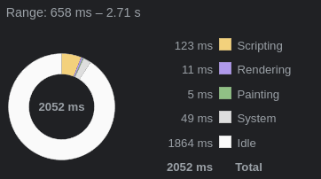

There were a few low-hanging fruits that I cleaned up on the CPU side, but even before that the CPU wasn't even close to saturated even on my smartphone.

### Instanced Rendering

The most important performance decision I made was using instanced rendering to render all of the connections and artists in the visualization.  All of the over 200,000 rendered connection lines are drawn with a single draw call.  This is done using Three.js's [`BufferGeometry`](https://threejs.org/docs/#api/en/core/BufferGeometry) which allows all of the vertex positions and colors to be provided in a single buffer which is rendered all at once.

Connections are almost entirely static throughout the lifetime of the program, and as such they're generated once and then uploaded to the GPU's memory where they remain.  Artist geometries are also rendered all at once using [`InstancedMesh`](https://threejs.org/docs/?q=instan#api/en/objects/InstancedMesh).  However, the buffer needs to be continuously updated as the camera moves.  Not all artists are rendered at once for performance reasons.  Luckily, Three.JS (and WebGL under the hood) provides a mechanism to only update a portion of the buffer in order to limit the amount of data that is sent over the PCI bus to the GPU.

### Web Workers

I use a web worker to offload some work off the main thread and keep it clear for rendering the visualization and handling user input.  The main code running on the worker is written in Rust and compiled to WebAssembly.

When the artist positions buffer is received over the network, it is immediately transferred over to the worker there where it's decoded and unpacked into various data structures in memory.  Whenever artist relationship chunks are received, they're also immediately transferred over to the worker and processed there.

The workers generate vertex and color buffers directly and update them dynamically as data is loaded and periodically as the user moves through the galaxy.  These buffers are then transferred to the main thread and sent to WebGL to be rendered.  The web worker also handles the logic for determining which labels should be displayed at a given time based on artist popularity, distance from the camera, whether they're in a user's personal top artists, etc.  The worker indicates to the main thread to apply various changes to the visualization by sending packed commands which are decoded at the beginning of each frame and applied deterministically in order to the visualization's state in JS.

I use the [comlink](https://github.com/GoogleChromeLabs/comlink) library to simplify running tasks on the worker and transferring data.  It provides a clean, typed, lightweight, promise-based interface over the underlying web worker ports.  I highly recommend it.

### Dynamic Quality Scaling

Despite best efforts, sometimes the device we're running on is just too weak and we need to scale back the quality in order to make the experience stable.  I set up a system that records the timings of the last several hundred frames and a quality-tiering system that reactively adjusts several different visualization parameters if FPS drops too low.  It updates the following visualization params:

 * Number of rendered artists
 * Number of rendered connections
 * Detail of artist geometries

If the device is struggling to keep a steady framerate, these params are adjusted downward (to a minimum) until it is.  Also, if FPS remains very high for an extended portion of time, it is adjusted upwards (to a maximum) to allow for more detail to be shown on higher-end devices.

Additionally, I have some special-case detection for Apple devices running with a [`devicePixelRatio`](https://developer.mozilla.org/en-US/docs/Web/API/Window/devicePixelRatio) greater than one, which is the case for the built-in Retina displays.  For my 2015 MacBook Pro, rendering the visualization full-screened with the double pixel ratio was simply too much for the built-in GPU, so I force the pixel ratio to 1 on Intel-based Macs.  I left label rendering at the native pixel ratio, though, because lowering that looked quite bad.  Higher pixel ratios are also left enabled on smartphones; all the ones I've had people test on seemed to run just fine.  It would seem the smaller screen size more than makes up for the supposedly weaker GPUs in mobile phones.

### Working Around an Apparent GPU Memory Bandwidth Bottleneck

Even after all of the above performance improvements, I was still running into performance issues on some weaker devices.  Although I couldn't find any working profilers or WebGL debuggers for the devices seeing the bad perf, I was able to run an AMD-specific GPU performance monitor called [`radeontop`](https://github.com/clbr/radeontop) on my Linux desktop.  That resulted in this graph:

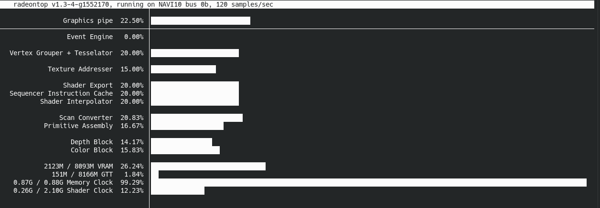

All of the recorded metrics were low except for Memory Clock which was consistently near 100%.  My first thought was that maybe the GPU was running out of VRAM and having to swap out to system memory or something like that.  However, that didn't seem to be the case; there are no textures used at all, just the vertices and colors which are quite small in raw byte size.

My next thought was that it was perhaps a memory bandwidth problem.  I vaguely remembered reading something about how GPUs can suffer from memory bandwidth bottlenecks, especially for GPGPU or machine learning use cases.  However, all of those rendered lines are transparent - a very important attribute for getting the galaxy to look realistic and have the space-like quality I was looking for.  The downside is that blending in Web/OpenGL is an expensive operation that requires a large amount of memory reads and writes to buffers in memory in order to add up the opacities.  I also found [various writings](https://developer.apple.com/documentation/metal/gpu_features/understanding_gpu_family_4) online that seemed indicate that Apple devices use tile-based renderers which suffer especially badly from transparency due to an implementation detail of their design.  This all led me to believe that memory bandwidth really was the root cause of the bad performance.

To test that idea, I removed all of the color buffers from the connections and artist geometries, setting them all to the same static color.  This resulted in an immediate massive performance improvement, like 20FPS -> 60FPS with a higher base quality massive.  I don't fully understand the big picture of the performance situation, but the fact that removing the need to read those colors from memory had such a drastic effect on performance was pretty strong evidence for memory bandwidth being the bottleneck.

As a middle ground that allowed me to keep having varied colors for the galaxy, I found that changing the backing color representation from 3 floating point numbers (the WebGL and Three.JS default) to three unsigned bytes (which is fully supported by WebGL and Three.JS) preserved most of the performance improvements while retaining the ability to color things.

I don't have a lot of experience working on performance with GPUs or graphics programming, so this was a valuable learning experience for me.  Usually memory latency is a lot more important for CPUs than bandwidth, but since GPUs have so many processing units all clamoring for data I can understand why memory bandwidth is a bigger problem there.
