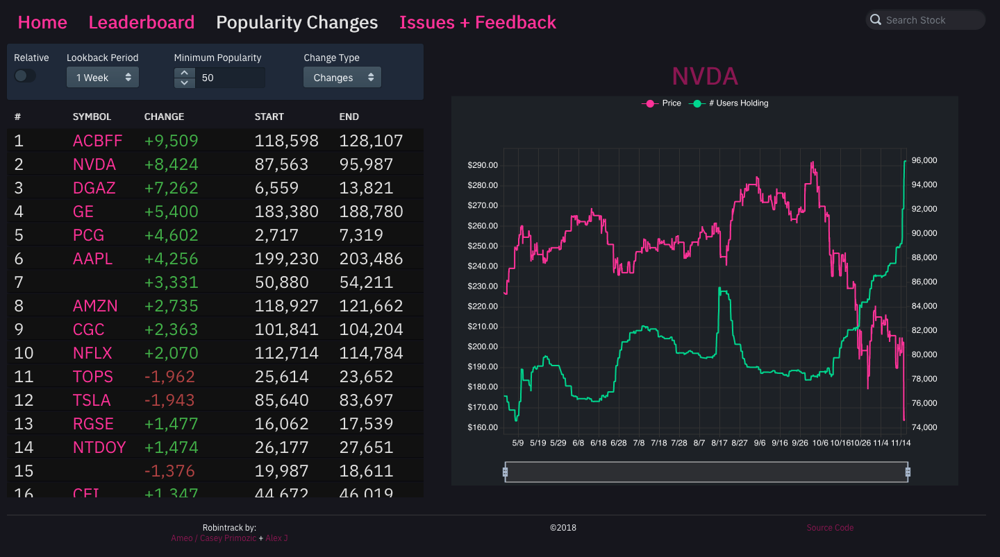

[Robintrack](https://robintrack.net/) is a website that I created to allow users to view how the popularity of various stocks held by [Robinhood](https://robinhood.com/) users change over time. I built the site along with [Alex J](https://github.com/dalexj) as a side project and launched it live in June 2018.

## Design + Rationale

I have a long history of creating \*-track websites. I don't know what it is about them, but I really enjoy both using and making them. I was originally inspired by the [RuneTrack](https://runetracker.org/) website long ago, and I've built other tracker websites for various other games and utilities in the past.

I'm personally a user of the Robinhood exchange, and I follow several online communities that have many members who actively trade on Robinhood as well. When I noticed that Robinhood publishes data about how many of their users own particular stocks, I got the idea to see how those numbers change as the price of those stocks do. It would be a simple matter of collecting the data points periodically for all of the stocks out there and plotting them on charts, which is exactly what Robintrack does.

Robintrack is made up of three individual parts: The scraper, backend, and frontend. Each of these three parts work together to pull, process, and display the popularity data and present it to users in an easy to understand and intuitive way.

## Scraper

The [Scraper](https://github.com/Ameobea/robintrack/tree/master/scraper) is a Python application that interfaces with the Robinhood API to pull down live data about the price and popularity of stocks on Robinhood. It uses an [Unofficial Robinhood API Client](https://github.com/Jamonek/Robinhood) to pull data from the Robinhood API.

When designing this component, I anticipated problems with rate-limiting on the Robinhood API. I originally overestimated the amount of API calls that would need to be made, and I planned on making it possible to distribute the requests among several hosts on separate IP addresses. To facilitate that, I designed the application to have several worker instances that all pull work out of a job queue, make requests to the Robinhood API, and store the results in the database. As it turns out, the Robinhood API is rather lienant, and I'm able to run all of the instances on a single host.

### Data Collection

Every hour, the main script runs to start the process of collecting new data. There are three individual pieces of data (from three separate API endpoints) that I pull: The list of tradable instruments, the prices of each of those instruments, and the number of users that hold them. The list of tradable instruments is fetched first, and each of the Instrument IDs are stored which map to the actual symbol name of the stock (like GOOG). The instrument IDs are then pushed into a RabbitMQ queues in batches for processing by the workers, one for both price and popularity.

As new work items arrive in the queue, the workers pull it out and make requests to the API for the price and popularity data. As they fetch it, they insert it as a new entry into the database where it's matched with the instrument ID and forms a timeseries for each of the instruments. All of these individual workers are fault-tolerant, handling both rate limiting by the Robinhood API by sleeping the specified duration, as well as handling networking errors and application errors on the Robinhood side.

## Backend

The backend is a Rails application that provides all of the API routes used by the frontend to retrieve data from the database. It was mostly built by Alex; I mainly just listed the requirements, added a few extra endpoints, and integrated it with the caching system (described later).

### Database

Most of the backend's endpoints are very light-weight, serving as simple wrappers and formatters to database queries. The database (MongoDB) does most of the heavy lifting for all of our queries; it's powerful query aggregation system allows us to perform complex, multi-step queries and computations entirely on the database. I know that MongoDB has a bad reputation among developers for many reasons, but I'm personally a fan of the way that it does things. Getting to work with data and make queries in terms of map/reduce and make queries using simple JSON is really nice, and I've had good experiences with its performance capabilities.

For example, this is the query that is used to determine the popularity rank of some symbol:

```ruby
MongoClient[:popularity].aggregate([
  { "$match" => { timestamp: { "$gte": 2.hour.ago.utc } } },
  { "$sort" => { timestamp: -1 } },
  { "$group" => { _id: "$instrument_id", latest_popularity: { "$first" => "$popularity" } } },
  { "$lookup" => {
    from: "index",
    localField: "_id",
    foreignField: "instrument_id",
    as: "indexes",
  } },
  { "$addFields" => { symbol: { "$arrayElemAt" => ["$indexes.symbol", 0] } } },
  { "$sort" => { latest_popularity: SORT_DESCENDING, symbol: SORT_ASCENDING } },
  { "$group" => { _id: 1, symbol: { "$push" => "$symbol" } } },
  { "$unwind" => { path: "$symbol", includeArrayIndex: "ranking" } },
  { "$match" => { symbol: symbol } },
  { "$addFields" => { ranking: { "$add" => ["$ranking", 1] } } },
  { "$limit" => 1 },
]).first
```

It starts by selecting the latest popularity data for every stock available on Robinhood. This is accomplished by selecting all popularity readings taken in the past 2 hours (which guarantees that at least one will be matched since new popularity data is fetched hourly) and taking the latest one for each symbol. Then, the symbol is looked up from the `index` collection and used as a secondary sorting index (in the case that two symbols have the same popularity). Finally, an array of these sorted symbols is built up, and the index of the target symbol is used as the popularity ranking.

#### Database Optimizations

One very important thing was to set up good indexes on the database for all of the queries that were made. Adding proper indices made an incredible difference in the speed of queries. Some complex queries required multiple indices on different collections in order to reach optimal speed, but finding out which queries still needed additional indexes was made far easier by Mongo's query explanation functionality.

Right now, the entire database is only ~1.5GB and fits entirely in the memory of the VPS it runs on. However, as the data set continues to grow, this will not be possible. I'm somewhat concerned what kind of impact this will have on its performance, and will continue watching until that ends up happening.

## Frontend

The frontend is implemented as a single-page React application. All of the routing is handled on the client side using [react-router](https://github.com/ReactTraining/react-router), and all data is loaded and parsed on-demand from API routes on the backend. To manage the API calls and store the queried data, [redux](https://github.com/reduxjs/redux.git) and [redux-saga](https://github.com/redux-saga/redux-saga.git) are used. As data is fetched, it forms a sort of in-memory cache within Redux. If a requested resource has already been fetched, it will not be re-fetched. This means that switching between different pages on the site doesn't require data to be re-queried every time, improving site performance and reducing network usage for the user.

### Responsive Design

The web app runs on all kinds of devices, and has been tuned to display on all realistic screen sizes. This is accomplished through a mixture of responsive CSS using flex-box as well as conditional rendering based on screen size by using [react-responsive](https://github.com/contra/react-responsive) which uses media queries internally. This process took significant effort, but turned out ot be very worthwhile as over 70% of users to the site visited it on some kind of mobile device.


### Data Visualization

For the charts, I used the [Echarts](https://ecomfe.github.io/echarts-doc/public/en/index.html) library. It was my first time using this library; I'd used [Highcharts](https://www.highcharts.com/) in the past for all of my other sites. As it turns out, Echarts is an excellent library with a huge level of support for different visualization types as well as allowing for a very high level of customization and styling of the charts themselves. I plan on using Echarts in the future as my primary web-based charting solution.

The site features several infinite-scrolling lists that display things such as the most and least popular stocks on Robinhood as well as stocks that have changed the most in popularity in some time period. These are built using [react-virtualized](https://github.com/bvaughn/react-virtualized), a very powerful library that makes it easy to create high-performing infinite lists and tables in React by only rendering what's in view to the DOM.

For menus and other UI, I used [Blueprint](https://blueprintjs.com/). I've not used this library before, but have come to really like both the way that it looks visually as well as its API internally. I certainly prefer it over [Material UI](https://material-ui.com/) and [Bootstrap](https://getbootstrap.com/), and its API is leagues better than [Semantic's](https://semantic-ui.com/).

All in all, I'm quite happy with how the frontend turned out. It may not be the most aesthetically pleasing of UIs, but it's quite functional and conveys the data well. Plus, it's the first one of my personal projects that properly handles mobile devices, and I feel that it does it very well.

## Caching

Caching was set up at the end of the project once everything else had been built. Due to the fact that all of the application's data is static except during the hourly update periods, there was a compelling opportunity to add a caching layer. Every single API route would return the same result given the same parameters, essentially making them pure functions.

As a result, caching was added at the API route level. Every time a request was received from the backend, the Redis cache was checked for an existing value. Cache entries are stored as entries in sets, with the set names being defined by the names of the API methods and the keys being created by concatenating the request parameters together in a deterministic way, producing the equivalent of a hash itself.

If an entry exists, it is returned directly, bypassing all of the route's logic and any calls to MongoDB. The item stored in the cache is the same as the response from the API route after processing and formatting, meaning that it can be returned directly as text. If no entry exists, MongoDB is hit and the query is formatted using the backend's logic. The formatted JSON is then stored in Redis, and the response is returned.

This isn't the most advanced or nuanced caching solution, but it is dead simple and does a great job increasing site performance. During the site's initial release when there were many users on the site at the same time, it had the added bonus of being warmed up almost immediately for the site's most common API endpoints. I am still considering adding a cache warmer to the scraper that will be run after new data is added, but I've not yet implemented that.

### Cache Invalidation

A cache locking system has been set up to prevent old cache entries from persisting after the hourly updates. Since the updates are asynchronous and consist of three individual workers all inserting data simultaneously with no pre-defined order in which they will finish, the instrument scraper will transmit a `__DONE` message over RabbitMQ to the workers which indicate that there are no more entries for this batch. Once the workers process this, they set a value in the cache which indicates that they are finished themselves and check to see if all other workers are finished as well.

If all workers are finished, the entire cache is dumped and the flags cleared for the next run. As users hit the site's API routes, new cache entries are added and the cache begins to become populated again.

## Docker

Docker is used extensively as a deployment solution for the application. The Rails backend is fully dockerized, as well as the scrapers. In addition, the RabbitMQ, MongoDB, and Redis instances run within Docker with the MongoDB container making use of volumes to persist data directly to the host filesystem. A docker-compose file could be created to deploy the whole application stack (potentially even including the frontend with a dockerized webserver), but I'm currently just running them as individual containers.

I've found Docker to be invaluable for managing the deployment of complex software stacks that involve several different languages or sensitive dependency trees. Moving things to different servers is as simple as pulling or rebuilding the docker image and running a single command.

## Future Work

There are several features that I'd like to add to the site in the future. One, as I mentioned in the previous section, is to add a cache warmer to pre-populate the cache whenever a data scrape finishes.

On the frontend, I'd like to add a popularity comparison view so that users can see how the popularities of several different stocks change with respect to each other. I'd also like to create a histogram of the popularities of all of the stocks on the brokerage, but I don't know how valuable that would be.

I'd like to add some more information to the pages for each individual stock. The Robinhood API provides data about the company name and description for all of the different stocks, and it would be good to display that on the page rather than just the symbol. Robinhood also provides data about the distribution of prices at which its users bought stocks compared to the current price, which I feel there is a neat opportunity for visualization when its change over time is taken into account.

I'd also like to implement some kind of indication of how the popularity ranking (what position it is in the list of the most popularity stocks on Robinhood) changes and display that in the most/least popular stock list.

Looking further down the road, I've got some ideas about giving users tools to analyze their own portfolios and trading activity. Robinhood currently doesn't provide much information at all regarding performance history, with an unlabeled line chart showing historical profitability being the only thing that they offer. Similar to my [Polotrack](https://ameo.link/polotrack/) (mostly non-functional) which allows users of the Poloniex cryptocurrency exchange view data about their portfolio's performance and their past trading activity, I believe that there is a great opportunity for a similar tool to be created for Robinhood.

I also had an idea to make a [StockTwits](https://stocktwits.com/) bot that posted when significant popularity changes occurred.

---

Overall, I'm very happy with how Robintrack turned out. It was very well received by everywhere I've shared it, and I genuinely feel that it will serve as a valuable tool to traders and anyone interested in the sentiment of retail traders in the market.
