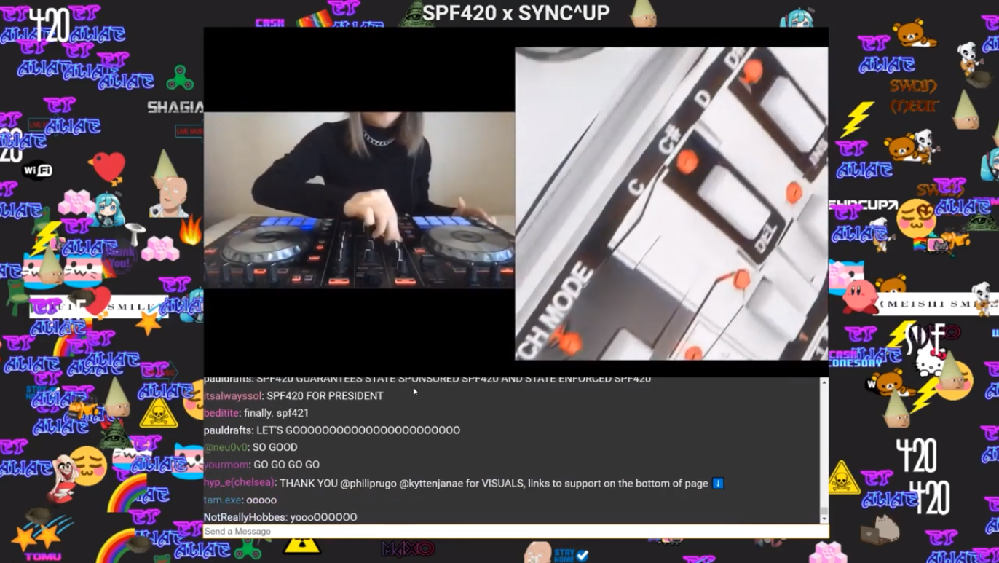
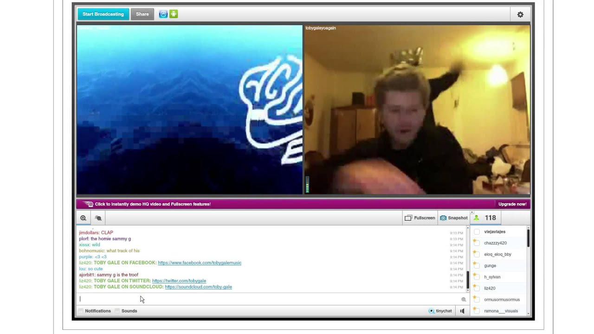
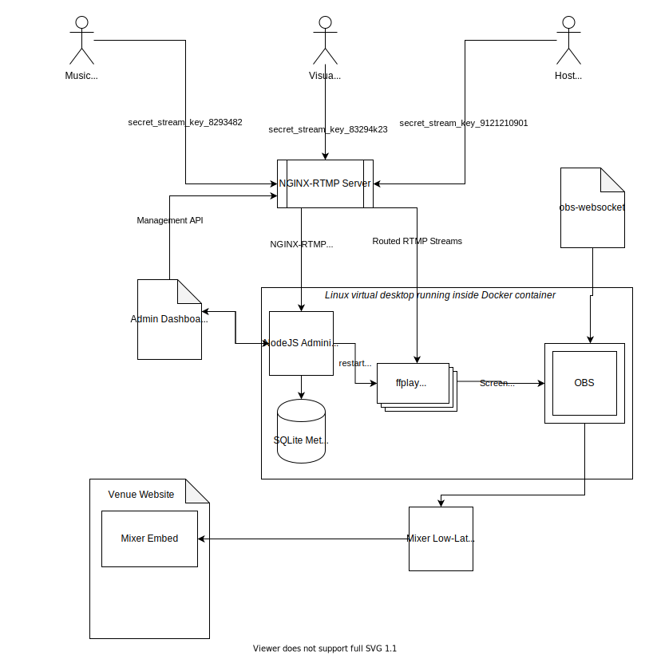
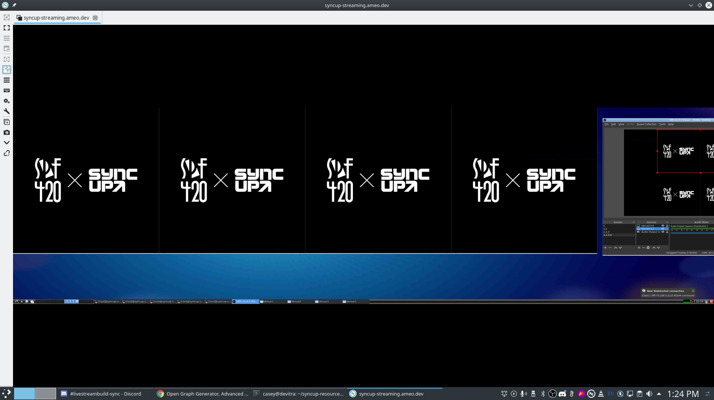
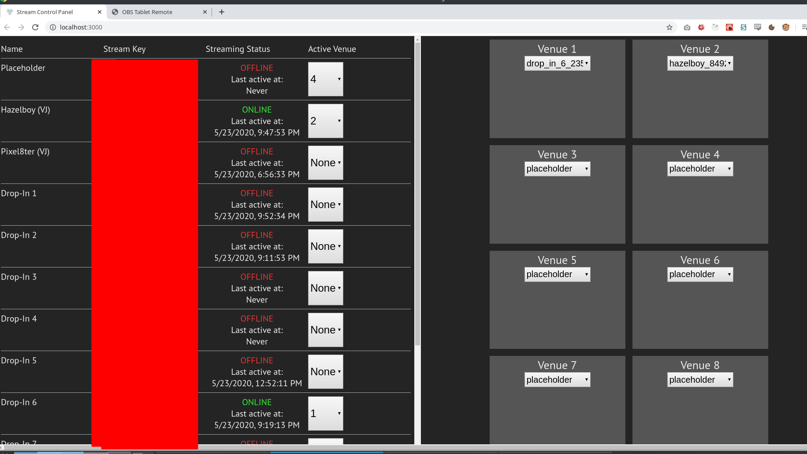
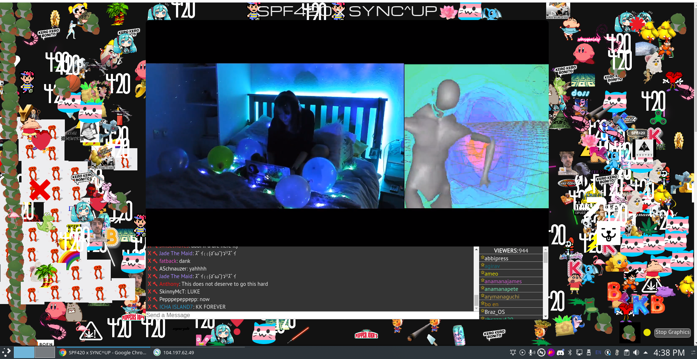
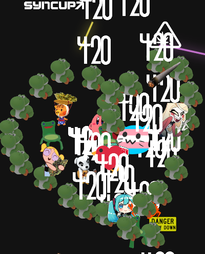

Back at the beginning of 2020, I become involved with the people who founded SPF420 - a group of musicians and artists who had started hosting live concerts over an ancient video chat application called TinyChat years before virtual concerts or online events were really even a thing. With the situation created by COVID-19, there was an explosion in activity in the digital events space and they wanted to bring SPF420 back after a several-year hiatus. Here's an idea of what the original SPF420 looked like:

TinyChat was long gone, and they didn't have a method for hosting the event that they were happy with. There were loads of events doing simple Twitch/YouTube streams, and they wanted to do something special and unique. Before this, I was working with one of members of that group to develop a video stremaing setup that could link together three real venues, allowing crowds to see each other at three simultaneous concerts across the country. That event was canceled due to the pandemic, but I had a good bit of livestreaming setup already built that I figured I could re-purpose for a fully online event.

I set out to capture the vibe of the original TinyChat concerts of SPF420's roots while at the same time making it into a modern and accessible experience. I was also lucky to have a week off between when I was switching jobs during which I could focus entirely on building the setup which was a huge help. By the end of it, I managed to create a fully functional livestreaming setup and web frontend that allowed hundreds (and later thousands) of concurrent viewers to experience the music + visuals live and interact in real time along with custom visualizations and interactive components.

<iframe width="560" height="315" src="https://www.youtube-nocookie.com/embed/uJL8FRKmJOw" frameborder="0" allow="accelerometer; autoplay; encrypted-media; gyroscope; picture-in-picture" allowfullscreen></iframe>

Since then, we've put on a total of three concerts so far with dozens of musical and visual artists involved, attracting hundreds to thousands of concurrent viewers each time. I've added more features to the platform and tried to improve things overall along the way.

I've been meaning to do a technical breakdown of the different components of the build for some time; it really spanned more of the stack than anything I've built previously and allowed me to work in frontend web UI, live audio/video streaming, realtime/streaming event handling + state synchronization, and devops/system administration to create a cohesive and functional system.

## Livestreaming Architecture

The livestreaming infrastructure was designed with the main goal of allowing multiple artists to stream themselves performing music, DJing, or creating visuals live and have it all end up routed to the same output stream that viewers watched. This included allowing for multiple artists to be displayed at the same time side by side, mimicking the TinyChat experience.

First, here's a diagram I made outlining the entire livestreaming architecture from front to back (I'll explain each piece later on):

There's a lot going on there, and indeed it was a complicated architecture with many interconnected pieces. However, the end result was a fully controllable, dynamic, and 100% live setup by which artists could stream live audio + video to a single server using stream keys I generated for them and have them combined dynamically with streams from other artists and/or hosts and all be displayed in a single output stream embedded on the venue webpage.

### NGINX-RTMP Server

This piece serves as the core of the whole setup. At a high level, it's an instance of NGINX with the [RTMP Module](https://github.com/arut/nginx-rtmp-module) included which allows individual RTMP streams (the main live video/audio format used for internet live streaming from applications such as OBS) to connect to it and stream their video.

The RTMP module supports a variety of features like proxying, redirecting, transcoding, and saving RTMP streams. This allows it to be used, in a simple case, as a broadcast server by which one input RTMP stream is broadcast to all connected RTMP clients. However, the feature that made everything possible was the dynamic control API that it came with. This API allows for controlling various different configuration parameters of the server dynamically by making HTTP requests to endpoints on the server. Among these endpoints was one that redirected the source of an output stream to a different input.

Using this functionality, I created several different "venue" streams that all were initially pointed at a static "placeholder" stream that was just an endlessly looping image of the SPF420 x SYNC^UP logo. Whenever RTMP clients connected to one of those venue streams, the source that the venue stream was configured to connect to would be proxied through to the client.

By calling the control API to change the input for each of those venue streams individually, it became possible to "route" different streamers through to different venues. I created a UI on the admin webpage to change the routing of each venue, allowing any of the source artists' stream keys to be chosen to be displayed on any of the venues. By this method, it was possible to switch between different artists during the event as they finished their sets and the next one started.

### Dockerized Virtual Desktop

The method by which all of the input streams were combined into one and routed to the delivery stream was handled by an instance of OBS running inside of a virtual Linux desktop that itself ran inside of a Docker container on the same server that the NGINX RTMP server ran on. I had a set of `ffplay` (a very light-weight video/livestream playback application bundled with `ffmpeg`) instances scripted to launch and open at carefully calculated coordinates on the screen. Each one connected to one of the RTMP venue streams and simply played it back. OBS then added each of these as an input, and I used its built-in scene-building functionality to combine them into the output:

This actually worked better than I expected it to; OBS functioned fully in that environment except for some issues where it couldn't use the "window capture" mode. As a workaround, I was able to set up several different scenes that each captured a portion of the full screen which worked just fine. And critically, audio capture worked as well using PulseAudio and a virtual software-only audio device.

As I mentioned, all of this ran on the same server as the NGINX proxy. Since there was no GPU for OBS/ffmpeg to use for encoding and conversion, it did everything in software and nearly saturated all 16 cores of the VPS I ran it on at peak load. However, this worked like a charm without a hitch and the server has run smoothly through all of the events so far.

### Admin Web UI

The admin UI, as I mentioned before, was what I and the other concert administrators used to view the status of each of the input streamers (whether they were streaming or not) and change the routing of the venue streams dynamically. Any time any of those select inputs were changed, an API request was made to the NGINX server which triggered the venue stream's input to be switched to the selected stream key. In later revisions of the setup, it also contained controls for managing the interactive pieces of the website including changing the title to show the currently playing artist, change the available set of stickers could use, change between interactivity modes for users, and other things.

The other piece is in the other tab, OBS Tablet Remote which is a frontend for [obs-websocket](https://github.com/Palakis/obs-websocket). This is a tool that allows remote control of an OBS instance. I used it to switch between different scenes which had different numbers of side-by-side windows, so it was possible to go from having a single person streaming at once to up to 4 or more side-by-side streams combined into the output as needed.

### NodeJS Administration API + Custom `ffplay` instances

This piece was responsible for serving APIs ingested by the admin UI as well as interacting directly with the `ffplay` instances that played back the venue streams. It also received webhook callbacks from the NGINX server which were went when artists started or stopped streaming and kept track of that state in a SQLite database.

One important detail of its functionality is that whenever an admin changed the routing of one of the venue streams, it triggered the `ffplay` instance that displayed that venue stream to reload from scratch after a few seconds. The reason for this is that when the routing for a stream is changed, there's a chance that the RTMP stream from the venue will cause the `ffplay` instance to enter a bad state. I assume this has something to do with the statefulness of the encoding causing the video playback to break when it's switched in the middle or a frame sequence or something like that. Anyway, the end result was that sometimes when the venue stream was re-routed, the `ffplay` instance playing it back would start spewing thousands of error messages and fail to display any video.

I [forked](https://github.com/Ameobea/FFmpeg/commit/a644a4e814d941f5af4891786378c2f15ac26410#diff-e3eea8ed5ebb63190faafde21a687b48R3263) `ffplay` and added in a patch that allows it to re-initialize from scratch (without closing the window and messing up the alignment used by OBS) and clear out any bad state caused by re-routing the venue stream. This re-initialization is triggered when a UNIX signal is received by the process, and the NodeJS admin API handles sending that signal to the correct `ffplay` instance after re-routing takes place. This successfully dealt with the issue and allows re-routing venues to work smoothly.

## Visualizations + Chat Server

As you might have seen in screenshots or videos of the event's website, there are tons of little stickers in the background along the sides of the video embed. These were part of the interactivity of the site; each one was played by a user whenever they click on the background of the site. They turned out to be a big hit with people, and attendees did all kinds of cool + cute things with them together:

Whenever users moved their cursors around the background of the site, a glowing trail would follow it that was visible to all other users. This meant that users could see each other in a limited fashion and do things like follow each other around or "dance," making things feel a bit like you're attending the event with a everyone else even while potentially being alone physically. In addition, I also added support for other types of visualizations later on in the form of fireworks that viewers could launch:

  <video width="800" height="500" controls poster="https://i.ameo.link/bkv.png">
    <source src="https://i.ameo.link/7vn.mp4" type="video/mp4">
  </video>

There was also a fully custom chat implementation by which users could pick a username and chat with other viewers. I upgraded this to support more features like a list of users, "starring" well-known/verified users, and supporting full moderation and spam control.

For more recent concerts, I added support for switching the set of available stickers depending on which artist was currently performing, allowing for artist-specific stickers to be displayed while they played. I also added the ability to change some other things about the site like the background color. This helped to switch things up and keep viewers interested as well as cut down on the spam and clutter that built up after a while of people placing down stickers.

### Technical Implementation

The websocket server which powered all of this was written in Rust, using the latest and greatest tooling that the Rust async ecosystem had to offer. I used protobuffers to encode all of the messages available to send to and from the server and then wrote logic to handle them. I took care to account for as many edge cases and potential site-killing problems as I could: I had extensive rate-limiting built into almost every command, I had support for automated as well as manual moderation of the chat, I carefully audited all of the synchronization code to avoid deadlocks or other bugs, and I made extra effort to avoid any `.unwrap()`s or other code that may trigger panics, instead handling each possible error case explicitly.

The end result was an extremely performant server that successfully scaled up to over a thousand concurrent users off a single virtual server. It handled synchronizing the state of visualizations, applying updates from all of the users, and keeping all connected users up to date by broadcasting events. In order to keep bandwidth to a minimum, I batched updates into chunks that were transmitted on a regular interval, and I compressed the protobuf bytes (and de-compressed them on the frontend) to make their over-the-wire size as small as possible.

The frontend that connected to the websocket server was also written in Rust via WebAssembly, so I was able to share a good deal of code between the two of them - namely the protobuf definitions. Serialization and deserialization of messages was trivial and was handled nicely in Rust. The user of a binary encoding like protobuffers over the usual JSON had a dramatic impact on the bandwidth usage of the server which matters because bandwidth was the highest cost by far of the whole cloud setup. Google Cloud (where I ran the servers) like most other cloud providers charge heavily for bandwidth, so anything saved there goes a long way. It also makes the site faster for users and takes less of a toll on mobile users' data plans if they're viewing on the go.

### Issues

I ran into a few problems with the viz server that caused some downtime during some of the streams. The first was when I hit the file descriptor limit of 1024 when over ~900 users were viewing at the same time; this was very hard to track down because of a programming error on my end that caused the program to exit (with a 0 status code) instead of handle the error when it happened. It was very sad when I finally found that the problem was that simple, but at least it was an easy fix.

There was only one panic that occurred, and that was caused by me slicing UTF-8 strings. when users provided input for their usernames or messages that contained multi-byte characters, Rust panic'd when trying to slice between those bytes. It was pretty easy to identify and fix on the fly during the first concert what that happened.

## Frontend

The frontend was built using TypeScript, React, and Rust compiled into WebAssembly. It's relatively simple and even primitive in design, intentionally so; we tried to capture the independent, casual, fun, and community-run feeling of the original SPF420 events.

Besides the React pieces, there was a WebAssembly component that was compiled to Rust which served as the interface between the UI and the viz WebSocket server. It used [`wasm-bindgen`](https://github.com/rustwasm/wasm-bindgen) to bridge between WebAssembly and JavaScript smoothly, allowing for seamless integration with the DOM and the site as a whole.

For the most recent concert, I re-wrote the implementation of the visualizations entirely to be more performant and allow a wider variety of features. I used a 2D WebGL graphics engine called [PixiJS](https://www.pixijs.com/) to implement the visuals, and was very happy with the experience of working with it. I was able to implement the fireworks, animated stickers, and better cursor trails in a performant manner, providing a better experience to users with slower hardware.

<blockquote class="twitter-tweet" data-dnt="true" data-theme="dark">
Doing some performance tuning + stress testing on the <a href="https://t.co/OBKkrqFz0N">https://t.co/OBKkrqFz0N</a> site for next SPF420.  The crashes last concert were due to it hitting the file descriptor limit; will be fixed for next time!  Website&#39;s being overhauled to be high-performance even on low-end devices. <a href="https://t.co/jXVXGmWZVN">pic.twitter.com/jXVXGmWZVN</a>
&mdash; Casey Primozic (ameo) (@Ameobea10) <a href="https://twitter.com/Ameobea10/status/1254197522395873280?ref_src=twsrc%5Etfw">April 25, 2020</a></blockquote> 

## Future Work

One thing that I'd love to do more of is create highly customized and artist/set-specific sets with more elaborate integrations with the web platform. I think it would be a lot of fun to do sort of "choreographed" changes to the site as a whole such as adding filters, adding little minigames that correspond to something going on with the visuals, or other fun things like that which can tie the site and the stream together.

I'd also like to put even more effort into optimizing the performance of the frontend and making it display and function well on mobile. Although it will work on almost any modern smartphone, there's a lot of possibility to make things smoother for mobile viewers and I think there's more performance gains to be had as well.

---

Overall, this has been one of my favorite projects I've been a part of so far in my life. I got to work directly with artists who I love and listen to and be a part of a great group of people doing exciting creative work. I look forward to the future of what SPF420 / SYNC^UP will become in the future and can't wait to help build it!
