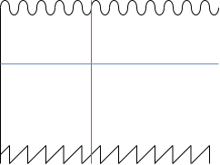

TODO: Insert cool picture of wavetable synth visualization or something similar

Wavetable Synthesis is a method for synthesizing audio by interpolating between different pre-sampled waveforms stored in a table. It's a very neat way to generate sounds that change over time, allowing the different waveforms to morph into each other slowly in order to create rich and complicated textures.

I've been experimenting with synthesizing audio in the web browser via my [web synthesizer project](https://github.com/ameobea/web-synth), and figured that wavetable synthesis would be a cool addition to the platform. It seemed like a simple enough thing to implement from scratch and an awesome opportunity to put Rust and WebAssembly to work in a useful way!

## Background on Wavetables and Computer Audio Programming

The construction of the wavetable itself is relatively straightforward: All that is needed is a bunch of sampled waveforms in memory. It's possible to have any number of these waveforms in the table, and the number of samples in each waveform is arbitrary as well.

As a bit of background, in computer audio sound is represented as a series of floating point numbers from -1 to 1. These represent the physical position of the speakers as the electromagnets that control them are powered on and off. By varying this value over time, the speakers move and vibrate the air molecules, producing sound. The rate and amount by which these values change determines the kind of sound that is produced. It's kind of awesome how direct of a connection there is between the code and the physical world here - that's something that you don't see every day when working with modern software.

A waveform is nothing but a list of these floating point samples. Most waveforms produced by synthesizers are periodic, meaning that the same pattern of samples repeats infinitely over and over to produce a constant sound. In the case of this wavetable synth, we will loop back to the beginning of the waveform once we reach the end. This means that we have to have at minimum one period of the wave stored in the table, otherwise we won't have enough information to fully re-construct the sound.

Anyway, a wavetable just consists of a 2D array of samples. As we move through the table, we interpolate between the different waveforms within it, meaning just that we mix their samples together. Take for example the simplest case: a table with just two waveforms. Let's assume that the "range" of this wavetable goes from 0 to 1; any value within this range can be selected to sample the wavetable in a slightly different way.

If waveform A is at the beginning of the wavetable at position 0 and waveform B is at the end of the wavetable at position 1, then we would sample both waveforms at the same sample index and then mix those two samples together according to the position that we're at in the table. In this way, we can sample the table using a 2D coordinate of `(sample index, mix factor)`. In the visualization below, the red line represents the sample index, and the blue log represents the mix factor.



Each time we take a sample, we increase our sample index by some amount in order to move through the wave. The amount that we move is equal to the ratio between the frequency of the waveforms in the wavetable and the desired output frequency of the wavetable. By increasing the number of samples that we advanced through the wavetable for each sample output, the pitch of the output is increased. The same goes in reverse. In order to support non-integer ratios, we interpolate between the samples along the x axis in the same way that we interpolate between waveforms on the y axis.

### Adding More Dimensions

A 1D waveform (well, two if you count the waveforms themselves as have a dimension due to the fact that they're made up of many individual samples) is cool as it is - you can get a lot of neat effects out of just moving around the different waveforms there. However, what's stopping us from adding more layers of interoplation with _other_ wave tables, mixing the interpolated result of the first dimension with the output of the second? Nothing, of course; computers are really really good at indexing into arrays of memory and mixing together floating point numbers.

In order to do that, we'll need to add two additional variables for each dimension: one to control the mix factor of the second dimension, and one to control the mix between that dimension and the previous dimension. So the total set of all inputs that we have when sampling our n-dimensional wavetable now look something like this:

- `sample_index`: The current horizontal position within the wavetable marking the sample index of the waveforms that we're sampling
- `output_frequency`: The desired output frequency. `output_frequency / wavetable_frequency = sample indices moved per sample`
- `dimension_0_mix`: The mix factor of the first dimension; vertical position within the wavetable for that dimension

And additionally, for each dimension after the first one:

- `dimension_n_mix`: The mix factor for the nth dimension; vertical position within the wavetable for that dimension
- `dimension_n_interdimensional_mix`: The mix factor used to interpolate between the output of the previous dimension and this one

In a way, this can be thought of as constructing a chain of "virtual" wavetables, with the output of the previous wavetable serving as the input waveform for the _interdimensional wavetable_. Each wavetable is sampled independently and then mixed with the output of the previous dimension to yield its output, which can then be mixed again etc. It will probably be a good idea to use smaller mix factors for the higher dimensions in order to preserve the effects that the lower dimensions had on the sound; otherwise it's possible for a higher dimension with a high mix factor to almost entirely take over the generated sound.

The alternative to this sort of chaining strategy would be to sample have a single mix factor for each dimension that all added up to 1.0 and then do a weighted average of the outputs from each of them according to their mix factor. The issue with this that I imagine, however, is that there are many more opportunities for signals to cancel themselves out of degrade to noise in that kind of environment. When we mix only two dimensions together at a time, the interactions are much more tightly controlled, and we get an aditional parameter with which to control the mix between dimensions.

## Implementation

### Data Structures

So now that we know what we want to do, we have to figure out how to translate it into code. The solution that I ended up with was potentially a bit overcomplicated as I split things up a bit more than was probably necessary. I originally designed it with the possibility of multiple voices being sampled out of the same wavetable simultaneously, but later dropped that idea because it would require adding the complication of mixing those voices together, normalizing volume, and other stuff. That being said, here are the data structures that I came up with:

```rs
pub struct WaveTableSettings {
    /// Number of `f32` samples in a single waveform
    pub waveform_length: usize,
    /// Number of dimensions in the wave table that can be mixed
    pub dimension_count: usize,
    /// Number of waveforms in each dimension
    pub waveforms_per_dimension: usize,
    /// Frequency of the samples that are stored in the wavetable
    pub base_frequency: f32,
}

pub struct WaveTable {
    pub settings: WaveTableSettings,
    pub samples: Vec<f32>,
}

TODO: Update this once we update the Rust code...
/// Represents a single voice playing out of an attached `WaveTable`
pub struct WaveTableHandle {
    pub table: &'static mut WaveTable,
    pub frequency: f32,
    pub sample_ix: f32,
    pub mixes: Vec<f32>,
    pub sample_buffer: Vec<f32>,
}
```

By allowing all of the wavetable's properties to be defined dynamically via `WaveTableSettings`, users are able to use the wavetable in a variety of different ways without having to do any kind of re-compilation. The drawback is that we do have to do some dynamic allocations in order to create the table, but these allocations are all up-front and shouldn't be a cause for any kind of performance problems outside of making the resulting Wasm module a little fatter.

There's a partial solution for just this use case in the [`wee-alloc`](https://github.com/rustwasm/wee_alloc) crate, but I've run into strange issues with memory corruption while using that crate in the past (which may or may not stem from issues with my own code or bugs in `wee-alloc` iself), but in any case I opt to take the few-KB Wasm blob size penalty and stick with the default allocator.

### API

### `AudioWorkletProcessor`

The WebAudio spec supports two methods for implementing custom DSP code: `ScriptProcessorNode` and `AudioWorkletProcessor`. `ScriptProcessor` is now deprecated, however, leaving `AudioWorkletProcessor` as the de-facto standard. Unfortunately, Firefox does not yet support `AudioWorkletProcessor`, so it will be necessary to use Google Chrome in order to run this project.

`AudioWorkletProcessor` is superior to `ScriptProcessorNode` because it runs the DSP code on a separate thread, freeing up the main thread for things like rendering the UI and handling input events. `ScriptProcessorNode` uses an event-based API to perform digital signal processing, and all code runs on the main thread. I've worked with both approaches, and I can say that the benefits of using `AudioWorkletProcessor` are immense: doing any kind of work on the UI thread such as rendering React components or rendering audio visualizations will cause really bad clicks, pops, and cutouts of audio being processed with a `ScriptProcessorNode`.

#### Challenges of `AudioWorkletProcessor`

Naturally, there are a few trade-offs that come with using `AudioWorkletProcessor`. Any time more than one thread gets involved, complexity tends to go up quickly. That being said, there are certainly good ways to deal with those new challenges for our use case and the resulting is crisp jitter-free audio is well worth it.

When using WebAssembly from an `AudioWorkletProcessor`, we don't get a lot of the benefits of the modern JavaScript ecosystem that tools like [`webpack`](https://webpack.js.org/) bring us. Since the code in audio worklet processors runs on a separate thread than normal JavaScript, there are many restrictions put on the JavaScript code that executes there compared to what can be done on the main/UI thread. One of these limitations is that we are unable to make network requests to fetch things dynamically from within the processor - a reasonable limitation, all things considered. This poses a problem for using Rust-generated Wasm in audio worklet processors due to the way that `wasm-bindgen` works.

Currently, almost every piece of documentation for compiling Rust to WebAssembly uses [`wasm-bindgen`](https://rustwasm.github.io/docs/wasm-bindgen/) to make interacting with Rust-generated Wasm from JavaScript easy. It's a really awesome tool - it automatically generates TypeScript functions that correspond directly to your Rust functions, it takes care of transforming JS data structures like strings into Rust data structures in Wasm, and it takes care of all of that automatically. The generated JavaScript code gets created as an ES module that wraps over the underlying Wasm module, abstracting it entirely from the view of the developer when interacting with it from JavaScript.

The modules generated by `wasm-bindgen` are asynchronously loaded - they return a JavaScript `Promise` since fetching, compiling, and instantiating Wasm modules is an asynchronous process. They perform an import of the Wasm module at the top level which Webpack sees, causing it to pass on that asynchronous import behavior to the `wasm-bindgen` module as well. Webpack takes care of a lot of this complication via the `import()` syntax; it automatically generates the code that fetches the async module and returns a `Promise` that will resolve to the module once it finishes initializing.

However, since the only way to load the modules generated by `wasm-bindgen` is by making a request to fetch it dynamically, and we can't even use Webpack at all for audio worklet processors, that pretty much rules out using `wasm-bindgen` for our Rust code.

### Rust to WebAssembly without `wasm-bindgen`

Luckily, there is still a way to generate Wasm modules from Rust without having to use `wasm-bindgen` at all. Back in the early days of Rust's Wasm support before `wasm-bindgen` came into being, that was the only way to do it. What we lose with this approach is the ability to pass complicated data structures back and forth between Rust and JavaScript; the only data type that currently exists in Wasm is numbers. In our situation, that's not too bad: audio is just numbers, after all, so we should be able to get by reasonably well within that limitation.

One of the nice abstractions that `wasm-bindgen` provides is the ability to pass arrays back and forth between JavaScript and Rust with ease. We'll have to do this ourselves, but the benefit is that we get to do delightfully low-level things to the Rust code running inside of Wasm. There's no feeling quite like that obtained from writing bytes directly into Rust's memory and watching as all of those beautiful safety guarentees it provides crumble:


#### Manually Optimizing Generated Wasm

The WebAssembly ecosystem, although still pretty young, has a rich ecosystem of tooling available for working with Wasm modules and transforming them in-place. Since the Wasm binary format is designed to be easily readable and extremely standardized, it's possible for tools to operate directly on Wasm blobs and perform optimizations to reduce their size or even increase their performance via things like inlining and loop unrolling. The `wasm-opt` tool, available as part of the [binaryen](https://github.com/WebAssembly/binaryen) toolchain, does just that and all via a simple command line interface. To install `wasm-opt` and optimize the generated Wasm module,

```bash
» git clone git@github.com:WebAssembly/binaryen.git
» cd binaryen
» mkdir build && cd build
» cmake ..
» make -j8 # Replace 8 with your CPU's core count
» sudo make install
```

Then, to optimize a Wasm module using all possible optimizations,

```bash
» wasm-opt dist/wavetable.wasm -O4 -o dist/wavetable.wasm
```

For many Wasm modules, you will see module size decreases of >30% - pretty terrific for something that can run without even looking at the source code that generated it!

However, after building the wavetable Wasm module and running `wasm-opt`, I was shocked to see that it was still over 1MB in size! This was really surprising because it uses no external dependencies, doesn't do any kind of complicated string manipulation or anything like that, and doesn't even include the overhead created by `wasm-bindgen` for its shim imports/exports. Using a tool called [`twiggy`](https://github.com/rustwasm/twiggy), I profiled the Wasm module that was produced:

```
» cargo install twiggy
» twiggy top dist/wavetable.wasm

 Shallow Bytes │ Shallow % │ Item
───────────────┼───────────┼─────────────────────────────────────────
        582478 ┊    33.20% ┊ custom section '.debug_str'
        456731 ┊    26.03% ┊ custom section '.debug_info'
        305913 ┊    17.44% ┊ custom section '.debug_line'
        177960 ┊    10.14% ┊ custom section '.debug_ranges'
        142882 ┊     8.14% ┊ custom section '.debug_pubnames'
         52017 ┊     2.96% ┊ custom section '.debug_pubtypes'
         16984 ┊     0.97% ┊ custom section '.debug_aranges'
          4633 ┊     0.26% ┊ custom section '.debug_abbrev'
          3145 ┊     0.18% ┊ code[29]
          1062 ┊     0.06% ┊ code[41]
           939 ┊     0.05% ┊ code[34]
           866 ┊     0.05% ┊ data[0]
           ...
```

It seems that there are some extremely large debug sections getting emitted even though I don't have debug info turned on for release builds. By default, `wasm-bindgen` takes care of doing a couple of things to reduce the size of the Wasm modules it generates. One of these things is to remove these custom debug sections that are generated by the Rust compiler. We can do that manually ourselves by using a tool called `wasm-strip` provided by the [WebAssembly Binary Toolkit (WABT)](https://github.com/WebAssembly/wabt):

```bash
» git clone git@github.com:WebAssembly/wabt.git
» cd wabt && git submodule update --init
» mkdir build && cd build
» cmake ..
» make -j8 # Replace 8 with your CPU's core count
» sudo make install
» wasm-strip dist/wavetable.wasm
```

Checking with Twiggy again, it looks like that did the trick:

```
» twiggy top dist/wavetable.wasm

 Shallow Bytes │ Shallow % │ Item
───────────────┼───────────┼──────────────────────────────────────
          3145 ┊    21.40% ┊ code[29]
          1062 ┊     7.22% ┊ code[41]
           939 ┊     6.39% ┊ code[34]
           866 ┊     5.89% ┊ data[0]
           728 ┊     4.95% ┊ code[32]
           683 ┊     4.65% ┊ code[8]
           ...

» ls -l dist/wavetable-wasm
-rwxr-xr-x 1 casey casey 14700 Dec  6 09:06 dist/wavetable.wasm
```

Our Wasm module now clocks in at a stunningly slim 14.7KB, dropping down to a miniscule 6.5KB after `gzip`. Now that's what I'm talking about!

#### Debugging Without Strings or Dev Tools

TODO

## Constructing the Waveforms

For testing and demo purposes, I figured it would be a good idea to implement a 2-dimensional wavetable populated with the 4 basic waveforms: sine, triangle, sawtooth, and square. Generating them from scratch is straightforward enough, and they can be modified to any desired frequency.

I decided to use a low frequency of 30hz for the wavetable in order to have as high of a resolution as possible when interpolating between samples when sampling at higher frequencies. On important property of the waveforms used to populate the wavetable is _periodicity_ - the waveforms need to be able to loop back to their beginnings smoothly without cutting off in the middle of a period. If a waveform used to build the wavetable is cut off, looping it will create outputs like this:


Malformed waveforms like that will introduce clicking, buzzing, or other unwanted audio artifacts into the generated sound, so it's important to make sure that the waveforms used to build the wavetable really are periodic. Since the normal sample rate of audio used in WebAudio is 44100hz (44100 samples per second - very standard for computer audio), there are 44100/30 = 1470 samples in a single period of the wave. That means for for the 30hz waves we'll be generating, the waveforms will need to be arrays of 1470 samples.

So here are the parameters that we'll be using to generate our waveforms and the wavetable they'll live in:

```ts
const SAMPLE_RATE = 44100;
const desiredFrequency = 30; // 30hz

const waveformSampleCount = SAMPLE_RATE / desiredFrequency;
```

## Generating Waves

Sine waves are just the sine function. The sine function naturally has a period of 2π, and we need to scale that into a period of `(sample_rate / desired_frequency)`. So, the equation we use to generate the samples of our 30hz sine wave is `y = sin(x * (2π / (44100 / 30)))`:

```ts
for (let x = 0; x < 440; x++) {
  bufs[0][x] = Math.sin(x * ((Math.PI * 2) / waveformSampleCount));
}
```

Triangle waves start at -1, spend half a period rising linearly to 1, and then half a period linearly back down to -1. I found that the easiest way to think about this one was to treat it as a repeating piecewise function with one piece on each half of the waveform:

```ts
// triangle wave; goes from -1 to 1 for one half the period and 1 to -1 for the other half
for (let i = 0; i < waveformSampleCount; i++) {
  // Number of half-periods of this wave that this sample lies on.
  const halfPeriodIx = i / (waveformSampleCount / 2);
  const isClimbing = Math.floor(halfPeriodIx) % 2 == 0;
  // `%1` is a trick to get the decimal part of a number in JS
  let val = 2 * (halfPeriodIx % 1) - 1;

  // If we're on the second half of the waveform, we flip the sign
  if (!isClimbing) {
    val = -val;
  }

  bufs[1][i] = val;
}
```

Square waves are at -1 for half of a period and then at 1 for half of a period:

```ts
// square wave; half a period -1, half a period 1
for (let i = 0; i < waveformSampleCount; i++) {
  const halfPeriodIx = i / (waveformSampleCount / 2);
  const isFirstHalf = Math.floor(halfPeriodIx) % 2 == 0;

  bufs[2][i] = isFirstHalf ? -1 : 1;
}
```

Sawtooth waves start at -1 and then rise linearly to 1 throughout the whole period, resetting back to -1 immediately at the beginning of the next period. It can be implemented rather easily by just repeating a scaled `y = x` function:

```ts
// sawtooth; climb from -1 to 1 over 1 period
for (let i = 0; i < waveformSampleCount; i++) {
  // What fraction of the way we are through the current period
  const periodIxFract = (i / waveformSampleCount) % 1;

  // Scale from [0, 1] to [-1, 1]
  bufs[3][i] = periodIxFract * 2 - 1;
}
```

To help with debugging, I dumped the generated waveforms to CSV and plotted them:

TODO TODO TODO

Looks good! All of the periods line up and the waveforms look like we'd expect them to.

## Populating the Wavetable

Once we have out source waveforms, we now need to use them to build the `WaveTable` data structure itself in Wasm. Luckily, the implementation is very simple - it's just all of the waveforms for all of the dimensions concatenated into a big 1D array:

```ts
// I felt that this would be more efficient than using a real multi-dimensional array
// since all of the data is in the same allocation and the differnt waveforms are near
// each other in memory.

const wavetableData = new Float32Array(
  dimensionCount * waveformsPerDimension * waveformLength
);

for (let dimensionIx = 0; dimensionIx < dimensionCount; dimensionIx++) {
  for (let waveformIx = 0; waveformIx < waveformsPerDimension; waveformIx++) {
    for (let sampleIx = 0; sampleIx < waveformLength; sampleIx++) {
      const i =
        samplesPerDimension * dimensionIx +
        waveformLength * waveformIx +
        sampleIx;
      wavetableData[i] = wavetableDef[dimensionIx][waveformIx][sampleIx];
    }
  }
}
```

In case you've not seen it before, `Float32Array` is a _Typed Array_ which is a special JavaScript data structure optimized for storing only 32-bit floating point numbers. Besides being much more performant than normal JS arrays, they also have several useful methods for copying data around which are useful for moving data in and out of Wasm memory.

In order to get the data out of our JavaScript arrays and into Wasm, we first need to allocate the data structures that it will be stored in. On the Rust/Wasm side, I've created some exported functions for doing that.

TODO: Update these with code changes once we make them

`init_wavetable` creates a new empty wavetable instance with the provided settings:

```rs
impl WaveTable {
    pub fn new(settings: WaveTableSettings) -> Self {
        let wavetable_data_size = settings.get_wavetable_size();
        WaveTable {
            settings,
            samples: vec![-1.0; wavetable_data_size],
        }
    }
}

// Marking the function as `#[no_mangle]` is required in order to
// make the function exported for use from JavaScript
#[no_mangle]
pub fn init_wavetable(
    waveforms_per_dimension: usize,
    dimension_count: usize,
    waveform_length: usize,
    base_frequency: f32,
) -> *mut WaveTable {
    let settings = WaveTableSettings {
        waveforms_per_dimension,
        dimension_count,
        waveform_length,
        base_frequency,
    };

    Box::into_raw(Box::new(WaveTable::new(settings)))
}
```

It handles allocating the buffer into which the table's data will go. The return type of the function is `*mut WaveTable` which is a raw pointer to the allocated `WaveTable` struct on the Rust/Wasm heap. When this function is called, that pointer is returned to JavaScript as a normal number which serves as an index into the Wasm memory buffer for the wavetable module.

I also created a second helper function for retrieving a pointer to the generated wavetable data buffer:

```rs
#[no_mangle]
pub fn get_data_table_ptr(handle_ptr: *mut WaveTable) -> *mut f32 {
    unsafe { (*handle_ptr).samples.as_mut_ptr() }
}
```

### Potential Pointer Pitfalls

It's important to note that we're actually leaking that memory from the Rust side. The only way that the underlying `Box` will ever get `drop()`'d is if we re-cast it to a `Box` on the Rust side and let it fall out of scope. Although currently the created wavetable exists for the life of the Wasm module and the `AudioWorkletProcessor` that owns it, if any future features ever involve modifying/replacing the generated wavetable creating cleanup functions would be necessary in order to avoid a memory leak. That can be implemented simply enough like this:

```rs
#[no_mangle]
pub fn drop_wavetable(table: *mut WaveTable) { drop(unsafe { Box::from_raw(table) }) }
```

One other easy mistake that has stung me several times in the past is accidentally dropping the boxed handle in a function that's only meant to operate on it/access it. For example, if we implemented the `get_data_table_ptr` function like this:

```rs
#[no_mangle]
pub fn get_data_table_ptr(handle_ptr: *mut WaveTable) -> *mut f32 {
    let mut handle = unsafe { Box::from_raw(handle_ptr) };
    handle.samples.as_mut_ptr()
}
```

The `handle` would end up getting `drop()`d and the underlying heap allocations `free()`d. This can be very hard to track down and manifest itself in strange and mysterious ways with crazy data corruption and seemingly impossible control flows. One way to avoid the box from getting dropped is to use `mem::forget` to leak it explicitly:

```rs
#[no_mangle]
pub fn get_data_table_ptr(handle_ptr: *mut WaveTable) -> *mut f32 {
    let mut handle = unsafe { Box::from_raw(handle_ptr) };
    let data_ptr = handle.samples.as_mut_ptr();
    ::std::mem::forget(handle); // Prevent the `Box` from getting `drop()`'d
    data_ptr
}
```

Make sure that you either just deref the raw pointer directly or `forget()` the box before returning from the function.

### Rust <-> JavaScript Interop

Anyway, our `get_data_table_ptr` function takes the pointer to the `WaveTable` as input, and using it would look like this:

```ts
const wavetablePtr = wasmModule.exports.init_wavetable(...args);
const wavetableDataBufferPtr = wasmModule.exports.get_data_table_ptr(
  wavetablePtr
);
```

Now that we've set up space for the wavetable's data in Wasm memory, we need to copy our waveforms in from JavaScript. The Wasm memory is available as an `ArrayBuffer` via `wasmModule.exports.memory.buffer`. However, this poses a problem: we have 32-bit numbers, but the only way to write into an `ArrayBuffer` is byte by byte. In order to copy full `f32`s, we need to create a typed array _view_ of that memory buffer:

```ts
const f32WasmMemoryView = new Float32Array(wasmModule.exports.memory.buffer);
```

This doesn't actually allocate any new memory, but it provides an interface for reading the Wasm memory buffer as if it was an array of 32-bit floating point numbers. The final step that we have to do is convert the wavetable data buffer pointer into an index in that f32 memory view:

```ts
const BYTES_PER_F32 = 32 / 8;
const f32ViewMemoryBufferIx = wavetableDataBufferPtr / BYTES_PER_F32;
```

We assume that the Rust compiler created the buffer with a 4-byte alignment; otherwise this isn't possible and everything burns down. Anyway, the last step is to copy the wavetable data from JavaScript into Rust. There is a convenient [`.set()`](https://developer.mozilla.org/en-US/docs/Web/JavaScript/Reference/Global_Objects/TypedArray/set) method on `TypedArray`s that does this very cleanly:

```ts
f32WasmMemoryView.set(wavetableData, f32ViewMemoryBufferIx);
```

### Wavetable Handle Setup

Now that we've got our wavetable built, the final thing we have to do is create a handle to read from it:

```rs
#[no_mangle]
pub fn init_wavetable_handle(table: *mut WaveTable) -> *mut WaveTableHandle {
    let handle = Box::new(WaveTableHandle::new(unsafe { ::std::mem::transmute(table) }));
    Box::into_raw(handle)
}

Since the mix parameters will change over time, we need a way to update them as well:

#[no_mangle]
pub fn get_mixes_ptr(handle_ptr: *mut WaveTableHandle, sample_count: usize) -> *mut f32 {
    let mut handle = unsafe { Box::from_raw(handle_ptr) };

    while handle.sample_buffer.len() < sample_count {
        handle.sample_buffer.push(0.0);
    }

    while handle.mixes.len() < sample_count * handle.table.settings.dimension_count {
        handle.mixes.push(0.0);
    }

    let mixes_ptr = handle.mixes.as_mut_ptr();

    mem::forget(handle);

    mixes_ptr
}
```

## Sampling the Wavetable

Well, we're about ready to start reading out of our freshly allocated wavetable. The interface that `AudioWorkletProcessor` provides us with for processing audio data is the [`process`](https://developer.mozilla.org/en-US/docs/Web/API/AudioWorkletProcessor/process) function. It gives us an array of input channels (which we ignore), an array of output channels (which we will write the output of the wavetable into), and a map of `AudioParam`s.

`AudioParam`s are WebAudio constructs that represent numbers that can change over time. You can connect anything in the WebAudio to an `AudioParam`: constant values, the output of `OscillatorNode`s, or even audio samples out of a buffer. `AudioWorkletProcessor` provides that ability to define a set of input `AudioParam`s that will be accessible during its execution.

TODO: Update with new code from after we add in the additional mix param for each dimension

## Result

TODO

## Extra - Visualizing the Wavetable's Output

TODO

## Potential Future Improvements + Enhancements

TODO

### Avoiding Aliasing in Higher Frequencies

TODO
