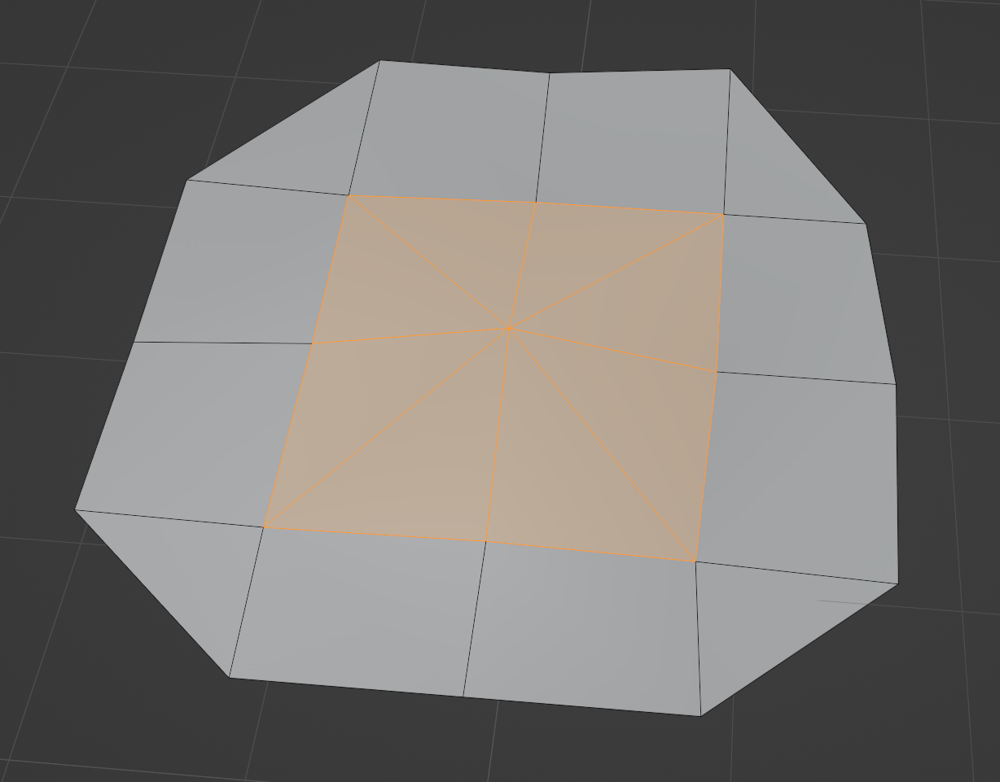
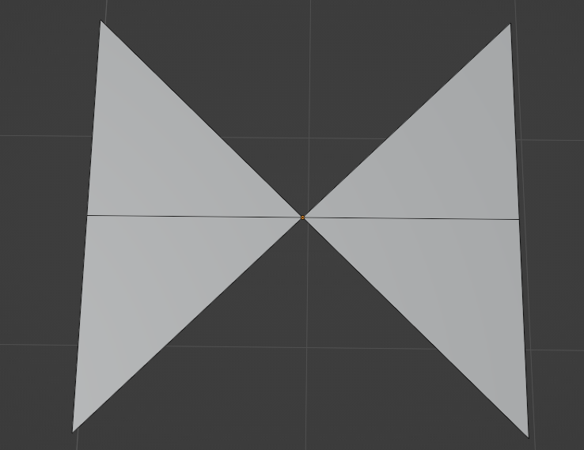

 

## Background

As part of some [other work](/blog/subdividing-meshes-for-displacement/) I was doing that involved programmatically manipulating 3D meshes, I encountered the need to compute normals for them from scratch.

Usually this isn't necessary since applications like Blender handle doing this automatically.  But in my case, I was doing these transformations dynamically and in the web browser for my Three.JS application.  If I wanted normals to shade my transformed meshes, I'd have to compute them myself.

### "Smooth by Angle" Shading

There are two "simple" shading models available:

 * **Smooth shading** - where the normals of each vertex that is shared by more than one face share gets a single, averaged normal
 * **Flat shading** - where each vertex is duplicated for every triangle it's a part of and gets assigned the normal of that triangle

Computing normals for these shading models is pretty easy, especially for flat shading.

And then there's "smooth by angle" shading.

Blender used to label it as "Auto-Smooth" shading, but it's the exact same thing.  It operates as a mix between smooth and flat shading, conditionally shading different parts of the same mesh differently depending on the sharpness of its various edges.

It's a very useful tool when dealing with models that have a mix of organic and geometric parts, or as a good default when you don't know what kind of mesh is being shaded.

When I started out, I tried to come up with an algorithm to compute normals for this shading model myself.  I had a few different attempts, some of which got close, but there were always edge cases or mesh structures that caused them to fail and produce inaccurate or just straight broken shading.

After a lost weekend, I decided to give in and try to figure out how Blender does it so I can do the same.

### Loops + Loop Normals

One important concept that Blender uses in its implementation of this is that of the **loop**.

This is a loop:

  </img>

Another way to think about a loop is as _an instance of a vertex within a particular face_.

One crucial attribute of loops is that each one can have a unique normal.

This is critical for shading; it allows for different faces that share the same vertex to have the same or different normals depending on the shading parameters and the context of the rest of the mesh.

## Data Structures

In order to compute these normals in an efficient way, it's necessary to use a sufficiently powerful data structure to represent the mesh.

One common choice is referred to as a **half-edge** data structure, also known as a doubly-connected edge list.  This is a common choice used by a lot of serious geometry processing applications.

It represents meshes as graphs with their constituent components (vertices, edges, and faces) all pointing to each other.  "Half-Edges" are used to refer to a single direction of an edge between two vertices going around a face.  Each edge is represented by two half-edges, each going a different direction, hence the name.

### `LinkedMesh`

For my own code, I created a similar data structure which I called `LinkedMesh`.  It's similar to, and in many ways a simplification of, a half-edge data structure.

Just like a half edge data structure, it maintains bi-directional links between the different entities like this:

 &quot;Edge&quot;;  &quot;Edge&quot; -> Vertex;  Face -> Vertex;  &quot;Edge&quot; -> Face;  Face -> &quot;Edge&quot;;}" style="width: 100%;"></img>

My whole implementation lives in [one file](https://github.com/Ameobea/sketches-3d/blob/main/src/viz/wasm/common/src/mesh/linked_mesh.rs) if you're interested in checking it out or using it as a basis for a data structure of your own.

The main requirements are that it's possible to easily and efficiently perform operations like finding all edges that contain a given vertex and find all faces that contain some given edge.

## The Algorithm

To be honest, the algorithm for computing normals for smooth-by-angle shading really isn't that complicated (as long as sufficiently powerful data structures are used to represent the mesh).

It's split into three different parts.

### Merging Coincident Vertices

This step might not necessary depending on the format of the data you're starting with.

In order to have an accurate topological representation of the mesh, all vertices that are at exactly the same position need to be merged.  This is the same thing as running "Merge by Distance" in Blender with a distance set to zero.

This will be necessary if working with post-export indexed vertex data like I was since some vertices will have already been duplicated by Blender or whatever other application to facilitate the original shading model on the mesh.

### Marking Sharp Angles

The next step is to iterate over all edges in the mesh and mark them as either sharp or smooth.

Before checking any angles, there are some special cases to consider:

 * If an edge is only contained in a single face, it's automatically sharp
 * If an edge is used by more than two faces, it's automatically sharp as well

So, that means the only case that remains to be considered is an edge that is shared by exactly two faces.  In that case, the normals of those faces are computed and compared.

For reference, the normal of a face with vertices `v0`, `v1`, `v2` in counter-clockwise winding order can be computed like this:

$$
\mathbf{N} = (\mathbf{v}_1 - \mathbf{v}_0) \times (\mathbf{v}_2 - \mathbf{v}_0) \\
$$

Then normalize that result:

$$
\mathbf{N} = \frac{\mathbf{N}}{\|\mathbf{N}\|}
$$

If the angle between those normals is greater than the user-provided threshold, the edge is sharp.  Otherwise, it's smooth.  These sharp flags should be recorded somewhere that they're easy to look for any given edge.

### Smooth Fans

Once the edges are all marked as either smooth or flat, the next step is to visit each vertex in the mesh and partition all of the faces around it into **smooth fans**.

Here's what Blender means when they refer to faces fanning around a vertex (the center orange one in this case):

All of the faces in the fan have that center vertex as one of their three vertices and share an edge with another face in the same fan.

Fans don't have to go all the way around like this though, and multiple disconnected fans can exist around a single vertex like this:

This leads to the concept of **smooth fans**.  A smooth fan is a portion of a fan of faces around at vertex that are joined by smooth edges.  If a sharp edge is encountered between two faces, they're treated as not connected and will be partitioned into a different smooth fan.

Here's that same mesh from the start but modified to create two sharp edges:

As a result, the full fan around that vertex gets split into two smooth fans (the highlighted faces in one, and the other faces around that vertex in another).

### Walking Smooth Fans

Now we've arrived at the core of the algorithm.

For each vertex visited in the mesh, all of its smooth fans must be traversed.  This can be done by walking from face to face through shared edges that contain the vertex.  The walk stops at sharp edges, edges that are only contained by a single face, or faces that have already been visited.

I tracked down [the spot](https://github.com/blender/blender/blob/a4aa5faa2008472413403600382f419280ac8b20/source/blender/bmesh/intern/bmesh_mesh_normals.cc#L1081) in the Blender source code where this is implemented if you want to look at that directly.  It's pretty arcane, though, with lots of handling for extra features and Blender-specific implementation details.

One thing to note is that depending on your mesh data structure, you might have to walk the other way from the starting face once you hit the end.

While walking, the normal of each face visited is accumulated into a sum weighted by the angle between the edges of that faces that share the vertex.  If that didn't make any sense, here's what those are:

Once all faces in a smooth fan have been visited, the weighted normal sum is normalized and assigned to be the **loop normal** of every loop in that smooth fan.  Blender also calls those "Split Normals", or "per-face-per-vertex" normals.

When meshes are exported into indexed vertex data, duplicate vertices will be created for each unique loop normal.  This will produce discontinuities in the normals along the mesh at sharp edges and result in a locally flat-shaded appearance.

And that's it!  Once all smooth fans for every vertex in the mesh have been walked, loop normals will have been set for every loop.

## Unique Cases

One interesting scenario I ran into when testing this algorithm out is when dealing with smooth fans that have exactly one sharp edge, like this:

With only one sharp edge, there's no way to partition the faces around that vertex into more than one smooth fan, so all of the loops at that vertex get the same normal as shown by the single magenta split normal being rendered.

The result is a sort of "half-sharp" edge, where the shading gets smoother and smoother as the edge is traced towards the center vertex:

This seemed weird and kind of buggy to me at first, but it made sense when I thought about it some more.

When this mesh is exported as individual triangles with indexed vertices, there's no way to partition the inner vertices such that they all share normals except for the two on either side of that sharp edge.  It's just not topologically possible.

That issue doesn't exist for the outer vertex, though; it can be split nicely into two smooth fans that each have a single face.  However, if the mesh is modified to make a full fan of faces all the way around that outer vertex, the sharp edge will disappear entirely and be effectively smooth shaded - there's no way around it.
