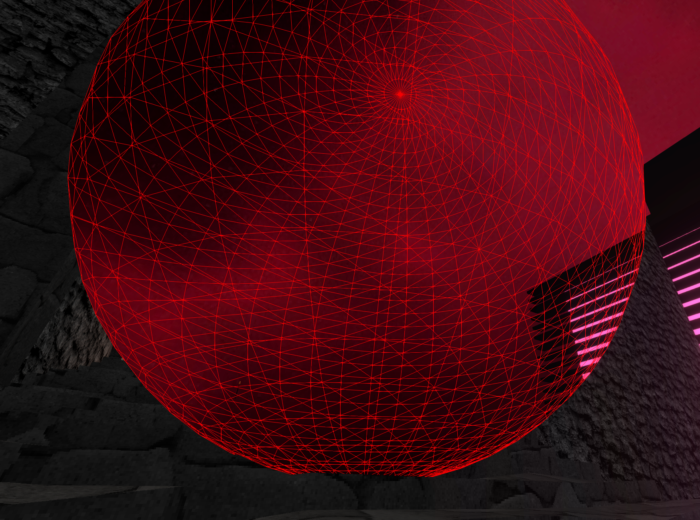

Recently, I've been working on some 3D projects in the browser with Three.JS.  It's mostly just for learning and fun right now, getting familiar with writing shaders in GLSL, 3D modeling with Blender, and all of that jazz.

The modern ecosystem is very rich and WebGL is a mature platform, so there's a ton of pre-built shaders, post-processing effects, and tools to pick from.  Plugging all of these things together along with a [Wasm-compiled physics engine](https://github.com/kripken/ammo.js/) yas yielded me some really great results so far, even with my very amateur Blender skills:


## Expensive Fragment Shaders

One of the resources I pulled in and integrated into my project is a hex-based seamless tiling shader.  Textures that repeat over a large area can lead to very obvious patterns being visible, even when the textures are seamless.  The hex tiling algorithm uses a very clever technique which transforms the coordinates using a hexagonal grid, then samples and blends between three adjacent hexes.  This synthesizes a new texture that looks visually identical to the old one but without any perceptible tiling patterns.

The awesome part is that it does all of that live within the fragment shader!  You just ship and load the normal texture, and the tile-free version magically manifests itself in your scene.

I took code [from Shadertoy](https://t.co/fd5pED209e) - which itself is an implementation of a [research paper](https://hal.inria.fr/hal-01824773) - and adapted it to work inside of a Three.JS PBR shader material.  Here's how it looks in my project:

<iframe src="https://homepage-external-mixins.ameo.design/depth_based_fragment_culling/tiling_compare.html" loading="lazy" style="width: 100%;aspect-ratio: 1856/1326;overflow:hidden;display: block;outline:none;border:none;box-sizing:border-box; margin-left: auto; margin-right: auto"></iframe>
<!-- <iframe src="http://localhost:5173/depth_based_fragment_culling/tiling_compare" loading="lazy" style="width: 100%;aspect-ratio: 1856/1326;overflow:hidden;display: block;outline:none;border:none;box-sizing:border-box; margin-left: auto; margin-right: auto"></iframe> -->

I'm extremely impressed with how well it works.  Pretty much any texture I've tried it with works great and the quality is amazing.

However, this comes at a cost.  The algorithm is pretty expensive computationally.  Besides needing to do some math to compute transformed coordinates, it also needs to perform three texture lookups instead of one, and the locality of those fetches is not very good which can lead to cache thrashing.

For me, this cost is worth it and I'm happy to include this in my shaders for things like grounds or walls.  However, I noticed that as I continued fleshing out my levels and adding more meshes, performance kept getting worse.  Even when staring at a wall, things behind the wall were still rendered and costing significant resources.

## Existing 3D Rendering Optimizations

The most effective way to speed up computers, as always, is finding ways to compute less.  The primary way this is done in 3D graphics is through different types of culling - determining which objects don't need to be rendered and just not rendering them.

To start, WebGL/OpenGL implements **backface culling** natively.  If you set the right flags, only triangles that are facing the camera will be rendered.  As long as you make sure that the triangles are facing the right way on your geometry, then this is a nice freebie to get things started.

Another very simple type is called **frustum culling**.  This takes the region of the world that the camera can see, intersects it with the bounding boxes of every object in the scene, and skips rendering everything that doesn't intersect with the camera's viewbox, or frustum.  Performing these checks is very cheap and quite easy to implement, and Three.JS actually comes with this functionality built-in and enabled automatically.

That doesn't help with other situations, however, like the case I was talking about where all the objects behind a wall were still getting rendered.  To handle this, games and 3D engines use **occlusion culling**.  This involves performing some calculations before rendering each frame to determine which objects are completely covered (occluded) by others and excluding those from rendering.  That is significantly more difficult to implement, though, and CPU expensive.

Although this would indeed address the problem, there are no occlusion culling implementations for Three.JS that I could find, and I wasn't interested in trying to implement it myself.  It also adds cost on the CPU side and has some other drawbacks.  For example, if even a single pixel of a large mesh is visible, then the whole mesh will still be rendered.

## A Culling Compromise

When doing some research into solutions for optimizing my shaders, I happened across something that seemed like a great candidate called **early fragment test**.  The [OpenGL doc page](https://www.khronos.org/opengl/wiki/Early_Fragment_Test) for it had some very hopefulness-inspiring bits that made it seem like it could really help my use case.

The premise of this optimization is that it will look at the depth buffer when rendering each fragment and check if the fragment currently being computed is "deeper" than one that's already been rendered.  A larger depth value means that the current fragment is behind another one and barring some situations like transparency, isn't visible.  In that case, the fragment shader can be skipped entirely.

The docs page lists a magic statement you can put at the beginning of your shader which forces these to get enabled:

```glsl
layout(early_fragment_tests) in;
```

I tried putting that in the shaders generated by Three.JS, but it turns out that it's only available in GL version 3.1 and higher.  WebGL 2 uses GL version 3.0, which means this wouldn't work for me.

A disappointing result; early fragment tests seemed like the ideal solution to my situation.  Since the fragment shader is the most expensive part of my application by far, being able to skip running it should significantly lighten the rendering load.  Although docs page mentioned that this optimization could potentially be enabled automatically in some situations, the performance I was seeing in my app didn't make it seem that it was working in my case.

But just when I was about to abandon the search, I happened across a Stack Exchange question that looked like it could offer a solution:

https://computergraphics.stackexchange.com/questions/9833/early-depth-test-in-webgl

The proposed solution is actually very simple, so I'll just include it here:

> 1. make a depth pass with a straight-forward fragment shader and
> 2. then in a second pass test gl_FragCoord.z against the value of the depth texture.

Seems straightforward enough!  This is implementing the same behavior as the early fragment test, but doing it manually and explicitly.

We have to pay the cost of rendering our whole scene twice, but the first time we just run an extremely trivial fragment shader and only record the shallowest depth of each fragment in the scene.  This is almost identical to the method that shadow-casting lights use to determine which parts of the scene are in shadows and which ones receive light.

The second pass uses all the existing shaders and proceeds like normal, but adds a little bit of code that runs at the beginning of the fragment shader.  It reads from the computed depth buffer and compares the current fragment's depth to the shallowest depth for that pixel.  If the current fragment is deeper, then we can just skip rendering it entirely!

## Three.JS Implementation

To implement this in Three.JS, I first used the [`postprocessing`](https://github.com/pmndrs/postprocessing) library to set up a multi-step rendering pipeline.  The library provides a pre-built `DepthPass` which does exactly what we need for the first step of the process:

```ts
const composer = new EffectComposer(viz.renderer);

const depthPass = new DepthPass(viz.scene, viz.camera);
depthPass.renderToScreen = false;

const depthTexture = depthPass.texture;
depthTexture.wrapS = THREE.RepeatWrapping;
depthTexture.wrapT = THREE.RepeatWrapping;
depthTexture.generateMipmaps = false;
depthTexture.magFilter = THREE.NearestFilter;
depthTexture.minFilter = THREE.NearestFilter;
```

This is what the output of the depth pass looks like if rendered to RGBA, compared to the scene itself:

<iframe src="https://homepage-external-mixins.ameo.design/depth_based_fragment_culling/depth_diffuse.html" loading="lazy" style="width: 100%;aspect-ratio: 1850/1326;overflow:hidden;display: block;outline:none;border:none;box-sizing:border-box; margin-left: auto; margin-right: auto"></iframe>

The strange coloring and banding in the depth pass output is due to the packing scheme which the depth shader uses to increase the resolution of the recorded depth data by combining it into multiples channels of the output texture.

Now that we have the depth texture, we need to bind it to all of the shaders for which we want to perform the manual depth-based fragment culling.  We also bind the resolution of the screen so we can compute texture coordinates to read from:

```ts
const mat = new THREE.ShaderMaterial(...);

mat.uniforms.tDepth = { value: depthTexture };
mat.uniforms.iResolution = {
  value: new THREE.Vector2(viz.renderer.domElement.width, viz.renderer.domElement.height),
};
```

Note that care must be taken to update the resolution if the canvas is resized.

The final step is writing the shader code to perform the test.  We start off by setting up the other side of the bindings from the previous step.  Using those, we can read the depth value for the current pixel on the screen out of the texture computed by the depth pass:

```glsl
uniform sampler2D tDepth;
uniform vec2 iResolution;

float readDepth() {
  vec2 depthUV = vec2(gl_FragCoord.x / iResolution.x, gl_FragCoord.y / iResolution.y);
  vec4 sampledDepth = texture2D(tDepth, depthUV);
  // Use a function provided by Three.JS to unpack the depth data into a single
  // floating point number from 0 to 1
  return unpackRGBAToDepth(sampledDepth);
}
```

All that's left is to implement the manual depth test itself and run it first thing so we can discard unnecessary fragments as early as possible:

```glsl
void main() {
  // This comes from the depth pre-pass; we know the depth of the closest fragment that will
  // be rendered here.
  float sceneDepth = readDepth();
  float fragDepth = gl_FragCoord.z;

  // It is expected that fragDepth will be less than or equal to sceneDepth. If it is not,
  // then we are rendering a fragment that is behind the closest fragment that will be
  // rendered here.
  float tolerance = 0.0001;
  float depthDiff = (sceneDepth + tolerance) - fragDepth;

  if (depthDiff < 0.) {
    discard;
  }

  <rest of shader code goes here>
}
```

One thing I tried while setting this up was flipping the operator in the depth test to discard only non-occluded fragments.  This serves to render only the fragments that will theoretically be saved from being rendered by this optimization:


After getting all of this set up and debugging some miscellaneous bugs and issues, I finally got the scene rendering again!  And it looked... exactly like it did before - which is just the way we want it since this is only an optimization.

There was one interesting bug, though, which involved transparent objects.  In that case, we actually do want to render deeper fragments since they may show through the transparent bits of the top ones.  However, the depth pass as it is doesn't care and discards all the lower fragments.  This led to some very interesting effects.  The red wireframe sphere is actually fully transparent, but the buggy culling caused it to show up like this:



The black and pink structure in the background still renders because it uses a different material for which the manual depth culling isn't implemented.

The solution was to slightly modify the `DepthPass` from the `postprocessing` library to exclude transparent objects from being rendered during it.  This excludes them from the manual depth-based fragment culling and fixes the problem.

## Results

Now the most important question: How did this impact performance?

The headline is **the manual depth-based fragment culling helped, and seems to reduce the work my GPU has to do to render the scene by around 20%**

The details are a bit murkier.  It turns out that it isn't very easy to get an accurate answer.  Even without the optimization enabled, my GPU runs at under half capacity when rendering the scene at 165 FPS on my 1440p monitor.  It's a simple scene after all.

I asked around on Reddit and in the Three.JS Discord server, but I couldn't find any good profiling tools to help with this.  I'm used to being quite spoiled by the many tools that exist for profiling and performance analysis on the CPU, but I really couldn't find any that gave that experience on the GPU side.

My best success for measuring this was a CLI application called `radeontop`.  It shows some basic stats for my AMD GPU including clock speed scaling and graphics pipeline utilization.  By looking at those together, I was able to gauge a rough proxy for the amount of work being done while rendering the scene.

To test, I set the camera to the exact same position and orientation both with and without the optimizations enabled and looked at the `radeontop` stats for each one.

Before:

 * Graphics Pipe: ~68-74%
 * Shader Clock: ~46.5%

After:

 * Graphics Pipe: ~65-70%
 * Shader Clock: 37.5%

Depending on where you tested in the scene, results differed - sometimes higher and sometimes lower.  It depends on the number of fragments which are getting culled, which is a factor of the amount of occluded geometry in the particular view.  At some points in the scene, performance was actually slightly worse (~3-5%).  I only found this to happen in areas where there was little to no occluded geometry, so the optimization yielded no benefit while still paying the overhead of the added depth pass.

Even though these are admittedly crude and unscientific results, it's an undeniable improvement.  Another benefit that might even be comparable to the performance gains themselves is that the variance in GPU utilization while moving around in the scene is reduced dramatically.

Without the optimization, clock rates varied in a ~10% range and graphics pipe utilization even more so.  After applying the manual depth-based fragment culling, I couldn't find any point on the level where shader clock changed more than a percent or two away from 37.

This is really valuable because dips in framerate are sometimes more noticeable and annoying than a consistently slightly lower FPS.  This also gives me hope that this optimization will scale as I continue to make my scenes larger and more complex.  It makes sense technically; using this optimization should limit the number of invocations of the fragment shader to roughly the number of pixels on the screen, which is constant no matter how big the scene being rendered is.

## Conclusion

In all, I am quite happy with the results of this experiment!  Free performance with no real downside never fails to brighten my mood.  I will keep an eye on performance as I continue development to see how this scales, but yeah I'm satisfied with this result already.

I am especially a fan of the simplicity of the optimization itself.  Rather than an invasive and complex solution like full occlusion culling, this hybrid approach can be implemented entirely with shaders and in less than 100 lines of code (not counting the `postprocessing` dependency of course).
