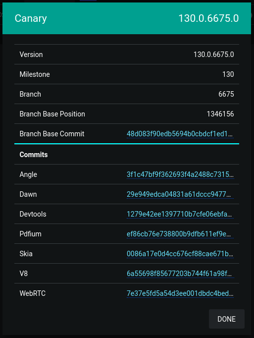

I recently finished up the process of fixing a bug in the Chromium/Google Chrome web browser.  It was my first time contributing to the Chromium project or any other open source project of that scale, and it was a very unique experience compared to other open source work I've done in the past.

I figured that I'd write up an overview of the whole process from beginning to end to give some perspective for any other devs looking to try this kind of work themselves.

<div class="note padded">
I'll say up front that for me personally, fixing this bug was well worth the effort, and it's an achievement I'm very proud to have in my software development portfolio.
</div>

## The Bug

The bug I fixed was in the Chromium Devtools - specifically the integration between Devtools and network requests made by worklets running off the main thread such as [`AudioWorklet`](https://developer.mozilla.org/en-US/docs/Web/API/AudioWorklet).

Network requests made by worklets - including the request to fetch the worklet's entrypoint JavaScript source file - were completely missing in the Devtools network tab.

In addition, the "Disable Cache" Devtools option was also ignored.  This was the most annoying one as it was impossible to get stale code out of the cache during development.  I had ended up rolling my own cache busting methods to work around this locally, but things were more difficult in prod where I actually wanted the caching to be used.

I found three error reports matching this bug that all had the same underlying cause:

 * [Worklet modules don't show up in devtools networking](https://issues.chromium.org/issues/40686236)
 * ["Disable cache (while devtools is open)" option doesn't affect audioWorklet modules](https://issues.chromium.org/issues/40592236)
 * [Audio Worklet keeps using invalid cached *processor.js](https://issues.chromium.org/issues/40935361)

This is a rather niche area of impact since most web developers will never have the need to write custom realtime audio processing code or things like that - which probably explains why this bug was left unfixed for several years.  That being said, I've run into this bug pretty consistently during normal work on multiple projects.

Anyway, creating a minimal repro was very easy.  All that was needed was to create an `AudioWorkletProcessor` using a script that had cache headers set, update the script, and then reload the page with Devtools open and "Disable Cache" enabled.

If things were working properly, the fresh script would be re-fetched and if not, no network request would be made and the old, stale script would be used.

## Getting the Code + Building Chromium

The first step in actually fixing the bug was to build Chromium from scratch.  Luckily for me, there exists [detailed documentation](https://www.chromium.org/developers/how-tos/get-the-code/) on how to do this on all the major operating systems.

I run Linux myself, and things were pretty straightforward.  There were some APT packages to install but other than that, I was able to `git clone` the source code and start building using `ninja`.

Building Chromium has some pretty steep system requirements though.   My computer is quite strong with a 7950X CPU and M.2 SSD., but a clean build still takes something like 45 minutes to finish.  While compiling with 32 threads, the build also used over 50GB of RAM at peak consumption and over 100GB of disk space.

Incremental builds are quite fast though, usually taking less than 10 seconds.

<div class="good padded">
Despite the time it takes to run, the build really is fire-and-forget once all the prerequisites are installed.
</div>

I generated the build config, ran `autoninja -C out/Default chrome`, and ~45 minutes later I had an executable at `./out/Default/chrome` which launched and worked perfectly.  Well, perfectly other than the fact that everything was incredibly slow since it was an unoptimized build and had all the debug checks enabled.

## Finding the Bug + Making the Fix

Once I had my build setup working, it was time to get into the code.

<div class="warning padded">
I quickly realized that the Chromium codebase is VERY big.
</div>

As of 2024, Chromium has something like 33 million lines of code in total.  I doubt that many people have a good understanding of how all its components fit together even at a high level, and the codebase is constantly changing + growing with dozens of commits being added per hour at busy times.

Because of this huge codebase size, I wasn't able to get VS Code's C++ extension to work very well with the project.  Features like go-to definition (which I usually rely on heavily when navigating codebases) and find references didn't work well or at all, and one of my CPU cores would stay stuck at 100% permanently while the project was open.  I'm sure that people have configs or alternative extensions to make this work better, but I personally didn't have much luck getting this to work myself.

### Debugging Process

I started my debugging by finding where the network request for the worklet script was initiated and tracing it down as far as necessary until the request was actually made - or retrieved from the cache.  The call tree looked something like this:

```cpp
Worklet::FetchAndInvokeScript
WorkletGlobalScope::FetchAndInvokeScript
DedicatedWorkerGlobalScope::FetchModuleScript
WorkerOrWorkletGlobalScope::FetchModuleScript
Modulator::FetchTree
ModuleTreeLinkerRegistry::Fetch
ModuleTreeLinker::FetchRoot
ModulatorImplBase::FetchSingle
ModuleMap::FetchSingleModuleScript
ModuleScriptLoader::Fetch
ModuleScriptLoader::FetchInternal
WorkletModuleScriptFetcher::Fetch
ScriptResource::Fetch
ResourceFetcher::RequestResource
```

Below that bottom point in the call tree, the actual request gets made on a dedicated network thread and the response gets asynchronously sent back to the caller.

This is a pretty good indicator of how code seems to be structured in Chromium.  Things are well organized and separated, but there is _much_ indirection and modularization.  There's also extensive use of dynamic dispatch everywhere which sometimes made it difficult to figure out what code is getting run at some particular callpoint.

I'll unashamedly admit that I made liberal use of printf debugging while trying to make my way through these code paths.  Chromium does a pretty good job keeping stdout mostly clear during regular operation, so my log messages were easy enough to follow.

My strategy was to log out anything that looked remotely interesting as I made my way down this call tree.  There were lots of red herrings and dead ends along the way, but I eventually found something promising.

### The Bug

<div class="note padded">
I noticed that every request had a <code>devtools_id_</code> set except the one made by the worklet.
</div>

The place where this was happening was pretty early up in the call tree as well - far before any caching interaction would come into play.

I'll try to avoid writing too much about the technical details of what was going on, but here's the gist of it.

When Devtools attaches to a target, it's supposed to create an [`InspectorNetworkAgent`](https://source.chromium.org/chromium/chromium/src/+/main:third_party/blink/renderer/core/inspector/inspector_network_agent.cc) and attach it to the session.

<div class="note padded">
After much debugging and code scrolling, I realized that an <code>InspectorNetworkAgent</code> wasn't getting created for the worklet target.
</div>

A few hours after that, I finally figured out why.

Although the target itself was a worklet, it uses a [`WorkerInspectorController`](https://source.chromium.org/chromium/chromium/src/+/main:third_party/blink/renderer/core/inspector/worker_inspector_controller.cc) to manage its Devtools session.  This is because `AudioWorklet`s run off the main thread on a worker thread.

The smoking gun was these few lines:

```cpp
if (auto* scope = DynamicTo<WorkerGlobalScope>(thread_->GlobalScope())) {
  auto* network_agent = session->CreateAndAppend<InspectorNetworkAgent>(
      inspected_frames_.Get(), scope, session->V8Session());
  // ...
}
```

Although the worklet was running on a worker thread, it didn't have a `WorkerGlobalScope` - it had a `WorkletGlobalScope`.  Because of this, that cast returned a null pointer and the `InspectorNetworkAgent` was never created.

### The Fix

The fix I went for was to change `InspectorNetworkAgent` from accepting a `WorkerGlobalScope` to accepting an aptly named `WorkerOrWorkletGlobalScope` instead.  The changes necessary were quite minimal since `WorkerOrWorkletGlobalScope` is the base class common to both `WorkerGlobalScope` and `WorkletGlobalScope`.

Then, I updated the code in `WorkerInspectorController` to cast the scope to `WorkerOrWorkletGlobalScope` and initialize the `InspectorNetworkAgent` for both worklets and workers.

And that was it!  Everything worked perfectly after that... except it didn't.

I could see that the `InspectorNetworkAgent` was indeed getting created, but: it was never initialized, `devtools_id_` was never set on the request, and nothing was showing up in the network tab.

After a few more fevered hours of digging through the code, I eventually wound up stuck at a dead end at the RPC boundary between the Devtools frontend and Chromium itself.  The RPC to initialize the network capabilities of Devtools for that Worklet target just wasn't getting called.

Eventually, just as I was getting demoralized, I moved over to skimming through the TypeScript code for the devtools frontend itself.  There, I found [a file](https://source.chromium.org/chromium/chromium/src/+/main:third_party/devtools-frontend/src/front_end/core/sdk/Target.ts) that mapped Devtools target types to the set of capabilities that were enabled for them.

<div class="good padded">
To my joy and giddy relief, I noticed that the <code>Capability.Networking</code> was conspicuously missing for <code>Type.Worklet</code>.
</div>

After adding that capability in and waiting through one final rebuild, an entry for the audio worklet processor script finally appeared in the Devtools networking tab.  "Disable Cache" worked like a charm, and the bug was finally fixed for real.

## Testing + Code Review

After cleaning up all the copious debug logs I had left strewn throughout the codebase and finalizing my diff, I set about figuring out the process for submitting the changes for review.

At some point, I came across a Google Docs presentation called [Life of a Chromium Developer](https://docs.google.com/presentation/d/1abnqM9j6zFodPHA38JG1061rG2iGj_GABxEDgZsdbJg) which was extremely useful in explaining the process of reviewing and merging changes.  Although some parts were a bit out of date, this served as my main reference.

I created an account on the [Chromium Gerrit code review](https://chromium-review.googlesource.com/) site and signed the CLA which was no problem since I was contributing as an individual without the encumberment of some company or organization.  I did take care to make sure the email address I was using with Git was the same as that of the account on Gerrit though.

### Creating a CL

To create a PR, which Gerrit calls a change list or CL, it starts off just like any other Git-based workflow.  You create a new branch, make your changes, write a commit message, and commit.

From there, things deviate a bit.

Chromium has some custom scripts and tools called [`depot_tools`](https://chromium.googlesource.com/chromium/tools/depot_tools.git).  Some of these add a new subcommand to git - `git cl` - which is used to manage the CL creation.

I ran `git cl upload` which handled running some preflight checks like code formatting and linting, and it held me back from uploading until I'd added myself to the `AUTHORS` file.

Once I had that sorted out, I wrote a description for the change (it defaulted to the commit message which worked great for me), linked to the relevant bugs from the bug tracker, and created the CL.  It gave me a link directly to the Gerrit web UI for [that CL](https://chromium-review.googlesource.com/c/chromium/src/+/5726981) once it was created, and I managed most of the rest of the process from there.

### Writing Tests

In Chromium, you pick your own reviewers for your CLs.  I looked through the blame of the main files I touched for my fix and found a few people who had contributed significantly to those files recently.  I wasn't sure how many reviewers I should pick, but I ended up selecting three people.

All three of these individuals were Google employees who contributed to Chromium as part of their jobs.  As an outsider and first-time contributor, I did my best to be as respectful of their time as possible and avoid spamming them with notifications or questions I could find the answers to on my own.

<div class="warn padded">
However, one thing that I was completely unsure about was how to add tests for this fix.
</div>

As a professionally developed and critical application, Chromium takes testing very seriously and has a truly enormous number of tests already written.  There were so many that I didn't even know where to start looking to add one of my own for this feature.

I posted a comment on that issue asking for some guidance or links to tests that I could use as reference, and I got a response a few days later (I had submitted the CL on a Friday, and I heard back on Monday).  In addition to providing some comments on my diff which I promptly resolved, I was also was sent a link to [a directory](https://source.chromium.org/chromium/chromium/src/+/main:third_party/blink/web_tests/http/tests/inspector-protocol/network/) containing dozens of E2E-style JavaScript tests which tested various parts of the Devtools' network inspection functionality.

After reading through a few there that had names that seemed similar to my worklets scenario, I was able to cobble together a test of my own which verified the fix.  It really wasn't too difficult to set up; the other tests had some common patterns that I was able to copy and a ton of useful helper functions available as well.

The test that I ended up writing sets up a Devtools session, fetches a JavaScript file from within an audio worklet, and then waits for the Devtools backend to emit an event indicating that the request was intercepted.  Here's what the whole thing looks like if you're interested:

```ts
async function(/** @type {import('test_runner').TestRunner} */ testRunner) {
  const {session, dp} = await testRunner.startBlank(
    'Verifies that we can intercept the network request for the script loaded when adding a module to an audio worklet.');

    await Promise.all([
      dp.Target.setDiscoverTargets({discover: true}),
      dp.Target.setAutoAttach({autoAttach: true, waitForDebuggerOnStart: true, flatten: true}),
    ]);
    const swTargetPromises = [
      dp.Target.onceTargetCreated(),
      new Promise(resolve => {
        dp.Target.onceAttachedToTarget(async event => {
          const swdp = session.createChild(event.params.sessionId).protocol;
          const networkEnableRes = await swdp.Network.enable();

          swdp.Network.onRequestWillBeSent(e => {
            if (e.params.request.url.endsWith('audio-worklet-processor.js')) {
              resolve([networkEnableRes, `Network.requestWillBeSent: ${e.params.request.url}`]);
            }
          });

          swdp.Runtime.runIfWaitingForDebugger();
        })
      }),
    ];

    await session.evaluate(
      `new AudioContext().audioWorklet.addModule('/inspector-protocol/network/resources/audio-worklet-processor.js')`);
    const [_swTarget, [networkEnableRes, scriptFetched]] = await Promise.all(swTargetPromises);
    testRunner.log(networkEnableRes);
    testRunner.log(scriptFetched);
    testRunner.log("OK");
    testRunner.completeTest();
});
```

There were a few more back-and-forths with a different Chromium maintainer, and they asked me to add another test to verify that the "disable cache" functionality works for workers as well.

I added that test and resolved a few more feedback items on the code, and eventually got my first out of two required code review "LGTM" votes before the CL would be ready to land.  They indicated that I should wait for the first reviewer's OK before I land it, so I did.

I didn't hear back for quite a while after that.  I don't fault the Chromium maintainers for that - they're very busy and I'm not part of the usual crew who contribute regularly.  I never did hear back from the original reviewer, but I eventually got a second "LGTM" code review vote and approval to land the PR.

After one final CI run, the CL was landed and the code made it into the main tree.

### Second CL

I wasn't done quite yet.  I needed to make one more CL to the `devtools_frontend` repo for that one-line change to add the `Capability.Network` to worklet Devtools targets.

I set that CL up and asked if they wanted me to add any more tests on that end, but that didn't seem necessary as I quickly got two +1 code review votes and the CI was kicked off.

<div class="warn padded">
However, it seems that the Chromium <code>devtools_frontend</code> repo suffers a bit from a common problem in software development: flaky tests.
</div>

There's a dedicated spot on the CL page showing the status of the tree at any given time.  In the case that CI is red or flaky for some reason, that spot is updated with the reason and automatic merges are blocked:


I'm all too familiar with flaky tests - especially in complicated, async, E2E-style tests like those which were flaking here - so I certainly sympathize.

Luckily for me, after I rebased my change and the CI was kicked off once more, the tests all managed to pass (after 4 internal retries).

My CL was automatically landed once the tree opened back up and my fix was fully complete.

## Release

Chromium maintains multiple release channels that each have a different release cadence.  There's a web app called [Chromium Dash](https://chromiumdash.appspot.com/releases?platform=Mac) which shows the hashes of the latest commits that are included in each version of each channel:



I consulted that site to figure out if my fix was shipped yet or not.

The most commonly updated of these channels is Chrome Canary which gets updated up to twice daily.  These updates are fully automatic.  At both 8AM and 8PM Pacific time, a bot creates a tag from the current tip of the tree and uses that to build a new Canary version.

Once my second CL was landed, I waited until Chrome canary released a version that included both of my commits.  It took about 24 hours; it seems like there's some lag between when something is committed to the `devtools_frontend` repo and when it's pointed to by the main tree.

I downloaded Chrome Canary on my computer, opened up Devtools, opened up one of my web apps that uses an `AudioWorkletProcessor`, and was met with the stunningly beautiful sight of that request successfully showing up in the network request list:


"Disable Cache" worked like a charm as well - just as I expected it to (I was nonetheless relieved to see it doing so in reality).

At long last, the bug was fixed and the saga drew to a close.  It took a bit over a month from the day I first started working on fixing this bug to the day the fix was available in Chrome Canary.

At the time of writing this, it will still be weeks or months before the fix makes its way into the stable release channel.  Chrome 128 was just released a few days ago and this fix will be included in Chrome 130.

Luckily for me, I use Chrome Canary as my daily driver (on my laptop at least; Chrome Canary doesn't have a Linux version available) so I'll be able to enjoy this fix right away.

## Results + Retrospective

Although it took a while and a good bit of effort, I'm very glad I spent time time to get this bug fixed.  It was very unique compared to the kind of development I've done in the past, and it was cool to experience how software gets built at Chromium's scale.

<div class="good padded">
One of the main things motivating me to do this was the knowledge that if I succeeded, code I wrote would be part of an application that eventually makes its way onto millions (billions?) of devices.
</div>

Even though the change itself is niche and concerns developer tooling rather than the main browser, that kind of impact is very alluring to me.

Now that I've gained this experience contributing to Chromium, I'll certainly be on the lookout for more bugs that I might be able to fix in the future.  I don't think I'll go out of my way to seek them out, though, due to the huge amount of time it takes to tackle the Chromium codebase from scratch.
