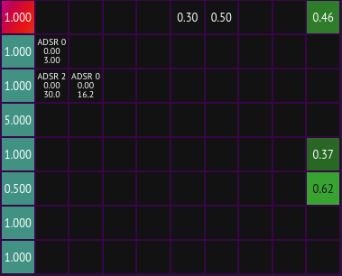
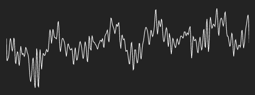
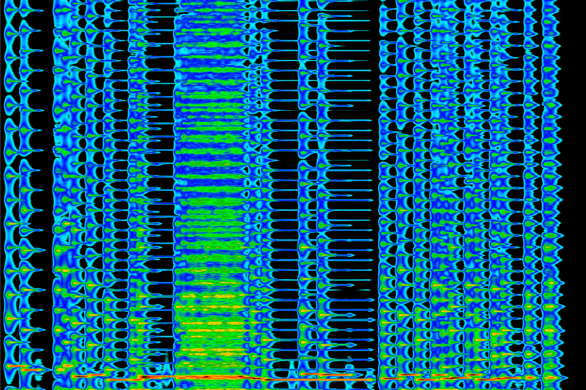

As web browsers have grown and evolved over the years, they've gained many APIs and functionalities that have made them into incredibly capable application platforms in addition to their original role of web page renderers.  One of the APIs that I've been particularly interested in is the Web Audio API and its capabilities as a foundation for browser-based audio synthesis and DSP programming.

Using a variety of modern web technologies, I built a feature-rich FM (frequency modulation) synthesizer that runs completely in the browser and on pretty much any web-capable device, all while using the same code for all of them.  Building it using web technologies and the web browser as a base allows it loads instantly, require zero installation or setup, run securely within the browser sandbox, and be efficient on all kinds of devices with near-native performance.  There were certainly some roadblocks in the form of browser and operating system bugs/incompatiblies, but overall I found it to be a very well-designed and useful toolkit to build what turned into quite a complicated project.

----

**Before anything else, I highly suggest checking out the live demo and playing the synth for yourself**: <https://notes.ameo.design/fm.html>

Notes are playable by clicking/tapping the on-screen keys or pressing the labeled keyboard keys.  Try a few of the different presets from the dropdown menu on the left to see some of the wide variety of sounds that FM synthesis is capable of producing.

If you'd prefer to check out a video demo or learn how to create your own presets using the synth, I created a video as well:

<center>
<iframe
  width="80%"
  style="height:50vh;margin-bottom:30px;"
  src="https://www.youtube-nocookie.com/embed/N4mZn9ZczDM"
  frameBorder="0"
  allow="accelerometer; autoplay; encrypted-media; gyroscope; picture-in-picture"
  allowFullScreen
></iframe>
</center>

## FM Synthesis

If you're already familiar with FM synthesis or don't care about this somewhat niche audio synthesis topic, feel free to skip this section.  It would be helpful to have some familiarity with basic audio topics like oscillators if you want to get a good understanding of it. However, if you're a programmer, you may find the parallels between FM synthesis and programming topics such as functional programming and graph theory really interesting; I definitely did.

FM synthesis was first developed in the late 1960s.  Since then, it's been used in a huge variety of hardeware and software synthesizers.  There's a 100% chance that you've heard FM synth-based instruments in music before; it's an incredibly versatile and capable synthesis method.

The pitch of a sound is determined by the frequency of that sound.  **Oscillators** produce sound at a fixed frequency, outputting sound waves of some shape with the rate at which the oscillator repeats determining the frequency.  FM synthesis is based on the concept of altering the frequency of oscillators (which are referred to as **operators** in FM synthesis since it was invented) with another oscillator.  Depending a variety of factors including the frequencies of both of the oscillators, the ratio between them, the oscillators' waveforms, and the magnitude of the modulation, a massive variety of different sounds can be produced.  This may remind you of higher-order functions, and yeah they're incredibly similar.

Here's what FM synthesis looks like looks like at the waveform level, with the synth's built-in oscilloscope visualizing the result of a sine wave oscillator modulating a different sine wave oscillator's frequency but with the intensity of that modulation changing over time:

<center><video style="max-height:300px;max-width:80vw;" src="https://i.ameo.link/8v5.webm" controls></video></center>

As you can see, the waveform is stretched and crunched as the frequency of the oscillator is both increased and reduced according to the output of the modulating oscillator.

FM synthesis is quite cheap computationally since it just involves simple math operations on simple operators, all of which can be done very efficiently on CPUs.  It's quite easy to implement as well; basic FM synthesis can be done in a few dozen lines of code.  There is a lot of complicated math that people have done to calculate things like the exact effects FM synthesis will have on signals' harmonic content and stuff like that, but honestly most of it isn't really useful for building a FM synth designed for make music.

### Implementing Oscillators/Operators

Oscillators can be implemented in a few different ways.  The method that this FM synthesizer uses is to keeping a state variable for **phase** (a number from 0 to 1 representing what percentage of the way through its repeating waveform the oscillator has progressed).  Phase increases from 0 to 1 and then loops back to 0.  Using this method, a basic sine oscillator can be implemented with just `output = phase * 2π`.

The only other piece that is required is to update the phase of the oscillator each sample according to its frequency.  Audio programming outputs a fixed number of _samples_ (values from -1 to 1 which represent sound waves) per second; 44,100 samples/second is a standard and is the value that this synth uses as well.  Using these facts, this is the function I use to update the oscillator's phase each sample:

```rs
fn update_phase(&mut self, frequency: f32) {
    // 1 phase corresponds to 1 period of the waveform.  1 phase is passed every (SAMPLE_RATE /
    // frequency) samples.
    let mut new_phase = (self.phase + (1. / (SAMPLE_RATE as f32 / frequency))).fract();
    if new_phase < 0. {
        new_phase = 1. + new_phase;
    }
    self.phase = new_phase;
}
```

You may notice special handling for negative phases.  This is a side effect of FM synthesis, where sometimes negative frequencies can be produced.  Luckily, we can just move our phase backwards instead of forwards as usual and everything just works.  One other consideration is something called _oversampling_ which is a method used to reduce an effect called _aliasing_.  Aliasing is caused by the fact that we quantize audio to the sample rate and can manifest in undesirable audio artifacts.  However, this is just an implementation detail and doesn't impact the math.  If you're interested in this kind of thing, there are tons of resources out there that go into great detail on how these things work and how to implement them.

Due to the way that the oscillators are implemented, the FM synthesis implementation used by this synth is technically _phase modulation_.  However, for all intents and purposes, it is equivalent to FM synthesis and has the same output.

### Advanced FM Synthesis

FM synthesis gets really interesting when many operators are connected together into graphs.  These graphs can have feedback loops where Operator A modulates operator B which in turn modulates operator A, or operators can even modulate themselves directly.  Each of the operators can have any base frequency, which can then be modulated by other operators.  Usually integer fractions of the base frequency (2/1, 3/2, 4/1, etc.) sound the best.  Add to that the ability for the degrees that these operators to modulate each other (called _modulation indices_) to change over time and you can see how this creates a virtually limitless variety of possible tones, timbres, and styles of sound that can be produced.

Anything from the most delicate electric piano to the grittiest dubstep bassline can be produced by tweaking these parameters and connecting operators in unique ways.  One drawback to this huge parameter space is that FM synthesis can be very touchy and sensitive to even small changes.  This is a characteristic that is shared with many complicated systems, and I've found that it can make using FM synthesis a highly nuanced and intricate undertaking.

This FM synth uses a **modulation matrix_** to visualize the FM synthesis graph and allow it to be controlled as precisely as possible.



Each cell in the matrix corresponds to the index of modulation between one operator and another.  The synth supports setting constant values, having the value be supplied by an envelope generator (explained later on in this post), or a being a multiplier of the frequency of the currently playing note.  This offers an enormous amount of control over the sound.

This video shows an example of FM synthesis with two operators.  The second operator modulates the first one with the modulation index (degree of modulation) being changed manually by dragging the slider.  You can hear how changing the frequency multiplier of the modulating operator affects the resulting sound.

<video style="width:100%;" src="https://i.ameo.link/8v3.webm" controls></video>

Here we add one more operator, so operator 3 modulates operator 2 which modulates 1:

<video style="width:100%;" src="https://i.ameo.link/8v4.mp4" controls></video>

Such a sweet sound, and that's just the tip of the iceberg for the kinds of sounds FM synthesis can create!

If you want to know more, I wrote a [more detailed guide](https://notes.ameo.design/docs/modulation-matrix) to the synth's modulation matrix more focused towards people interested in using the synth themselves.

## Technical Implementation + Plumbing

As I mentioned before, this FM synthesizer makes use of a wide range of modern web technologies and APIs.  I wanted to go over exactly what those are and how they contributed to buliding the synth.

### WebAssembly

The main synthesis engine of the synthesizer is written in Rust and compiled to WebAssembly.  This is a combination that I've used extensively in the past and have found to be incredibly versatile and effective.  Audio rendering requires very consinstent performance characteristics to avoid missing samples.  Unlike missing a frame in graphics programming which will almost certainly go unnoticed, missing a frame of audio rendering will almost always be heard; it sounds like a click or pop.  Generating garbage from the JS garbage collector necessitates running a GC pass at some point which has a high probability of causing a frame to be missed, especially on lower-end devices.  The execllent performance characteristics of Rust+Wasm are perfect for this use case, and writing DSP code in Rust feels comfortable and natural.

Another big part of why it's so good is the large amount of high-quality modern tooling that is available in the space.  Besides having great documentation, active maintainers, and well-designed interfaces, almost all of these tools are very easy to build and install from scratch.  Some of the tools which I used directly to build this synth include:

 * `wasm-opt` and `wasm2wat` from [Binaryen](https://github.com/WebAssembly/binaryen).  Both of these tools take compiled Wasm modules as input and work for Wasm produced by any language or toolkit.
   * `wasm-opt` performs a variety of optimizations on already compiled wasm modules, serving as an excellent addition to Rust/LLVM's langauge-level optimizations.  I've found that it can often shrink Wasm module size by 20%+ from already optimized modules.
   * `wasm2wat` converts compiled Wasm modules into WebAssembly text format, making it possible to see exactly what code was generated and which functions are getting produced.
 * [`twiggy`](https://github.com/rustwasm/twiggy) is a Wasm code profiler that makes it very clear which functions and code segments are taking up the most space in the Wasm module.  The main Wasm module which the FM synth uses is 27KB over the wire after compression, and that includes a lot of code for Wavetable synthesis which isn't used by this synth.  Twiggy makes trimming modules down incredibly simple and helps ensure you're not including code that you don't need.
 * [`wasm-bindgen`](https://rustwasm.github.io/wasm-bindgen/), an excellent tool for streamlining the process of bulilding Rust into Wasm and generating JavaScript/TypeScript bindings for them

Rust itself also has excellent language-level support for compiling to WebAssembly, even in the case of using some of the latest Wasm features like SIMD.

### Wasm SIMD

WebAssembly has recently added support for fixed-width SIMD instructions, allowing SIMD to be used on any CPU that supports it regardless of architecture or feature set, with the same code.  I make use of SIMD in the FM synth when it is supported by the browser, which is currently only the case in Google Chrome since I enrolled in a [Chrome Origin Trial](https://developer.chrome.com/origintrials/#/trials/active).  Firefox exposes it behind a feature flag.  When Wasm SIMD support isn't available, fallback code is loaded.  Note that this is the only place in the application where I write different code to deal with system compatability, and it's only an optimization and only required due to the fact that many browsers haven't yet added support for Wasm SIMD.

The main way which it is used in the synth is for processing arrays of samples, parameters, and other floating-point values.  There are many places in the code where buffers of `f32`s need to be 1) copied around, 2) multiplied in-place by a constant or another values, or 3) initialized to a constant value.  Rust's Wasm SIMD supports all of these operations with [typed language-level intrinsics](https://doc.rust-lang.org/core/arch/wasm32/index.html).  Note that some of these use-cases would be better filled by [WebAssembly bulk memory operations](https://github.com/WebAssembly/bulk-memory-operations), but I don't make use of them in the synth.

### Web Audio

Web Audio is the foundation on which the synth is built.  It handles all of the lowest-level platform-dependent pieces of building the synthesizer including:

 * Normalizing the system sample rate to a user-provided rate
 * Defining and driving an audio graph and flushing audio to audio drivers and output devices
 * Mixing multiple channels of audio
 * Providing a variety of nodes for things like gain, limiting/compression, filters, and even oscillators (although we don't use those for this synth)
 * Running user-provided DSP code on a dedicated audio rendering thread to avoid dropouts and glitches caused by the main render thread starving resources

Being able to rely on Web Audio to handle all of this was a massive help when building the synth, especially since my experience with audio programming isn't that long.  Given the huge amount of possible audio drivers and hardware as well as the realtime requirements of audio rendering, being able to focus on the application itself without having to spend as much time with system-specific implementation details is terrific.  This is one of the biggest boons of web programming and why technologies like JavaScript have become some prevalent in software, and it was great to see that transfer over to audio programming as well.

### `AudioWorkletProcessor`

All of the synthesizer's audio generation code is implemented in WebAssembly and runs on the audio rendering thread thanks to `AudioWorkletProcessor`.  `AudioWorkletProcessor`s (or AWPs as I often refer to them in my code and docs) are interfaces that allow programmers to define entirely custom DSP code for audio rendering; they even support compiling, instantiating, and running WebAssembly modules.  The source code for this synth's AWP is here: <https://github.com/Ameobea/web-synth/blob/master/public/FMSynthAWP.js>

If you're interested in the nitty gritty of creating a WebAssembly-powered AWP, I created another blog post which goes into [further detail](../buliding-a-wavetable-synthesizer-with-rust-wasm-and-webaudio/#audioworkletprocessor-implementation)

There are three ways of passing data between AWPs on the audio rendering thread and the main UI thread where the rest of the code runs:

  1) The audio graph via input/output buffers and parameters
  2) Message port
  3) `SharedArrayBuffer`

All three of these methods have different uses and benefits, and the synth uses all three of them for different parts of its implementation.  Output buffers are used for the main generated audio from the synth, one for each channel.  These are connected to gain envelopes and to the filter (if enabled), one for each voice. (This synth is polyphonic, meaning that multiple notes can be playing at the same time.  One voice plays one note and has its own base frequency and own gain envelope and filter).

Message ports are used to trigger voices to start or stop playing according to when users press keys and handle other UI events for things like setting effects, changing modulating indices, setting oscillator waveforms.  They're also used during the initialization process to send the Wasm blob over to the AWP since it's not possible to make network requests from the audio rendering thread.

Finally, `SharedArrayBuffer` is used to get realtime data from the audio thread as to the current phase of all of the _envelope generators_.

## Envelope Generators

One of the most important parts of the synth for adding dynamism and character to its sound are **envelope generators**.  These are similar to oscillators in that they output a value that changes over time, but unlike oscillators they support extremely fine-grain customization to the shape, length, magnitude, and looping properties of the generated signals.

Although Web Audio provides a set of primivites for building envelope generators, there are some very bad [unfixed bugs in Firefox](https://bugzilla.mozilla.org/show_bug.cgi?id=1435625) which make them all but broken in that browser.  Besides that, building my own envelope generators ([source code](https://github.com/Ameobea/web-synth/blob/master/engine/adsr/src/lib.rs)) allows for a much tighter integration into the synthesizer itself; I can render and read from the generated envelopes inline the synth's own code and avoid having to connect them to the audio graph and copy buffers into and out of Wasm.

In the synth, envelope generators can be used to control/modulate many different parameters of the synth including modulation indices, operator output levels, all effect parameters, filter cutoff frequency, and more.  They can also be looped to mimic oscillators even more closely and allow the synth's sound to continue to change and morph long after the key was pressed.  They allow adding a whole new dimension of possibilities to the synth's sound.  If you're interested in learning more about this synth's envelope generators and how to use them, I wrote [detailed docs](https://notes.ameo.design/docs/envelope-generator).


In the above image, the yellow highlighted area represents where the envelope generator is in its progress and what value it's currently outputting.  In order to render that, we need to get that data directly from the audio rendering thread where the ADSRs are computed and rendered with as little delay as possible.  So do this, `SharedArrayBuffer` is used.  If you're unfamiliar, `SharedArrayBuffer` is a web API that supports concurrent access to a buffer between multiple threads - just what we need.

This use case doesn't require any atomics or other synchronization.  Instead, it creates a `SharedArrayBuffer` and shares references to it between both threads, the main/UI thread and the Web Audio rendering thread.  Then, whenever the FM synth `AudioWorkletProcessor` renders a frame, it gets the current phase of all of the envelope generators and writes them into the buffer.  All the envelope generator UI has to do is read the values out of the buffer every frame of its render loop and use that to determine how wide to make the highlighted area.

## Audio Visualizations

Although there are many pieces of this synth I haven't mentioned such as WebMIDI integration, polyphonic voice management, operator/voice culling optimizations, and the built-in audio FX, the one thing I wanted to be sure to mention were the audio visualizations.  I included two of them with this synth: An _oscilloscope_ and a _spectrogram_.  They visualize audio in the _time domain_ and the _frequency domain_ respectively, and both can be useful to see just what the synth is doing under the hood and what's contributing to what you hear.

Web Audio provides an `AnalyserNode` which handles all of the heavy lifting for this.  It applies the Fast Fourier Transform to audio to the signal using optimized native code to get the frequency domain representation used by the spectrogram and pulls samples directly from the audio graph for the time domain data.

### Oscilloscope



The oscilloscope I used is incredibly basic, based off of a library called [Wavy Jones](https://github.com/stuartmemo/wavy-jones).  It's the simplest audio visualization, just plotting the output samples as a line graph.  Nonetheless, it's still a useful tool to see exactly what is getting produced by the synthesizer.

### Spectrogram



The spectrogram is a bit more involved.  All sound and in fact all signals are made up of a variety of sine waves of different frequencies and intensities.  The Fast Fourier Transform or FFT converts sound from an array of samples into an array of frequency values.  These frequency values can then be plotted on a heatmap to see which frequencies are most prevalent in the sound and how they change over time.

That's the gist of it, but the spectrogram implementation from this synth has a few different color scaler functions available and supports scaling values on both a linear an exponential scale to filter out noise.

## Conclusion

I've become a really big fan of FM synthesis through the process of building this synth.  I was initially struck by the elegance of the algorithm and the parallels to programming concepts I was familiar with.  As the synthesizer took shape and gained functionality, I kept finding more and more little islands of parameters that produced amazing sounds.

In addition, I've found my belief in the capabilities and usefulness of the modern web browser and the web as an application platform grow even stronger than they were before.  There is so much to be gained by making content available as a website outside of OS-specific releases, app stores, or proprietary libraries + toolkits.  Every year I've been a developer, I've seen the gap between what a web application and a native app do narrow more and more.  I'm very excited to see how it all continues to gain momentum into the future as these technologies grow from niche bleeding-edge curosities into the foundations of software that powers our world.
