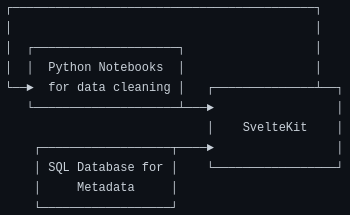
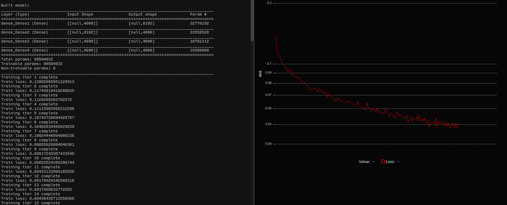

I've been building a project over the past month or so — an interactive recommendation web app powered by a relatively basic neural network.  Building it has been one of my most unique, engaging, and memorable dev experiences in recent memory.

There are multiple reasons for this, and after thinking about it I figure it boils down to two technology choices that underpin the whole project:

**SvelteKit** and **TensorFlow.JS**

 * [SvelteKit](https://kit.svelte.dev/) is an application framework for the Svelte UI framework — much like [Next.JS](https://nextjs.org/) is for React.  I've tried out SvelteKit before and [wrote about my experience](https://cprimozic.net/blog/trying-out-sveltekit/) of using it to develop full-stack applications.  Since writing that back in January, the framework has only gotten better and more mature and many of my negative points from that post have already been fixed.

 * [TensorFlow.JS](https://www.tensorflow.org/js) is a JavaScript port of Google's very popular [TensorFlow](https://www.tensorflow.org/) platform for machine learning.  It mirrors many of the APIs and high-level components from base TensorFlow and even comes with tools for converting models between TF.JS and TensorFlow formats.

<div class="note">The way that these two frameworks interact with each other for this particular project created a development experience unlike anything I've ever experienced before.</div>

There were elements of both frontend and backend development, but the end result didn't feel like traditional full-stack development either. It was something unique, which I'm calling "middle-end" for lack of a better term.

## Project Overview

As I mentioned, the app itself is an anime recommendation engine + stats tool.  If you're an anime fan, you can check it out for yourself:

https://anime.ameo.dev/

Or you can check out this demo profile if you don't have an account but still want to try it out: https://anime.ameo.dev/user/ameo___

The premise is pretty simple: it loads a user's profile from the API of a popular anime site, runs it through a neural network, and shows recommendations to the user.  It's got some other stats + visualizations that I added on as well.

## The Stack (Or Stump)

Although it's not very extensive as far as its scope, that model still has to be served for live inference at the end of the day.  Normally if I was designing this app, I'd probably come up with an architecture something like this:


I dare say that is a pretty reasonable modern setup for this kind of project.  However, what I ended up going for instead is this:



I didn't plan for it like that from the start, but as I kept building things and adding new features I kept thinking, "Hmm, why should I spend all the effort of deploying a whole new service in a new language, building all the type definitions, constructing internal APIs, etc., when I can just add it as a SvelteKit endpoint?"

<div class="good">As it turns out, having all of the code in the same place is a massive boon for both ease of development as well as deployment and maintenance.</div>

Starting up the dev environment from scratch takes under a second - just `cd project-dir; yarn dev` and it's ready to go in the browser.  Instead of having to build, configure, and deploy different containers for each service, the whole thing bundles into a single Docker container that I just re-build and re-start to push updates.

<div class="good">If I ever have to jump back in a year later to update an API binding or something, I won't have to spend as much effort figuring out my dev setup and getting it running.</div>

Since this is just a personal project that I likely won't be working on actively in the future, these things are extra valuable.  Maintenance is very easy for a single docker container: all the logs are in one place, there's no inter-container networking to configure, and the entire deployment can be re-constructed with a single docker command.

### Data Collection

For collecting the raw data used to train the recommendation model, I wrote endpoints on the SvelteKit application that pull a single profile from one of the APIs I integrated with and store it raw for later processing.  To collect data, all I had to do was hit that endpoint repeatedly until I'd accumulated enough.  Since it was exposed as a normal HTTP endpoint (with some basic token auth), the whole process could be driven with shell commands:

```bash
while true; do curl http://localhost:3080/collect-profile?token=xxx && sleep 3; done
```

In addition to the simplicity of this approach, there's also another great benefit from setting it up like this:

<div class="good">Collecting data for training the model makes use of the same libraries, auth config, types, and wrapper functions as I use for the main app itself.</div>

I re-use the exact same code for fetching profiles for training as for fetching them at runtime when getting recommendations for users live.  All the rate limiting to avoid hitting API limits, OAuth, error handling, and types gets used for both as well.  If the API ever changes, I'll only have to update one place as well.

The metadata layer is shared too.  Since more anime are being released all the time, the set of anime being considered for the model is not constant over time.  The exact same metadata fetching API wrappers, caching layer, and helper functions built for the web app can be re-used when working with the training data.

### TensorFlow.JS

For both training and predicting with the model, I use [TensorFlow.JS](https://www.tensorflow.org/js).  As an added bonus of this, I'm able to get GPU accelerated training with my AMD GPU on Linux without switching to a different distro and installing a bunch of specialized drivers.  Since TF.JS uses WebGL instead of CUDA, I'm able to perform the entire training of the model in the browser.

The whole training process is just a private page + endpoints of the main app, so I can re-use all my existing caches, DB wrapper functions, and types from the main app.  Here's what training the 100 million parameter model looks like from the browser via the little UI I built for it:



It's primitive and much less flashy as a whole TensorBoard setup, but the models it trains have that natural, home-grown terroir that everyone loves.

There's another benefit to doing things this way as well:

<div class="good">The exact model produced from training can be used for inference with no changes.</div>

TensorFlow.JS works on the server side as well via [`tfjs-node`](https://www.npmjs.com/package/@tensorflow/tfjs-node).  The API is identical the browser version, but models are accelerated using native libraries and multithreading.  It even has support for GPUs as well if you have one of those on your server.  The model can then be mounted as a volume in the Docker container or even baked into the Docker image directly and boom it's being served live alongside the rest of the application.

I did have to do some special handling to prevent the model from blocking the event loop by running it inside of a Node.JS [`worker_thread`](https://nodejs.org/api/worker_threads.html), but I was able to get it working with SvelteKit's NodeJS adapter just fine.  It runs quite fast too thanks to all of TensorFlow's optimization - just over 40 milliseconds including all overhead - on my mid-end server.

This was one of the strangest and most interesting parts of the application's architecture for me:

<div class="note">Code for live inference with a neural network, rendering webpages, and managing dynamic client-side state all runs side by side in the same language and within the same application and outputs server-side rendered HTML</div>

I can click go to definitely on a function from the actual Svelte component rendering the main recommendation UI and wind up looking directly at the code that vectorizes the input data and passes it into the neural network.  It definitely felt very weird at first, but I quickly got used to it and grew to like it.  There's no de/serialization that needs to be done in between services, no metadata that needs to get double-fetched or passes around.

Of course, there's the flipside to this:

<div class="bad">You're going to miss Python really quickly if you're doing advanced ML, need access to high-tier accelerators, or make use of Python number crunching libraries like <code>numpy</code> or <code>conda</code>.</div>

I feel like it would become clear pretty quickly if this approach is't going to work for you.  However, even if you do handle your training separately, it's possible to convert many models into TF.JS format from native TensorFlow/Keras and still gain many of these benefits.

### SvelteKit

The more I use SvelteKit the more I love it.

A large part of its power comes from its server-side rendering.  SvelteKit is far from the only player in this arena and alternatives like Next.JS provide many of the same benefits, but I feel that server-side rendering is especially suited to Svelte's templating and overall design.

When I first learned web development ~8 years ago, I started with PHP apps that glued together HTML tables in for loops.  I moved to EJS templates, did my time with JQuery, and then spent the majority of my career with React.  There's lots of very active discourse these days about SPAs vs MPAs, fully static server side rendering vs hydration, and related topics.  There are benefits and tradeoffs for almost every situation, but for this project SvelteKit's server-side rendering was the keystone for the entire thing.

<div class="good">SvelteKit's server-side rendering experience really feels like it closes the loop on my personal web development journey, taking the best parts of each approach in a clean + modern package</div>

When you're writing a SvelteKit component for a route, you really are writing both the "frontend" and the "backend" at the same time.  The same code literally runs on both the server and the client.  There are some useful methods that SvelteKit provides for transparently fetching data or making requests on the server and then having it appear directly in the component as props as well.

<div class="note">The lines between frontend and backend blur when using SvelteKit with server-side rendering, and this opens up use-cases that aren't possible with other approaches</div>

This allows for things like generating dynamic OpenGraph metadata for users' recommendations pages that contain descriptions + images pulled from their personal recommendations.  The user's profile gets fetched, data is converted and processed, the whole recommendation model is run, metadata is fetched, and the result is rendered into HTML - all within the same page in the same application.

This is all in addition to the heaps of benefits that Svelte brings normally.  For example, setting up really nice animations for the recommendations as they change in response to user config changes + filtering was _shockingly_ easy - like 2 lines of code - and the result is gorgeous:


## Epilogue

Building this project really was one of the most unique development experiences I've ever had.  I will certainly be exploring this style of architecture with other projects in the future, and I really look forward to getting more familiar with it and pushing its boundaries further.

<div class="bad">That being said, I suspect that this style of software architecture may never be widely adopted in industry (at least not to this extent)</div>

The biggest reason for this that I see is that it doesn't scale very well in a couple of different ways.

For one, if there were multiple devs working on this instead of just me, having all of the code so tightly integrated together could pose some challenges.  It would require the dev handling the ML to be familiar with TypeScript, for example.  The dev building the web app might have to concern themself with the rather low-level details of how the TensorFlow.JS library executes to avoid locking up the NodeJS event loop and freezing the whole app for other users.

Also, it makes scaling the application's complexity harder too to some degree.  For every new page or piece of functionality added to the web app, the possibility of some change impacting or breaking something else goes up exponentially.  Changing some helper function to take an additional param means that dozens of call sites may need to be updated and audited as well.

This cuts both ways, though.  If you're going to have separate services for things, you now have to make sure you either keep your API boundaries backwards compatible or update both services together (which kind of defeats the purpose a bit).  Much of this has already been extensively discussed as part of the microservices vs monoliths debate; this is just spread across a bit more of the stack.

As server-side rendering grows in popularity and the web chews off more and more of the software pie, I look forward to seeing how these ideas and solutions evolve into the future!
