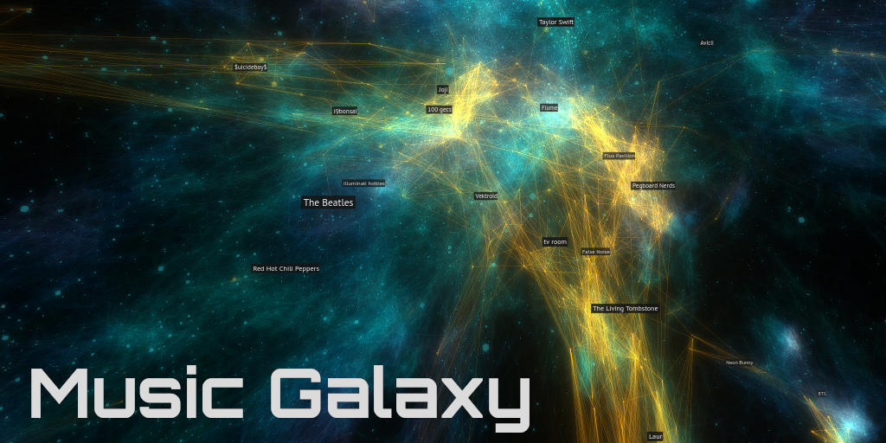
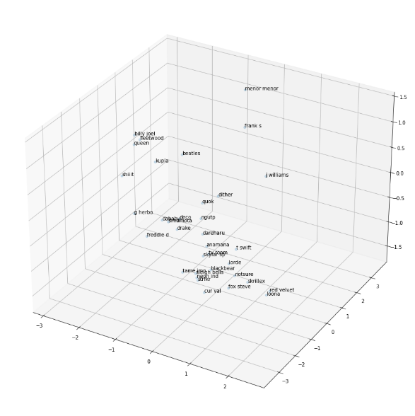
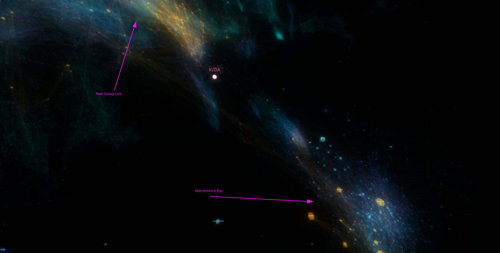

If you listen to music using a modern platform like Spotify, YouTube, SoundCloud, or similar, chances are you've had songs programmatically recommended to you in some way or another.  These recommendations were likely generated by a machine learning model or other data-driven approach that takes information about you and what you listen to and predicts other songs or artists you'll also like.

In my experience, they're incredibly effective!  Every day when I return to my YouTube homepage or check my Spotify Weekly playlist to find new music, there's always something there that I'll enjoy.  As a species, we've become immensely sophisticated and specialized at finding the things we want.  However, the amount of _stuff_ out there is massive and is only getting bigger.  The commercial interests are huge as well; the world's best data scientists and machine learning engineers work to build ever more powerful recommendation engines for the platforms of today with the goal of bringing users the content they'll like the most.

The problem, though, is that these models are largely black boxes and operate almost entirely out of view of the users they serve.  We only see their final output, the neatly arranged rows of thumbnails or album art, pre-compiled and primed for one-click consumption.  They do their job of locating optimal content and making it easy to access, but the bigger picture and more importantly the context within which the media exists is largely invisible.

## What I Built

_My goal was to visualize the world of music as a whole, providing a way to understand the relationships between artists and a framework for music discovery outside of genres_.

The end result of my work is **Music Galaxy**, an interactive 3D visualization of the relationships between over 70,000 artists. It was created from an embedding of a graph of artist relationships; it arranges artists in such a way that artists with similar audiences are closer together in space.

Try it out yourself in your browser:  <a href="https://galaxy.spotifytrack.net" target="_blank">https://galaxy.spotifytrack.net</a>

Along the way, I developed a tool I call "Artist Averager" - a web application that takes two musical artists as input and returns a list of artists that best represent the midpoint between them.

You can try it out as well: <https://spotifytrack.net/artist-averager.html>

The rest of this post goes over background on these tools and techniques used to build these tools and the process I came up with do so.

## About Embeddings

(Feel free to skip this section if you're familiar with word/graph embeddings and how they're generated)

**Embeddings** are a method for projecting data into another representation while preserving the underlying structure and information that the data contains.  Graph data, as powerful as it is, can be difficult to use directly for machine learning or other computational use-cases, and embeddings can help bridge the gap.

### `word2vec`

There have been many attempts at developing strategies to build embeddings from various sources, but one standout solution is called [`word2vec`](https://www.tensorflow.org/tutorials/text/word2vec).  It was developed at Google in 2013 for natural language processing use cases of generating embeddings out of text, and since then has made huge waves in the industry.

At its core, `word2vec` works by taking text and generating an embedding where each word in the input corpus is represented by an n-dimensional vector (fixed-length list of floating point numbers) in the output.  The vectors for each word are chosen such that the similarity between vectors of related words are minimized.  The input text is treated as a graph where each word is connected to the words before and after it in each sentence.

There's a ton of exciting stuff in that area and I'm not going to try to explain it here (there are tons of resources for learning it online), but one example that really resonated with me was that you could actually do things like analogies just by performing simple arithmetic operations on the generated vectors.  A famous one is [king - man + woman = queen](https://www.ed.ac.uk/informatics/news-events/stories/2019/king-man-woman-queen-the-hidden-algebraic-struct).  Just by adding and subtracting the vectors of the embedded words, you can get what feels really close to "meaning".

As you might imagine, this representation is much easier to work with than the raw graph.  Vectors from the embedding can be fed directly into neural networks whose outputs can then be mapped back by looking for the most similar vector in an embedding to the output.

### Graph Embeddings with `node2vec`

As noted previously, text is really just a specialized type of graph with complex rules and common patterns for things like word distribution, sentence length, etc.  The same strategy used by `word2vec` can be generalized to work with arbitrary graph data, opening up a whole world of other applications and use-cases from [predicting protein-protein interactions](https://bmcbioinformatics.biomedcentral.com/articles/10.1186/s12859-020-03646-8) to [encoding abstract concepts](https://wiki.pathmind.com/thought-vectors) to power search engines and information retrieval systems like Google.

Various methods have been developed for embedding arbitrary graphs.  One such framework is called [`node2vec`](https://snap.stanford.edu/node2vec/) and it builds on top of `word2vec` directly.  It's in the family of similar frameworks such as [Deepwalk](https://arxiv.org/abs/1403.6652) that construct "sentences" out of random walks through arbitrary graphs and then pass those to `word2vec` to generate an embedding.  In addition to the parameters available for `word2vec`, `node2vec` also provides several tunable hyperparameters that control the way the random walks are generated.  These can have large influence over the character of the resulting embedding.

## Spotify Artist Relationship Data

Now, let's get back to the problem at hand and the data that I used to build the two projects.

No matter how tall the tower of shimmering GPU-accelerated machine learning models gets, no matter how many pages of LaTeX-encrusted research papers go into the software that runs them, the base level of data remains the same: _Relationships Between Things_.

If you like something, the chance you will like something similar to it is higher than the chance you'll like some other random thing.  The word "similar" can mean basically anything depending on the context (shirt size, demographic, tempo, price) but it always represents a _connection to something else_.  For this reason, all recommendation engines, at some level, operate on data that can be described as a graph.  The "things" being recommended are nodes and the relationships between them are the edges.

Spotify has a [public API](https://developer.spotify.com/documentation/web-api/) that they provide for creating applications and tools that integrate with Spotify.  I've used this myself in the past to build [Spotifytrack](https://spotifytrack.net), a web application to analyze your music listening habits and see how they evolve over time.

Notably, the API provides an endpoint that returns **a list of up to 20 "Related Artists"** for every artist on Spotify.  According to [the docs](https://developer.spotify.com/documentation/web-api/reference/#/operations/get-an-artists-related-artists), "Similarity is based on analysis of the Spotify community's listening history."  This is the same data that is shown in the Spotify app under the "Fans also like" on artist pages:

This data is very powerful because it _represents actual listening patterns of users_.  This has a lot more value than features like BPM, release date, or genre.  It contains elements of social relationships between artists and listeners, record labels, geographic influences, playlists, cultural trends, and the other countless ways people find music and the reasons they listen to what they do.  It also is naturally influenced by Spotify's own recommendation algorithms which in turn are almost certainly trained using this data itself or something like it.

I use this data within Spotifytrack, building a 2D graph visualization of each user's top artists and how they are related to each other. It uses a graph layout algorithm to arrange the artists with the goal of placing related artists closer to each other.  I have a [blog post](/blog/speeding-up-webcola-with-webassembly/) on that as well if you care to learn more about the process of building + optimizing it.

Although the 2D visualization is interesting and useful in itself, there are many clear limitations that prevent it from scaling well with larger graphs.  The graph in the screenshot above only contains my personal top artists and their relationships and it's already incredibly noisy and visually overwhelming.  It would be quite impractical to use it for trying to visualize large numbers of artist, such as  all artists on Spotify.

## Building the Artist Relationship Embedding

_The problem to solve was representing this graph data in way that preserves the semantics of the graph's connections while presenting the data in a visually tractable way._

For this, I used a graph embedding.  A graph embedding works in a similar way to the graph layout algorithm used in the 2D visualization, but it provides much more ability to tune and control the properties of what was generated.

To start, I scraped the artist relationship network using that endpoint from the Spotify API and built up a graph of over 1.4 million artists by crawling relationships in the same manner as a web spider.  Although many of these artists have 0 plays or 0 uploaded tracks, the end result was a graph of relationships between virtually all listened-to artists on Spotify.

I used [a Python notebook](https://github.com/Ameobea/spotifytrack/blob/main/research/spotify_related_artists_embedding.ipynb) to do the necessary data cleanup and pre-processing and load the source data I collected from the API into a graph representation using `networkx`.  I then used an [implementation of `node2vec`](https://github.com/eliorc/node2vec) to generate the embeddings.

While testing out different hyperparameters and configurations, I used a 3D scatter plot to get a rough idea for how embeddings looked by plotting the positions of a hand-picked collection of widely differing artists.

### Choosing the Right Dimensionality

Most embeddings, such as those created from large corpora of text or social networks composed of millions of people, use large vectors with hundreds of dimensions or more to encode the underlying graphs.  By choosing large vectors like this, they are able to encode huge amounts of information and represent complex relationships between nodes rather than just "similar" or "dissimilar".

For the Spotify dataset, the amount of data available is quite limited.  Although I retrieved relationship data from over a million artists from the API, the majority of them have no or very low numbers of monthly plays.  For artists with the least numbers of plays, the number of related artists returned from the API was also very low which caused undesirable artifacts to develop in the generated embeddings.

To address this, I pruned the data set down to 100,000 artists.  An additional challenge is that the API caps the maximum number of related artists returned at 20, and there is no information about the degree of similarity between them.  Because of this, the size of the vectors for the embeddings I generated were quite small; I experimented with dimension counts ranging from 3 to 16.

#### Artist Averager

There was a lot of trial and error involved with picking the best vector size for each of the embeddings.  For the Artist Averager, I found that a vector size of 8 was best.  Using higher number of dimensions than 8 provided too many degrees of freedom to place artists and as a result too much space in between artists.  It was to the point that nothing was really similar to anything else except for first-order connections.  The vector that was most similar to most midpoints of artist A and artist B was usually a directly connected neighbor of either artist A or artist B, 90% similar to artist A and 2% similar to artist B, but it was the best that was available.

Using lower numbers of dimensions than 8 provided noisier results that I felt were lower-quality.  It still gave decent results - especially between artists within the same genre or community - but performed worse when comparing drastically different artists.  There is simply less information available in that case to describe the relationships between artists.

#### Music Galaxy

For the Music Galaxy, the requirements were very different.  Although the embeddings I generated ranged in dimensionality, the maximum number of spatial dimensions we as humans can easily perceive caps out at 3; at the end of the day I needed some kind of 3-dimensional embedding to construct the galaxy.

Besides being a good match for the data itself, it was also necessary for the Music Galaxy's embedding to look aesthetically pleasing and to be visually tractable as well.  When I say visually tractable, I mean that when you look at it or fly around in it, it should be easy to identify the structure and patterns that it represents: clusters or closely related artists, thin filaments of artists that bridge the gaps between different styles, etc.

When I tried generating a 3D embedding directly with `node2vec`, it kept generating one where all artists existed on the surface of a big "bowl", almost like a 2D plane that was placed into 3D and warped into a bowl shape.  I'm not sure why it happened - perhaps some caveat of the `node2vec` implementation I used - but in any case it looked very bad.

Generating high-dimensional embeddings and projecting down to 3D via PCA had too much information loss; the whole embedding looked very "fuzzy", had little defined structure, and had blatantly unrelated artists in close proximity.

Here's what it looked like from a distance:

Generating a 4D embedding with `node2vec` and PCA'ing it down to 3 dimensions was the sweet spot; `node2vec` had enough space to lay things out well and the information loss from shaving just one dimension off was manageable.  In fact, I've found that the bit of noise that is added by the PCA is actually desirable; it helps to facilitate exploration and discovery by mixing in things you might not have seen normally. A similar strategy is used by some AI-powered recommendation engines.  Some percentage of their recommendations will be either partially or entirely random in order to expose users to fresh content and keep the model from over-saturating in one specific groove.

### Hyperparameter Search

The final key to generating a great embedding for the galaxy were two `node2vec` hyperparameters which are descriptively named `p` and `q`.  You can read about them in [the official research paper](https://arxiv.org/pdf/1607.00653.pdf) if you want, but essentially they boil down to this:

As mentioned earlier, `node2vec` uses random walks through the source graph to create "sentences" which are then fed to `word2vec` under the hood to generate the embedding.

 * `p` is the "Return parameter" which "controls the likelihood of immediately revisiting a node in the walk".
 * `q` is the "In-out parameter"; it controls whether the random walk is "more DFS-like" in that it is biased towards visiting nodes further away or "BFS-like" in that it is more likely to visit closer nodes.

Together, these two parameters have a dramatic effect on the structure of the generated embedding.  It was difficult to anticipate what those effects would be, though, so I set up a rather extensive hyperparameter search with different `p` and `q` values for the 4D embedding.  Once they all generated, I PCA'd them all down to 3 dimensions and loaded them up to see what they looked like.

I kept [a log](https://github.com/Ameobea/spotifytrack/blob/main/research/comparisons.md) of the different variations I tried along with screenshots of them from inside an early version of the visualization.

The findings were that having a high `p` and a relatively low `q` produced the best embeddings.  A high `p` (~2.5) means that walks were more likely to loop back on themselves and visit the same nodes again.  I believe this helped to produce more tightly-defined clusters and neighborhoods and prevent everything from looking like a big blob.  A relatively low `q` (~0.5) means that the the walk is "more DFS-like" and will wander further away from the starting node by default.  These two parameters also interact with each other; setting `q` low by itself or `p` high by itself wasn't as good as when both were changed.

The improvement in the quality of the generated galaxy was dramatic and obvious:

I found that embeddings with high variations in density were the most visually pleasing and that they additionally provided the most information about the underlying artist relationships.

Once I'd settled on good embedding hyperparameters, I was able to tweak some other settings such as the scale of the galaxy, the speed the user flies through it, coloring, opacity, and things like that.

## Results + Observations

If you haven't already, I encourage you to [try out Music Galaxy](https://galaxy.spotifytrack.net/) for yourself and explore the embedding first-hand!

Although it looked good, it was important to make sure that the embedding still carried the artist relationship information accurately.  Flying around and exploring, it is apparent that it does.

One of my favorite "landmarks" is the area around what is generally known as K-Pop.  It is an extremely dense region way off by itself, largely disconnected from the main body of the galaxy.  This makes a lot of sense given what I've observed about K-Pop listeners.  I've found that they're often deeply involved with the scene rather than being casual listeners.  Also notable is the fact that the most mainstream and widely-known K-Pop artists are located on the side facing towards the core of the galaxy.  This makes sense since the most popular artists are likely to have the most mainstream appeal and thus most likely to be related to non-K-pop artists.

"K/DA" is a virtual music group created for the online game League of Legends to create music inspired by the game.  Some of the singers from the group are from popular K-Pop groups and much of the music's style aligns with K-Pop.

Looking at the position generated for it in the embedding, it is situated outside of the core K-Pop cluster in the space towards the galaxy's center and various electronic music.  This position makes complete sense since the group draws an audience from both K-Pop listeners as well as League of Legends players who might not previously have listened to much or any K-Pop.

Another fascinating region of the galaxy is best described as the "internet music zone".  It represents a ton of artists that as far as I can tell are mainly related by the fact that they're popular with online communities, gamers, and other heavy internet users.  There are artists from a wide variety of genres including EDM, Lofi, Chiptune, game soundtracks, and more.  It also is neighbors to a large section of largely Japanese music and Vocaloid which fits perfectly since that kind music is also very popular online.

Additionally, I checked that the average connection length between related artists was relatively low compared to the size of the galaxy.  This ensures that on average, artists were being positioned close to other artists they were related to.  There are cases where some artists have many long connections due to them serving as bridges between disparate genres or musical communities, but they make sense given the context.

## Conclusion

I consider these projects and this line of investigation as a whole quite successful in accomplishing the goals I set out.  Using both the Music Galaxy and Artist Averager myself, I found several artists that I'd never heard before which I really liked and I've listened to them extensively since.  That alone I consider a big sign of success for the tools I built.

One of my favorite things about these tools is the fact that they work entirely outside the concept of genres and don't require categorizing artists under any labels in order to function.  When one artist can produce songs spanning dozens of different styles/genres (or even do so within a single song), genre-less tools are distinctly advantaged for music discovery.

The fact that the visualization exists in a 3D space worked out very well too in my opinion.  Being able to literally wander around and sample different musical styles and observe how they change from place to place is a very organic experience that would be difficult to replicate in a non-spatial manner.

I'd love to see how similar 3D embedding visualizations work for other graph data as well.  The same or very similar processes can be used to generate them and there are plenty of knobs to turn to fine-tune it to fit different data sets and their personalities.  I don't have any plans to try that right now myself, but I'll definitely have embeddings in mind as a powerful tool for working with graph data in the future.
