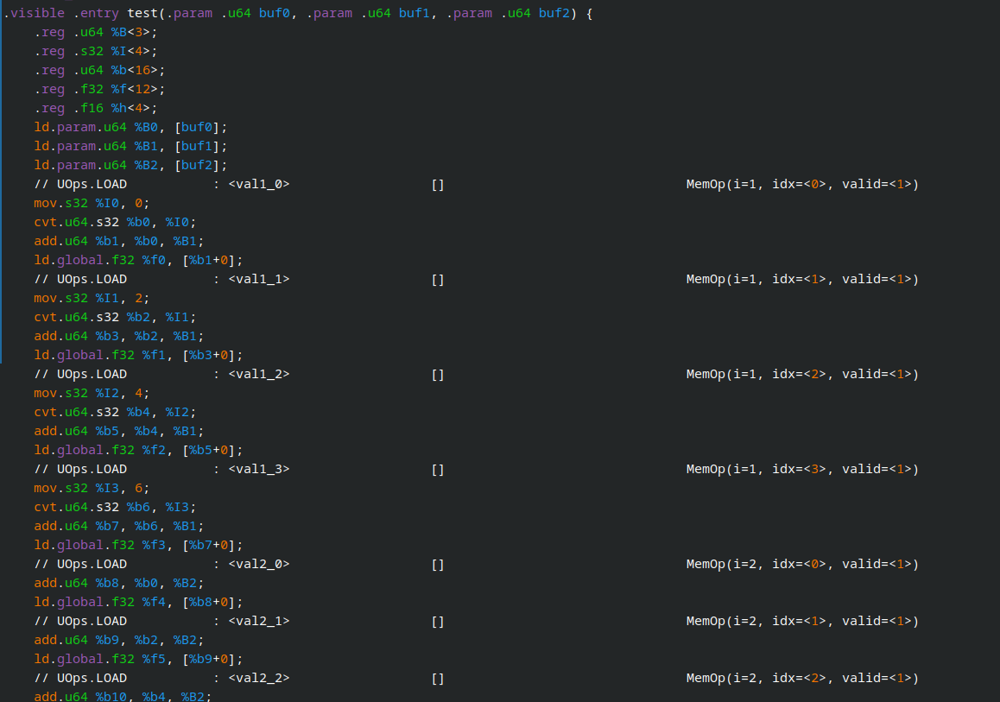
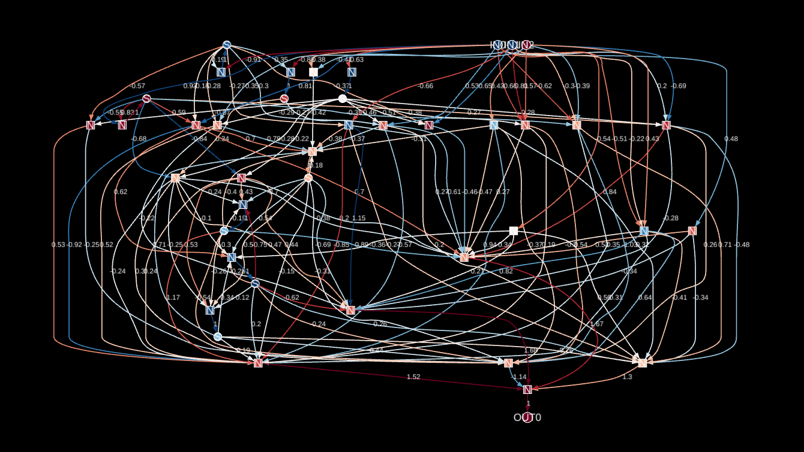

<div style="text-align: center; margin-top: 20px; margin-bottom: -20px;">

</div>

This writeup introduces what I'm calling **Bonsai Networks** - extremely sparse computational graphs produced by training and pruning RNNs.  They provide an interpretable view into the solutions learned by networks for simple logic problems, breaking out of the black box neural networks typically reside in.

I give an overview of the process I use to create these networks which includes several custom neural network components and a training pipeline implemented from scratch in Tinygrad. I also include many interactive visualizations of the generated graphs and use them to reverse engineer some interesting solutions they learned for a variety of logic problems.

<i>If you aren't that interested in the process I used to develop and train these networks, feel free to skip down to the <a href="#results">Results</a> section to check out the reverse engineering part.</i>

## Background

My original inspiration for this project came from a blog post called [Differentiable Finite State Machines](https://google-research.github.io/self-organising-systems/2022/diff-fsm/).  It lays out a strategy for directly learning state machines to model binary sequences.  The FSMs are learned using gradient descent in a similar way to how neural networks are trained, hence the "differentiable" part of the title.

<div class="good xpadding">The part that I found especially interesting was how the author (<a href="https://znah.net/" target="_blank">Alexander Mordvintsev</a>, the creator of DeepDream) managed to extract "hard" FSMs from the "soft" weights learned during training.</div>

I have a big interest in ML interpretability, and I've done [some work](https://cprimozic.net/blog/reverse-engineering-a-small-neural-network/) on reverse engineering small neural networks in the past.  The prospect of taking the big blob of floating point numbers + matrix multiplication and turning it into something that can be reasoned about and manipulated was very exciting to me.

This got me thinking about how I could expand the ideas from that post into something that could handle slightly more involved problems.  At some point, I had the idea of trying to extend the ideas from the FSM post to full-fledged RNNs.  That got me started on the path that eventually led to this project and writeup.

## Bonsai Networks Overview

Here's the headline:

<div class="note xpadding">Bonsai networks are computational graphs where nodes are neurons and edges are weights</div>

Since RNNs (and all other neural networks) are different kinds of computational graphs, it's also true that:

<div class="note xpadding">Bonsai networks are just extremely sparse RNNs</div>

That sparsity is their first key feature.  Most bonsai networks I trained ended up pruning out >90% of their weights.  And once you get networks that sparse and convert them into graphs, some unique things become possible.

<div class="good xpadding">By analyzing the pruned graphs, it's possible to eliminate entire neurons/branches of the tree in a manner similar to dead code elimination in a compiler.</div>

By doing that, the sparsity goes up even further and the most minimal graphs can be created.

At a high level, the whole process of growing them looks like this:

 * Train sparse RNNs on random examples generated by a target program
 * Convert the weights from those RNNs into a directed graph
 * Apply the DCE-like pruning to the graphs
 * Analyze the resulting graph to understand the network's solution

There's a good bit of nuance that's required for each of these points, so let's dive into that now.

## Custom Neural Network Components

The design goals of the RNNs I trained for the bonsai networks are significantly different from those of RNNs used for conventional purposes.

In order to get good results with creating these bonsai networks, I needed to design some custom components and architectures for their training.

### Activation Function

The usual activation functions used when training neural networks - functions like sigmoid, ReLU, tanh, etc. - are usually quite simple.  For large, deep networks like the vast majority of those trained today, they're a great choice.  Neural networks excel at composing complex solutions out of these simple functions, building up more and more sophisticated internal representations over dozens of layers.

There's no rule saying that the activation function has to be simple, though.  Technically, any differentiable non-linear function will work.  For my purposes here, I wanted to pack as much computational power into the function as possible without making it impossible to train or numerically unstable.

I ended up using a custom activation function which looks like this:

<iframe src="https://nnb-demos.ameo.design/activationPlot.html?interpolatedAmeo=1" class="iframe-mobile-scale" loading="lazy" style="display: block; outline: none; border: 1px solid rgb(136, 136, 136); box-sizing: border-box; width: calc(min(430px, 114%)); overflow: hidden; height: 370px; margin-left: auto; margin-right: auto;"></iframe>

I developed this activation function around a year ago as part of some [earlier research](https://cprimozic.net/blog/boolean-logic-with-neural-networks/#designing-a-new-activation-function) into using neural networks to perform boolean logic.  It has some unique properties which make it very well-suited for this particular use-case:

 * It can solve the *XOR problem* in a single neuron.  In fact, it can actually model [all 2 and 3 input boolean functions](https://cprimozic.net/blog/boolean-logic-with-neural-networks/#results) (like `a && b`, `!a && (b || !c)`, `a ? b : c`, etc.) in a single neuron as well.
 * It is well-balanced, symmetrical, and has an average output value of 0 across all real numbers.
 * It can be tuned to have wide regions where it outputs very nearly -1 and 1
   * This makes it less sensitive to quantization and makes it better able to model functions with binary inputs and outputs.

All of these things contribute to making it very well-suited for modeling the kinds of binary logic programs I was targeting.  However, there are some downsides as well:

 * The complex, spiky derivative makes it more difficult to train using this function compared to conventional alternatives, and it is quite sensitive to the initialization of network parameters.
 * Its piecewise nature makes it require a hand-written kernel and a manually implemented derivative/backwards pass.

These certainly created some headaches to deal with, but they were well worth it for the power that this function unlocks for the networks.

### RNN Architecture

Another key modification I made was to the base architecture of the RNNs themselves.

I started out with a vanilla RNN modeled after TensorFlow's [`SimpleRNNCell`](https://github.com/keras-team/keras/blob/v2.13.1/keras/layers/rnn/simple_rnn.py).  This is about as simple as it gets for a RNN, and I didn't use any of the fancy features like dropout, LSTM/GRU, etc.

Here's the architecture that TensorFlow uses for it:

<div style="text-align: center; margin-top: 20px">
<a target="_blank" href="https://i.ameo.link/bax.svg">

</a>
</div>

Like all RNNs, each cell has its own internal state which is fed back for the next timestep of the sequence.  In this vanilla architecture, the value passed on as output from the cell is the same as new state.

One important thing to note is how the inputs and current state are combined by adding them together before being passed to the activation function.  In the diagram above, that's the `+` operator just before the activation function `σ`.

<div class="note xpadding">I believe this is done to help with the vanishing/exploding gradient problem when training RNNs, but for my purposes it has the effect of glomming up the signals and making the dataflow harder to reason about.</div>

To solve this, I implemented a custom RNN cell using a modified architecture:

<div style="text-align: center; margin-top: 20px">
<a target="_blank" href="https://i.ameo.link/bb2.svg">

</a>
</div>

It's pretty similar to the vanilla architecture but with a few key differences.

<div class="note xpadding">The main thing to note is that the output passed on to the next cell in the chain can be different from the new state fed back for the next timestep.</div>

This is important for multiple reasons:

 - It decouples the state from the output.
    - Distinct representations can be learned for each that can be more concise, aiding in the production of very small and interpretable networks.
 - The introduction of the second bias vector is useful for the custom activation function which requires rather specific combinations of weights and biases to represent some logic gates and other functions.
 - It homogenizes the operations used by the network.
    - Rather than having to add different nodes for the neurons and then the `+` operator that combines the outputs from both dot products, all the nodes can instead implement the same operation.

This last point is important for keeping the converted graphs at the end of the process as simple to understand as possible.  Every node can be thought of as a single neuron implementing this identical `sum weighted inputs -> add bias -> activation` operation, making the flow of data and overall operation much easier to follow.

### Sparsity-Promoting Regularizer

One of the most important goals when training these RNNs is ensuring that they are maximally sparse - meaning that as many of their weights are almost exactly zero as possible.

A commonly used technique for encouraging sparsity while training neural networks is the use of **regularizers** during the training process.

Regularizers can be thought of as secondary training objectives.  They are functions that take a tensor (weights, biases, or any other trainable parameter) and return a cost value.  That regularization cost is then added on to the base loss value computed for the batch:

$$
Cost = Loss(y_{actual}, y_{pred}) + \lambda * R(\mathbf{w})
$$

where $R(\mathbf{w})$ represents the regularization function and $\lambda$ is the regularization coefficient which controls the intensity of the regularization.

<div class="note xpadding">For many different kinds of neural networks, decent success can be had by just <a href="https://developers.google.com/machine-learning/crash-course/regularization-for-sparsity/l1-regularization">using <span class="math math-inline"><span class="katex"><span class="katex-mathml"><math xmlns="http://www.w3.org/1998/Math/MathML"><semantics><mrow><msub><mtext>L</mtext><mn>1</mn></msub></mrow><annotation encoding="application/x-tex">\text{L}_{1}</annotation></semantics></math></span><span class="katex-html" aria-hidden="true"><span class="base"><span class="strut" style="height: 0.8333em; vertical-align: -0.15em;"></span><span class="mord"><span class="mord text"><span class="mord">L</span></span><span class="msupsub"><span class="vlist-t vlist-t2"><span class="vlist-r"><span class="vlist" style="height: 0.3011em;"><span style="top: -2.55em; margin-right: 0.05em;"><span class="pstrut" style="height: 2.7em;"></span><span class="sizing reset-size6 size3 mtight"><span class="mord mtight"><span class="mord mtight">1</span></span></span></span></span><span class="vlist-s">​</span></span><span class="vlist-r"><span class="vlist" style="height: 0.15em;"><span></span></span></span></span></span></span></span></span></span></span> regularization</a>.</div>

$\text{L}_{1}$ regularization penalizes weights based on their absolute value: the bigger the weight, the bigger the penalty linearly.  For larger networks, this can have the result of driving superfluous weights to zero without any extra effort required.  It can also help avoid overfitting by deterring very large weights from developing.

However, for my case, I wasn't getting much luck with it.  My best guess for why not is the behavior of the custom activation function.

To represent many logic gates concisely, the activation function needs to use rather large weights.  For my purposes, I didn't want to penalize a weight of 1.5 any more than a weight of 0.1, but $\text{L}_{1}$ regularization has the effect of penalizing the first much more.

<div class="bad xpadding">This made it very difficult for those configurations that required large weights to develop in the networks.  As a result, networks would use more resources to represent the same functionality in a less efficient manner.</div>

To fix this, I ended up implementing a custom regularization function.  It works by penalizing non-zero weights in the same way as $\text{L}_{1}$ regularization, but it has a sharp cutoff very close to zero at which point it "turns on" and starts penalizing the weight.  Crucially, the penalty goes up extremely gradually as weights get larger past that threshold so the optimizer has more breathing room to tune useful existing weights to good values.

Here's the function I came up with:

Let:

$$
\begin{align*}
x & : \text{The tensor being regularized} \\
n & : \text{The number of elements in $x$} \\
t & : \text{The threshold of the activation} \\
s & : \text{The steepness of the activation} \\
i_T & : \text{The intensity of $T(x)$} \\
i_{L_1} & : \text{The } L_1 \text{ regularization intensity} \\
\end{align*}
$$

The regularizer $R(x)$ consists of the custom function I developed $T(x)$ combined with standard $\text{L}_{1}$ regularization:

$$
\begin{align*}
T(x) &= \tanh((|x| - t) \cdot s) - \tanh(-t \cdot s) \\
R(x) &= \frac{1}{n} \sum_{j=1}^{n} \left(i_T \cdot T(x_{j}) + i_{L1} \cdot |x_{j}|\right)
\end{align*}
$$

Or, if you find code easier to understand than symbols like me, here's the actual code I used to implement it:

```py
class SparseRegularizer:
    def __init__(self, intensity=0.1, threshold=0.1, steepness=100, l1=0.001):
        self.intensity = intensity
        self.threshold = threshold
        self.steepness = steepness
        self.y_shift = np.tanh(-self.threshold * self.steepness)
        self.l1_intensity = l1

    def __call__(self, x: Tensor):
        abs_weights = x.abs()
        shifted_weights = abs_weights - self.threshold
        tanh_weights = (shifted_weights * self.steepness).tanh() - self.y_shift

        l1_weight = abs_weights.mean() * self.l1_intensity

        return tanh_weights.mean() * self.intensity + l1_weight
```

Note that it includes a very small amount of vanilla $\text{L}_{1}$ regularization.  I found that this is important to provide a gradient to drive unnecessary weights to zero since the gradient produced by the squooshed `tanh` is so miniscule on its own.

This plot shows the penalty added by the regularizer for different weight values:

<iframe src="https://nnb-demos.ameo.design/sparseRegularizerPlot.html" loading="lazy" style="display: block; outline: none; border: 1px solid rgb(136, 136, 136); box-sizing: border-box; width: 99%; height: 400px; max-width: 800px; margin-bottom: 10px; overflow: hidden; margin-left: auto; margin-right: auto;"></iframe>

As you can see, the penalty for non-zero weights is essentially the same, so the network can actually optimize for true sparsity rather than just having a bunch of small weights.

### Trainable Initial States

For the first timestep of a sequence, RNNs need to initialize their states to some value.  This is often accomplished by just setting all the states to 0.

<div class="bad xpadding">Zeroing initial states turns out to be quite limiting when training small RNNs.</div>

In addition to being able to model state transitions from one timestep to another, the model also needs to learn how to initialize its state from scratch on the first timestep and differentiate between the first timestep and all others.

To look at it from a programming perspective, it's like forcing you to use `.reduce()` without being able to provide an initial state:

```ts
const { y0, y1 } = inputs.reduce((acc, x) => {
  if (!acc) {
    acc = { y0: 4, y1: 2 };
  }

  acc.y0 = (acc.y0 + x) % 5;
  acc.y1 = (acc.y1 - x) % 3;
  return acc;
}, null) // no initial state provided
```

In the context of neural networks, that `if (!acc) { acc = { y0: 4, y1: 2 }; }` operation could be very expensive, requiring dozens of parameters or more to implement.  This issue is made even more prominent due to the way the custom activation function works.  Since it's optimized to output -1 and 1, it makes it even harder to deal with the all-0 initial states in an elegant manner.

<div class="good xpadding">To solve this, I marked the initial state tensors themselves as trainable and initialize them to random values at the start of training.</div>

It turns out that gradient descent has no problem at all optimizing those initial state values just like any other parameter in the network.

I found that this has a significant positive impact on the quality of graphs produced at the end, making them both smaller and easier to understand.  And since these initial state tensors are just constants, they don't add any actual complexity to the graphs created at the end.  The data flow itself can be simplified due to the greater degree of freedom the trainable initial states provide.

### Tinygrad

I wrote [all of the custom components](https://github.com/Ameobea/rnn-viz/tree/main/py/tg) as well as the training pipeline for the networks with [Tinygrad](https://tinygrad.org/).

Tinygrad is an extremely minimal library which re-implements a modern ML toolkit with GPU-accelerated tensor operations, automatic differentiation, optimizers, and more from scratch - all in a tiny code footprint.  It's under very active development and has gotten a lot of attention in recent months.

There are multiple reasons I chose to use Tinygrad for this project:

<div class="good xpadding">Tinygrad has out-of-the box support for easily training networks on AMD GPUs.</div>

This is important for me since that's what I have available.  I was even able to write a OpenCL kernel for the custom activation function and its derivative, and it worked performantly on the first try.

I've worked with the [ROCm TensorFlow fork](https://github.com/ROCmSoftwarePlatform/tensorflow-upstream) in the past.  My experience was mired with driver crashes, bad performance, and installation hell.

Tinygrad worked out of the box with my AMD GPU.  I just had to set `GPU=1` and everything worked quite well.

<div class="good xpadding">It's the first library time I felt that I actually had an end-to-end view of the whole pipeline from high-level Tensor operations in Python to assembly code that runs on my GPU.</div>

For the same reasons I'm interested in AI interpretability, I have a keen interest in understanding how the code I write is compiled and executed.  Compared to the CPU with its rich ecosystem of debuggers, decompilers, and similar tools, the GPU has always felt like a foreign realm hidden behind mountains of abstraction to protect us developers from its terrible alienness.

Thanks to Tinygrad's truly tiny codebase and built-in debugging tools, I can easily print out the generated kernel OpenCL source code or even the raw disassembly for every operation in my network and training pipeline:



It makes the GPU feel like something I can interact with directly and understand natively rather than some opaque "accelerator" that gets magically invoked by "something" 300 layers deep in the call graph.

## Training

Now that all the components are in order, it's time to start growing some networks!

...

That's a bit easier said than done.

<div class="bad xpadding">All in all, training these bonsai networks really was quite difficult.</div>

To start, I implemented the function I wanted the network to learn in Python so I could generate infinite training data.  I then implemented a basic training loop in Tinygrad to form it into batches, build those into tensors, and use it to train the network.

<div class="bad xpadding">It wasn't that hard to get RNNs that successfully modeled the target function, but they weren't nearly sparse enough to be interpretable.</div>

I spent many hours tweaking hyperparameters, layer counts and sizes, training data, and every other thing I could think of in an attempt to get nice, small graphs as output.

Even though all the custom stuff I described earlier helped a ton, the best I could get were graphs that looked like this:



It was _close_ to being interpretable, but still too messy to really make sense of things.

### Grokking

Since the networks I was training were quite small, the loss would bottom out quite quickly - usually after ~5-15 minutes of training or less.  At that point, the network would usually have perfect validation accuracy on the target function and I'd stop training and convert + prune the graph.

**The breakthrough came when I left a training run going while I left my apartment for a few hours.**

<div class="good xpadding">It turns out that if you just let the network keep training well after it has perfectly solved the problem, the regularization loss keeps going down very slowly and the network continues to sparsify itself further and further while still perfectly modeling the target function.</div>

Here's the loss plot for that training run:

<iframe src="https://nnb-demos.ameo.design/grokkingLossDemo.html" loading="lazy" style="display: block; outline: none; border: 1px solid rgb(136, 136, 136); box-sizing: border-box; width: 99%; height: 436px; max-width: 800px; margin-bottom: 10px; overflow: hidden; margin-left: auto; margin-right: auto;"></iframe>

"Regularization Loss" here corresponds to the extra penalty added by the custom regularization function I described above.  It serves as a direct proxy for how sparse the network is.

It sat at a plateau for thousands of batches and then spontaneously improved, all while the base loss stayed at almost exactly zero.

<div class="note xpadding">When I observed this, I was immediately reminded of <a target="_blank" href="https://www.lesswrong.com/posts/N6WM6hs7RQMKDhYjB/a-mechanistic-interpretability-analysis-of-grokking">Grokking</a>.</div>

Grokking is a phenomenon that is observed when training neural networks test set accuracy will sit at ~100%, but validation set accuracy will be low.  This means that the network has "memorized" its test set and failed to generalize.  After much time, they then spontaneously experience a "phase transition" in which they switch from memorizing data to implementing a general, more efficient solution.

Although the situation here is a bit different, something very similar was going on.  After more experimentation, I determined a set of conditions that were required for that behavior to show up for me:

1. The use of the Adam optimizer
2. Small-ish batch sizes
3. Use of the sparsity-promoting regularizer

These are quite similar to the set of conditions found in the [LessWrong post](https://www.lesswrong.com/posts/N6WM6hs7RQMKDhYjB/a-mechanistic-interpretability-analysis-of-grokking#Grokking___Phase_Changes___Regularisation___Limited_Data) describing grokking.

I'm not sure exactly what's going on internally to cause this behavior, but I have some ideas.

The Adam optimizer internally keeps track of a sort of "momentum" for the gradient.  I don't have any data to back this up, but after staring at many loss plots it feels like this might be allowing it to trade some short-term suffering (higher loss now) for long-term gains (lower loss in the future).

<div class="note xpadding">I often see that the test loss will spike up significantly during training before settling to a lower value shortly afterwards.</div>

It's also possible that this has something to do with the kinds of training objectives I was using or something about the networks I was training themselves.

I think this might be tied into the batch sizes as well.  If the batch sizes are too large, it's possible that the random variations in training data that could allow the optimizer to break out of a local minima might be too small, preventing the grokking-like behavior from emerging.

It's possible that this isn't "true" grokking and there's some other reason that this is happening, but in any case it was vital to unlocking the ability to finally train really sparse networks.

## Constructing the Graphs

Once a good network has been trained, we're left with raw weight values.  Each cell has weights for the recurrent and output kernels and biases as well as initial states.

Here are the weights I got when I trained an extremely small (1 cell with 4 neurons) network to output the value from the previous timestep (or -1 if it's the first timestep):

```
Cell 0:
   output weights:
      [[-0.00008739  0.00021077  0.5794643  -0.00001823]
       [-0.00020802  0.49030322 -0.00047993 -0.89849126]]
   output bias:
      [ 0.58836555  0.16279402  1.1870208  -0.09561448]
   recurrent weights:
      [[ 1.569628], [-0.00017183]]
   recurrent bias:
      [-0.10378765]
   initial state:
      [0.54937315]

Dense Layer:
   weights:
      [[-0.00003202  0.6027134   0.00035313 -0.87236595]]
   bias:
      [0.08960767]
```

Following the architecture of the custom RNN cell, the weights can be directly converted into a graph like this:


Each of the edges represents a weight.  The circles (`S`) are states, and the squares (`N`) are neurons.

I wrote [some code](https://github.com/Ameobea/rnn-viz/blob/main/src/routes/rnn/graph.ts#L867) to implement the network's operations on the graph components so that each of the neuron nodes actually performs the `sum weighted inputs -> add bias -> activation` operation, the states update each timestep, and data is pulled through the graph to populate the outputs.

### Pruning

The first step to prune these graphs is to cut edges for weights that nearly zero.  To choose an appropriate threshold at which to do that, I evaluate the graph and test random inputs of the target function for tens of thousands of iterations, then choose the highest clip threshold for which the graph still correctly models it.  The same thing is done to biases as well.

At this point, I also applied quantization to the weights, biases and initial states.  I used the same process to determine how coarsely I could quantize without making the graph invalid.  This doesn't make the resulting graphs any sparser, but it can make understanding the solutions a bit easier.

Once all of that is done, the last step is to clear out all of the disconnected nodes and subgraphs that are left over.  Starting from the outputs, a depth-first search is performed on the graph and the ID of every visited neuron is recorded.  Then, I go through every layer and delete every neuron that wasn't visited.

At the end of that process, here's what was left of the graph:


At this point, we have a minimal graph modeling the $Y_n = X_{n-1}$ function which is equivalent to this code:

```py
state = -1

for input in inputs:
  output = state
  state = input
  print(f'Output: {output}')
```

## Results

Now for the fun part!

### `y[n] = x[n-2]`

Let's start out with an extremely basic example: A network with a single layer trained to output the input from 2 timesteps ago, and output -1 otherwise:

$$
y_n =
\begin{cases}
x_{n-2} & \text{if } n \geq 2 \\
-1 & \text{if } n < 2
\end{cases}
$$

Here's the graph that was learned for that:

<iframe src="https://nnb-demos.ameo.design/2AgoDemo.html" loading="lazy" style="display: block; outline: none; border: 1px solid rgb(136, 136, 136); box-sizing: border-box; width: 99%; height: calc(min(740px, 90vw)); margin-bottom: 10px;"></iframe>

It's essentially created a 2-timestep delay line which is a pretty sensible solution to the problem.  The signal gets inverted a couple of times as it gets passed through the activation function, but it ends as the right sign at the end of the chain.

#### Understanding the Visualization

Nodes and edges are colored to indicate the value they're _outputting_ at the current timestep.  So an edge with a weight of `-1` getting an input of `-1` will get a color of red since it _outputs_ a value of `+1`.

The dashed edges pointing to the state neurons represent the feedback of state from one timestep to the next.  Those edges aren't actually evaluated until the timestep changes.

The state nodes themselves have a max of one input edge which comes from the recurrent neuron they're paired with.  Their current value is passed directly (with no activation function) to all output edges for the current timestep.  When the timestep advances, their value is replaced with the output of their paired recurrent neuron.

### `[-1, -1, 1]` loop

OK, let's try something slightly more interesting.  Here, I trained the networks to output the values `-1, -1, 1` in a loop:

$$
y_n =
\begin{cases}
-1 & \text{if } n \mod 3 = 0,1 \\
1 & \text{if } n \mod 3 = 2
\end{cases}
$$

I was expecting the resulting graph to be a circular delay line similar to the previous one with three recurrent neurons in it, each one passing its current state on to the next directly without changing it, and initial states set to something like `[-1, -1, 1]`.

It turns out that the network was able to do better:

<iframe src="https://nnb-demos.ameo.design/threeStateLoopDemo.html" loading="lazy" style="display: block; outline: none; border: 1px solid rgb(136, 136, 136); box-sizing: border-box; width: 99%; height: calc(min(740px, 90vw)); margin-bottom: 10px;"></iframe>

Only two states are needed!

I dug into its solution and determined that it's equivalent to this logic:

```py
S0[0] = T
S1[0] = F

S0[n] = XNOR(S0[n-1], s1[n-1])
S1[n] = NOT(S0[n-1])
out   = S1[n]
```

Or written imperatively:

```py
S0 = True
S1 = False

for _ in range(12):
  S0, S1, out = S0 == S1, not S0, S1
  print(out)
```

That makes it clear that the 3-state FSM is representable using two bits of state.  Both of the logic gates used for the transitions are expressible in a single neuron each as well.

### Balanced Parenthesis

Similar to the classic programming exercise, here the RNN is trained to interpret the input sequence as an expression like `()(()())` and, at each timestep, determine if the sequence is balanced.  I only produce valid sequences (no `())))` or similar) and cap the maximum nesting depth.

That example input sequence and the expected outputs are encoded like:

```txt
seq:       (  )   (   (   )   (   )  )

inputs:  [-1, 1, -1, -1,  1, -1,  1, 1]
outputs: [-1, 1, -1, -1, -1, -1, -1, 1]
```

A FSM to model this program for a max depth of 8 would look something like this:


The core of this implementation is a counter that goes up when opening parenthesis are encountered and down when closing parenthesis are encountered.  `State 0` corresponds to "balanced" and all the others are imbalanced.

Note that for a FSM, a linear number of states are required with regard to the maximum nesting depth of the sequence (or the length of the sequence if there is no max set artificially).

When I trained a bonsai network on the same problem, here's what it came up with:

<iframe src="https://nnb-demos.ameo.design/balancedParenthesis.html" loading="lazy" style="display: block; outline: none; border: 1px solid rgb(136, 136, 136); box-sizing: border-box; width: 99%; height: calc(min(740px, 90vw)); margin-bottom: 10px;"></iframe>

For this demo, the sequence generated is `(((((((())))))))(((((((())))))))` repeating forever, so the output is expected to be `-1` (unbalanced) at every timestep except for the last `)` in each block.

Digging in, the state on the left keeps track of the max nesting depth and the one on the right is used to implement an oscillator that toggles from slightly positive to slightly negative every timestep.  I'm not 100% sure why that's needed, but by combining that oscillator with the counter it does indeed model the sequence.

<div class="bad xpadding">That being said, it's actually cheating a bit to get there.</div>

I had to do tweak some of the parameters of the activation function to make it work, setting the interpolation factor all the way to 1, like this:

<iframe src="https://nnb-demos.ameo.design/activationPlot.html?interpolatedAmeo=1&defaultInterpolationFactor=1" class="iframe-mobile-scale" loading="lazy" style="display: block; outline: none; border: 1px solid rgb(136, 136, 136); box-sizing: border-box; width: calc(min(430px, 114%)); overflow: hidden; height: 370px; margin-left: auto; margin-right: auto;"></iframe>

The network learned how squash the range of the depth counter into the middle linear portion of the activation function from -1 to 1.  Then, it implemented a function like:

```ts
depth_counter = depth_counter + (char == '(' ? -0.04 : 0.04)
```

Finally, it uses the non-linear properties of the activation function to implement a threshold using the counter and the oscillator to switch the output from -1 to 1 once the counter reaches a certain value.

### Replace `1` -> `111`

This is one I stole from the "Differentiable Finite State Machines" blog post:

```
Training input  : -1, 1, -1, -1, -1, 1, -1, -1, -1, 1, -1
Expected output : -1, 1,  1,  1, -1, 1,  1,  1, -1, 1,  1
```

Whenever it encounters a `1` in the input sequence, it will lock the output to `1` for the next 2 timesteps regardless of the input.  Otherwise, it will pass through the input without changes.

Here's the learned graph:

<iframe src="https://nnb-demos.ameo.design/replace1To111Demo.html" loading="lazy" style="display: block; outline: none; border: 1px solid rgb(136, 136, 136); box-sizing: border-box; width: 99%; height: calc(min(740px, 90vw)); margin-bottom: 10px;"></iframe>

It's equivalent to this logic:

```py
S0 = True
S1 = False

for input in inputs:
  out = (not S0) or S1 or input
  S0, S1 = not input, not (S0 or input)
  print(out)
```

Pretty clever!  Even though I knew it was possible theoretically, it was good see confirmation that the networks were actually able to find valid configurations to represent 3-input boolean functions like it did here for (`(not S0) or S1 or input`) in a single neuron.

### Complex Gated Loop with Conditional Logic

For this one, I wanted to crank up the complexity much further.  All of the programs before this one had a single input bit and single output bit per timestep, but this one has 3 input bits.

Here's the program I had it learn:

```py
all_modes = ['XOR', 'AND', 'NOR', 'NAND']
mode_ix = 0

for change_mode, in1, in2 in inputs:
  if change_mode:
    mode_ix = (mode_ix + 1) % len(all_modes)
  mode = all_modes[mode_ix]

  out = None
  if mode == 'XOR':
    out = in1 != in2
  elif mode == 'AND':
    out = in1 and in2
  elif mode == 'NOR':
    out = !(in1 or in2)
  elif mode == 'NAND':
    out = !(in1 and in2)

  print(out)
```

So, the network will have to learn to keep track of some inner 4-variant state that it transitions between conditionally depending on the value of the `change_mode` flag.  Then, it will have to use that inner state to decide which logic gate to apply to the two inputs.

I expanded the network architecture for this one, making it bigger and adding a second cell.  After many failed attempts and a lot of training time, here's the network I got out:

<iframe src="https://nnb-demos.ameo.design/logicGateSwitcherDemo.html" loading="lazy" style="display: block; outline: none; border: 1px solid rgb(136, 136, 136); box-sizing: border-box; width: 99%; height: calc(min(740px, 90vw)); margin-bottom: 10px;"></iframe>

So in this visualization, `IN0` corresponds to the `change_mode` flag and `IN1`/`IN2` are the operands for the logic gate.

Looking at the graph's structure, it seems to be pretty distinctly split into two parts.  On the right, there's a big section of complex recursively connected states, and on the right there's a dense section of neurons connected in to the operands and the output.

Let's zoom into the right section first:

<iframe src="https://nnb-demos.ameo.design/gatedFSMDemo.html" loading="lazy" style="display: block; outline: none; border: 1px solid rgb(136, 136, 136); box-sizing: border-box; width: 99%; height: calc(min(740px, 90vw)); margin-bottom: 10px;"></iframe>

<div class="note xpadding">The fact that this whole section of the graph is only connected to the <code>change_mode</code> input gives a big clue as to what it's doing.</div>

This subgraph is implementing the internal "mode" state of the network.  It's doing it in a bit of a complex way with some intermediate states and signals, but at its core it's definitely keeping track of that mode.

To help demonstrate this, I added a logic analyzer to the graph visualization.  It renders line graphs showing the output value/current state of different nodes in the graph over time.

The `layer_1_state_0` and `layer_1_state_4` nodes are inverted copies of each other.  They both alternate between three states - low, zero, and high - in a loop (L, Z, H, Z, L, Z, H, Z, ...).  If `change_mode` flag is high, they swap to the next state in the sequence and if it's low, they stay at their current value.

The `layer_1_state_6` and `layer_1_state_3` nodes are also important.  They serve as 2-state oscillators with a period of 2, and they also only "tick" when the `change_mode` flag is high.

Together, here's how those states evolve together when the mode changes:

```
L Z H Z ...
H H L L ...
```

That gives us the following sequence of aggregate states:

```
LH, ZH, HL, ZL, ...
```

Which gives us our 4-step counter that loops around when it reaches the end and only advances when the `change_mode` input is high!

The left section of the graph takes the various internal states computed on the right side and combines them with the operands.  It implements chains of complex, many-input boolean functions that somehow result in the final outputs getting generated for each mode.

I'm not going to pretend to understand how that happens specifically.  There are two neurons that have 6 inputs each, although some of them are redundant and could be combined (I was kind of disappointed that those didn't get optimized out during training).

### The End of the Road?

After that, I tried training networks on even more complicated problems.  One thing I tried was a sort of emulator for a miniature CPU, where the inputs were instructions and the "CPU" had to keep track of registers and output their values at each timestep.

However, try as I might, it just wouldn't learn.  As I bumped the layer count and sizes higher and higher, I started running into all the issues that people complain about when training RNNs.  I experienced both the exploding and vanishing gradient problem, instability during training, and slow training.

<div class="bad xpadding">There's a reason RNNs fell out of fashion in recent years, and this is a big part of it.</div>

In any case, that's where I decided to call it for this project.  There are definitely approaches that could help fix these things and I'm reasonably confident I could make it work given enough effort, but I'll save that for another time.

## Conclusion

Here are my main takeaways from this project:

 * RNNs are very cool and versatile, but can be seriously hard to train and work with.
 * Tinygrad is an awesome library if you want to get closer to the hardware and build stuff yourself.
 * RNNs, FSMs, Turing Machines, and all other models of computation are similar at many levels.
 * Graphviz is an amazing tool and can do much more than I ever knew.
 * **It really is possible to peer inside the black box of neural networks with sufficient time and effort.**

I hope you found this stuff interesting and enjoyed the writeup.  Thanks for reading!

All the source code for this project and the interactive graph visualizations on this page is [on Github](https://github.com/ameobea/rnn-viz).

----

I often put out updates and little demos of this kind of work as I do it.  If you're interested, you can subscribe to my blog via RSS at the top of the page, follow me on Twitter [@ameobea10](https://twitter.com/ameobea10), or Mastodon [@ameo@mastodon.ameo.dev](https://mastodon.ameo.dev/@ameo).
