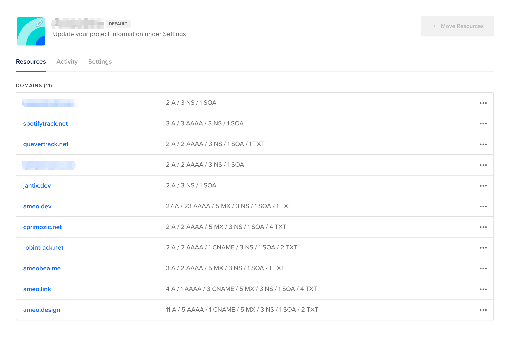
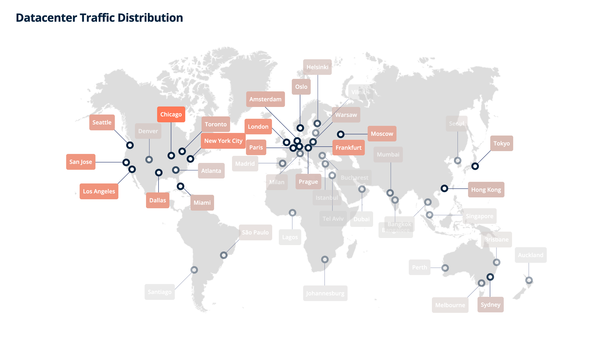
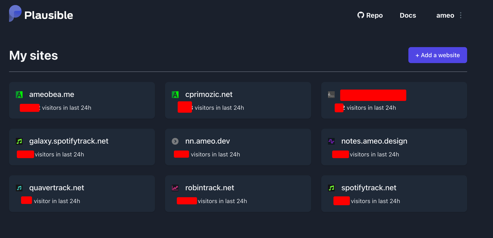
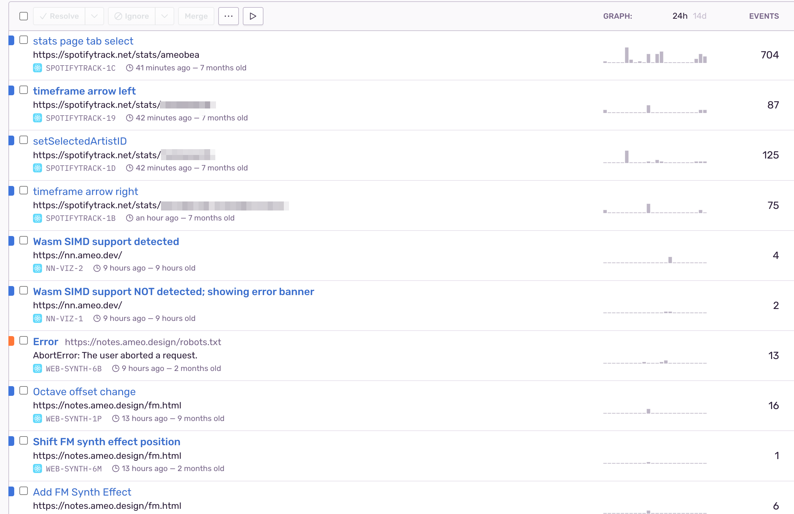
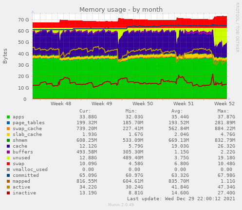
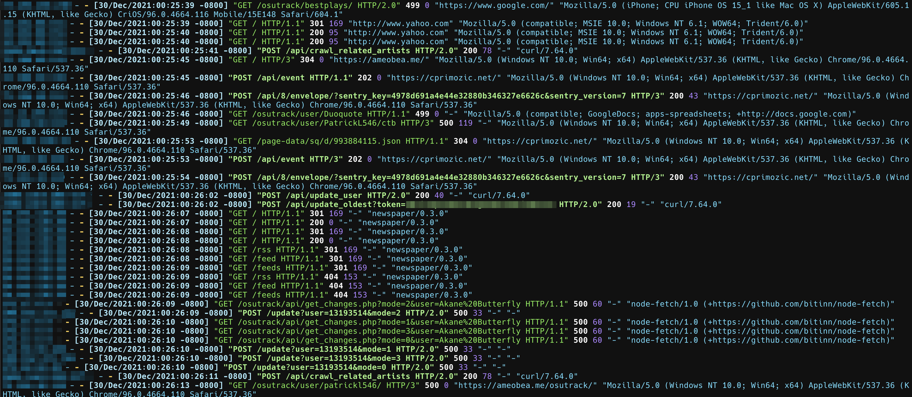
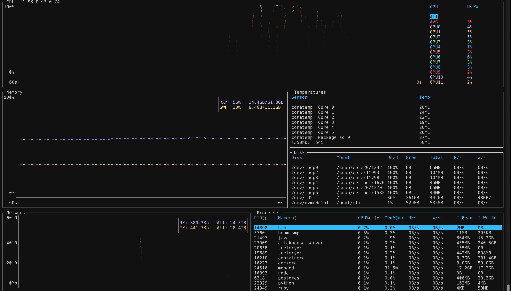

Over the years, I've accumulated [quite a collection](https://cprimozic.net/portfolio/) of websites, web applications, APIs, and other services that I've built and continue to host publicly.  I've experimented with a lot of different hosting methods for them, switched between several different providers, and have finally arrived at something that I feel comfortable with that meets all my needs.

There are nearly infinite options available for hosting software today and more come come out every day.  However, many articles and guides you'll find online for this kind of thing are either from public cloud providers or companies with massive infrastructure, complex application needs, and huge amounts of traffic.

I wanted to write this up mostly to share the decisions I made for the architecture and why I've done things the way I have.  Although my needs are much smaller-scale and I don't currently charge any money for anything I'm running, I still want to provide the best possible experience for my sites' users and protect all the work I've put into my projects.

## Hardware

I run everything off of a single dedicated server from OVH hosted in Hillsboro, Oregon.  I chose that location because I live in Seattle and get nice ping to it from my apartment.  Ping from the East Coast USA is usually <100ms, which I find acceptable.  I pay ~$85/month for it after taxes.  This is pretty expensive and it's honestly more than I need, but I care deeply about my sites and the other things I've built and host there, so I am happy to pay for a nice server to host them.

It has the following specs:

```
CPU: Intel Xeon E5-1650 v4, 6 cores/12 threads @ 3.6Ghz
Memory: 64GB
Network: 500mbit upload / 1Gbit download, uncapped
HD: 2x 420GB NVME in RAID 1, 420GB effective storage
OS: Debian
```

> In the past, I've used a variety of virtual servers to host my services.  I, like many other people,   started out on [DigitalOcean](https://www.digitalocean.com/) using their free student credits and then their $5/month droplet when I was first learning programming and system administration.

> After a couple of years, I moved to [SSDNodes](https://www.ssdnodes.com/) - a "budget" hosting company that provides extremely cheap servers.  They always have a sale of some kind going on; currently they're offering their KVM "2X-LARGE" VPS with 48GB RAM, 12vCPU, and 760GB storage for $100/year.  It sounds too good to be true and it kind of is in my experience.  I had huge issues with performance when running things there; I'm pretty sure their CPUs are extremely oversubscribed, and their HDs were VERY slow.  Their servers also had issues with getting randomly restarted.  Because of that, I can't really recommend it for serious production workloads.  That being said, it was a great option for me when I was in school and worked well enough for me for a few years.

### Virtual vs. Dedicated

I really wanted to go with a dedicated server rather than a virtual server.  I don't have many technical reasons for this; performance between a well set-up, non-overcommitted VPS and a dedicated server with identical underlying hardware should be almost identical.  I'm also not doing any kind of fancy custom kernel tuning or anything like that.  I do like the fact that I'm the only one using the hard drive and there's IOPS limiting or weird network storage setup.

I do quite like the idea of a real box of hardware setting in the OVH datacenter that I fully control, too.  It really lends a feeling of permanence and tangibility to the entirely virtual constructs I build and maintain.

## Containers + Docker

I don't have an "orchestration" layer like Kubernetes for my services.  I made this decision very explicitly.  I've used Kubernetes at multiple jobs, including my current one, and the amount of complication and problems it brings are much too high for the benefits when hosting something like what I am.  I may reconsider that decision in the future if the number of services I run grows considerably or if I need to add additional servers.

As an alternative, I use plain Docker.  Each server, database, and other service runs inside its own container.  Currently, there are 67 running containers on my server.  All of the containers are configured to restart automatically if the server is rebooted, but it's very rare that that happens.  The main disadvantage compared to K8s from my perspective is that there is some small downtime when I deploy new versions of things since I don't have any load balancing or rolling deployments.  For my applications and traffic levels, a few seconds of downtime is acceptable and just stopping and re-creating containers is sufficient.

Whenever I add a new service, I record the exact `docker run` command I used to launch it and refer to it when I need to re-create the containers for whatever reason.  I know that this is an area that could use improvement; it's quite manual right now.  I'd be interested to hear about some kind of light-weight solution for this that people have come up with.

I still get all the vital benefits of containerization which I rely on.  Services are isolated from each other, dependencies and environments are deterministic-y + much easier to manage, and it's possible to make changes and reason about individual services without potentially breaking other applications.

For any container that needs to store state on the filesystem, I use volume mounts that map to folders in a dedicated directory on the host filesystem.  This ensures that containers can be destroyed and re-created without losing data.  I also back this data up automatically, which is detailed in a later section.

For services that bind and listen on ports, I map from whatever port the container listens on by default to a separate range.  I keep blocks of 100 ports for each of my different services and have all their containers listen within that range; it helps me keep things organized.  I do not expose any of these ports to the internet directly, however.  I have a firewall set up using `ufw` to deny all traffic to the server except on ports I specifically select.

## NGINX Reverse Proxy

Everything exposed to the internet that speaks HTTPS or WebSocket goes through a single NGINX reverse proxy.  This is one of the very few things I have running outside of a container.  I could have put it in a container, but I find that I tweak its config and need to `nginx -s reload` pretty often to reload config changes, so having it run natively works best for me.  In the past, I used to use
Apache2 as my main webserver, but I find NGINX to be much easier to configure and seems to be more popular right now.

NGINX makes it easy to host multiple domains on the same server.  I just create a single config file for each top-level domain.  Since renting many domains can get expensive over time, I usually host new projects or smaller things on subdomains.  For backends and and APIs, I use `proxy_pass` directives to pass through traffic to whatever port the service is listening on locally from its Docker container.  Using pure NGINX configs, I can set up any kind of routing, header logic, or other custom behavior I need for my applications.  Here's an example of a typical config block for one of my services:

```
    location / {
        proxy_pass http://localhost:4900/;
        proxy_set_header Upgrade $http_upgrade;
        proxy_set_header Connection $connection_upgrade;
        proxy_set_header Host $host;
        proxy_set_header X-Real-IP $remote_addr;
        proxy_pass_request_headers      on;
    }
```

I have all my HTTPS certificates issued + managed via [letsencrypt](https://letsencrypt.org/).  It's a terrific service; all I have to do is run `snap run certonly --nginx` every 3 months and everything is taken care of automatically.  Even though I have almost 50 different domains+subdomains all routed by the same server, it works more or less flawlessly and it's 100% free.

### Modern NGINX Features

Another reason I don't use a container for NGINX is that I have some custom modules and customizations:

 - Support for brotli compression using Google's open source [ngx_brotli](https://github.com/google/ngx_brotli) module

Brotli compression is a modern alternative to gzip and deflate which offers [significant improvements](https://blog.cloudflare.com/results-experimenting-brotli/) in compression ratio while having a similar decompression speed on the client.  I have it enabled for everything compressible that passes through my NGINX server and it works very well.

 - Support for HTTP 3/QUIC via Cloudflare's [quiche](https://github.com/cloudflare/quiche) and associated patches for NGINX

HTTP3/QUIC is still somewhat experimental, but it's supported by all the browsers I use and Cloudflare has it deployed across their whole network.  Following the guide in a [blog post](https://blog.cloudflare.com/experiment-with-http-3-using-nginx-and-quiche/), I was able to apply the patches and get it set up with little headache.  I don't have any recorded metrics for improvements in latency or anything, but I always enjoy running the latest and greatest things and have had no issues with it so far.

 - The [`set-misc-nginx-module`](https://github.com/openresty/set-misc-nginx-module) module which I use for some complicated re-write logic to facilitate my `phost` static site hoster (more details below)

I built [a script](https://ameo.link/u/bin/9le/rendered) for automating this.  I can't guarantee that it will work without modifications; I might have made some manual edits to things that aren't reflected in it.

### `phost` Static Site Hoster

One unique tool that I make extensive use of is something I built myself as a project a few years ago: [`phost`](https://github.com/ameobea/phost).  Its main purpose is to make deploying static sites for demo or development extremely quick and easy.  I wrote up a more detailed (but out-of-date) [description of the tool](https://cprimozic.net/blog/phost/) if you're interested.

There is a small client I have installed on my computers that I can run to deploy a directory as a static site to a subdirectory on one of my domains.  This command handles that:

```
phost create subdir-name directory
```

The files will be sent to the server, a directory created, and with some webserver routing magic will be accessible at https://somedir-name.ameo.design/.  I have some useful additions like optionally redirecting 404s to `index.html` to facilitate SPAs and deploying new versions with `phost update`, but other than that the tool is pretty simple.

I use this tool quite heavily when in the development or prototyping stages of new projects.  I still have to handle deploying backends/APIs manually if the project needs one, but it makes deploying UI updates extremely easy.  That being said, I can't recommend trying to use `phost` yourself unless you're willing to dedicate a good chunk of effort getting it set up - I really only built it for personal use.  And to be honest, there are probably polished open-source alternatives out there that work better.

## Networking + DNS

The DNS for all of my sites is managed for free on DigitalOcean.  This is entirely because DO was the first place I ever hosted websites or configured DNS and I never bothered moving it because it works perfectly.  Their web UI is very easy to use too.



One recent change I made was setting up IPv6 support for my server.  OVH provides a /64 of IPv6 addresses along with the IPv4 I had been using, but I put off setting it up for a long time because I've had tons of issues with IPv6 in the past on my desktops and laptops.  However, when I actually went to do it, it went quite smoothly!  Most of my time was spent with NGINX configuration changes, but now that I've learned the proper pattern everything works great.  DNS changes just consisted of creating duplicate AAAA records of all my existing A records with my server's IPv6 address.

### External CDN

Although running and hosting everything off a single server is convenient, for users that are geographically far away latency can be high.  For some of my sites, the majority of traffic comes from outside of the US.  For that reason, I use a CDN ([bunny.net](https://bunny.net/)) to host static sites for my largest/most visited sites.  They use a simple model where they just proxy your target on their domain, so most of the changes I had to make were on my application frontends.  I pay $1/month (their minimum monthly bill), enough for up to ~1TB of outbound traffic per month.



I've used Cloudflare in the past, and that would work fine too.  If I wanted to hide my server's IP address, it would be pretty much necessary.  That may become necessary if I ever have trouble with DDOS attacks or similar in the future, but Bunny is a great and simple option for now.

## Services

Now that I've gone over all the infrastructure I have running to support them, I feel like I should give a bit of an idea of the kind of stuff I have deployed to justify it.  This is a non-exhaustive list, but it gives a good idea for the kind of services I'm hosting.

### Websites

I host the static content and API backends for several websites:

 - My collection of "-track" sites and associated APIs/backends: <https://robintrack.net/>, <https://ameobea.me/osutrack>, <https://spotifytrack.net/>, <https://quavertrack.net>
 - This site <https://cprimozic.net>
 - My web-based audio synthesis and experimentation platform: <https://synth.ameo.dev>
 - Wordpress sites for my sister and some other people
 - Dozens of small one-off sites, experiments, and sketches including everything hosted via `phost`

### Databases

I host a few different databases to support them all:

 - MySQL/MariaDB server used by several sites and services
 - Postgres servers for Quavertrack and Sentry
 - MongoDB server used by Robintrack
 - Clickhouse servers for Plausible and Sentry

### Self-Hosted Analytics via Plausible

I host my own analytics for all my sites with [Plausible](https://plausible.io/).  It's a privacy-conscious, lightweight alternative to Google Analytics, which I used to use.  They provide an open-source, self-hostable version which I have it deployed with `docker-compose`.  It's very easy to add to sites once set up, and I have it configured for most of my biggest sites and new ones I deploy going forward.

Something Plausible does that Google Analytics doesn't is show all my sites' daily views on a single dashboard for easy checking:



### Self-Hosted Error Reporting via Sentry

Similar to Plausible, I run a self-hosted [Sentry](https://sentry.io) instance to record JS errors and other events from all my websites.



Since setting this up, I've found it very valuable for catching bugs and seeing how users are using my sites.  It has the ability to aggregate events from all my sites into a single view as well which I find very useful.

### Personal Utilities

I also run a variety of utilities and services for my personal, non-public use:

 - [httpbin](https://httpbin.org/) for testing APIs and stuff
 - [Send](https://github.com/timvisee/send), a self-hosted fork of the discontinued Firefox Send service for easy file sharing
 - A personal [screenshot hoster and file uploader](https://github.com/ameobea/ameotrack) that I use along with a customized version of [Flameshot](https://github.com/flameshot-org/flameshot) to capture, upload, and share screenshots instantly
 - [Owncast](https://owncast.online/) - Self-contained self-hosted RTMP livestreaming

## Security

I taught myself everything I know about servers and hosting websites, and I've made my fair share of mistakes.  I've accidentally leaked my AWS credentials on Github when I was in high school (happily AWS saved me from the multi-thousand-dollar bill racked up overnight by crypto miners), I've had a VPS pwnd by a bots that used an unauthenticated public Redis server I had running to overwrite my SSH authorized keys file, and I've had my MongoDB emptied out and held for ransom (luckily I had this backed up).  I was lucky that these things happened to me early on in my programming career and didn't really have any lasting impacts.  They've also taught me lessons that I've never forgotten regarding security for my servers and sites.

The first step is firewall.  I use `ufw`, a wrapper around `iptables`, and default to denying all access to everything other than ports 80, 443, and the non-default port I run my SSH server on.  As I previously mentioned, everything passes through the NGINX reverse proxy on the way in and out of the server.  Since everything runs on the same server, I don't have to worry about exposing databases or similar to the internet; even if something is accidentally bound to 0.0.0.0 instead of 127.0.0.1, the firewall will prevent it from being reachable from outside of the server.

Speaking of SSH, I have my `sshd` configured to only allow key-based access - no password-only logins.  My SSH key is password protected as well.  Beyond that, I ssh in as a non-privileged user and have one final password configured on the server for sudo access.

At the service level, I'm careful to create and use application-specific credentials for things like databases, cloud storage APIs, and anything else that requires authenticated access.  I have password authentication enabled for most of my databases even though they're on the same server and use different usernames/passwords for each service.  This ensures that even if there is some kind of breach in one container that gives access to its database, the databases of other applications will remain protected.

For runtime secrets and configuration, I use a mix of environment variables, mounted config files, and baked-in secrets depending on the service and the sensitivity of the secret.  If someone is able to get root on the host, it's really game over.  If an attacker is somehow able to escape from a container, things don't look very good either.

One important thing to note, though, is that none of my websites currently deal with sensitive user data of any kind.  Because of this, the security needs of my server are quite different than what would be appropriate for anything dealing with PII.  If I ever build something that has those needs, I will probably end up hosting it on its own server or turn to a public cloud/serverless alternative.

## Monitoring

I use an old tool called [Munin](https://munin-monitoring.org/) for monitoring my server and some services.  It's pretty fiddly to configure and can break easily, but it produces clear and useful charts.  I might swap this out for Prometheus + Grafana or some other more modern alternative some day if I get bored.



One advantage of running all my services in containers is that per-service resource usage can be collected.  Munin has plugins that handle this automatically, polling the Docker daemon and building area charts for per-container memory and CPU usage.

I also use a program called [ccze](https://github.com/cornet/ccze) for producing formatted, colorized logs from my NGINX server.  Watching this log allows me to view live traffic for all of my sites in aggregate which I fine very useful for gauging traffic levels, identifying patterns in behavior, checking out what bots are hitting my APIs, and stuff like that.



For getting a feel for live resource utilization and activity on the server, I use a program called [btm](https://github.com/ClementTsang/bottom).  I've used others in the past, but I use `btm` because it's written in Rust and I like the language and the community.



## Backup + Disaster Recovery

My backup solution is simple but effective.  I have a variety of shell scripts that run periodically to back up databases and other things and upload them to Google Cloud Storage for backup.

I use parallel xz compression (overkill, but might as well put those cores to use).  One thing I learned was that piping directly from `mysqldump` or similar into `xz` is a bad idea; I had issues with my database locking up and my sites becoming unresponsive, so I always dump to a plain `.sql` file in `/tmp` and then compress and upload that.

I store my backups using "Archive" level storage.  The minimum storage period is 1 year, but the cost is like 0.11 cents/GB/month which is just kind of crazy to be honest.  I upload new archives every day and have a lifecycle rule configured to delete all the old backups after the 1 year storage period has ended.

I did the math before I set it up and it seemed that storing as Archive for 1 year was almost the same price as storing as "Coldline" for 90 days (its minimum storage period).  Because of that, I opted for archive.  It really doesn't matter at all, though; I spend <$5/month for storing >2TB of backups.

In addition, I keep a copy of all (well, as many as I can) configuration files for everything on the server and the stuff running on it stored locally.  My NGINX config is especially complex and took a ton of time to get just right, so I make sure to keep it synchronized regularly.

## Conclusion

As you might imagine, this setup has evolved dramatically over time as I've learned things and added more sites + services.  By some measures, it's overkill for my purposes.  The main factor is that I really care about this server and everything running on it.  The sites and services it hosts represent countless hours of my life in effort and are some of the things I care about most.  But most importantly, I really enjoy setting this all up and hosting it.  It's very satisfying getting all the various pieces working together in harmony and truly having end-to-end visibility and control over the software I'm running.  I also love how it's possible to do all of this using publicly available software and tools.  Almost everything is free except renting the hardware, too, which is great.

I hope you found this writeup useful or at least interesting.  I'm sure that some of the things I'm doing could be improved upon, and I'd love to hear your thoughts on what I could do better or different!
