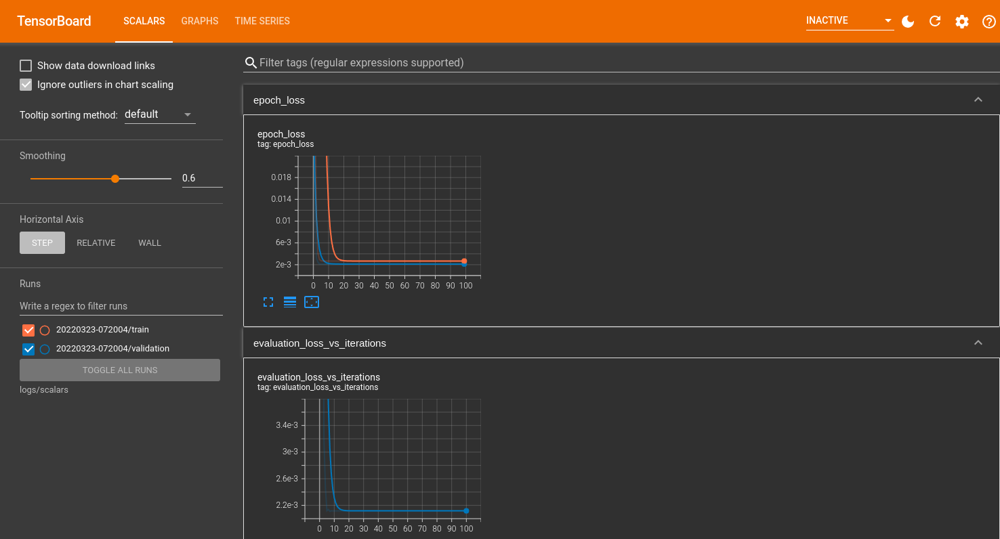
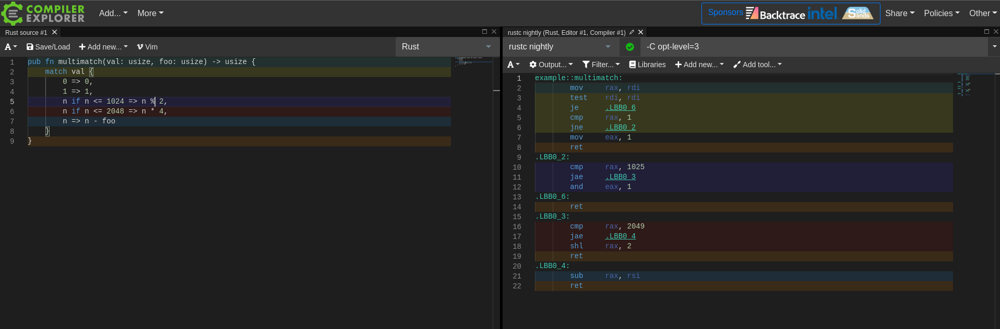
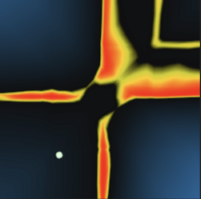
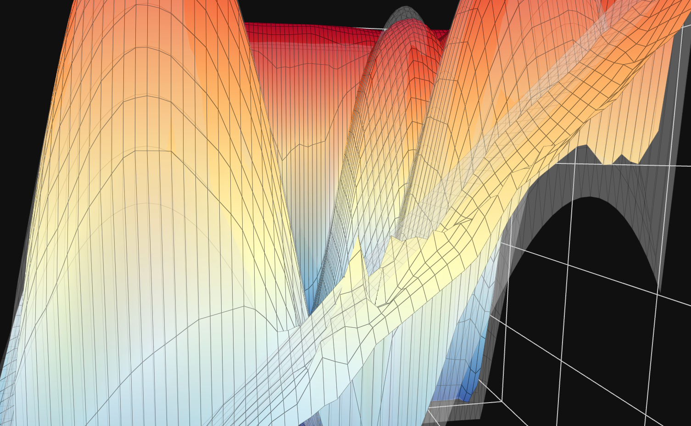

</img>

While teaching myself the basics of neural networks, I was finding it hard to bridge the gap between the foundational theory and a practical "feeling" of how neural networks function at a fundamental level.  I learned how pieces like gradient descent and activation functions worked and even played with building and training some networks in a [Google Colab](https://colab.research.google.com/) notebook.

Modern toolkits like Tensorflow handle the full pipeline from data preparation to training to testing and everything else you can think of - all behind high-level, well-documented APIs.  The power of these tools is obvious.  Anyone can load, run, and experiment with state of the art deep learning architectures in GPU-accelerated Python notebooks instantly in the web browser.  Even implementations of bleeding-edge research papers are readily available - you can even run them with your own data.  Powerful visualizations of every stage of the process are instantly available with [TensorBoard](https://www.tensorflow.org/tensorboard), tuned to whatever particular model you're working with.

## The Problem

Despite the richness of the ecosystem and the incredible ergonomics of the tools, I felt like I was missing a core piece of the puzzle in my understanding.

On one side, there are the very abstract concepts built on calculus and matrix multiplication which provide the underlying mechanism for how neural networks function.  On the other end, there are the extremely high-level software suites used to work with neural networks for practical and research purposes.

I come from a software background, and when I was learning how compilers and code generation worked one of my favorite tools was and still is [Compiler Explorer](https://godbolt.org/) aka Godbolt.  It's a web application where you can type in any code you want in a variety of languages, choose a compiler and compilation options, and instantly view the disassembled output for a wide range of different hardware architectures.

I find this tool to be unparalleled for learning how compilers work and understanding what kinds of assembly gets generated for different kinds of code input.  It's dynamic and responds instantly as soon as you poke it.  It's an environment for experimentation rather than a static knowledge resource.  Crucially, it provides a visual mapping between the two sides of the extremely complex transformation taking place under the hood.

This is what I wanted for neural networks: A constrained, simplified environment for building basic network topologies and experimenting live to see <i>visually</i> how different layer counts, sizes, activation functions, hyperparameters, etc. impact their functionality and performance.

## Neural Network Playground Overview

With this goal in mind, I created a browser-based tool for building, training, visualizing, and experimenting with neural networks.  Since it runs on the web, I've embedded it directly in this post:

<collapsible-nn-viz defaultexpanded="true"></collapsible-nn-viz>

There's also a standalone version of the tool available: <https://nn.ameo.dev>

### How it Works

The tool trains user-configured neural networks to model functions mapping vectors of 2 numbers from [0, 1] to a single output value from [0, 1].  Most neural networks you'll see in practice deal with vectors with thousands or more dimensions, but there is a good reason I chose to keep it this small:

By limiting the dimensionality of the input and output vectors to 2 and 1 respectively, the entire range of input data can be plotted as a 3D surface and visualized at once.

I refer to this as the "response" of the network, inspired by [frequency response](https://en.wikipedia.org/wiki/Frequency_response) of digital filters which works with a very similar premise.

The 3D area plot shown by default shows a translucent view of the target function that the network is modelling.  As the network is trained, the network is periodically sampled with values throughout the entire valid input range, and the outputs are plotted alongside the target function.  If the network is learning successfully, its response plot will get closer and closer to the target as it sees more and more examples.

If you click the "Layer Outputs Viz" button, a secondary visualization of the network's internals is opened.  It shows the output value of all neurons in the network, and it updates live as the network is trained.  Additionally, clicking/tapping on any of the neurons will open a response plot _for that individual neuron_.  It allows you to see exactly what inputs will cause each neuron to output different values, and how much of an effect it has on neurons in subsequent layers.

Give it a try yourself!  Try using more or less hidden layers, pick a different target function, experiment with different activation functions, and try tweaking the learning rate.

## Learnings + Observations

I've personally spent a ton of time just playing with various topologies and parameters and seeing how the networks respond.

### Network Topology + Hyperparameters

Slowly reducing the learning rate while training can help models reach a lower final error before converging

Another thing that sometimes works is increasing the learning rate for short periods of time to help break out of local minima - but this can just as easily have a negative effect.

The values that weights + biases are initialized to is critical for training performance and network stability.

Initializing weights or biases all to a constant value rarely seems to be the best option.  This is especially true for activation functions like ReLU which have gradients that behave badly at exactly zero due to the discontinuity at that point.

Additionally, initializing starting weights or biases to values that are too large can cause the training to fail to diverge immediately.

Using ReLU and ReLU-like activation functions is by far the fastest for training.

This makes sense due to how incredibly trivial they are to compute - it's about as simple as it gets.  I was able to implement SIMD-accelerated application functions for both the activation functions themselves as well as their derivatives for calculating gradients during backpropagation.

### Neuron Responses + Feature Generation

Adding more layers gives networks the ability to do things that just adding more neurons to a single layer cannot.

This is especially apparent on more complex target functions.  For "Fancy Sine Thing", a 2-layer network with sizes of 24 and 12 far outperformed a single layer with 128 neurons.  This makes some sense since the number of parameters in a network increases as the product of the count of neurons in adjacent layers.

Some additional clues as to why adding more layers can be so powerful can be found by looking at the response plots for individual neurons of different layers.  I created a network with 4 hidden layers where the number of neurons in each is half that of the one before it.

<collapsible-nn-viz preset="4-layer-neuron-response"></collapsible-nn-viz>

After training the network for a few million examples, the network mostly settles on "jobs" for all of its neurons and the responses of neurons from different layers are very interesting.  The deeper you get in the network, the more complicated the response plots for the neurons get.

Neurons in the first hidden layer have responses that are limited by the dimensionality of the inputs and the simplicity of the activation function:

The second layer gets a bit more complex.  It pulls from multiple neurons in the first hidden layer which have their gradients oriented multiple different, only outputting significant values in an "island" of the input range.

By the third layer, the neuron's response is significantly more complex with concave features and holes.  The transition zones between activated and and not activated are a lot sharper as well making the output more binary.

In the fourth and final hidden layer, the response plot is more complex still and visually resembles parts of the response of the target function itself.

I find it fascinating to observe how the networks manage to create features for themselves out of extremely simple inputs and progressively refine them into more and more accurate representations of the target function.

 * When using ReLU as activation function for the output layer, learning rate needs to be set incredibly low in order for the model to not diverge.  As we add more layers, the effect is compounded.  This makes sense since ReLU is more or less linear for positive values; values need to be carefully balanced to make outputs fit the expected range of 0-1.  Using a nonlinear activation function for the output layer like sigmoid makes things a lot easier since values get clamped at the limits of the range.
 * Networks with more parameters (both wide and deep) seem to require more examples before converging.  This is partially due to the fact that lower training rates are needed to keep them stable during training, but it feels like more than that as well.  I saw some networks that still hadn't converged even after being trained with several million examples.
 * Models have trouble dealing with sharp transitions in multiple dimensions between different domains.  They seems to require more "resources" (layer sizes/counts) to deal with these kinds of features.  They seem to like smoother functions best.

 

Although experimenting with this tool doesn't give

## Technical Implementation

TODO

 * Rust + Wasm with SIMD
 * Web workers + Comlink so training can happen on another thread and not block the renderer
 *

## Limitations

 * Examples are fed in one by one rather than in batches.  This is just a limitation of my implementation of the neural network's training; training efficiency and performance can often be greatly improved by using batches.
 * Since the target functions are so simple, most of these networks are heavily overfitting the target functions.  For real applications, the inputs and outputs often have orders of magnitude more dimensions which is where bigger and deeper networks shine.
 * Additionally, since these networks are so simple, there are likely differences between how they work compared to huge networks with billions of parameters.  I'd be interested to expand this neural network to support different kinds of input/output data types and sizes to see how the perform.
 * All layers in the tool's networks are densely connected.  Lots of modern networks use sparsely connected layers and other complex layers to help improve performance or enhance the networks' capabilities.

## Other Useful Tools

Probably mention that we'll talk about this later somewhere earlier on in the intro of the article

TODO
