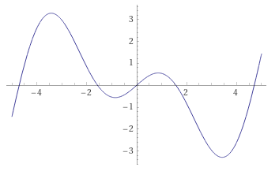
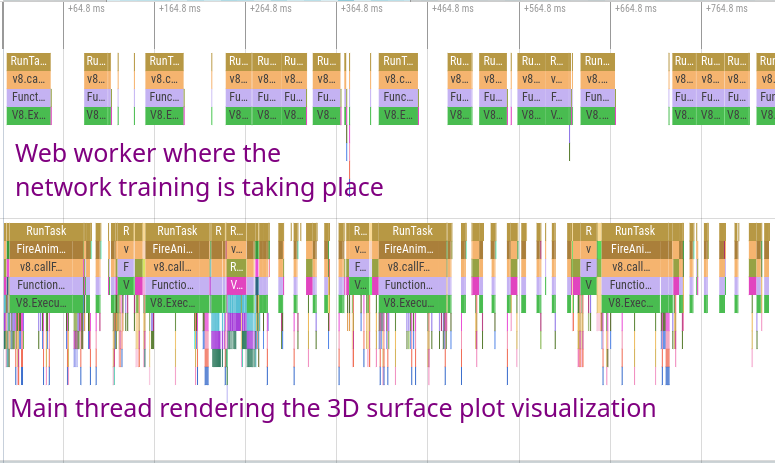

</img>

While teaching myself the basics of neural networks, I was finding it hard to bridge the gap between the foundational theory and a practical "feeling" of how neural networks function at a fundamental level.  I learned how pieces like gradient descent and different activation functions worked, and I played with building and training some networks in a [Google Colab](https://colab.research.google.com/) notebook.

Modern toolkits like Tensorflow handle the full pipeline from data preparation to training to testing and everything else you can think of - all behind extremely high-level, well-documented APIs.  The power of these tools is obvious.  Anyone can load, run, and play with state of the art deep learning architectures in GPU-accelerated Python notebooks instantly in the web browser.  Even implementations of bleeding-edge research papers are readily available on sites like [Hugging Face](https://huggingface.co/EleutherAI/gpt-j-6B).

## The Problem

Despite the richness of the ecosystem and the incredible power of the available tools, I felt like I was missing a core piece of the puzzle in my understanding.

On one side, there are the very abstract concepts built on calculus and matrix multiplication which provide the underlying mechanism for how neural networks function.  On the other end, there are the extremely high-level software suites used to work with neural networks for practical and research purposes.  The idea of partial derivatives being used to compute gradients which optimize the neurons' weights and biases made sense, but I couldn't get a clear picture of it in my head - especially how it scales up to thousands and millions of neurons and dozens of layers.

I come from a software background, and when I was learning how compilers and code generation worked one of my favorite tools was and still is [Compiler Explorer](https://godbolt.org/) aka Godbolt.  It's a web application where you can type in any code you want in a variety of languages, choose a compiler and compilation options, and instantly view the disassembled output for a wide range of different hardware architectures.

I find this tool to be unparalleled for learning about compiler code generation patterns and understanding what kinds of assembly gets output for different kinds of code input.  It's dynamic and responds instantly as soon as you poke it.  It's an environment for experimentation rather than a static knowledge resource.  Crucially, it provides a visual mapping between the two sides of the extremely complex transformation taking place under the hood.

This is what I wanted for neural networks: A constrained, simplified environment for building basic network topologies and experimenting live to see <i>visually</i> how different layer counts, sizes, activation functions, hyperparameters, etc. impact their functionality and performance.

## Neural Network Sandbox

With this goal in mind, I created a browser-based tool for building, training, visualizing, and experimenting with neural networks.  Since it runs on the web, I've embedded it directly in this post:

<collapsible-nn-viz defaultexpanded="true"></collapsible-nn-viz>

What you see above is a fully-fledged neural network implementation running in your browser.  You can add, remove, and configure the layers to change the activation function, neuron count, and initialization parameters.  Hit one of the "train" buttons, and the network will start learning from examples to match one of the variety of selectable target functions.

There are also a few different built-in visualizations to provide insight into the progress of the network as it trains and inspect the internal state of the network - all the way down to individual neurons.

A standalone version of the sandbox is also available: <https://nn.ameo.dev>

The full source code is available on Github: <https://github.com/ameobea/neural-network-from-scratch>

### How it Works

The sandbox trains neural networks to model functions mapping vectors of 2 numbers from [0, 1] to a single output value from [0, 1].  Most neural networks you'll see in practice deal with vectors with thousands or more dimensions like images or [graph embeddings](/blog/graph-embeddings-for-music-discovery/), but there is a good reason I chose to keep it this small.

By limiting the dimensionality of the input and output vectors to 2 and 1 respectively, the entire range of input data can be plotted as a 3D surface and visualized at once.

I refer to this as the "response" of the network, inspired by [frequency response](https://en.wikipedia.org/wiki/Frequency_response) of digital filters which works with a very similar premise.

The 3D area plot shown by default shows a translucent view of the target function that the network is modelling.  As the network is trained, the network is periodically sampled with values throughout the entire valid input range, and the outputs are plotted alongside the target function.  If the network is learning successfully, its response plot will get closer and closer to the target as it sees more and more examples.

If you click the "Layer Outputs Viz" button, a secondary visualization of the network's internals is opened.  It shows the output value of all neurons in the network, and it updates live as the network is trained.  Additionally, clicking/tapping on any of the neurons will open a response plot _for that individual neuron_.  It allows you to see exactly what inputs will cause each neuron to "fire", and how much of an effect it has on neurons in subsequent layers.

Give it a try yourself!  Try using more or less hidden layers, pick a different target function, experiment with different activation functions, and try tweaking the learning rate.

## Learnings + Observations

I've personally spent a ton of time just playing with various topologies and parameters and seeing how the networks respond.  That was my whole reason behind building the sandbox after all!  Here's a collection of the most interesting things I've observed.

### Neuron Responses + Feature Generation

Adding more layers gives networks the ability to do things that just adding more neurons to a single layer cannot.

This is especially apparent on more complex target functions.  For "Fancy Sine Thing", a 2-layer network with sizes of 24 and 12 far outperformed a single layer with 128 neurons.  This makes some sense since the number of parameters in a network increases as the product of the count of neurons in adjacent layers.

Some additional clues as to why adding more layers can be so powerful can be found by looking at the response plots for individual neurons of different layers.  I created a network with 4 hidden layers where the number of neurons in each is half that of the one before it:

<collapsible-nn-viz preset="4-layer-neuron-response"></collapsible-nn-viz>

After training the network for a few million examples, the network mostly settles on "jobs" for all of its neurons and the responses of neurons from different layers become very interesting.  The deeper you get in the network, the more complicated the response plots for the neurons get.

Neurons in the first hidden layer have responses that are limited by the dimensionality of the inputs and the simplicity of the activation function.  This is about as complex as it gets for hidden layer 1:

The second layer gets a bit more interesting.  It pulls from multiple neurons in the first hidden layer which have their gradients oriented many different ways.  For example, this neuron only activates significantly within an "island".

By the third layer, the neuron's response is significantly more complex with concave features and holes.  The transition zones between activated and and not activated are a lot sharper as well, making the output more binary.

In the fourth and final hidden layer, the response plot is more complex still and visually resembles parts of the response of the target function itself.

I find it fascinating to observe how the networks manage to create features for themselves out of extremely simple inputs and progressively refine them into more and more accurate representations of the target function.  I recommend trying out some different network structures and changing up the activation functions and seeing what the neuronal responses look like.

### Network Topology + Hyperparameters

Slowly reducing the learning rate while training can help models reach a lower final error before converging

You can do this for yourself in the sandbox by dragging the "learning rate" slider down while the network is training a large batch of examples.

Another thing that sometimes works is increasing the learning rate for short periods of time to help break out of local minima - but this can just as easily have a negative effect.

Networks with more parameters (both wide and deep) seem to require more examples before converging.

This is partially due to the fact that lower training rates are needed to keep them stable during training, but it feels like more than that as well.  I saw some networks that still hadn't converged (loss was still decreasing) even after being trained with several million examples.

### ReLU Problems + Limitations

Using the sandbox, you can directly visualize the [Dying ReLU Problem](https://arxiv.org/abs/1903.06733).  Since the ReLU activation function has a derivative of 0 when its output is <= 0, the gradient will also be zero for these values which means the neurons can "die" and never output anything other than 0.

You can see this happen yourself using the sandbox.  Train 250k or so examples then click some of the neurons of hidden layer in the layers visualization.  Eventually, you should find one where the entire response plot should be gray - the neuron will only ever output 0 for all possible values in the input range.  This neuron is "dead" and will be stuck like that forever no matter how many examples are trained.

<collapsible-nn-viz preset="dying-relu"></collapsible-nn-viz>

One solution for the dying ReLU problem is to switch it for a different but very similar activation function called [Leaky ReLU](https://paperswithcode.com/method/leaky-relu) which has a very small but non-zero gradient for zero and negative values.  Try swapping the activation functions for the two layers with "leaky relu" from the dropdown, reset the viz, and see what effect it has.

As the paper linked above notes, another method for alleviating the dying ReLU problem is altering the way that network parameters such as weights and biases are initialized.

The values that weights + biases are initialized to is critical for training performance and network stability.

Initializing weights or biases all to a constant value rarely seems to be the best option.  This is especially true for activation functions like ReLU which have gradients that behave badly at exactly zero due to the discontinuity at that point.  Initializing starting weights or biases to values that are too large can cause the training to diverge immediately.

### Complex Activation Functions

A [recent paper](https://arxiv.org/abs/2108.12943v2) from August 2021 introduced the rather exotic Growing Cosine Unit (GCU) activation function.  As its name suggests, it uses the equation `x * cos(x)` to provide nonlinearity.  Here's a plot of its output I made using Wolfram Alpha:

As stated in the paper's abstract, "It is shown that oscillatory activation functions allow neurons to switch classification (sign of output) within the interior of neuronal hyperplane positive and negative half-spaces allowing complex decisions with fewer neurons."

We can test that claim directly with the sandbox:

<collapsible-nn-viz preset="gcu-small"></collapsible-nn-viz>

The network in the above demo only has 2 layers of sizes 16 and 12.  The first layer uses the GCU activation function, and the second uses Leaky ReLU.  Despite its small layer sizes and low layer counts, it is still able to fit the target function pretty well and it only takes ~300k examples for it to mostly converge.

By examining the output of some of the GCU neurons in the first layer, it is clear that the response is much more complex than what you can get with a simple activation function like ReLU.  It can also be seen that the output does indeed switch between negative and positive multiple times, just as the abstract claimed.

By using a more complex activation functions like the GCU early on in networks' layers, a greater amount and variety of internal features can be generated for the later layers to refine down and process further.  There is a price for this, though - the GCU is much more expensive to compute than the ReLU which is pretty much just a single multiplication.  This means that training and inference are slower.  There are some ways to improve this, though, which I'll detail later in this writeup.  Plus, the additional power that complex activation functions like GCU can provide provides means the networks that use them can be smaller, and smaller networks are inherently cheaper to train.

### Other Observations

Using ReLU and ReLU-like activation functions is by far the fastest for training.

This makes sense due to how incredibly trivial they are to compute - it's about as simple as it gets.  I was able to implement SIMD-accelerated versions of their activation functions as well as their derivatives for calculating gradients during backpropagation.

Models have trouble dealing with sharp transitions in multiple dimensions between different domains

Neural networks seems to require more "resources" (layer sizes/counts) to deal with these kinds of features in the functions they model.  They seem to be able to model smoother functions more easily; sharp discontinuity-like areas in the target function are hard for them to represent cleanly.  I'd be willing to be that there's some research paper out there full of extremely dense math notation which proves this or something similar to it.

## Technical Implementation + Performance

The neural network engine and much of the supporting visualizations and other UI features are built in Rust and compiled to WebAssembly.  The full source code for everything is [on Github](https://github.com/Ameobea/neural-network-from-scratch/tree/main/engine/libnn).  The visualizations are made using a combination of [ECharts](https://echarts.apache.org/en/index.html) and hand-rolled canvas-based things.

### WebAssembly + Wasm SIMD

The best way to train neural networks is by using GPUs or other specialized hardware.  Even though it's possible to do this in the browser using WebGL compute shaders or [WebGPU](https://web.dev/gpu/) in the future (this is how [TensorFlow.js](https://github.com/tensorflow/tfjs) does it), you can still get great performance on the CPU - especially for the small networks used by the sandbox.

One of the biggest benefits of having the sandbox running in WebAssembly is it can be accelerated via [Wasm SIMD](https://v8.dev/features/simd).  I've worked with this [in the past](https://cprimozic.net/blog/speeding-up-webcola-with-webassembly/#wasm-simd--other-misc-optimizations) to accelerate various web-based applications and visualizations, and the performance it can provide even on relatively low-end mobile devices can be very impressive.

The core of neural network training is matrix multiplication, which is about as SIMD-friendly as it gets.  Multiple pieces of training + inference are implemented using hand-written Wasm SIMD

### Approximations

In addition to that, I used approximations based on the [`fastapprox`](https://docs.rs/fastapprox) library for several of the more complex activation functions.  Activation functions like Sigmoid, Hyperbolic Tangent, and GCU can be extremely expensive to compute in software, but luckily neural networks are very good at smoothing over the small imprecisions caused by the approximations while sometimes nearly 10x-ing the training rate.

### Multi-Threading

One of the most important things I did to make the sandbox more responsive and faster while training was to run the entire neural network on a separate thread from the UI via a web worker.  I used the excellent [Comlink](https://github.com/GoogleChromeLabs/comlink) library to create easy-to-use bindings that wrap the underlying message passing interface between the UI thread and the neural network web worker.  This allows even the expensive 3D surface visualization to update decently smoothly while the model trains at full speed.

## Limitations

Although the sandbox is very useful for trying out a variety of different neural network topologies, there are some missing pieces and features it lacks:

 * Examples are fed in one by one rather than in batches.  This is just a limitation of my implementation of the neural network's training; training efficiency and performance can often be greatly improved by combining the gradients of batches of examples during backpropagation.
 * Since the target functions are so simple, it's extremely easy for networks to overfit them.  For real applications, the inputs and outputs often have orders of magnitude more dimensions which is where bigger and deeper networks shine.
 * Additionally, since these networks are so simple, there are likely differences between how they work compared to huge networks with billions of parameters.  I'd be interested to expand this neural network to support different kinds of input/output data types and shapes to see how the perform.
 * All layers in the sandbox's networks are densely connected.  Lots of modern networks use sparsely connected layers and other complex layers to help improve performance or enhance the networks' capabilities.

In addition, I would love to someday update the tool to support more features and network types.  In particular, I'd personally be extremely interested to add support for basic RNNs.

## Other Useful Tools + Resources

 * [3D Visualization of a Convolutional Neural Network](https://www.cs.ryerson.ca/~aharley/vis/conv/) - an awesome interactive 3D visualization that I've spent a long time playing with myself.
 * [The Unreasonable Effectiveness of Recurrent Neural Networks](http://karpathy.github.io/2015/05/21/rnn-effectiveness/) - an incredibly inspiring read that also includes lots of really useful graphics and examples to understand how RNNs work.
