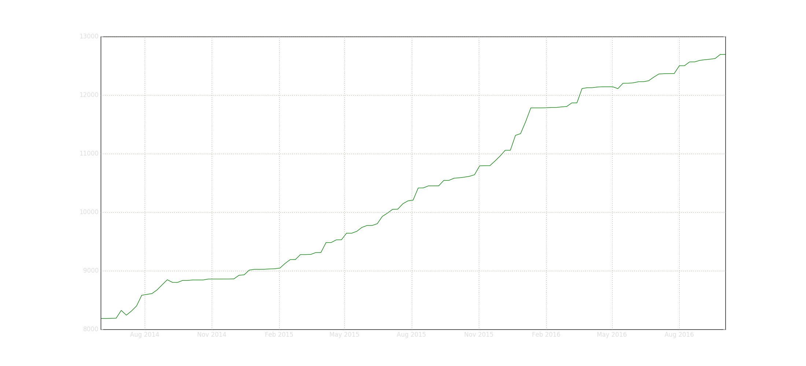
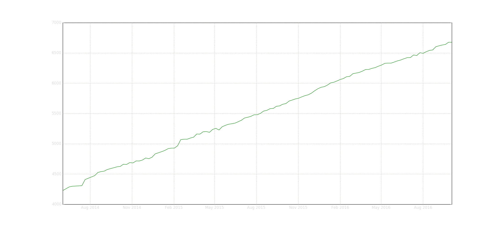
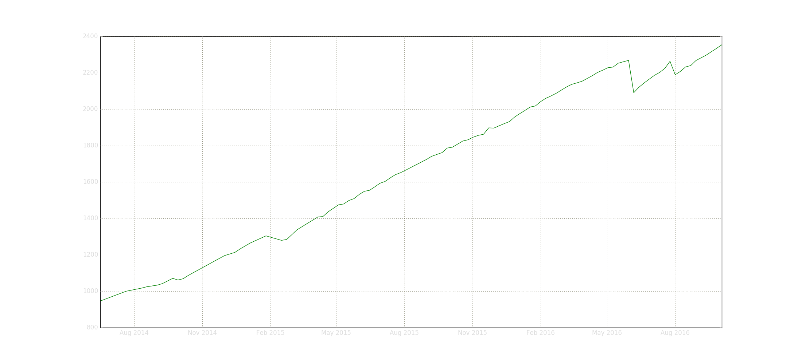
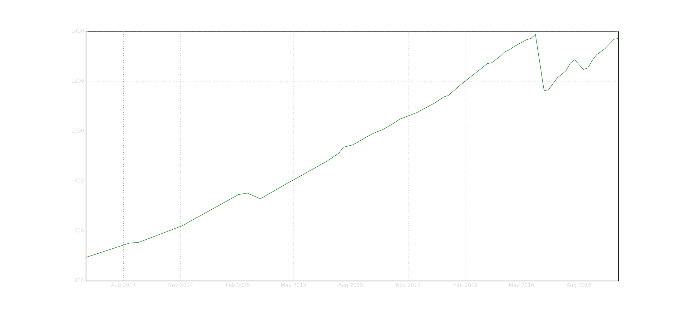
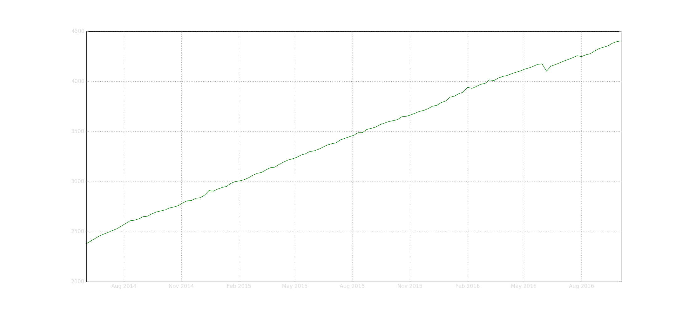
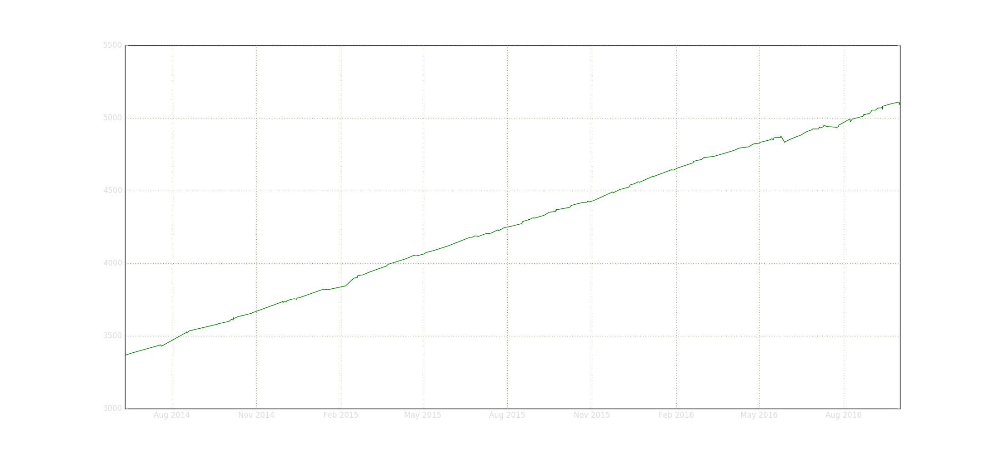

Being the owner of [osu!track](https://ameobea.me/osutrack), I'm in the unique position of having access to a _ton_ of historical player data going back over two years. I decided to dig into this data and pull our some interesting statistics.

_I've uploaded the full osu!track database [here](https://ameo.link/u/31w.gz) for anyone to use! Also, the scripts I used to parse the data and create the graphs in this post can be found [here](https://github.com/Ameobea/osu-statistics)._

---

To start things off, here's how much PP you need to be rank 1 over the past 2 years:

Pretty crazy! The top ranked player from 2 years ago wouldn't even make the top 200 of today.

Then we have the top 1000:

What surprised me about this and most of the other timeframes is how very, very linear it is. I expected it to be more curved with higher and higher PP values taking longer and longer to attain.

I'm not really sure what the reasons for that are; maybe all these pp-heavy maps that are being released lately, maybe something about the pp formula itself. In any case, you have to get, on average, 20.6 PP per week in order to maintain your place in the top 1000. Based on this estimate, in one year, you'll have to have 8000 PP to make it into the top 1000 club. For some perspective, 8000 PP puts you at around rank 250 as of today (Oct. 1 2016). Looks like the competition is going to get pretty crazy!

Some interesting things appear in the charts for the top 50,000

and top 100,000.

My guess is that there was some kind of idle account purge that went on in May-June of this year, but I'm not sure. The same thing shows up in the top 10,000, but to a lesser extent.

Anyway, I hope you found this interesting! I plan on making more of these kind of things using osu!track data in the future, so keep an eye open! Thanks for reading <3

BONUS: [/u/TaigaAisakaSB](https://www.reddit.com/user/TaigaAisakaSB) asked if I could plot where pp=rank, so here it is!

