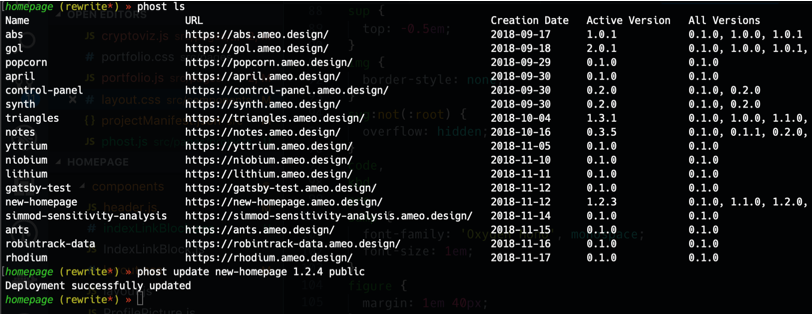

**Phost** is a tool that I created for hosting small projects, static websites, and code sketches quickly and easily as subdomains of a website that I own. It can take a directory of files such as those produced by WebPack, documentation generators, or HTML reports and make them available publicly at a url like https://gol.ameo.design/ instantly.

I've found that having this tool available is very useful, allowing me to do things like share files with other people and demo WIP projects without any the hassle of manually transfering files to the server. An example of a real deployment I've created using it is https://notes.ameo.design/, which is a live demo of my WIP [web-based MIDI editor and synthesizer](/projects/notes/). Creating and updating it is as simple as running `./build_all.sh` (which compiles and bundles the application into the `dist` directory) followed by `phost update notes 0.4.0 dist`.



---

The tool's functionality is pretty simple. It consists of a simple TUI client created in Python using the excellent [`click`](https://click.palletsprojects.com/en/7.x/) command line argument parsing library and a backend created using Django. When deployments are created, the client simply creates a tar archive of the provided directry and uploads it to the server, which unpacks it into a hosting directory managed by Apache2. Internally, it actually uses two individual Apache2 servers and layers of proxies route requests from subdomains to the appropriate directory.

## Client Functionality

The client is designed to be run as a standalone Python command line program. It is packaged as a `setuputils` project and can be installed directly using pip like this:

```txt
pip3 install --user "git+https://github.com/Ameobea/phost.git#egg=phost&subdirectory=client"
```

The client authenticates with the server using a password provided in a config file which is create in `~/.phost/conf.toml`. This file also includes configuration for the API server URL as well as the hosting URL for created deployments. Although it isn't currently implemented, phost was designed with support for multi-user environments and more complicated permissions systems in mind.

The client can be used to create new deployments as well as list + manage existing deployments. It was designed using `click`'s subcommand design; it's auto-generated help info looks like this:

```txt
Usage: phost [OPTIONS] COMMAND [ARGS]...

Options:
  -c, --config FILENAME
  --help                 Show this message and exit.

Commands:
  create
  deployment
  ls
  rm
  update
```

Commonly used functionaly is exposed as top-level commands, while the rest is available in a REST-based style under the `deployment` subcommand. For example, to list all deployments, the command would be `phost deployment ls`, but it's also available under the shorthand `phost ls`.

## Deployment Versioning

One idea I implemented from the start was the idea of versioned deployments. Rather than overwriting existing deployments when new updates are pushed, old versions are kept around and remain accessible via the deployments site. There is an "active" version for each deployment which is accessible from the root of the subdomain, and all other versions are accessible under URLs like https://deployment.ameo.design/v/0.1.0/

## Backend Architecture

The backend is created using [Django](https://www.djangoproject.com/). A MySQL server is used as the database, and authentication is handled automatically. This was my first project using Django, and I was pretty happy with how it's set up. I've used a few other large-scale web frameworks like Rails in the past, and I like Django's way of doing things. Django is integrated into Apache2 using WSGI.

### Docker

The entire backend is deployed using Docker. I created a [Dockerfile](https://github.com/Ameobea/phost/blob/master/server/Dockerfile) which handles the entire process of setting up and configuring Apache2, installing Python + WSGI, and installing its dependencies. One complication of this is that since the backend runs an instance of Apache2 internally and the server it's running on also runs an Apache2 instance for serving all of my other sites, there are two layers of Apache2 running.

A somewhat complicated system of proxies was set up in order to manage the routing. The API server currently runs on the root of same domain as the projects are hosted on, so routing has to be handled specially for its exposed API. The end result is a set of two Apache2 config files, regex-based proxying to the internal Apache2 instance running inside Docker, and a directory of deployment data which is mounted into the Docker container running the phost backend. The routing could be simplified and handled by a single Apache2 server, but the fact that I have several other websites running on the server as well as several proxies and other manual configuration changes made makes that impossible for my environment.

### HTTPS via LetsEncrypt

Since deployments exist on subdomains, a wildcard SSL is required in order to have HTTPS enabled for all deployments. Luckly, [LetsEncrypt](https://letsencrypt.org/) has added support for creating wildcard certificates for a variety of DNS hosts including DigitalOcean, which I use for my DNS.

Using a relatively simple [shell script](https://github.com/Ameobea/phost/blob/master/server/renew-cert.sh) which runs a Docker container internally, LetsEncrypt is able to connect to my DigitalOcean account via an API token and verify that I have ownership over the entire ameo.design domain, generate the certificates, and automatically deploy them live by mounting the live `/etc/letsencrypt/` and `/var/lib/letsencrypt/` directories.
