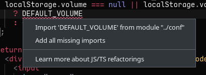

There's a lot more than just writing code that goes into being an effective software developer, and there's naturally a lot of discussion that goes on about what those other things are.  However, **the core of software development is reading, navigating, understanding, and at the end of the day writing code**.

The benefits of being fast and efficient at the actual mechanics of programming can have far-reaching benefits besides just the obvious ones of being able to do more work in less time.  Spending less mental resources on translating thoughts into characters in the text editor helps preserve complex mental state.  Developing better patterns for using your text editor or IDE reduces the amount of effort you have to spend getting to where you want to go in your codebase.  All of these things have the goal of freeing up your time and more importantly your mental bandwidth to focus on the algorithms, interactions, abstractions, and business problems instead.

----

Since my early days of programming in Notepad++ on Windows XP, I've changed the way I code significantly and have adopted many different strategies with the goal of improving my workflow and making myself a more effective programmer.  Here are some of them, in no particular order:

<style type="text/css">
li {
  margin-bottom: 20px;
}
</style>

 * **Getting really good at using “go-to definition” in my editor**

Being able to navigate around large codebases quickly and with little friction is so massively important for keeping context hot and thought streams continuous.  I often find myself control-clicking through 5+ layers of function calls or type definitions in seconds to get to what I'm looking for.

 * **Making extensive use of full-codebase search and learning the best things to grep for in order to navigate code quickly**

Rather than manually navigating through complex directory structures or actually typing file names, I build up a collection of good search terms to use with the full-codebase search built into my editor (VS Code) to jump between different parts of the code quickly.  They work like virtual bookmarks.

 * In the same vein, **Writing descriptive and unique error messages that can be easily searched for**

I find that spending a bit of extra time writing more extensive error logging can save a ton of time during subsequent development or debugging.  Being able to copy-paste an error message directly into the full-codebase search and find the exact line of code that caused it is very valuable.  If you have a logging system with line-level spans, that's great too of course.

 * **Using Auto-import code assists**

I have these for Rust and Typescript and I actually dread to think about programming without them. So much time used to be wasted hunting for which file some function comes from, typing out the full path to it, etc.  The best ones that I use have the ability to automatically locate the source file for some undefined variable, generate the import statement, and insert it automatically.



 * **Having embedded linting and errors in the editor/IDE**

Having to tab over to a terminal and look at the output of your compiler or linter and then tab back to the code and cross-reference is a big context switch in my experience.  Better yet, having "quick-fix" support takes it to the next level saving you from having to even write the code yourself if it's trivial.

* **Being a fast typist**

Pressing the keys on the keyboard is the most fundamental layer programming, so naturally being good at it will benefit everything else.  I'm lucky in that I'm a native English speaker, I learned how to type early in life, and I type a lot as a part of my non-programming activities.  Because of this, I've naturally developed a pretty high WPM.  If you are a peck-typer or struggle a lot with typos and actually hitting the keys you want to hit, it might be worth investing time into training your typing.

 * **Using code auto-formatters**

I used to waste huge amounts of time laboring over exact formatting of my code. Now, I’ll type 200+ character lines for things like function signatures or complex conditionals and let the formatter handle adding newlines, spaces, etc.  Pretty much every language I develop in has a well-featured code formatter, and it's one of the first things I look for when picking up a new one.

 * **Having very fast hot-reload**

This applies to backends with hot reload as well, although I have less experience with that.  Especially when doing fine-tuning stuff with styling etc., having a rapid (~500ms) hot-reload is such a massive difference-maker and it prevents me from getting fatigued of the dev process when things work smoothly.  If you're using webpack, check your [`devtool`](https://webpack.js.org/configuration/devtool/) config for source map generation; this can have a huge (multi-second) impact on hot-reload speed.  Also, using [code splitting](https://webpack.js.org/guides/code-splitting/) to limit the amount of code that has to be re-compiled on save.

 * For backend development, **Making sure compilation times are as low as possible**

This is a really broad one and there's only so much you can do, but eventually you need to run the code you write.  The strategies for this vary by language, but there's a great collection of [tips for Rust](https://nnethercote.github.io/perf-book/compile-times.html) that I've found very useful.  I've swapped out the linker I use with Rust for `lld` which shaves multiple seconds off of builds.  Intelligently splitting code into modules can also have a big impact by allowing unchanged code to remain cached for incremental builds.

 * **Using language-specific tools like language servers or editor plugins when available**

Specialized plugins like [`rust-analyzer`](https://github.com/rust-analyzer/rust-analyzer) have tons of amazing functionality designed with the express goal of accelerating development.  `rust-analyzer` and other language server clients provide deep integration with individual languages that can't be matched.  There is good support for most other popular languages as well.

And most recently,

 * **Adopting AI-powered code autocomplete**

I started with [Tabnine](https://www.tabnine.com/) and now I’m quickly becoming a [Github Copilot](https://copilot.github.com/) addict.

With regards to Github Copilot, the jaw-dropping demos you may have seen aren’t the best part in my opinion.  I’ve adopted some really neat time-saving patterns that rely on simple, relatively trivial completions.  One that I find really cool is for if I can’t think of a CSS attribute or some standard library function’s name, I type a comment like:

```css
  /* 1px box shadow */
```

or

```rs
  // Cross product of a and b
```

And almost every time Copilot will generate me valid CSS on the next line that I can then tweak/modify as I need to and delete the comment.  This often saves me a Google search or trip to Stack Overflow.

----

These are a bit less related to writing code itself, but still help me a lot with the process of programming:

 * **Being able to spin your development environment up quickly when starting work**

When getting started on work for either my job or a personal project, I almost always have a neat set of scripts or simple commands memorized that I can use to quickly spin up dev servers, docker containers, and other services.  I like using a command runner like [`just`](https://github.com/casey/just), but a simple shell script does the job almost as well.

 * **Building dev-specific routes, methods, and endpoints to avoid tedious or repetitive tasks during development**

When working on web frontends with complex or stateful flows, I'll often create a special route or page only available during development that pre-populates application state and avoids the need to manually click through multi-step forms or things like that.  If you make a lot of use of hot-reload like I do, then this can save a large amount of time pretty quickly.  Another useful trick that I often use for frontend webdev is adding global functions like `getState()` to return the global Redux store or similar things easily from the devtools console.

 * **Having a well-equipped terminal/shell with modern features**

   * I use [`ohmyzsh`](https://ohmyz.sh/) which has lots of time-saving plugins available, but most of these things are available in any modern shell.
   * [`autojump`](https://github.com/wting/autojump) is a utility that allows for fast navigation to directories using partial or fuzzy names.  It saves a ton of time that would normally be spent `cd`/`ls`'ing around trying to get where I want to go.
   * [`zsh-autosuggestions`](https://github.com/zsh-users/zsh-autosuggestions) to have history-based autocomplete for everything I type in:  [](https://asciinema.org/a/R5WYynfb6o5A4bh6X373di5ff)
   * A terminal emulator that supports things like search, scrollback, multiple tabs without `screen` or `tmux`, and other features like that.  For things like analyzing dense streaming log output or editing remote files, these features can make it possible to do things directly in the terminal that would otherwise have to be handled by other applications or via arcane shell scripting I can never remember.

 * **Making good and correct use of types in languages that support it**

This one is quite subjective and specific to my own styles and preferences as a developer, but I find that having types I can rely on gives me a massive boost to my overall efficiency.  One place they're especially useful is across API boundaries.  If the type annotations on API methods are incorrect or missing, it can take a lot of time to cross-reference with backend code or actually check to see what was returned from the API.

Any overhead that may be caused by having to write out type annotations or appease the type-checker is paid back many times over.  I write less buggy code, I spend less time debugging, and most importantly it's possible to _change code confidently_.  In weakly typed languages like TypeScript or Python, I try to make sure that all types are accurate and respected lest they cause more harm than help.

----

This is by no means a complete list, and it's very possible some of them may not apply to you or that you may disagree with some of them.  That's fine!  Everyone is different, and you probably have things that make you a faster programmer that I don't use.
