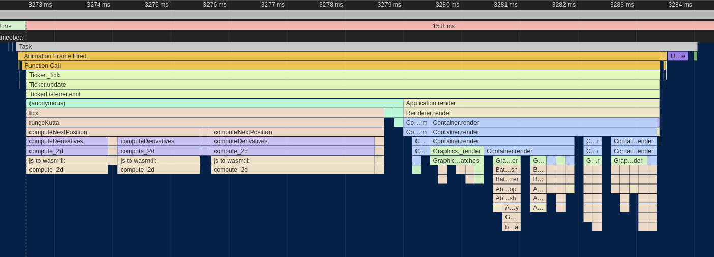
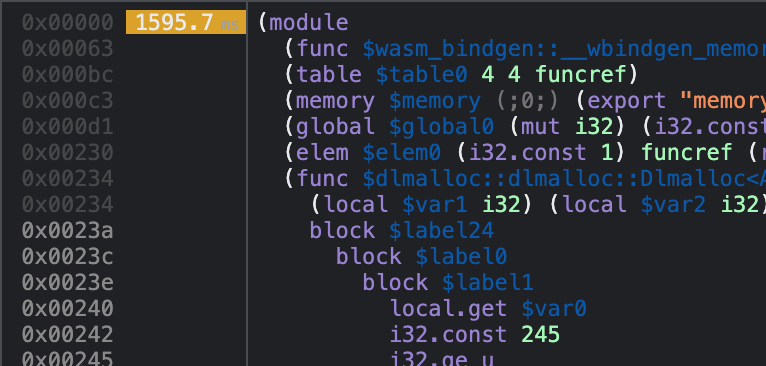

For a recent project I've been working on, I wanted to include a graph showing the relationships between different artists on Spotify.  Spotify provides the data directly from their API, and I had everything set up to pull it for a user's top artists and into the browser.

This is the story of how I took the initial unoptimized graph visualization - which ran at <10 FPS on my powerful desktop - and optimized it to run at well over 60 FPS, even on weaker mobile devices.  I was inspired by [this HTTP server performance tuning writeup](https://talawah.io/blog/extreme-http-performance-tuning-one-point-two-million/) and kept track of the changes I made and their impact in a similar way.

----

Since it is a web-based visualization and we are currently on the web, you can check it out right here for yourself, pre-populated with my personal top artists from Spotify!  Click and drag (or tap and drag if you're on mobile) to move around or pull on the nodes, mouse wheel (pinch on mobile) to zoom, and double-click/tap nodes to load additional additional artists that are connected but not in my top artists collection.

<iframe title="Related Artists Graph Visualization Demo" src="https://spotifytrack.net/graph.html" loading="lazy" style="width: 100%; outline: none; border: none; margin-right: 0px; margin-left: 0px; height: 67vh; margin-top: 5px; margin-bottom: 0px;" />

.

If you're using an embedded browser, it might not load.  You can view the full graph on [Spotifytrack](https://spotifytrack.net) and connect your Spotify account to see it personalized for your own top artists.

## Force Directed Graphs

If you're not familiar with them, [force-directed graphs](https://en.wikipedia.org/wiki/Force-directed_graph_drawing) are a visualization for graph data that lays out nodes in an easy-to-see way, avoiding edge crosses as much as possible and trying to keep all edges to approximately the same length.

After a bit of research, I chose the [Webcola](https://ialab.it.monash.edu/webcola/) constraint-based graph layout library.  Webcola is itself a port/adaptation of the C++ [libcola](http://www.adaptagrams.org/) library and it supports easy integration with D3 which I've worked with in the past.  It really was very simple to get a working force-directed graph rendered by adapting some code from their examples, and it actually looked pretty good!  The relationships between artists were apparent and I found myself spending a good amount of time just scrolling around it and exploring my own world of musical connections.

## Initial Analysis

There was one problem though: it was incredibly slow; slow to the tune of 8 FPS.  Obviously, that's not acceptable and it made using the graph very difficult.  To be fair, I had almost 400 nodes in my personal graph and ~1500 edges which was a lot more than any of the Webcola examples, but it felt like performance was an order of magnitude or two too low.

What followed was an extensive journey of optimizing my application and all of the underlying layers to boost that 8 FPS to a consistent 60, even on less powerful devices.

The first step of all of my browser-based performance optimization starts with Google Chrome's excellent built-in profiler.  Here's what one frame of the animation looked like at the start before any changes were made:


The whole frame took ~125ms, miles away from the 16.5ms required for 60 FPS.  Ideally, we'll also want it to be even quicker than that since other code needs to run on the webpage as well.

Breaking down where most of the time was being spent, The `Descent.rungeKutta` function comes from the Webcola library and is used to compute new positions for all of the nodes based on the connections between them.  `D3StyleLayoutAdapter.trigger` is the rendering portion where the SVG nodes created by D3 are updated to match the newly computed positions of the nodes.  The `Run Microtasks` section at the end contains some extra D3 bookkeeping code, and finally the small (well, small compared to everything else right now) purple and green bars at the end were for browser-level layout and rendering.

## Eliminating Forced Layout

The first thing I noticed about the perf graph above was the purple boxes with red tags that dominated more than half of the entire frame.  Zooming in a bit more, it became apparent that these were caused by **Forced Reflow**, which means that the browser was being forced to re-compute the geometric layout of all of the SVG nodes in the visualization every time I updated the positions of any of them.


It looked to be caused by the [`getBBox()`](https://developer.mozilla.org/en-US/docs/Web/API/SVGGraphicsElement/getBBox) function which is used to compute the actual size of SVG elements.

Looking at my code, some of the example code I copied over for positioning the labels of the nodes looked like this:

```ts
label
  .attr("x", function (d) { return d.x; })
  .attr("y", function (d) {
    var h = this.getBBox().height;
    return d.y + h/4;
  });
```

After a bit of quick Googling, I found that the `getBBox` function indeed causes forced reflow in SVGs.  Since in my graph all nodes had a uniform height, I was able to replace that code with just this:

```ts
label
  .attr("x", function (d) { return d.x; })
  .attr("y", function (d) { return d.y + 20/4; });
```

That change alone was the biggest contribution to the performance improvements of the graph since the forced layout cost was linear to the number of nodes in the graph but the layout itself required computing positions for all nodes and edges.  Since it was more of a bugfix than an optimization, I don't really count it as part of the main optimization changes I made here, but it was a vital change nonetheless.

Here's what the perf graph looked like after removing the `getBBox()` calls:


Much better - already down to ~50ms for a frame.  Still a long way to go, though!

## Custom Canvas-Based Renderer

As a result of removing the horrible `getBBox` code, Webcola has moved up to taking around a third of the processing time of the frame with the D3 rendering and associated overhead taking up the rest.  One thing to notice is that the majority of `D3StyleLayoutAdapter.trigger` is now dominated by calls to [`setAttribute`](https://developer.mozilla.org/en-US/docs/Web/API/Element/setAttribute), which is a browser built-in that is used by D3 under the hood to set the actual attribute on the `<line>` and `<rect>` nodes used to render the graph into the SVG.

Unfortunately, this is a bit of a dead-end for D3; as far as I know, in order to animate the visualization according to the positions computed by Webcola, you need to actually change those attributes - there's no way getting around it.  I managed to improve the performance a bit by using some specialized SVG position setting APIs, but the mere act of setting the coordinates on the SVG elements was still taking up ~15ms, nearly the entire budget for the frame.  Besides that, the "Recalculate Styles", "Layout", and "Paint" boxes at the end had become much more prominent as well and were also seemingly unavoidable overhead of the SVG-based renderer.

After trying a couple of other ideas in vain, I decided to bite the bullet and implement a fully custom renderer for the graph that used Canvas rather than SVG.  Although SVG is a terrific choice for many kinds of visualizations due to its rich API and direct integration into the DOM, there were some things that it doesn't perform very well with.

I'd used the [PixiJS](https://www.pixijs.com/) library on [a](https://notes.ameo.design/fm.html) [few](https://github.com/ameobea/web-synth) [projects](https://cprimozic.net/projects/spf420_x_syncup) in the past and found it to be an extremely productive tool for building rich visualizations and interactive applications in the browser.  It's based on WebGL, but it provides a high-level API on top with lots of useful tools for building applications quickly without compromising performance.

Building out the initial renderer was actually pretty straightforward; the graph visualization only really consists of boxes, lines, and labels.  The biggest advantage over the D3/SVG-based renderer is that the nodes don't need to be managed individually and treated as fully-fledged DOM elements.  Instead, the whole visualization can be passed off to the GPU in one go which performs all of the rendering directly, giving us the equivalent of an image that can then be rendered into the canvas on the page.

The biggest drawback is that we have to do all of the interactive bits (hit-testing, clicking, dragging, hover, etc.) manually instead of relying on handy HTML event listeners and CSS to do it for us.  Thankfully, PIXI includes a ton of utilities to do most of this for us.

The final step was to plug the renderer into Webcola.  Webcola was designed to be pluggable into various different rendering engines, so after looking at how the D3 shim was implemented getting it to work with the canvas-based renderer went pretty smoothly.

After all of that effort, the reward was another massive bump in performance:


The difference is almost as shocking as the first one!  The renderer went from taking up two thirds of the frame to taking up around 20%, and the total frame time was down to ~32ms.  That's a very usable FPS, at least on my desktop.  However, on smartphones or even lower-end laptops or netbooks, that number is going to be a lot worse.

## Optimizing Webcola

At this point, it became clear that the Webcola library was the next thing to look at since it was taking up the vast majority of the rendering time.  The Chrome profiler also supports line-level profiling, so I zoomed into the `Descent.computeDerivatives` function to see which lines were taking the most CPU time:


Well, there are some positives and some negatives.  On the plus side, almost all of the CPU time is spent in a handful of lines.  On the minus side, the hottest lines are all doing very simple operations like reading from/writing to arrays and doing basic math operations.

After spending a lot of time looking at and working with this code, I've discovered that the core of the algorithm consists of computing the distance between each node and all other nodes.  Using this distance measurement and some other magic data determined by Webcola, new positions for each node are computed to better satisfy the layout of the graph as a whole.  This is a n^2 time complexity loop which the nested `for` loops in the code snippet above hint at.

### Switching to Typed Arrays

The issue with the hottest lines all being array stores and loads is that there's really not a ton that can be done to optimize that.  My initial thought was to change all of the arrays, which were vanilla JavaScript arrays, into typed arrays like `Float32Array`.  The APIs between vanilla arrays and typed arrays are actually almost exactly the same and Webcola is written in Typescript, so swapping them out for typed arrays mostly just required changing the constructors and type definitions.

Surprisingly, after doing that, performance actually regressed!  This was the opposite of what I expected because typed arrays are specifically designed for high-performance code.  I did a bit of research, and a couple of potential explanations came up:

 1) The JavaScript engine was doing some optimizations on arrays that it wasn't able to do with the typed arrays.  One thing I only noticed later is that several of the arrays used in the loop were very small (2-3 elements) which might explain some of the issue.
 2) The code was doing out-of-bounds reads somewhere in a way that didn't impact the correctness of the algorithm.  Some posts seemed to indicate that doing out-of-bounds reads on typed arrays caused code to be de-optimized worse than when doing them on normal arrays.
 3) Several of the arrays used in the algorithm were multi-dimensional, so switching them to typed arrays only actually changed the inner dimension.  It's possible that if the arrays were flattened to hold all their elements in a single buffer, the performance might be much better.

In any case, I abandoned this approach entirely and left the arrays as they were.

## Porting Webcola to Rust + WebAssembly

Having run into a wall with optimizing the JavaScript itself for the WebCola engine, I turned to a more radical approach: Re-writing the hot loop in Rust / WebAssembly.

Before going into details about the Wasm port itself, I want to provide a little bit of justification for this decision.  There are a [variety](https://surma.dev/things/js-to-asc/) [of](https://www.usenix.org/system/files/atc19-jangda.pdf) [writeups](https://mrale.ph/blog/2018/02/03/maybe-you-dont-need-rust-to-speed-up-your-js.html) that have pretty much the same message that about boils down to "writing things in Wasm doesn't automatically mean that they're going to be fast or faster than JavaScript."  This is a valid point for a lot of things; modern JS engines like V8 are almost miraculous in their performance and ability to optimize JavaScript execution.

However, there are also many situations where WebAssembly is a much more appealing option than JavaScript due to the much higher degree of control it provides over things like memory layout, data types, and code layout behavior like inlining, monomorphization, etc.  A tight, hot loop doing number crunching without touching the DOM or interoperating with JS data structures is a quite an ideal target for implementation in Wasm.

### Initial Port

My intention with the initial port was to re-write the `computeDerivatives` function in Rust and then make whatever other changes were necessary to glue it to the existing JavaScript code, leaving the bulk of the WebCola codebase as it is and limiting the surface area of the change.  That would make it easier to implement and test the port since less code changes would be necessary.  It also helps to keep changes to WebCola's APIs, both internal and external, as limited as possible.

Since the `computeDerivatives` function itself only really does some basic math and array shuffling, porting it to Rust was pretty trivial.  The complicated part, however, was managing access to the various input and output buffers that are used by it.  In the original WebCola library, those buffers live in arrays that are contained in the parent class of the `computeDerivatives` method.

In order for them to be accessed from WebAssembly, they either need to be copied into the WebAssembly heap as arguments or changed to live inside the Wasm heap by default.  The advantage of the first option is that code changes to the JS code are limited which makes the port easier to manage.  However, the tradeoff is that the buffers need to be copied into the JS heap every time the function is called.

Moving the buffers into JS means they can be accessed very easily from the ported Rust code without needing to copy them around between JS and Wasm, at least not in order to run `computeDerivatives`.  The tradeoff for that is that setting/getting them from JS requires doing that copying and creating dedicated shim functions to facilitate that.

I ended up doing a combination of both methods.  I moved all of the data buffers accessed by `computeDerivatives` into Wasm memory, pre-allocating buffers for them.  I left one of the buffers in JS, the `x` vector which was passed as an argument to `computeDerivatives`.  As it turned out, since the `computeDerivatives` function is only called a few times per frame, the cost of copying these buffers is negligible compared to the cost of running the `computeDerivatives` function itself, not even showing up on the profiler.

Since some other WebCola internals access the buffers that were moved into Wasm, I created some shimmed getter and setter methods that pulled from the Wasm module's memory under the hood:

```ts
public get g(): Float32Array[] {
   const memory: WebAssembly.Memory = this.wasm.get_memory();
   const memoryView = new Float32Array(memory.buffer);

   const gPtr = this.k === 2 ? this.wasm.get_g_2d(this.ctxPtr) : this.wasm.get_g_3d(this.ctxPtr);
   const gOffset = gPtr / BYTES_PER_F32;
   return new Array(this.k)
       .fill(null)
       .map((_, i) => memoryView.subarray(gOffset + i * this.n, gOffset + i * this.n + this.n));
}
```

### Specialization for 2D and 3D Usage via Const Generics

The WebCola library supports both 2D and 3D layout, using the `i` variable to indicate the number of dimensions.  Since this variable is static for a given graph and is known ahead of time, there is an opportunity to provide that information to the compiler at build-time in order to allow it to generate more efficient code that is specialized for either 2D or 3D usage.

Rust has recently added support for [const generics](https://rust-lang.github.io/rfcs/2000-const-generics.html) in stable which suits this use-case perfectly.  Instead of storing `i` as a field and referring to it dynamically at runtime, it's encoded at the type level as a const generic.  Shim functions are then exported for both 2D and 3D versions which both call the same generic function but with a different value for the dimension parameter:

```rs
#[wasm_bindgen]
pub fn compute_2d(ctx_ptr: *mut Context<2>, mut x: Vec<f32>) -> Vec<f32> {
    let ctx: &mut Context<2> = unsafe { &mut *ctx_ptr };
    ctx.compute(&mut x);
    x
}

#[wasm_bindgen]
pub fn compute_3d(ctx_ptr: *mut Context<3>, mut x: Vec<f32>) -> Vec<f32> {
    let ctx: &mut Context<3> = unsafe { &mut *ctx_ptr };
    ctx.compute(&mut x);
    x
}
```

This provides a variety of optimization opportunities that wouldn't otherwise be available:

* The sizes of various buffers can be known statically which allows them to be created on the stack for free rather than having to be dynamically allocated.  This also facilitates automatic bounds check elision which means efficient code can be written without having to use `unsafe` memory accesses.
* Various loops that run `i` times can be unrolled entirely, avoiding the loop control flow entirely
* Various array accesses of data buffers can be made more efficient since their indexes involve multiplying things by `i` in some way or another

### Performance Summary

After performing the initial port and wiring it up to the existing JS code, this is what the profiler looked like:


It's clear that the WebAssembly port was very worth it!  The `rungeKutta` function which spends the vast majority of its time calling `computeDerivatives` went from taking ~18ms to just 9ms - a 2x speedup!  If I had to guess, I'd say that much of this improved performance comes from more efficient accesses to the data buffers and the benefits of making the dimension static at compile time listed above.

Despite all of that, the actual code was a more or less 1-to-1 port; all of the performance improvements came from opportunities made possible by Rust/WebAssembly.  Although it would technically be possible to manually create separate 2D and 3D versions of the JS code, Rust allows it to be codified and made fully automatic.

## Improvements to the Wasm Port

After having ported `computeDerivatives` to Wasm, I had started to become more familiar with how it worked and what it was actually doing.  At its core, it's computing the distance between each node in the graph and all other nodes, doing some math and other logic, and then writing results to output buffers.

### Pre-Computing Distances

One change to the code which sped things up a bit was to move the distance computations themselves out before the main loop.  The original code would compute the distance for each node-node pair in the graph and then immediately use that to perform some additional computations and write to output buffers.  By doing all the distance calculations up front, both code code paths become simpler and easier for the compiler to optimize.

The cost is that the distances must be written into intermediate buffers and then read out again which puts pressure on the caches.  Despite that, I found that it resulted in a slight performance uptick overall:


Another change that I worked in around this time was converting some of the multi-dimensional arrays from `Vec<Vec<f32>>` and similar to `Vec<f32>`, storing elements contiguously and accessing them like `buf[u * n + v]` rather than `buf[u][v]`.

Theoretically, doing this should improve the locality of data and reduce indirection by avoiding the need to do multiple steps of pointer arithmetic using dynamic pointers.  Flattening the arrays allows the index to be calculated statically and then added to the base of the array.

In practice, I didn't really notice much of an improvement in performance after doing this.  It could be because the data access patterns for the arrays are bad enough that the cost of loading the data from memory itself outweighed the inefficient data structures or perhaps the fact that the allocator used by the application placed the sub-arrays close together in memory anyway.

### Delay Displacement Checking

There was some code included in the distance computation path that about boiled down to this:

```py
for node_a in nodes:
    for node_b in nodes:
        distance = compute_distance(node_a, node_b)
        while distance < 0.000000001:
            node_a.position += random_offset()
            node_b.position += random_offset()

            distance = compute_distance(node_a, node_b)
```

This is necessary to prevent dividing by zero from happening later on in the computation path if two nodes are at exactly or almost exactly the same point.  However, that realistically is only going to happen during the first few iterations of the computation; all nodes are initialized to the same point, but then the algorithm is designed to arrange them so that they're roughly equidistant from each other.  Additionally, if one node needs to be offset, it's likely that all other nodes need to be offset as well.

In order to simplify the distance computation loop and remove as many branches from it as possible, I changed the code to something like this:

```py
while True:
    needs_displace = false;
    for node_a in nodes:
        for node_b in nodes:
            distance = compute_distance(node_a, node_b)

            needs_displace = needs_displace || distance < 0.000000001

    if not needs_displace:
        break

    for node_a in nodes:
        for node_b in nodes:
            distance = compute_distance(node_a, node_b)

            if distance < 0.000000001:
                node_a.position += random_offset()
                node_b.position += random_offset()
```

Although this looks like a lot more code, it's important to note that most of it is only going to run the first few calls (or first call) to `computeDerivatives` when all the nodes are on top of each other.  The important change is that the conditional check is removed from each iteration of the main distance computation loop and all of the code responsible for applying the displacements is pulled out as well.

Although it's true that modern CPU branch predictors are [extremely effective](https://blog.cloudflare.com/branch-predictor/) and adding branches can often be free up to a certain point, there is still the benefit of the code being simplified and a level of nesting from the hot loop being removed.

All in all, making this change yielded another modest performance bump:


### Wasm SIMD + Other Misc. Optimizations

Among the final optimizations that I made to the Wasm was the addition of SIMD to accelerate the computation.  There were two places that I was able to apply it: the distance computation loop and some matrix multiplications used by a `computeStepSize` function that I also ported to Wasm.

In both cases, the SIMD implementation was pretty straightforward, just doing 4 operations at once instead of 1.  The one place that was a bit interesting was the handling for the `needs_displace` flag that was maintained during each distance computation.  Since 4 distances were computed at once, the `needs_displace` variable was replaced with a SIMD vector holding 4 flags which were then extracted one by one and OR'd with each other after all distances were computed:

```rs
let mut needs_to_apply_displacements = unsafe { f32x4_splat(0.) };

for i in 0..DIMS {
    for u in 0..n {
        let summed_distances_squared_v = ...;
        let sqrted = f32x4_sqrt(summed_distances_squared_v);

        // check here if we need to apply displacements
        let any_under_displacement_threshold =
            f32x4_lt(sqrted_distance, displacement_threshold);
        needs_to_apply_displacements = f32x4_max(
            needs_to_apply_displacements,
            any_under_displacement_threshold,
        );
    }
}

let needs_displace = unsafe {
    f32x4_extract_lane::<0>(needs_to_apply_displacements) != 0.
      || f32x4_extract_lane::<1>(needs_to_apply_displacements) != 0.
      || f32x4_extract_lane::<2>(needs_to_apply_displacements) != 0.
      || f32x4_extract_lane::<3>(needs_to_apply_displacements) != 0.
};
```

The `computeStepSize` function was actually the larger contributor to overall performance gain.  I hadn't mentioned it in the past because up until this point, it was a very small overall contributor to runtime.  However, since `computeDerivatives` had been optimized a good bit, it had become much more prominent.  That whole function is pretty much just matrix multiplication which not surprisingly is greatly accelerated by SIMD.

As I always do when adding SIMD to wasm, I added a `simd` feature to the Rust project and created SIMD and non-SIMD functions that are conditionally compiled depending on whether it's enabled or not.  Running the SIMD version yielded the following results:



Although it may not have seemed like it from step to step, there's been a respectable performance bump between the initial Wasm port and this version after applying the various optimizations.  All of the small changes added up to give a significant overall result.

I was pretty surprised to see that the SIMD-ification of the distance computation had such a tiny impact.  In the past, just adding SIMD bumped performance to 50%+ in compute-heavy code sections.  During the process of trying to figure out why this was, I set the `#[inline(never)]` attribute on the `compute_distances()` function where the SIMD happens and was very surprised to see this:


This `compute_distances` function, which I had assumed was taking the majority of the runtime, is entirely contained within the small bottom-most segment of the profile and was only taking up a small percentage of the `computeDerivatives` function runtime.  That explains why adding SIMD to the distance computation didn't have a huge impact on overall performance; it just doesn't run long enough for improvements there to matter much overall.

## Sprite Caching

Now that the Wasm was optimized as far as I could get it (so far), I switched back to looking at the renderer since it had once again emerged as taking >50% of the CPU time.  I did some reading online one PixiJS forums and other places to see what kinds of things people did to speed up their applications.

All the nodes in the graph were constructed from PIXI `Graphics` objects which supports rendering shapes, lines, and other graphics primitives and composing them to create more complex images.  Internally, `Graphics` build up a list of WebGL draw calls and submit them for rendering on the GPU every frame.  This is great for dynamic elements or animations where the draw calls need to change every frame.

I used `Graphics` for the backgrounds of each node in the graph, meaning that each node was created dynamically every frame.  However, the actual shape of the nodes never changed at all other than color when they are de/selected.

PixiJS has a feature where `Graphics` and other objects can be rendered to a `Texture`, bypassing the need to re-generate them each frame.  The `Texture` can then be used to build a `Sprite` which can be added to the scene and manipulated in the same way as `Graphics`.

When populating the graph with nodes, I converted the `Graphics` to `Sprites` immediately.  The only other change that was required was changing the node background color from being set in the draw calls themselves to being set via `tint`, which can be changed every frame and applied for free without having to re-generate the texture.

This resulted in a very significant (at this point) performance win, allowing the renderer itself to finish in just over 2 milliseconds on average.


## Going Deeper: Assembly-Level Analysis

At this point, I had hit a wall.  Chrome's profiler showed that `compute_2d` was taking up all the Wasm runtime, and the vast majority of that was happening outside of the `compute_distances` function.  The whole rest of that function is just a loop over all node pairs, loading the pre-computed values from memory, doing some math, and storing the results back to memory.  I tried pulling various pieces of that loop out into other functions and marking them with `#[inline(never)]`, but the profiler yielded more or less random results.  The functions were simply too small to show up well with whatever the profiler's sample interval is, and I found no way to increase that sample rate.

What I *really* needed was line-level profiling like Chrome provides for JS.  Unfortunately, that doesn't work for Wasm; it shows all of the runtime for the Wasm module on the first line.



Luckily, there was one final option for figuring out where all the CPU time was going: the CPU itself.

V8, Google Chrome/Chromium's JavaScript engine, [has support](https://v8.dev/docs/linux-perf) for integrating with Linux's `perf` profiling tool, allowing the JIT-compiled code it produces to be analyzed and instrumented at the CPU-instruction level.  After V8 parses, compiles, and optimizes WebAssembly or JavaScript source code, it uses [Turbofan](https://v8.dev/docs/turbofan) to generate actual machine code for the target system.  That code is then loaded into executable memory and executed just like a native executable would be.

V8's `perf` integration allows for this JIT-compiled code to be labeled with function names and other information which makes it possible to match the generated assembly instructions to the JS or Wasm it was compiled from.  Getting it to work was surprisingly simple, just launch Chrome with some special flags, record the PID of the renderer process for the tab you want to profile which is listed in Chrome's built-in Task Manager and then run a `perf` command in the terminal while running the code you want to measure.

After injecting the profile file with some additional data generated by Chrome and loading it up with `perf report`, it's possible to search for the actual name of the Wasm or JS function that ran:


The place where things get REALLY exciting is when you drill down into the function itself and get to look at the CPU instructions that make it up:

<iframe loading="lazy" title="Perf Instruction Level View" src="https://ameo.link/u/91p.html" style="width: calc(100% - 40px); outline: none; border: none; margin-right: 20px; margin-left: 20px; height: 80vh; margin-top: 5px; margin-bottom: 0px;" />

.

This view shows all CPU instructions in the selected function along with the percentage of runtime that was spent executing (approximately) each one of them.  By default, it starts off pointing to the "hottest" instruction in the function, the one that the instruction pointer was pointing to for the largest number of samples.

This is an incredibly useful tool; there is no "lower level" than this, at least not that can be reached with software.  We see, instruction for instruction, where the CPU is spending most of its time and what native code was generated from the WebAssembly module.  It's a beautiful reminder that no matter how many layers of abstraction, codegen, compilation, optimization, and sandboxing there are, it all ends with a CPU executing instructions.

Using this information, it's possible to start digging into what parts of the code are the most expensive and optimizing them at an extremely granular level.

### Avoiding Expensive `f32::is_finite()` Call

I began at the most obvious starting point: the hottest instruction: `and $0x7fffffff,%r9d`.  According to perf, over 16% of the total execution time of the entire `compute_2d` function was spent on this single instruction!

It is a binary AND with a constant that takes place in the middle of a bunch of comparisons and other logic involving floating-point numbers as indicated by the use of `xmm` registers.  Additionally, it requires the 32-bit float to be moved out of the `xmm` register and into a general purpose register and then loaded back which adds additional overhead.

I'm not sure why exactly this instruction took so long to run compared to the others; it could be a cost of moving data between `xmm` and general purpose registers, or perhaps the binary operation screwed up pipelining in some way.  In any case, it seemed clear to me that improving this situation would likely speed things up significantly.

I wasn't sure what was going on, so I googled the hex constant.  The [first Stack Overflow result](https://stackoverflow.com/questions/46625819/what-does-0x7fffffff-mean-in-inttime-time1000-0-0x7fffffff) made it clear that this has the effect of clearing out the sign bit of a 32-bit floating point number, taking the absolute value of it.

Looking through the disassembled WebAssembly code produced using the `wasm2wat` tool from the [WebAssembly Binary Toolkit](https://github.com/WebAssembly/wabt), I found the place that generated these instructions:

```wat
local.get 25
i32.reinterpret_f32
i32.const 2147483647 (; This is our magical `0x7fff_ffff` constant ;)
i32.and
f32.reinterpret_i32
f32.const inf (;=inf;)
f32.lt
i32.const 1
i32.xor
br_if 0 (;@5;)
```

The Rust code that generated these instructions maps back to this line:

```rs
if weight > 1. && distance > ideal_distance || !ideal_distance.is_finite() {
```

More specifically, the `f32::is_finite` function which has this source code:

```rs
self.abs_private() < Self::INFINITY
```

And `f32::abs_private()` is this:

```rs
f32::from_bits(self.to_bits() & 0x7fff_ffff)
```

The code makes sense; it sets the sign bit to 0 so that `-Infinity` is converted to `Infinity`, and then checks that the value is less than it and inverts the result with `xor 1`.

However, in this particular situation, we know that `-Infinity` will never be produced for `ideal_distance` so we can avoid doing this check altogether!

Changing the Rust code to this:

```rs
if weight > 1. && distance > ideal_distance || ideal_distance == std::f32::INFINITY {
```

Produced the following WebAssembly:

```wat
...
f32.load
local.tee 25
f32.const inf (;=inf;)
f32.ne
```

And this the assembly that `perf` showed:

<iframe loading="lazy" title="Perf Instruction Level View After Optimization" src="https://ameo.link/u/91q.html" style="width: calc(100% - 40px); outline: none; border: none; margin-right: 20px; margin-left: 20px; height: 80vh; margin-top: 5px; margin-bottom: 0px;" />

.

That's much better; the most expensive instructions look to mostly be loads from memory and conditional branches.  The conditional branches being expensive makes sense since these conditions are largely random and don't follow a pattern that the CPU's branch predictor can easily learn.

Making that tiny change actually made a detectable difference in performance for the whole function.  I'm still not sure exactly why doing that binary AND was that expensive, though, and I'd love to hear from anyone who does know!

### Cheaper Alternative to `f32x4.max`

When scrolling through the disassembled code for `compute_2d`, I spotted a span of instructions that I didn't understand:

<iframe loading="lazy" title="Perf Instruction Level View of Weird SIMD Stuff" src="https://ameo.link/u/91s.html" style="width: calc(100% - 40px); outline: none; border: none; margin-right: 20px; margin-left: 20px; height: 200px; margin-top: 5px; margin-bottom: 0px;" />

.

Googling the names of some of these instructions, I really couldn't understand what was going on.  It didn't seem to correspond to any of my code.

After a lot of looking around and reading various things, I finally found the answer.  This sequence of instructions is generated by V8 to implement the `f32x4.max` SIMD instruction.  Here's the spot in the Chromium source code where the actual instructions are emitted: <https://source.chromium.org/chromium/chromium/src/+/main:v8/src/compiler/backend/x64/code-generator-x64.cc;drc=8ab75a56a24f34d4f582261c99939ffa1446a3b7;l=2712>

From what I could tell, the `f32x4.max` instruction guarantees that things like negative zeroes and NaNs are properly propagated through which is why it emits all of those weird instructions rather than just a single `vmaxps` instructions or similar.

In my code, I was using the `f32x4.max` to combine bitflags created using `f32x4.lt`.  I switched to using `f32x4.or` which is actually the correct choice in that situation.  This successfully collapsed down all of those instructions.

I also learned from someone in the WebAssembly Discord Server named Zhin (who just so happens to work on Wasm SIMD at Google) that some recently added Wasm SIMD instructions were added, one of which is `f32x4.pmax`.  `pmax` matches the behavior of `std::max` from C++ and would have been another valid option.

### Better Array Indexing

One change I made along the way here was altering the way I indexed into various data buffers.  The main loop of the function looked like this:

```rs
for u in 0..n {
    for v in 0..n {
        let _ = self.buffer[u * n + v];
        let _ = self.other_buffer[u * n + v];
    }
}
```

Reading to or writing from any of those buffers required doing a multiplication and an addition in order to compute the correct index.  Although the various compilers and optimizers in the chain are almost certainly smart enough to optimize this pretty well, it still was more complex than it needed to be.

I changed the indexing scheme to work like this:

```rs
let mut ix = 0;
for u in 0..n {
    for v in 0..n {
        let _ = self.buffer[ix];
        let _ = self.other_buffer[ix];

        ix += 1;
    }
}
```

Although I didn't notice any direct improvement in performance from this change, the number of lines of decompiled WebAssembly generated went down and the number of locals used by the function also went down which is almost always a good thing.  The less code there is, the easier it is for the compilers to optimize it.

### Manual Loop Unrolling for `compute_step_size`

Profiling info was also available for the `compute_step_size` function.  Although `compute_step_size` only has ~13% of the runtime of `compute_2d`, it still deserved some attention using the info from `perf`.

After opening the disassembly view, I was immediately impressed that:

1. 50% of the total runtime was spent on only 3 instructions
2. All of these instructions mapped one-to-one to Rust Wasm SIMD intrinsics

Here's the Rust code, from the SIMD `dot_product` function inlined into `compute_step_size_2d`:

```rs
let mut vector_sum = unsafe { f32x4_splat(0.) };
let chunk_count = (count - (count % 4)) / 4;
for chunk_ix in 0..chunk_count {
    let i = chunk_ix * 4;
    unsafe {
        let a_n = v128_load(a.add(i) as *const v128);
        let b_n = v128_load(b.add(i) as *const v128);
        let multiplied = f32x4_mul(a_n, b_n);
        vector_sum = f32x4_add(vector_sum, multiplied);
    }
}
```

And here's the generated x86 assembly:

<iframe loading="lazy" title="Perf Instruction Level View of SIMD Dot Product" src="https://ameo.link/u/91t.html" style="width: calc(100% - 40px); outline: none; border: none; margin-right: 20px; margin-left: 20px; height: 200px; margin-top: 5px; margin-bottom: 0px;" />

.

In this case, neither Rust/LLVM, `wasm-opt`, nor V8 did any unrolling on this very tight loop.  That means that for every element of the inputs, it needs to perform the index increment and comparison to see if it's done.  By performing multiple operations per iteration of the loop, the work to overhead ratio can be reduced.

I manually unrolled the loop to perform 4 SIMD multiply-adds per iteration, processing a total of 16 elements from the input array:

```rs
let mut i = 0u64;
let max_i = chunk_count * CHUNK_SIZE;
while i != max_i {
    unsafe {
        let a_n = v128_load(a.add(i as usize) as *const v128);
        let b_n = v128_load(b.add(i as usize) as *const v128);
        let multiplied = f32x4_mul(a_n, b_n);
        vector_sum = f32x4_add(vector_sum, multiplied);

        let a_n = v128_load(a.add(i as usize + 4) as *const v128);
        let b_n = v128_load(b.add(i as usize + 4) as *const v128);
        let multiplied = f32x4_mul(a_n, b_n);
        vector_sum = f32x4_add(vector_sum, multiplied);

        let a_n = v128_load(a.add(i as usize + 8) as *const v128);
        let b_n = v128_load(b.add(i as usize + 8) as *const v128);
        let multiplied = f32x4_mul(a_n, b_n);
        vector_sum = f32x4_add(vector_sum, multiplied);

        let a_n = v128_load(a.add(i as usize + 12) as *const v128);
        let b_n = v128_load(b.add(i as usize + 12) as *const v128);
        let multiplied = f32x4_mul(a_n, b_n);
        vector_sum = f32x4_add(vector_sum, multiplied);
    }
    i += CHUNK_SIZE;
}
```

This resulted in `compute_step_size_2d` going from ~13% of the runtime of `compute_2d` to ~9%.

## Getting Creative

Even after removing the `is_finite` call, the single line doing three conditional checks remained the most expensive one in the function.  When trying to figure out ways to optimize it, I realized that two of conditions could probably be collapsed into one.

Here's the line again after making the change to remove the `is_finite` call:

```rs
if weight > 1. && distance > ideal_distance || ideal_distance == std::f32::INFINITY {
```

In this application, there is no way for `distance` to ever be infinite, meaning that if `ideal_distance == std::f32::INFINITY`, then `distance > ideal_distance` must be false.  Given that info, this is the full set of possible values for these three conditions:

| weight > 1 | distance > ideal_distance | ideal_distance == INFINITY |
|------------|---------------------------|----------------------------|
| T          | T                         | F                          |
| T          | F                         | T                          |
| T          | F                         | F                          |
| F          | T                         | F                          |
| F          | F                         | T                          |
| F          | F                         | F                          |

And this is the full set of values for which the whole condition is true:

| weight > 1 | distance > ideal_distance | ideal_distance == INFINITY |
|------------|---------------------------|----------------------------|
| T          | T                         | F                          |
| T          | F                         | T                          |
| F          | F                         | T                          |

One thing to note at this point is that the `ideal_distance == INFINITY` check is basically just a flag.  If the ideal distance is infinite, all we do is zero out some indexes in a big array and continue on to the next node pair.  Additionally, `ideal_distance` is never below zero; it is always a positive number since it's computed as `sqrt((x1 - x2)^2 + (y1 - y2)^2)`.

Using this knowledge, I added some code on the JS side before any of the Wasm code was ever called to look through the `ideal_distances` buffer, find all indexes where the ideal distance was `Infinity`, and set it to a negative number.  At the same time, I also changed `weight` to be a large positive number for that same index.  This is valid because for any index where `ideal_distance` is `Infinity`, it is skipped and the `weight` value isn't used.

That allows the truth table to be changed to this:

| weight > 1 | distance > ideal_distance | ideal_distance < 0 |
|------------|---------------------------|--------------------|
| T          | T                         | T                  |
| T          | T                         | F                  |
| T          | F                         | T                  |
| T          | F                         | F                  |
| F          | T                         | T                  |
| F          | T                         | F                  |
| F          | F                         | T                  |
| F          | F                         | F                  |

Since we changed the input data to enforce that if `ideal_distance < 0`, `weight` is guaranteed to be > 1 and `distance` is guaranteed to be greater than `ideal_distance`, we can reduce down to this:

| weight > 1 | distance > ideal_distance | ideal_distance < 0 |
|------------|---------------------------|--------------------|
| T          | T                         | T                  |
| T          | T                         | F                  |
| T          | F                         | F                  |
| F          | T                         | F                  |
| F          | F                         | F                  |

And from that, only these values satisfy the full condition which is now `(weight > 1 && ideal_distance > ideal_distance) || ideal_distance < 0`:

| weight > 1 | distance > ideal_distance | ideal_distance < 0 |
|------------|---------------------------|--------------------|
| T          | T                         | T                  |
| T          | T                         | F                  |

This means that the `ideal_distance < 0` check goes away entirely, leaving our one and only condition as `weight > 1 && distance > ideal_distance`.  This is much easier to compute than the original and a big improvement!

### SIMD-ifying the Comparison

Since this comparison is so simple, I figured I would give a shot at lifting it up into the `compute_distances` function and compute it with SIMD.  It turned out to be very easy!  Here's the whole thing:

```rs
 let ideal_distances_v = v128_load(
     self.D.get_unchecked(u * n + v_chunk_ix * 4) as *const f32
         as *const _,
 );
 let weights_v = v128_load(self.G.get_unchecked(u * n + v_chunk_ix * 4)
     as *const f32
     as *const _);

 let flags = v128_and(
     f32x4_gt(sqrted, ideal_distances_v),
     f32x4_gt(weights_v, f32x4_splat(1.)),
 );
 v128_store(
     self.inner_condition_flags
         .get_unchecked_mut(u * n + v_chunk_ix * 4)
         as *mut f32 as *mut _,
     flags,
 );
```

The whole thing maps one to one to Wasm SIMD instructions, allowing us to compute 4 of these flags at once.  The result of each check is stored in a buffer and read out by the main loop.

Although the most expensive part of the conditional - the conditional jump and associated branch predictor misses - still remained, almost all of the rest of the cost of that comparison was removed.  Memory loads from the buffers were performed more efficiently 4 elements at a time and could be skipped entirely if the condition was a hit, the comparisons themselves are done using SIMD, and the comparisons being performed were much simpler.

## Final Result

After everything, here's the final flame chart:


Although frame times vary, they are almost always below 8 milliseconds and average something like 7.25ms.  Considering how things were when we started, this honestly feels somewhat miraculous.  I find myself looking at the various flame charts, assembly dumps, and other visualizations that were produced along the way and feeling like I've created a small gem of computational beauty.  The best part is that it all has a purpose - it creates a pretty, personalize, and interactive data visualization.

Finally, for posterity, here's the full source code generated by V8 for the `compute_2d` function:

<iframe loading="lazy" title="Perf Instruction Level View of Final compute_2d Function" src="https://ameo.link/u/91u.html" style="width: calc(100% - 40px); outline: none; border: none; margin-right: 20px; margin-left: 20px; height: 60vh; margin-top: 5px; margin-bottom: 0px;" />

.

If you're reading this using Google Chrome on an x86 CPU, something very similar to this is running on your CPU right now :)

## Takeaways

This whole experience served to reinforce my confidence in the power of the modern web as a flexible and fully-featured application platform.  You get all the existing benefits of instantly accessible content on any device written using rich and mature languages and tooling.  You get integration with all other sites using common protocols.  You get battle-hardened sandboxing and application-level security by default.  And now, you get incredibly granular control down to individual CPU instructions - if you want it.  And if you don't, you can import a library off of NPM and have a fully functional prototype running in a couple of hours.

There's a reason I'm as obsessed with WebAssembly as I am.  It really feels like the missing piece that we've been searching for to help fix the issues with the web and help it grow into the future.  It hugely narrows the gap between the browser and the hardware making web applications as feel smooth and responsive as the native apps people love.  The fact that it's still growing and improving (Wasm SIMD was stabilized less than a week ago at the time of writing this) makes this possible.  As more Wasm features such as interface types and `anyref` continue to be built and deployed, it becomes even more powerful and gains exponentially more use-cases.

For me personally, I got a huge amount of enjoyment out of tracing the whole thing through all the layers involved with making it happen.  Rust -> LLVM -> WebAssembly -> `wasm-opt` -> Chromium -> V8 -> TurboFan -> Machine Code is a hell of a journey, and the fact that beautiful, optimized CPU instructions is the result is nothing short of amazing.

I was also fascinated by how addicting this optimization work was!  Seeing direct and measurable incremental progress is as good as it gets for this kind of work, and I was only able to stop once I couldn't scrape even the smallest additional improvement out of it.

But what's most important was that it all had a purpose!  This wasn't optimizing an algorithm to theoretical perfection for its own sake.  Every bit of performance improvement made the visualization itself more pleasant to use and provided a better experience to users on all kinds of devices.  I can drag around the nodes and watch them balance with each other and reach a locally optimal arrangement and know that underneath it all, my carefully crafted code was spinning away in my computer's CPU.

----

If you read down to here, even if you just skimmed, thank you for taking the time to read about my journey!  I hope this inspires you to build something of your own (as I was inspired by [this optimization saga](https://talawah.io/blog/extreme-http-performance-tuning-one-point-two-million/), if you missed it earlier), or gives you a chance to see the beauty and wonder again in the work we do as programmers.
