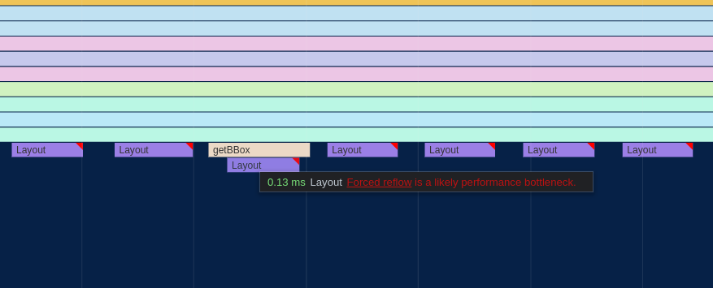

For a recent project I've been working on, I wanted to include a graph showing the relationships between different artists on Spotify.  Spotify provides the data directly from their API, and I had everything set up to pull it for a user's top artists and into the browser.

The final step - or so I thought - was to pick one of the available force-directed graph libraries, slap in some boilerplate code, and ship it.  If you're not familiar with them, [force-directed graphs](https://en.wikipedia.org/wiki/Force-directed_graph_drawing) are a visualization for graph data that lays out nodes in an easy-to-see way, avoiding edge crosses and trying to keep all edges to approximately the same length.

After a bit of research, I chose the [Webcola](https://ialab.it.monash.edu/webcola/) constraint-based graph layout library.  Webcola is itself a port/adapation of the C++ [libcola](http://www.adaptagrams.org/) library and it supports easy integration with D3 which I've worked with in the past.  It really was very simple to get a working force-directed graph rendered by adapting some code from their examples, and it actually looked pretty good!  The relationships between artists were apparent and I found myself spending a good amount of time just scrolling around it and exploring my own world of musical connections.

There was one problem though: it was incredibly slow; slow to the tune of 8 FPS.  Obviously, that's not acceptable and it made using the graph very difficult.  To be fair, I had almost 400 nodes in my personal graph and ~1500 edges which was a lot more than any of the examples, but it felt like performance was an order of magnitude or two too low.

What followed was an extensive journey of optimizing my application and all of the underlying layers to boost that 8 FPS to a consinstent 60, even on less powerful devices.

## Initial Analysis

The first step of all of my browser-based performance optimization starts with Google Chrome's excellent built-in profiler.  Here's what one frame of the animation looked like at the start before any changes were made:


The whole frame took ~125ms, miles beyond the 16.5ms required for 60 FPS.  Ideally, we'll also want it to be even quicker than that since other code needs to run on the webpage as well.

Breaking down where most of the time was being spent, The `Descent.rungeKutta` function comes from the Webcola library and is used to compute new positions for all of the nodes based on the connections between them.  `D3StyleLayoutAdapter.trigger` is the rendering portion where the SVG nodes created by D3 are updated to match the newly computed positions of the nodes.  The `Run Microtasks` section at the end contains some extra D3 bookkeeping code, and finally the small (well, small compared to everything else right now) purple and green bars at the end were for browser-level layout and rendering.

## Eliminating Forced Layout

The first thing I noticed about the perf graph above was the purple boxes with red tags that dominated more than half of the entire frame.  Zooming in a bit more, it became apparent that these were caused by **Forced Reflow**, which means that the browser was being forced to re-compute the geometric layout of all of the SVG nodes in the visualization every time I updated the positions of any of them.



It looked to be caused by the [`getBBox()`](https://developer.mozilla.org/en-US/docs/Web/API/SVGGraphicsElement/getBBox) function which is used to compute the actual size of SVG elements.

Looking at my code, some of the example code I copied over for positioning the labels of the nodes looked like this:

```ts
label
  .attr("x", function (d) { return d.x; })
  .attr("y", function (d) {
    var h = this.getBBox().height;
    return d.y + h/4;
  });
```

After a bit of quick Googling, I found that the `getBBox` function indeed causes forced reflow in SVGs.  Since in my graph all nodes had a uniform height, I was able to replace that code with just this:

```ts
label
  .attr("x", function (d) { return d.x; })
  .attr("y", function (d) { return d.y + 20/4; });
```

That change alone was the biggest contribution to the performance improvements of the graph since the forced layout cost was linear to the number of nodes in the graph but the layout itself required computing positions for all nodes and edges.  Since it was more of a bugfix than an optimization, I don't really count it as part of the main optimization changes I made here, but it was a vital change nonetheless.

Here's what the perf graph looked like after removing the `getBBox()` calls:


Much better - already down to ~50ms for a frame.  Still a long way to go, though!

## Custom Canvas-Based Renderer

As a result of removing the horrible `getBBox` code, Webcola has moved up to taking around a third of the processing time of the frame with the D3 rendering and associated overhead taking up the rest.  One thing to notice is that the majority of `D3StyleLayoutAdapaptor.trigger` is now dominated by calls to [`setAttribute`](https://developer.mozilla.org/en-US/docs/Web/API/Element/setAttribute), which is a browser built-in that is used by D3 under the hood to set the actual attribute on the `<line>` and `<rect>` nodes used to render the graph into the SVG.

Unfortunately, this is a bit of a dead-end for D3; as far as I know, in order to animate the visualization according to the positions computed by Webcola, you need to actually change those attributes - there's no way getting around it.  I managed to improve the performance a bit by using some specialized SVG position setting APIs, but the mere act of setting the coordinates on the SVG elements was still taking up ~15ms, nearly the entire budget for the frame.  Besides that, the "Recalculate Styles", "Layout", and "Paint" boxes at the end had become much more prominent as well and were also seemingly unavoidable overhead of the SVG-based renderer.

After trying a couple of other ideas in vain, I decided to bite the bullet and implement a fully custom renderer for the graph that used Canvas rather than SVG.  Although SVG is a terrific choice for many kinds of visualizations due to its rich API and direct integration into the DOM, there were some things that it doesn't perform very well with.

I'd used the [PixiJS](https://www.pixijs.com/) library on [a](https://notes.ameo.design/fm.html) [few](https://github.com/ameobea/web-synth) [projects](https://cprimozic.net/projects/spf420_x_syncup) in the past and found it to be an extremely productive tool for buliding rich visualizations and interactive applications in the browser.  It's based on WebGL, but it provides a high-level API on top with lots of useful tools for building applications quickly without compromising performance.

Buliding out the initial renderer was actually pretty straightforward; the graph visualization only really consists of boxes, lines, and labels.  The biggest advantage over the D3/SVG-based renderer is that the nodes don't need to be managed individually and treated as fully-fledged DOM elements.  Instead, the whole visualization can be passed off to the GPU in one go which performs all of the rendering directly, giving us the equivalent of an image that can then be rendered into the canvas on the page.

The biggest drawback is that we have to do all of the interactive bits (hit-testing, clicking, dragging, hover, etc.) manually instead of relying on handy HTML event listeners and CSS to do it for us.  Thankfully, PIXI includes a ton of utilities to do most of this for us.

The final step was to plug the renderer into Webcola.  Webcola was designed to be pluggable into various different rendering engines, so after looking at how the D3 shim was implemented getting it to work with the canvas-based renderer went pretty smoothly.

After all of that effort, the reward was another massive bump in performance:


The difference is almost as shocking as the first one!  The renderer went from taking up two thirds of the frame to taking up around 20%, and the total frame time was down to ~32ms.  That's a very usable FPS, at least on my desktop.  However, on smartphones or even lower-end laptops or netbooks, that number is going to be a lot worse.

## Optimizing Webcola

At this point, it became clear that the Webcola library was the next thing to look at since it was taking up the vast majority of the rendering time.  The Chrome profiler also supports line-level profiling, so I zoomed into the `Descent.computeDerivatives` function to see which lines were taking the most CPU time:


Well, there are some positives and some negatives.  On the plus side, almost all of the CPU time is spent in a handful of lines.  On the minus side, the hottest lines are all doing very simple operations like reading from/writing to arrays and doing basic math operations.

After spending a lot of time looking at and working with this code, I've discovered that the core of the algorithm consists of computing the distance between each node and all other nodes.  Using this distance measurement and some other magic data determined by Webcola, new positions for each node are computed to better satisfy the layout of the graph as a whole.  This is a n^2 time complexity loop which the nested `for` loops in the code snippet above hint at.

### Switching to Typed Arrays

The issue with the hottest lines all being array stores and loads is that there's really not a ton that can be done to optimize that.  My initial thought was to change all of the arrays, which were vanilla JavaScript arrays, into typed arrays like `Float32Array`.  The APIs between vanilla arrays and typed arrays are actually almost exactly the same and Webcola is written in Typescript, so swapping them out for typed arrays mostly just required changing the constructors and type definitions.

Surprisingly, after doing that, performance actually regressed!  This was the opposite of what I expected because typed arrays are specifically designed for high-performance code.  I did a bit of research, and a couple of potential explanations came up:

 1) The JavaScript engine was doing some optimizations on arrays that it wasn't able to do with the typed arrays.  One thing I only noticed later is that several of the arrays used in the loop were very small (2-3 elements) which might explain some of the issue.
 2) The code was doing out-of-bounds reads somewhere in a way that didn't impact the correctness of the algorithm.  Some posts seemed to indicate that doing out-of-bounds reads on typed arrays caused code to be de-optimized worse than when doing them on normal arrays.
 3) Several of the arrays used in the algorithm were multi-dimensional, so switching them to typed arrays only actually changed the inner dimension.  It's possible that if the arrays were flattened to hold all their elements in a single buffer, the performance might be much better.

In any case, I abandonded this approach entirely and left the arrays as they were.

## Porting Webcola to Rust + WebAssembly


