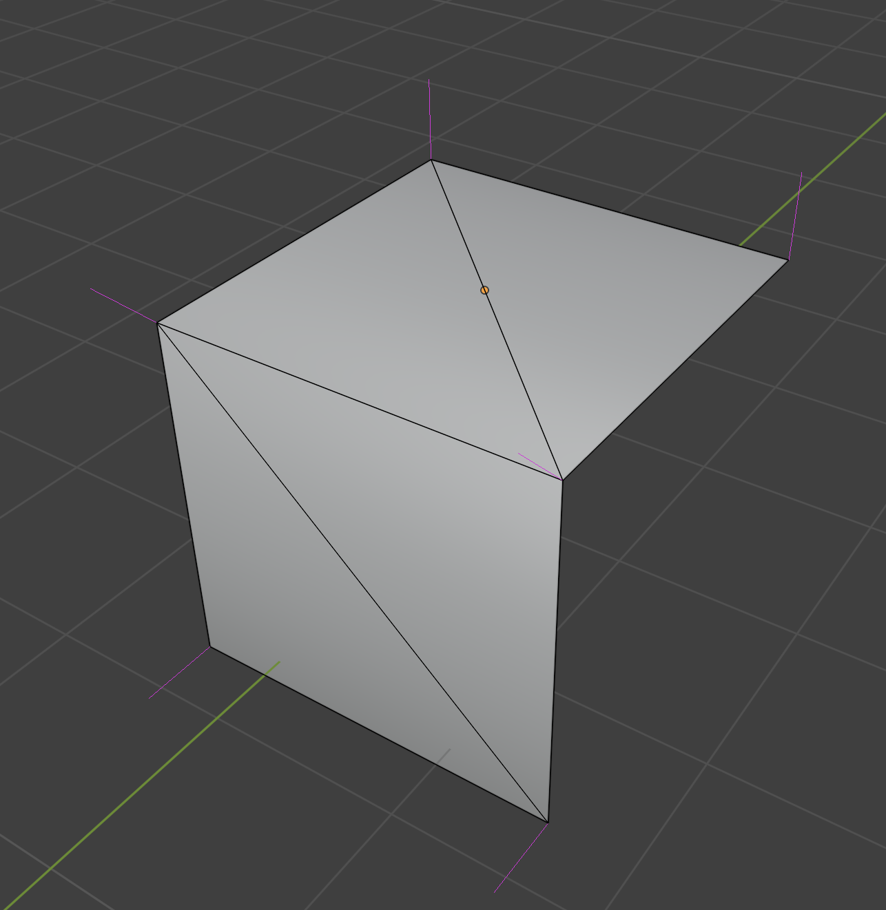

<br/>

## Overview

When I started off, my goal was simply to subdivide 3D meshes.

I wanted to add more geometry to simple meshes so that I could apply programmatic deformation like greebling and noise to give them increased detail and realism in procedurally and semi-procedurally-generated scenes.

It turns out that basic mesh subdivision is indeed very simple and can be implemented in a few dozen lines of code. However,

<div class="warning padded">
There are requirements stemming from how shading and 3D rendering work that quickly become apparent and make it a much more involved task.
</div>

It turns out that there's a ton of nuance involved with subdividing and deforming 3D meshes while still making them render and shade nicely.

This post explores solutions to the various problems that occur during the whole subdivision and deformation process.  It then extends this into a full pipeline for deforming and manipulating 3D meshes and computing accurate normals for both shading and displacement.

## Naive Subdivision

In 3D rendering, all meshes are composed of triangles. When models are exported out of Blender or any other 3D modelling application, that application handles decomposing that mesh into a set of triangles that the 3D engine rendering it turns into one or more draw calls to the GPU.

For my use case, I wanted to be able to subdivide _any_ 3D mesh and to be able to do it using the post-export 3D data. The idea would be to take the set of triangles and turn them into more, smaller triangles.  One easy way to do that is to take each triangle that has an area greater than some threshold and cut it into two by splitting its longest edge.

Here's how that would look in Blender after 2 rounds of subdivision:


Yeah, really nothing groundbreaking about that.  You can subdivide in other ways like adding a vertex in the center and splitting it into three by drawing new edges to the existing vertices or whatever you want.  It's all just turning triangles into smaller triangles.

And the best part is that it works!  I implemented some simple code to do it, applied it to some simple test meshes, and saw that they looked... exactly the same.

That's just what should be happening in this case since we're not actually changing the overall shape of the geometry - just splitting it into smaller pieces.

## Deformation + Displacement

Now that I had my meshes split, I figured I should test some basic deformation.

The word "deformation" doesn't really imply anything specific about what kind of change is being made to a mesh's topology.  The main thing I mean when I say it is that the positions of the mesh's vertices are being changed in some way which in turn alters the mesh's structure.

When moving them around, it's important to avoid breaking the mesh's topology by making faces clip into each other or twist around backwards (since only the front side of faces are actually visible when rendering).  Since 3D meshes can take on any number of complex shapes, it can often be unclear what effect moving a particular vertex in a particular way will have on the mesh as a whole.

A good heuristic for doing this is to move vertices along their **normals**.  I'll talk more about normals soon if you're not familiar, but the concept is that vertices are moved inwards or outwards based on their local angle on the surface of the mesh.

For the rest of the post, I'll refer to this idea of moving a vertex along its normal as "displacement".

### Displacement Mapping

In 3D graphics, **displacement mapping** is a method for adding increased geometric detail to meshes by modifying the positions of its vertices in the vertex shader based on the values read from some texture - the **displacement map**.

The process itself is also pretty simple. Each vertex is moved forward or backward along its normal vector depending on the value in the displacement map for that vertex, looked up using a dedicated UV map.

Here's the full shader code that Three.JS uses to implement it for reference:

```glsl
transformed += normalize(objectNormal) * (texture2D(displacementMap, vDisplacementMapUv).x * displacementScale + displacementBias);
```

<div class="warn padded">
There's a price for this simplicity, though.
</div>

In order for displacement mapping to look good, it's usually necessary to have another set of maps like normal maps or bump maps. If those are missing, the changes in geometry won't line up with the shading and things like specular highlights and shadows will look off or even break completely.

### Naive Subdivision Displacement Results

Rather than use a displacement map, I made a small tweak to my vertex shader to just apply a constant displacement outward for each vertex in the mesh.  This was more of a sanity check than anything to make sure that the subdivision really was working like I expected it to.

When I set it all up in my Three.JS scene, this is what I saw:

<iframe src="http://localhost:5173/subdivide/naive_displacement_demo" loading="lazy" style="width: 100%;aspect-ratio: 1530/1080;overflow:hidden;display: block;outline:none;border:none;box-sizing:border-box; margin-left: auto; margin-right: auto"></iframe>

_(You can use the slider on the image above to view the pre and post displacement versions)_

As you can see, it definitely wasn't working like I was expecting.  Understanding why it turned out like this requires some background into the way 3D graphics works.

## Normals

An extremely important concept for the rest of this post (and for 3D graphics in general) is that of **normals**.  A normal or normal vector is an angle perpendicular to something else.  For things like triangles or planes, their normals "shoots out" of their front sides.

As a little aside, I was curious as to how these things came to be named "normals".

<div class="note padded">
It turns out that people have been calling right angles "normal" for <a target="blank" href="https://mathoverflow.net/questions/172690/how-did-normal-come-to-mean-perpendicular">over 2000 years</a>.  The use of normal to mean regular or standard is actually <a target="blank" href="http://www.etymonline.com/index.php?term=normal">much younger</a> apparently. Weird.
</div>

In 3D graphics, normals are instead assigned to vertices.  Each vertex gets a normal that is an average of all faces that share it.  Blender, being the incredibly feature-rich application that it is, has built-in support for visualizing different kinds of normals on meshes.  Here's what it shows for a piece of that cube that was being rendered before:


The light blue lines are the face normals, the darker blue ones are the vertex normals produced by averaging the attached face normals, and the magenta ones are called "split" or "loop" normals.  I'll talk about those more later.

### Smooth + Flat Shading

Anyway, one of the main reasons that normals are so important for 3D rendering is the influence they have on shading.  Most of the equations used to simulate the way light interacts with surfaces rely on knowing the angle between the surface being lit and the light source and the angle between the surface and the camera.  Normals are essential for facilitating this.

Normals also provide the ability to switch between "smooth" and "flat" shading models.  With smooth shading, normals are interpolated for each fragment based on how close it is to each of its triangle's vertices.  This makes the computed normal at each fragment continuous across the whole surface of the mesh.

Here's a comparison between smooth (left) and flat (right) shading:

<div style="display: flex; flex-direction: row; justify-content: center;">
  <iframe src="http://localhost:5173/subdivide/smooth_flat_shading" loading="lazy" style="max-width: 821px;width: 100%;aspect-ratio: 821/756;overflow:hidden;display: block;outline:none;border:none;box-sizing:border-box; margin-left: auto; margin-right: auto"></iframe>
</div>

For flat shading, the normal for each fragment is set to the normal of the face.  This means that unique vertices need to be created for each face - even if those vertices are at exactly the same position - since they need to be assigned unique normals.

That cube from before that I was testing displacement on was exported from Blender with flat shading.  This is definitely appropriate for that mesh; all of its faces are at very sharp angles to each other and trying to smooth over that would make it look weird.  However, this is exactly what broke the displacement.

In order to facilitate flat shading, Blender needed to 3 duplicate vertices at each of the cube's corners.  They had the exact same positions, but their normals differed to match the triangles they were used in.  This is what those magenta lines in the Blender screenshot from before represent.  They show the distinct normals that will exist in the exported mesh with the current shading model applied.

If the vertices are displaced using those magenta-colored split normals, the effect will be that vertices at the same starting point will be moved to different ending points.

<div class="note padded">
To make displacement work, new normals must be computed such that vertices at the same position are moved to the same destination, keeping the mesh glued together.
</div>

## Linked Mesh Data Structure

At this point, I realized that I needed to get a bit more sophisticated with the way I was representing meshes than the "just a bunch of triangles" system I'd been working with so far.

While reading various posts and libraries I'd run into in the past, I'd heard many mentions of a "half-edge" data structure.  This is a method of representing 3D meshes that's commonly used by "serious" geometry libraries and tools.  It represents meshes as graphs with their constituent components (vertices, edges, and faces) all pointing to each other.  "Half-Edges" are used to refer to a single direction of an edge between two vertices going around a face.

I looked around to see if I could find a reasonably well-documented and maintained half-edge library in Rust, but I didn't find anything that looked appealing.

<div class="note padded">As a result, I decided to implement my own "<code>LinkedMesh</code>" data structure to represent meshes.</div>

It's similar to, and in many ways a simplification of, a half-edge data structure with some other differences:

 * No independent vertices or edges.  All vertices must be part of an edge, and all edges must be part of a face.
 * All faces are triangles; no N-gons.
 * No implicit direction on edges.  Instead, faces just hold an ordered list of references to the 3 vertices that make them up.

Just like a half edge data structure, it maintains bi-directional links between the different entities like this:

 &quot;Edge&quot;;  &quot;Edge&quot; -> Vertex;  Face -> Vertex;  &quot;Edge&quot; -> Face;  Face -> &quot;Edge&quot;;}" style="width: 100%;"></img>

<div class="good padded">
Having a representation like this makes a lot of things related to manipulating meshes much easier and/or more efficient.
</div>

For example, getting the list of all faces that border some other face is made very easy: just iterate over the face lists of all 3 of its edges.  There are multiple things coming up that this data structure will be crucial for.

### Implementation Details

Like the rest of the code for this, I implemented the `LinkedMesh` in Rust.  Although people often talk about how building linked data structures in Rust is difficult due to how the borrow checker works, the [`slotmap`](https://docs.rs/slotmap) crate makes this pretty much a non-issue.

Instead of storing pointers to other entities within them, you instead store special tagged indices into dedicated heaps - much like arena allocation.  This adds a slight bit of overhead, but it also provides additional checks which prevent bugs like using stale references to entities with the same index.

This is because the `SlotMap` keys contain a version which is incremented every time an index is updated, so a new entity inserted into a re-used index will have a distinct key from the old entity that used to be there.  This alone saved me a significant amount of time while developing and debugging the data structure.

Other than that, there really isn't a lot special going on in the implementation.  There were some tricky bugs to work out involving forgetting to update or refresh references after updating things in the graph, but I eventually got everything working.

The whole thing lives in [one file](https://github.com/Ameobea/sketches-3d/blob/main/src/viz/wasm/common/src/mesh/linked_mesh.rs) as well which makes it easy to set up and use.  I added some methods to import and export a `LinkedGraph` to/from buffers of indexed triangles - the raw data format I was working with before.

## Computing Separate Shading + Displacement Normals

Now back to the problem at hand.  The mesh data that we have to work with has multiple vertices at the same position to facilitate shading.  However, the normals that are used for displacement need to be identical for all coincident vertices.

<div class="note padded">
To support both non-smooth shading and effective displacement, two separate sets of normals must be computed.
</div>

In order to compute normals for displacement, those coincident vertices need to be merged together.  To implement this, I just used a brute-force quadratic search of every `(vertex, vertex)` pair in the mesh.  If those two vertices were at exactly the same point, they got merged - updating references in all edges and faces to point to the first one and then dropping the second one from the graph.

For meshes I was working with, this was fast enough that the N^2 performance characteristics didn't matter.  This was being run on the original low-resolution, pre-subdivision meshes after all.

If/when I end up using this with larger and more complex meshes, it will be necessary to use some space partitioning data structure like a BVH to speed it up.

### Graph Relation

Since the `LinkedMesh` data structure is in every way a graph, it's possible to visualize it as such.  I wrote some code to build a GraphViz representation of a `LinkedMesh` - originally for debugging purposes.

Here's the graph representation for that same mesh with the two square faces joined together at a right angle from before:


Note how there are two distinct, disconnected subgraphs.  Each subgraph has exactly two faces, since a rectangle is composed out of two triangles.  These two triangles share exactly one edge with each other, and all other edges are only contained in one.

After the merge of coincident vertices if performed, here's the resulting graph:


As expected, the subgraphs are merged together and no disconnected components remain.  The two merged vertices now have 4 edges - lining up with what we see when the mesh is triangulated in Blender:



### Computing Vertex Normals

Now that all of the coincident have been merged in the graph representation, we can compute accurate vertex normals on the merged vertices such that displacing them won't result in the faces of the mesh pulling apart from each other.

Previously, I mentioned that this is done by averaging the normals of attached faces and this is true.  However, when I was implementing this myself, I learned that there's actually a more specific algorithm that needs to be followed.

<div class="note padded">
Vertex normals need to be calculated by taking a <i>weighted</i> average of the normals of connected faces, with the weights being the angles between edges of those faces that share that vertex.
</div>

That sounds a bit complex when written down like that, but it's actually pretty simple.  Seeing it visually helps:


The red and blue arcs are marking the angles that are being measured, which is what the normals of those two faces that share the selected vertex are weighted by when computing its normal.

If weighting isn't performed, the normals will be lopsided and inaccurate on some geometry and produce buggy/uneven shading and displacement results.

## "Smooth by Angle" Shading

Accurate displacement normals are obtained as a result of the vertex merging, but the original shading data about which faces were smooth and which were flat is lost.  This has the effect of making the whole mesh smooth shaded.  If any other kind of shading than that is desired, we'll have to the work to compute it ourselves.

When computing shading normals, there are actually more options than just the binary "smooth" or "flat" that I've discussed so far.  Blender (and I'm sure other tools as well) provides an option called "Shade Smooth by Angle" (previously labeled as "Shade Auto Smooth"):


This shading model works as a hybrid of smooth and flat shading.  It looks at the angle of edges between faces and if the angle is larger than some configurable threshold, it marks the edge as "sharp".  This essentially has the effect of duplicating the vertices of that edge - reversing the merge process from the previous step.  This allows the faces that share that sharp edge to have different normals on it and makes the edge appear flat-shaded when rendered.

That seems straightforward enough, right?

That's what I thought until after I'd spent a full weekend trying to come up with an algorithm to do this from scratch.

I tried a variety of ideas with the most promising being a graph traversal-type approach where I'd traverse the mesh as a graph and walk along smooth faces and build up subgraphs of faces that were all smooth wrt. each other.

All of these failed in at least some places, producing all kinds of weird buggy shading artifacts like this:


Eventually, I had to admit defeat and defer to some experts to find an algorithm for this.

<div class="note padded">
I tracked down <a href="https://github.com/blender/blender/blob/a4aa5faa2008472413403600382f419280ac8b20/source/blender/bmesh/intern/bmesh_mesh_normals.cc#L1081" target="_blank">the spot</a> in the Blender source code where they do this for their meshes, figured out what was going on, and implemented it myself for the <code>LinkedMesh</code> in Rust.
</div>

The code they have there is quite arcane and full of handling for features I didn't have or implementation details of their platform, but I eventually figured out what was going on.

The algorithm they use is quite clever.  At its core, it involves walking around vertices and partitioning the faces into what they call "smooth fans".  Each smooth fan gets its own copy of that vertex with a unique shading normal.

There's a bit more to it than that, and I went ahead and wrote a [dedicated post](/blog/computing-smooth-by-angle-shaded-normals-like-blender/) about the algorithm and how I implemented it if you're interested.

The only important thing left to note about it here is that when I duplicate a vertex in order to make one of its edges sharp, the displacement normal computed earlier is copied to the new one.  This ensures that regardless of what shading normal that duplicate vertex gets assigned, they all will be displaced in the same way and the mesh won't rip apart.

## Procedural Displacement

So at this point, I had the following:

 * A method for converting arbitrary sets of triangles into a graph-like `LinkedMesh` representation
 * An algorithm for merging coincident vertices and computing displacement normals such that the mesh won't rip apart when displaced
 * An algorithm for computing "smooth by angle" normals for shading
 * An algorithm to subdivide the resulting `LinkedMesh` to add increased geometric detail without changing its shape

Now we get to actually do some displacement.

Rather than doing it inside the vertex shader like before, I decided to implement the displacement/deformation ahead of time on the CPU.

There are a few reasons for this:

 * It allows for more complicated/expensive algorithms to be run.
 * It allows for non-local data about the mesh to be used rather than just a single vertex

And perhaps most the impactful,

 * It allows for other things than just vertex positions to be computed + updated as well

As mentioned earlier, displacement mapping in the vertex shader is limited by the fact that it happens so late in the rendering process.  If you significantly displace your mesh's vertices without having a corresponding normal map or something else to match it, the results are going to look off.

<div class="good padded">
Since I now had fully-fledged smooth-by-angle normal computation code available, I could go as wild as I wanted with the mesh deformation and then compute accurate normals from scratch afterwards.
</div>

### Noise-Based Displacement

The first thing I tried out was a noise-based displacement algorithm.  I sampled a 3D FBM noise field with 4 octaves at the position of every vertex in the mesh and either pushed or pulled the vertex along its normal depending on the sampled value.

Here are the results:

<iframe src="http://localhost:5173/subdivide/noise_displ" loading="lazy" style="width: 100%;aspect-ratio: 3456/1895;overflow:hidden;display: block;outline:none;border:none;box-sizing:border-box; margin-left: auto; margin-right: auto"></iframe>

Quite successful, if I do say so myself.  This is a bit of an extreme example with a very high amount of displacement, but that helps to exaggerate the impact that the post-displacement normal calculation has on the shadows and shading.

### Crystal-Like Protrusions

I wanted to try out another displacement algorithm that would help make use of the dynamically flat shading abilities of the algorithm.

I modified the noise-based method to displace sharply based on a threshold, like this:

```rs
let displacement = if noise > -0.9 && noise < -0.7 { 1. } else { 0. };
```

And here was the result of that:


Smooth-by-angle shading's effect is out in full force.

Check out the base of the spikes where they join to the surface of the mesh.  Those edges get marked sharp due to the high angle at which it juts out, and the result is a nice flat shading distinction between the faces.

<div class="good padded">
When I saw the results here, I immediately got ideas for all kinds of other things to try out.
</div>

I could repeat the displacement process multiple times to build up more and more detail on the meshes, I could use constructive solid geometry to combine multiple simple meshes together then displace the merged result...  So much stuff is possible with this system.

This post has already gotten very long though, so I'll save all that stuff for another time.

## Other Notes + Considerations

Here's a list of little tricks I found to fix or tweak things during the mesh processing pipeline that made things work or look better for me in certain situations.

### Shading Normal Calculation Order

One thing I noticed when doing subdivision with minimal or no displacement was that sometimes triangular shading artifacts would show up on edges between flat faces meeting at a smooth angle:


I spent a good while trying to figure out if there was a bug or some other issue in my normal computation algorithm. but it turns out that this is actually correctly shading behavior for the underlying geometry.  When I re-created similar geometry manually in Blender, similar triangular artifacts appeared:

<iframe src="http://localhost:5173/subdivide/blender_artifacts_example" loading="lazy" style="width: 100%;aspect-ratio: 3456/1985;overflow:hidden;display: block;outline:none;border:none;box-sizing:border-box; margin-left: auto; margin-right: auto"></iframe>

For certain patterns of triangles, the way the normal calculation works just naturally produces these checkered patterns in the lighting.

Luckily, there's a way to fix it.  For meshes that run into this issue, I found that computing the shading normals on the pre-subdivided mesh and then interpolating those normals in the same way as the displacement normals works around the problem completely.

This essentially replicates the same behavior that the shader would do if it was rendering one big triangle and spreads the transition over the whole face instead.

### Retaining Sharp Edges

Another thing I noticed is that sometimes applying deformation caused an edge that was previously sharp to be made smooth, or partially smooth, when smooth-by-angle normals were computed afterwards.  The normal calc code was working correct, but the results looked a bit off for some meshes.

<div class="note padded">
To address this, I marked the sharp edges before displacement and retain that sharp flag all the way through subdivision and deformation.
</div>

3D modellers sometimes do this manually - explicitly marking certain edges as sharp even though their angle is smooth - in order to tweak the way their models are shaded.  Here's the effect it had on some of the meshes I was testing with:

<iframe src="http://localhost:5173/subdivide/pre_sharp_edges" loading="lazy" style="width: 100%;aspect-ratio: 1666/1009;overflow:hidden;display: block;outline:none;border:none;box-sizing:border-box; margin-left: auto; margin-right: auto"></iframe>

The effect is a bit subtle, but it really helps make certain meshes look more clean and retain their original structure a bit better.

### Displacement Normal Interpolation Method

If you remember back, the process for doing this displacement involved merging coincident vertices and then computing displacement normals for those merged vertices.  After that, the mesh was subdivided to add more detail followed by displacement.

<div class="note padded">
One thing I didn't mention is how displacement normals are computed for the new vertices created by the subdivision process.
</div>

My original solution for this was to just interpolate the displacement normals of each edge being split and set that to the new vertex created in the middle.

As it turns out, this works the best for the kind of deformation I was doing.  However, it can create a sort of "bouncy house" look to the geometry.  Here's what it looks like when every vertex is displaced outward along its normal by a constant amount using this method:

<iframe src="http://localhost:5173/subdivide/bouncy_house" loading="lazy" style="width: 100%;aspect-ratio: 3456/1985;overflow:hidden;display: block;outline:none;border:none;box-sizing:border-box; margin-left: auto; margin-right: auto"></iframe>

See what I mean?  They look like overinflated air mattresses.

To be fair, this is a pretty extreme amount of displacement being applied, so it's not going to be as noticeable for other meshes.

The other method I came up with for setting displacement normals for new vertices created during subdivision is setting them to the edge normal.  The edge normal can be computed ahead of time by just averaging the normals of all faces that share the edge.

Here's how the same scene looks using that method:

<iframe src="http://localhost:5173/subdivide/edge_normals" loading="lazy" style="width: 100%;aspect-ratio: 3456/1985;overflow:hidden;display: block;outline:none;border:none;box-sizing:border-box; margin-left: auto; margin-right: auto"></iframe>

The tops are flat now, but the geometry is less smooth and there are some large faces that get produced against the edges.

Anyway, I'd suggest going with the interpolated displacement normals to start with and only resorting to the second method if your particular displacement method requires it.

### UV Maps + Triplanar Mapping

You might have noticed that for all the screenshots I included in this post, the textures on the meshes didn't appear stretched or distorted despite the underlying meshes being heavily distorted.

The reason for this is that I'm using **triplanar mapping** to texture them.  Triplanar mapping is an algorithm that can be used to texture meshes without any need for UV maps at all.  Instead, it uses world-space coordinates and makes 3 different lookups for the X, Y, and Z axes.  It interpolates based on the normal of the mesh at the fragment being textured which results in a (mostly) smooth and natural-looking texturing of the mesh's surface.

Without using tri-planar mapping, one would have to consider the UV map when doing subdivision and compute interpolated UV coordinates for the new vertices produced during displacement.  If the deformation is mild, it might be possible to get away with that, but for more extreme deformation it's likely that it will lead to visible stretching effects on the mesh.

I highly recommend giving triplanar mapping a try though; it was quite magical for me when I first started using it.  It's pretty much the only way to go for texturing complex procedurally generated meshes that I know of.  And it's really very simple to implement; even my fancy implementation with some added features and performance optimizations is only a [few dozen lines of code](https://github.com/Ameobea/sketches-3d/blob/cf90e113c15ec24a8ef1e1401b74c24b380d63ac/src/viz/shaders/triplanarMapping.ts) long.

## Conclusion

As usual for my posts here, this ended up getting way longer than I was originally planning for.  I doubt every section will have been interesting to every reader, but my hopes are that there might be a tip or two in here that might be useful.

Anyway, I've come to realize one big high-level takeaway I got from this work:

<div class="note padded">
A lot of things in 3D graphics aren't so much guided by some "known best" algorithm or fundamental law so much as what happens to look good when the result is rendered.
</div>

This obviously doesn't apply to all things, but I found it interesting how the angle for smooth-by-angle shading, the normal interpolation methods, and things like that largely depend on the context and personal preference rather than some known best values.  Those parts feel much more like an art than a science, and I really like that.

I hope you got something out of this article and enjoyed the journey.  I sometimes post updates and tidbits as I work on projects if you want more content like this.

You can subscribe to my blog via RSS at the top of the page, follow me on Twitter [@ameobea10](https://twitter.com/ameobea10), or Mastodon [@ameo@mastodon.ameo.dev](https://mastodon.ameo.dev/@ameo).
