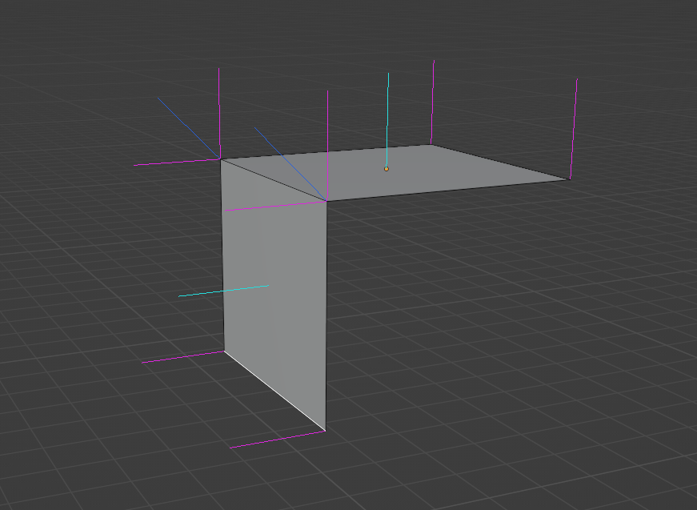

<br/>

## Summary

When I started off, my goal was to procedurally subdivide arbitrary 3D meshes. I wanted to add more geometry to simple meshes so that I could apply displacement mapping and other procedural deformation to give them increased detail and realism in scenes.

It turns out that the core of subdividing meshes is very simple and can be implemented in a few dozen lines of code

<div class="warning padded">
However, there are considerations stemming from requirements of how shading and 3D rendering work that quickly become apparent and made it a much more involved task.
</div>

This post explores solutions to the various problems that occur when subdividing arbitrary 3D meshes and applying displacement while still making sure that they're rendered and shaded correctly.

## Background

I've been working on building little [3D levels](https://github.com/ameobea/sketches-3d) and other graphics experiments in Three.JS on and off over the past few years.

## Naive Subdivision

In 3D graphics, all meshes are composed out of triangles. When models are exported out of Blender or any other 3D modelling application, that application handles decomposing that mesh into a set of triangles that the 3D engine of the application rendering it turns into one or more draw calls to the GPU.

For my use case, I wanted to be able to subdivide _any_ 3D mesh and be able to do it using the post-export 3D data. The idea would be to take the set of triangles and turn them into more, smaller triangles.  One easy way to do that is to take each triangle that has an area greater than some threshold and cut it into two by splitting its longest edge.

Here's how that would look in Blender after 2 rounds of subdivision:


In this case, the fact that everything was already a triangle actually makes it quite easy.  The algorithm I ended up with looked something like this:

```py
did_split = False
new_triangles = []

while did_split:
  did_split = False

  for triangle in triangles:
    if triangle.area() < target_triangle_area:
      new_triangles.append(triangle)
      continue

    longest_edge_ix = triangle.get_longest_edge_ix()
    new_tri_0, new_tri_1 = triangle.split_edge(longest_edge_ix)

    did_split = True
    new_triangles.append(new_tri_0)
    new_triangles.append(new_tri_1)
```

There's a slight bit of nuance that I omitted regarding things like the winding order of the vertices of new triangles so that they'd be facing the same way as the original one, but it's really nothing too complex.

And the best part is that it works!  I implemented this code, applied it to some simple test meshes, and saw that they looked... exactly the same.  That's just what should be happening in this case since we're not actually changing the overall shape of the geometry - just splitting it into smaller pieces.

## Displacement

Now that I had my meshes split, I figured I should test some basic displacement.

### Displacement Mapping Background

_Feel free to skip this section if you're already familiar with how displacement mapping works_

In 3D graphics, **displacement mapping** is a method for adding increased geometric detail to meshes by actually modifying the positions of its vertices in the vertex shader based on the values read from some texture - the **displacement map**.

The process itself is pretty simple. Each vertex is moved forward or backward along its normal vector depending on the value in the displacement map for that vertex, looked up using a dedicated UV map. Here's the full shader code for it from Three.JS for reference:

```glsl
transformed += normalize(objectNormal) * (texture2D(displacementMap, vDisplacementMapUv).x * displacementScale + displacementBias);
```

There's a price for this simplicity, though. In order for displacement mapping to look good, it's usually necessary to have another set of maps like normal maps or bump maps. If those are missing, the changes in geometry won't line up with the shading and things like specular highlights, shadows, and other elements of shading will look off or even break completely.

### Naive Subdivision Displacement Results

Rather than use a displacement map, I made a small tweak to my vertex shader to just apply a constant displacement outward for each vertex in the mesh.  This was more of a sanity check than anything to make sure that the subdivision really was working like I expected it to.

When I set it all up in my Three.JS scene, this is what I saw:

<iframe src="http://localhost:5173/subdivide/naive_displacement_demo" loading="lazy" style="width: 100%;aspect-ratio: 1530/1080;overflow:hidden;display: block;outline:none;border:none;box-sizing:border-box; margin-left: auto; margin-right: auto"></iframe>

_(You can use the slider on the image above to view the pre and post displacement versions)_

As you can see, it definitely wasn't working like I was expecting.  Understanding why it turned out like this requires some some background into the way 3D rendering works.

## Normals

An extremely important concept for the rest of this post (and for 3D rendering in general) is that of **normals**.  A normal or normal vector is an angle perpendicular to something else.  For things like triangles or planes, its normal "shoots out" of its front side.

As a little aside, I was curious as to how these things got to be named "normals".

<div class="note padded">
It turns out that people have been calling right angles "normal" for <a target="blank" href="https://mathoverflow.net/questions/172690/how-did-normal-come-to-mean-perpendicular">over 2000 years</a>.  The use of normal to mean regular or standard is actually <a target="blank" href="http://www.etymonline.com/index.php?term=normal">much younger</a> apparently. Weird.
</div>

In 3D graphics, normals instead are assigned to vertices.  Each vertex gets a normal that is a weighted average of all faces that share it.  Blender, being the incredibly feature-rich application that it is, has built-in support for visualizing different kinds of normals on meshes.  Here's what it shows for a piece of that cube that was being rendered before:



The light blue lines are the face normals, the darker blue ones are the vertex normals produced by averaging the attached face normals, and the magenta ones are called "split" or "loop" normals.  I'll talk about those more later.

### Smooth + Flat Shading

Anyway, one of the main reasons that normals are so important for 3D rendering is the influence they have on shading.  Most of the equations used to simulate the way light interacts with surfaces rely on knowing the angle between the surface being lit and the light source and the angle between the surface and the camera.  Normals are essential for facilitating this.

Normals are also provide the ability to switch between "smooth" and "flat" shading models.  With smooth shading, normals are interpolated for each fragment based on how close it is to each of its triangle's vertices.  This makes the effect computed normal at each fragment continuous across the whole surface of the mesh.

For flat shading, the normal for each fragment is set to the normal of the face.  This means that unique vertices need to be created for each face - even if those vertices are at exactly the same position - since they need to be assigned unique normals.

Here's a comparison between smooth (left) and flat (right) shading:

<div style="display: flex; flex-direction: row; justify-content: center;">
  <iframe src="http://localhost:5173/subdivide/smooth_flat_shading" loading="lazy" style="max-width: 821px;width: 100%;aspect-ratio: 821/756;overflow:hidden;display: block;outline:none;border:none;box-sizing:border-box; margin-left: auto; margin-right: auto"></iframe>
</div>

<br/>

## Computing Separate Shading + Displacement Normals

That cube from before that I was testing displacement on was exported from Blender with flat shading.  This is definitely appropriate for that mesh; all of its faces are at very sharp angles to each other and trying to smooth over that would make it look weird.  However, this is exactly what broke the displacement.

In order to facilitate flat shading, Blender needed to 3 duplicate vertices at each of the cube's corners.  They had the exact same positions, but their normals differed to match the triangles they were used in.  This is what those magenta lines in the Blender screenshot from before represent.  They show the distinct normals that will exist in the exported mesh with the current shading model applied.

If the vertices are displaced using those magenta-colored split normals, the effect will be that vertices at the same starting point will be moved to different ending points.

<div class="info padded">
To make displacement work, new normals must be computed such that vertices at the same position are moved to the same destination, keeping the mesh glued together.
</div>

## Linked Mesh Data Structure

At this point, I realized that I needed to get a bit more sophisticated with the way I was representing meshes than the "just a bunch of triangles" system I was working with.

While reading various posts and libraries I'd run into in the past, I'd heard many mentions of a "half-edge" data structure.  This is a commonly used way to represent 3D meshes by "serious" libraries and tools.  It represents meshes as graphs with their constituent components (vertices, edges, and faces) all pointing to each other.  "Half-Edges" are used to refer to a single direction of an edge between two vertices going around a face.

I looked around to see if I could find a reasonably well-documented and maintained half-edge library in Rust, but I didn't find anything that looked appealing.

<div class="note padded">As a result, I decided to implement my own "<code>LinkedMesh</code>" data structure to represent meshes.</div>

It's similar to, and in many ways a simplification of, a half-edge data structure with some other differences:

 * No independent vertices or edges.  All vertices must be part of an edge, and all edges must be part of a face.
 * All faces are triangles.
 * No implicit direction on edges.  Instead, faces just hold an ordered list of references to the 3 vertices that make them up.

Just like a half edge data structure, it maintains links between the different entities like this:

 &quot;Edge&quot;;  &quot;Edge&quot; -> Vertex;  Face -> Vertex;  &quot;Edge&quot; -> Face;  Face -> &quot;Edge&quot;;}" style="width: 100%;"></img>

Having a representation like this makes a lot of things related to manipulating meshes a lot easier and/or more efficient.  For example, getting the list of all faces that border some other face is made very easy: just iterate over the face lists of all 3 edges.  There are multiple things coming up that this data structure will be crucial for.

### Implementation Details

Like the rest of the code for this, I implemented the `LinkedMesh` in Rust.  Although people often talk about how building linked data structures in Rust is difficult due to how the borrow checker works, the [`slotmap`](https://docs.rs/slotmap) crate makes this pretty much a non-issue.

Instead of storing pointers to other entities within them, you instead store special tagged indices into dedicated buffers.  This adds a slight bit of overhead, but it also provides additional checks which prevent bugs like using stale references to entities with the same index.  This is because the `SlotMap` keys contain a version which is incremented every time an index is updated, so a new entity inserted into a re-used index will have a distinct key from the old entity that used to be there.  This alone saved me a significant amount of time while developing and debugging the data structure.

Other than that, there really isn't a lot special going on in the implementation.  There were some tricky bugs to work out involving stale references that I forgot to delete or refresh after updating things in the graph, but everything eventually got working.

The whole thing lives in [one file](https://github.com/Ameobea/sketches-3d/blob/main/src/viz/wasm/common/src/mesh/linked_mesh.rs) as well which makes it easy to set up and use.  I added some methods to import and export it from buffers of indexed triangles - the raw data format I was working with before.

## "Auto-Smooth" Shading

## Procedural Displacement

## Assembling the Pieces

## Results
