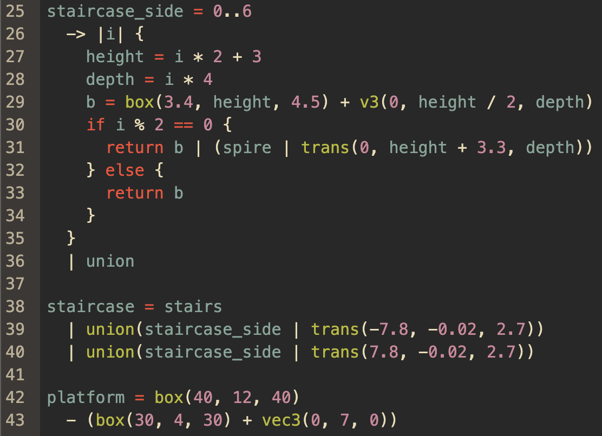
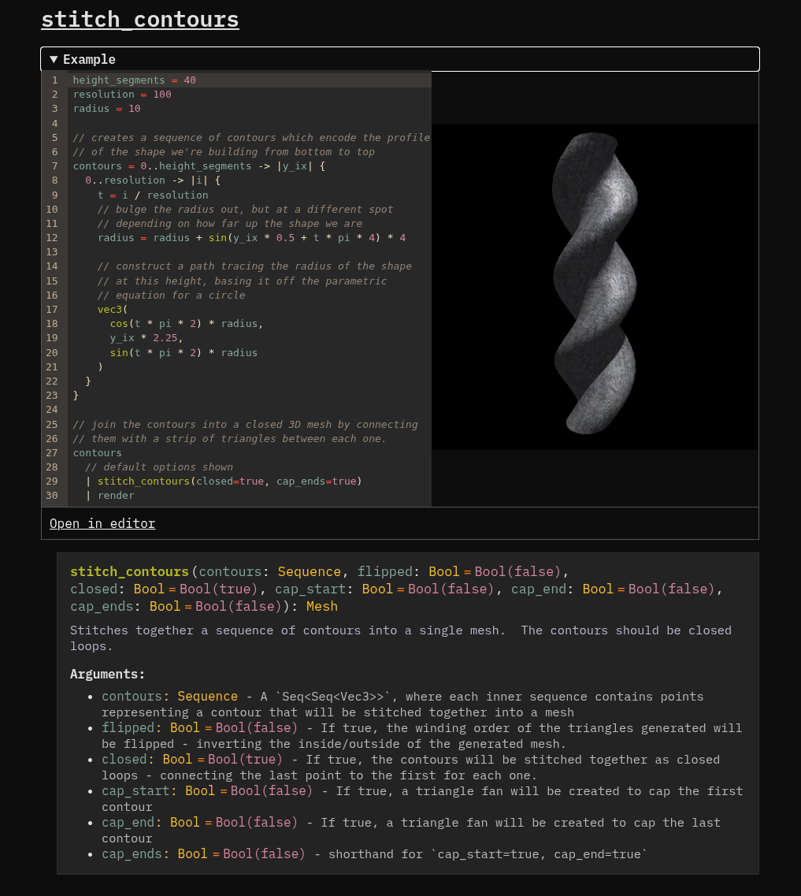

![A screenshot of the geotoy web app showing a scene that looks like a roof composed of interlocking shingles. the shingles are a curved shape with a shiny gray stone-like texture.  There is a code editor in the bottom left of the screen showing some syntax-highlighted code in a functional-looking programming language. It has variables like  and function calls like  and contains the code that defines the scene.  In the bottom right of the screen, there is some output showing basic stats about the scene and program like runtime in milliseconds, total vertices, and total face count.](./images/tech-behind-geotoy/shingles.png)

## Overview

[Geotoy](https://3d.ameo.design/geotoy) is a Shadertoy-inspired web app for building 3D meshes with code.  It includes a custom DSL called Geoscript which provides a syntax and wide set of built-in functions for generating, combining, and manipulating 3D geometry.

Geotoy wasn't really something I set out with the goal of building at the beginning.  It emerged as the natural progression of my experiments and other projects working with 3D graphics.

In a lot of ways, Geotoy is a big wrapper over an expansive collection of libraries, algorithms, and techniques that all compose together to create cool-looking 3D scenes on your screen.  Once I realized just how much was really there under the hood to make it work, I figured I'd list it out.

When I first started experimenting with graphics programming a few years ago, a list like this would have been incredibly useful to me - so I'm writing this in hopes that it will be useful to someone else in a similar spot today.

## Geometry + Mesh Handling

For most serious algorithms and applications that work with 3D meshes, the data structure of choice is called a "Halfedge".  It is a sort of specialized graph representation of meshes with the goal of efficiently supporting many operations that are needed by different algorithms that operate on meshes.

When I first started experimenting with mesh generation in Rust, I looked for some pre-built Rust library that could give me a half-edge data structure to use.  At that time, I didn't find anything that seemed to be high-quality enough to warrant pulling in.  (I haven't looked in a couple of years, and this may have changed since then).

Instead, I opted to build a custom lighter-weight data structure to represent meshes: `LinkedMesh`.

### `LinkedMesh`

`LinkedMesh` is a lighter-weight alternative to a half-edge data structure, hand-rolled in Rust.  It supports much of the same functionality but with some tradeoffs with the goal of making it simpler to implement, even potentially at the cost of some performance for certain operations.

It also represents meshes as a graph with the various components referencing each other like this:

 &quot;Edge&quot;;  &quot;Edge&quot; -> Vertex;  Face -> Vertex;  &quot;Edge&quot; -> Face;  Face -> &quot;Edge&quot;;}" style="width: 100%;"></img>

I wrote up some more detailed info about this data structure in a [previous post](https://cprimozic.net/blog/subdividing-meshes-for-displacement/#linked-mesh-data-structure) if you're interested.

Anyway, I've added on additional functionality to support things like [computing auto-smooth-shaded normals](https://cprimozic.net/blog/computing-auto-smooth-shaded-normals-like-blender/), importing/exporting meshes, and other stuff like that in order to support the needs of Geoscript.  There are still a few bugs and edge cases, but for the most part it works well and serves as a good core for this project.

## Constructive Solid Geometry

One of the core pieces of functionality that Geoscript provides is mesh boolean operations - often referred to as Constructive Solid Geometry or CSG.

Last summer, I ran into a really neat library called [CSG.js](https://evanw.github.io/csg.js/).  It's a pure-JavaScript implementation of CSG, created 14 years ago by [Evan Wallace](https://madebyevan.com/) - one of the co-founders of Figma - who has also built prominent open-source projects including [ESBuild](https://esbuild.github.io/).

Here's the kind of thing you can do with it, with this example from the [CSG.JS docs](https://evanw.github.io/csg.js/) for `a.intersect(b).subtract(c.union(d).union(e))`:

<div style="text-align: center">
</img>
</div>

This library was fascinating to me largely because the whole thing was implemented in a single file of ~600 lines of clean and simple JavaScript (including lots of comments and whitespace).

I really wanted to understand how the CSG algorithm works and use it in my own procedural generation experiments.  I ported CSG.JS to Rust and made it compatible with my own `LinkedMesh` and eventually got it working.  I was able to replicate the output of CSG.JS and do the same thing even with complicated meshes with thousands of faces.

<div class="warn padded">
However, the more I worked with the CSG.JS-based implementation, the clearer its limitations became.
</div>

There were two core issues that were both deal-breakers for serious use:

 * CSG.JS creates a HUGE amount of cuts in the outputs it generates.  This causes the number of faces to increase exponentially as CSG operations are chained.

The CSG.JS algorithm creates a binary space partitioning tree (BSP Tree) to represent the mesh.  Every face of the mesh creates a plane that cuts every other face in the mesh that intersects that plane - even if the triangles themselves don't intersect.

When repeatedly chaining CSG operations, the face count quickly spirals out of control and the code either takes a very long time to run or straight up runs out of memory.

 * CSG.JS produces non-manifold output meshes.  This means that their surfaces aren't topologically closed and they may contain [T-junctions](https://computergraphics.stackexchange.com/questions/1461/why-do-t-junctions-in-meshes-result-in-cracks) that produce issues when rendering.

For reference, this is a T-Junction:


_(The middle vertex is raised slightly to demonstrate the lack of connectivity.)_

The reason that these are a problem is that they break the connectivity that the `LinkedMesh` data structure is designed to maintain.  Certain computational geometry algorithms require manifold inputs and will simply not work if that's violated.  In addition, T-junctions can produce incorrect shading normals to be computed or result in flickering and other artifacts when rendering due to floating point precision issues.

<div class="note padded">Last summer, I took it upon myself to try to fix both of these problems.</div>

I spent a good month when I was between jobs trying very hard to tweak my Rust port of CSG.JS to work around these problems.

To solve the excessive face splitting problem, I implemented a re-meshing algorithm using the [`lyon_tessellation`](https://docs.rs/lyon_tessellation/latest/lyon_tessellation/) library.  This would take collections of triangles that all sat in the same plane and attempt to re-triangulate the polygon that represented their shared area.

To solve the T-Junction issue, I tried implementing what I called "edge welding".  This was a process that would scan through the mesh and try to join all T-junctions into fully-connected fans.

<div class="bad padded">
Although there were some hopeful early results, these efforts ultimately failed.
</div>

One of the most significant issues was the fact that floating point numbers have limited precision.  Many of the fundamental math used in CSG (stuff like finding the normal of a given triangle, computing the angle of a certain vertex of a triangle, etc.) breaks down and produces inaccurate or straight-up incorrect results in certain situations, especially those involving degenerate triangles.

The base CSG.JS implementation produces all kinds of degenerate triangles in its normal operation, and this problem proved too much for me to overcome.  I eventually admitted defeat and gave up on my work in this space.

### `manifold` Library

Then, this summer of 2025, I ran into a different library for CSG: [`manifold`](https://github.com/elalish/manifold).

<div class="good padded">
<code>manifold</code> solves both of those dealbreaker issues and packages the whole thing up into a well-documented, simple, and performant library.
</div>

I was amazed when I first saw it; there's really nothing else out there that even comes close to what it does.  Every edge case I could think of was handled gracefully, the performance was good, and it even came with a pre-built WebAssembly version that I could drop directly into my code.

Emmett Lalish, the author of `manifold`, wrote a very interesting [post](https://elalish.blogspot.com/2023/03/perseverance-history-of-manifold.html) describing the history of the project and some of the challenges that had to be overcome to build it.

It turns out that the manifoldness problem in particular is quite tricky, and hadn't ever been fully solved before:

> Second, manifoldness is such a thorny computational geometry problem that the mesh Boolean (how you add or subtract solids from each other) had been considered an open problem for decades in terms of guaranteeing manifold output. Even the top-of-the-line CAD packages that cost $30,000 per seat could not guarantee manifold mesh output.

`manifold` implemented its solution based on a [dissertation](https://github.com/elalish/manifold/blob/master/docs/RobustBoolean.pdf) by Julian Smith from 2009.  It provides the high-level algorithm which made it possible, but there was still a lot of work that needed to be done to make it usable as a general-purpose library.

`manifold` also implements a variety of other optimizations and improvements which greatly reduce the number of cuts that need to be made to the meshes, effectively solving the first issue as well.

So, `manifold` makes robust and accurate CSG possible and is ready to use.  Mesh boolean operations can be chained, composed, and interspersed with other transformations in any order and it all just works.

<div class="note padded">
It was that realization that first made me think "wouldn't it be cool if I could express all of this in a little purpose-built language?"  And Geoscript + Geotoy was the result.
</div>

## Rendering + Shading

Geotoy is built on the platform I created for my [browser-based game engine](https://github.com/ameobea/sketches-3d).  It's mostly a wrapper around Three.JS with some additional pieces to manage stuff like async resource loading, a physics engine, settings management (graphics, sound, controls, etc.), and level loading + switching.

### Three.JS

All meshes and everything else (lights + paths) are rendered using [Three.JS](https://threejs.org/): the ubiquitous WebGL-powered 3D framework for the web.

Materials provided by Geotoy correspond to souped-up versions of Three.JS's built-in materials (`MeshPhysicalMaterial` and `MeshBasicMaterial` specifically).  I built custom shaders which build on those as a base and add some additional features and functionality.

One of those additions is to allow user-provided GLSL code to be injected directly to color the mesh Shadertoy-style or programmatically define mesh properties like roughness/metalness/etc. per-fragment or over time.

### Modified Triplanar Mapping

In order to apply a texture to a 3D mesh, it's usually necessary to create a UV mapping.  There are ways to sidestep this requirement though, one of which is **triplanar mapping**.

Triplanar mapping is a well-known technique of texturing meshes and is especially useful for very large or procedurally generated meshes like terrain.  I've found it to be unreasonably effective for the majority of cases given how simple it is to implement, and it's the primary way that meshes generated in Geotoy are textured.

I created a GLSL shader which implements it and plugged it into my custom shader code.  I also added a small tweak which makes the transition zones less visible on most meshes ([full article](https://cprimozic.net/notes/posts/a-small-change-to-improve-triplanar-mapping/)).

### Postprocessing

The [`n8ao`](https://github.com/N8python/n8ao) screen-space ambient occlusion effect is the most impactful post-processing effect I use in Geotoy.  It's only enabled if the device running it is powerful enough as it's quite computationally expensive to run, but it really adds a ton of realism and intrigue - especially for simpler scenes with no or minimal texturing.

Here's a Geotoy scene rendering a 3D Hilbert curve with and without `n8ao`:

<iframe src="https://homepage-external-mixins.ameo.design/tech_behind_geotoy/na8o_comparison.html" loading="lazy" style="width: 100%;aspect-ratio: 3456/2234;overflow:hidden;display: block;outline:none;border:none;box-sizing:border-box; margin-left: auto; margin-right: auto"></iframe>

For me, it really makes the difference between having it feel like an artificial-looking rendering and something I could imagine holding in my hand.

I also use the built-in anti-aliasing from the [`pmndrs postprocessing`](https://github.com/pmndrs/postprocessing) library which gives a nice boost to the quality of the output.

Together, these help elevate the look of the results significantly from the baseline and give the graphics a much more polished feel.

### Automatic UV Unwrapping via `boundary-first-flattening`

Triplanar mapping usually works well, but it can be a bad fit for some meshes.  It also isn't interoperable with certain rendering environments like vanilla Three.JS.  Sometimes, generating a traditional UV mapping is desirable.

<div class="note padded">
So, I went on a bit of a sidequest towards the end of Geotoy development to try to add support for automatic UV unwrapping to Geotoy.
</div>

While doing some research into how different applications like Blender achieve their UV unwrapping functionality, I came across the [`boundary-first-flattening`](https://geometrycollective.github.io/boundary-first-flattening/) library.  It's a powerful toolkit that can perform high-quality UV unwrapping on arbitrary meshes.  It includes everything needed for a full UV unwrap pipeline: packing multiple texture islands into a square, handling weird mesh topologies, and inserting discontinuities where necessary.

BFF didn't come with a pre-built Wasm build like `manifold`, so my first approach was to spin up a Docker container running a [BFF web service](https://github.com/mattj23/bf-flatten-service) and then make network requests to that from the user's browser.

There were some significant downsides to this approach.  The web service expected inputs in .obj text format which required converting models to/from .obj text format (very inefficient and much overhead with big request sizes).

I ended up spending a good amount of effort to get the library compiled to WebAssembly.  This allows the unwrapping to be done entirely client-side in Geotoy and in a much more efficient way.


I wrote up a [dedicated article](https://cprimozic.net/notes/posts/compiling-boundary-first-flattening-to-wasm/) about the process I used to get it compiled.  It was a significant undertaking mostly because some of its linear algebra math library dependencies had to be compiled to Wasm manually as well.

## Frontend

Geotoy is built using [SvelteKit](https://svelte.dev/docs/kit/introduction) with the Node.JS adapter.  This provides hybrid SSR with hydration as well as full pre-rendering for static routes like the docs pages.

I use modern Svelte 5 with runes (despite not being a big fan of runes' syntax and style).  I don't use a lot of Svelte-specific libraries or tools, but one standout is [`svelte-seo`](https://github.com/artiebits/svelte-seo) which is great for managing stuff like OpenGraph metadata and other meta tags.

### WebAssembly

Wasm is fundamental to making Geoscript and Geotoy work in the browser.  All the core Mesh handling code, all the builtin functions, the Geoscript interpreter, and several other supporting pieces are all written in Rust or C++ compiled to WebAssembly.

All of the Rust code I wrote makes use of [`wasm-bindgen`](https://github.com/wasm-bindgen/wasm-bindgen) to conveniently create TypeScript wrapper functions that can be used to easily call into Wasm.

All of the C++ libraries I make use of are compiled to Wasm via [Emscripten](https://emscripten.org/).  I'm honestly amazed at how well Emscripten works for the vast majority of cases.  They've done extensive work to make it so that as many C++ programs and libraries as possible can be directly compiled to Wasm with no or minimal changes.

### Web Workers

I run the Geoscript interpreter and associated pieces in a web worker.  Since it can be computationally expensive, this makes it so that the UI and browser tab as a whole doesn't lock up while it's running.

_It could also support interruption/cancellation of program execution, but that's something I've not set up yet._

I use the [Comlink](https://github.com/GoogleChromeLabs/comlink) library from Google for all my web workers.  It automatically creates a typed RPC-like interface over the inner message channel of workers which is infinitely nicer to work with.  It's easy to set up, low overhead, small code size, and overall a 10/10 library.

The `manifold` library has some support for compiling in a mode that enables parallelization of some of the mesh operations.  I tried it out, but it had issues and didn't seem to result in any measurable performance benefit for my case, so I left it turned off.

### Style

I aimed for a clean and [brutalist](https://brutalist-web.design/) aesthetic with a "by-programmers-for-programmers" feel.  Mostly black/white/gray with very few animations, border radius, box shadow, etc.  I wanted to keep the focus on the areas of interest (the code editor and the output meshes).

The site uses the [IBM Plex Mono](https://fonts.google.com/specimen/IBM+Plex+Mono) font for everything just because I like the way it looks.

I used no UI framework, CSS framework, or other toolkit, opting instead for minimal styling and vanilla HTML elements wherever possible.  There weren't too many complex UIs on the site so I didn't really feel like I missed having one available while building it.

### CodeMirror Editor

I used [Codemirror](https://codemirror.net/) for the code editor.  I've used [Ace](https://ace.c9.io/) in the past but wanted to try something more modern for this project, and I'm glad I did.

Codemirror is a feature-rich editor with TONS of options for customization, plugins, etc.  It seems pretty modern in design and is actively maintained.  The downside is that it's rather complex and somewhat unintuitive to do relatively simple things like get/set editor content, watch for changes, etc.

I used the base library rather than a pre-built Svelte wrapper I found.  The Svelte one had weird dependency version issues and other conflicts and it was just a light wrapper anyway.

One of the big features I implemented was fully-featured syntax highlighting for Geoscript:



This is something that Codemirror has good support for, but it was still a decent undertaking getting it to work.  I'll talk more about this later on.

The CodeMirror editor is also used with [GLSL language support](https://www.npmjs.com/package/codemirror-lang-glsl) for the custom shader system.

### CDN

I use [BunnyCDN](https://bunny.net/) + Bunny Storage for user-uploaded textures and auto-generated thumbnails.  The storage is geo-replicated and SSD-backed as well as being cached by the CDN, so performance is very good.  I use Bunny for many of my sites and am a happy user.  It's easy to integrate, basically free at my scale, and very fast.

I still run the main site off of my dedicated server from OVH, but could theoretically port it over to run on Cloudflare workers with their edge SQLite if I wanted to.  I like self-hosting things where possible though.

## Backend

Since Geotoy supports login and sharing of compositions, it has a light-weight backend to provide the APIs to power that.  I'll avoid going into too much detail here since it's not a core part of Geotoy and really nothing special.

 * Simple light-weight Rust webserver using Axum, SQLx + SQLite, and Tokio
 * Simple cookie-based login/session system with [Argon2](https://en.wikipedia.org/wiki/Argon2) for password hashing
 * Username + password login system; no email verification or OAuth or anything like that
 * Using Cloudflare's convenient [`foundations`](https://github.com/cloudflare/foundations) library for metrics, config handling, auto-configured Jemalloc, and some other stuff
   * Full article I wrote talking about that library: https://cprimozic.net/blog/trying-out-cloudflare-foundations-library/
   * Exposes some basic metrics to gauge the time it takes to render screenshots, upload files, etc. as well as give an overview of traffic to the various endpoints.  I collect these with my existing Prometheus + Grafana setup.
 * At its core it's mostly just a bunch of basic CRUD endpoints, most of which are called by the backend directly during SSR so data is inlined into the page before it's even sent to the user

## Thumbnail Generator

One neat little component of Geotoy is the thumbnail generator.  This little service takes an arbitrary Geoscript composition and renders an image of it for use as a preview on the site.

Although it may seem trivial or unnecessary, I believe that it is absolutely crucial to have for Geotoy.  The site would feel half-baked at best without it.

It's the most basic single file Node.JS "microservice" I could create that would do the job.  It uses an Express webserver along with [puppeteer](https://www.npmjs.com/package/puppeteer) for the headless browser.

It's very locked down, only accepting composition ID and version.  It loads the page, takes a screenshot, converts it to AVIF using [`sharp`](https://sharp.pixelplumbing.com/), and sends it back to the Rust backend which uploads it to cloud storage and saves the URL in the DB.

I added some basic security to help prevent abuse or compromise in the case there's some kind of XSS in Geotoy or something like that, but nothing crazy.  It's fully containerized, and it's very limited and isolated in what it can do.

## Geoscript

Geoscript is the DSL I created which is used to generate everything in Geotoy.  It's inspired by functional programming languages, but it's not a true functional language (and it doesn't try to be).

That being said, I understand why language nerds all love FP now.  Every part of building a parser + interpreter pulls you towards FP, and it feels like that's what languages want to be if they evolved naturally.

I obviously drew a lot of inspiration from other languages when designing Geoscript's syntax.  I'd say that its closest relatives are Rust, F#, Python, and TypeScript.  I designed it for ease of use over rigorousness or performance (although it's still relatively performant overall).

### Pest Parser

I used the [Pest](https://pest.rs/) parser to implement Geoscript's parser.  As someone who has never written a parser for a programming language before, Pest was impressively easy to use for both defining the syntax as well as working with the generated AST nodes.

It generates Rust code at compile time based on a text-based syntax definition ([here](https://github.com/Ameobea/sketches-3d/blob/72cdea959bce8362a0e2a86b73f0a4ff6f7eed38/src/viz/wasm/geoscript/src/geoscript.pest) is the one I wrote for Geoscript).  The performance of the generated parser seems good enough to the point where it doesn't even show up on the flame graph when profiling.

Pest has everything you need to create a parser for pretty much any language.  This includes built-in support for working with infix operators using its built-in [`PrattParser`](https://docs.rs/pest/latest/pest/pratt_parser/struct.PrattParser.html).

There were virtually no cases where I got stuck trying to implement some language feature with Pest.  Overall, I highly recommend this library if you're looking to build a parser of your own for a language or something similar.

### Lezer Parser

As I mentioned before, I added custom syntax highlighting to Codemirror for Geoscript.  In order to do this, I had to write a second syntax definition for [Lezer](https://lezer.codemirror.net/), which integrates with Codemirror.

Compared to Pest, I found Lezer to be much more difficult to work with.  There are lots of special little things you have to do to handle ambiguity in the syntax.  There is probably good theoretical grounding for these limitations, but as a user they were just frustrating and time-consuming to deal with.

I was able to get it working eventually by stealing pieces of the [Lezer Rust grammar](https://github.com/lezer-parser/rust) since my language's syntax is quite similar in many places.  The Lezer-based Geoscript parser and the syntax highlighting that makes use of it work quite well now, and as a bonus I get syntax checking with little markers for invalid syntax for free.

### Tree-Walking Interpreter

The Geoscript interpreter itself is nothing special.  It just came to be naturally when I started working on actually executing the code.

I feel no need or desire to upgrade it into a bytecode interpreter or do any kind of compilation.  Evaluation overhead is usually a very tiny fraction of runtime, and I just don't think it matters much for this use case.

### Builtins + Function Definitions

Geoscript relies heavily on built-in functions for much of its functionality.  These are all implemented in Rust and provide things like mesh primitives, mesh manipulation, math, and pretty much everything else.

I have no interest in building a "standard library" written in Geoscript; it's not designed to be really good at that.  I'm kind of following the Python pattern common in the AI/ML world here where the language makes it as convenient as possible to access powerful engines/kernels that are written in native languages.

### Auto-Generated Builtin Reference

One nice addition that I'm actually pretty proud of is Geoscript's [auto-generated builtin function reference](https://3d.ameo.design/geoscript/docs).  I put a lot of effort into this because I think it's crucial to have good docs for a new language with a lot of features like this.


I define function signatures and other metadata like argument names, types, default values, and descriptions for all the builtin functions in the language.  I then serialize those to JSON and pre-render HTML showing it in a nicely formatted way.  It even looks (relatively) good on mobile!

As an extra bonus, I include inline examples for some functions that pull from saved compositions I created, showing the source code and a preview image inline in the docs:



### Const Eval

I started off trying to implement basic constant folding for Geoscript, but I soon realized that almost everything is const in a Geoscript program since there's not really any dynamic runtime input.  This led to me implementing a pretty thorough side-effect-aware const eval system.

This makes it so that constant sub-expressions will be evaluated ahead of time, allowing the same value to be re-used in situations like this:

```
fn = |n: int| {
  0..n -> |i| {
    b = box(1) // <- this expression will be evaluated once
               // and stored as a literal in the AST
    b | translate(0, n * 1.5, 0)
  }
}
```

_One extension to this feature which I've been meaning to add is auto-instancing support for meshes.  That would provide a nice rendering performance boost for scenes that create many copies of meshes._

I originally had a ton of stuff I was going to write here since the implementation is pretty sophisticated.  However, I'm not really confident that it's fully correct for all cases, and it certainly doesn't have any solid theoretical grounding.

That being said, I have some decent test coverage and don't know of any active correctness problems.

## Deployment

I try to keep things as simple as possible for deployment.  I run the Sveltekit application and all the supporting services in Docker containers on my dedicated server.

To deploy new versions, I create a [`Justfile`](https://github.com/casey/just) for each of the applications (SvelteKit server, Rust backend, thumbnail generator) with `build-and-deploy` scripts that build a new Docker image, compress + upload it to the server, kill the old one, and start the new one in its place.

It's true that this doesn't allow for rolling deploys or any other kind of fancy deployment strategy, and any users currently using the old version may run into missing chunks or other issues.  At my current scale, this is a tradeoff I'm OK with.

I have automated backups for the database to Google Cloud Storage as well.  Nothing fancy.

## Conclusion

I was impressed with how broad the stack was for this particular app.  There are plenty of cases in modern software development where the stack is deep, but I've never really had the opportunity to work on something with this much variety in its components.

I also felt a little funny writing this up; it felt a bit braggy rather than informative while putting it together.  However, I've found that I do enjoy reading things like this that other people write, so I have some hope that people will find it a worthwhile read.

I often put out updates and little demos of this kind of work as I do it.  If you're interested, you can subscribe to my blog via RSS at the top of the page, or follow me on [Twitter](https://twitter.com/ameobea10), [Mastodon](https://mastodon.ameo.dev/@ameo), or [Bluesky](https://bsky.app/profile/ameo.dev).
