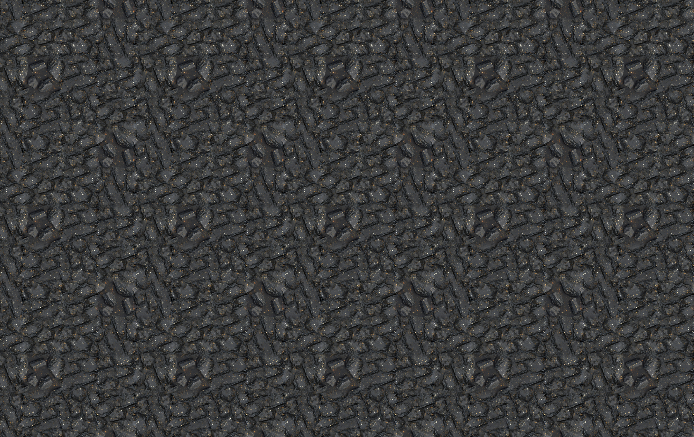
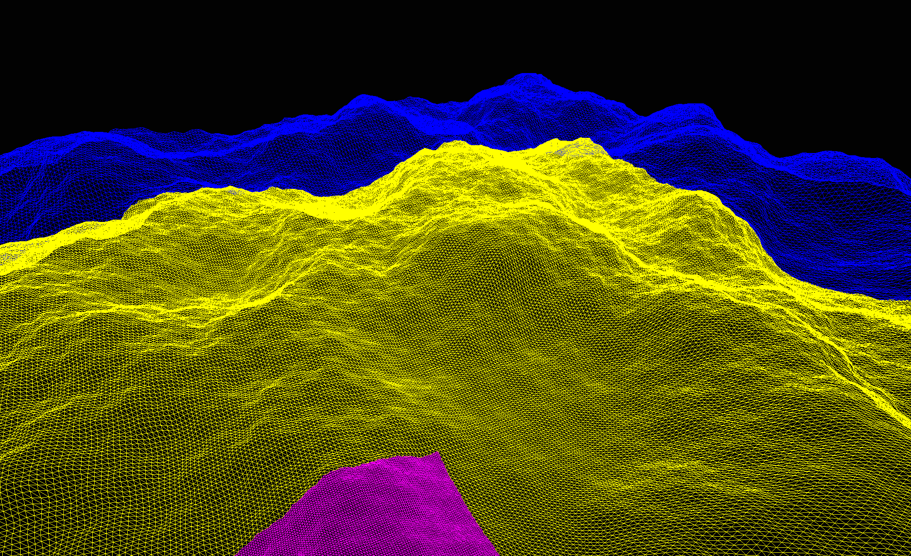

For a couple of years now, I've been working on and off on some [3D scenes and levels](https://github.com/ameobea/sketches-3d) that run in the browser.  It started off as a scattering of self-contained demos for some custom shaders or similar that I wanted to try out, but over time the project has grown into a pretty substantial interconnected game-like thing.

One of the unifying themes of the work is the use procedural and generative techniques in some way.  Usually it's just some specific element of the level that makes use of this rather than a fully procedurally generated world.

This has resulted in me accumulating a good number of procedural and semi-procedural tools and effects that I re-use from level to level.  I thought I'd put together a list of some of my favorites in case they might be of interest to anyone else working on similar kinds of 3D applications.

## Shaders + Textures

Most of the textures I use for my scenes are seamless - meaning that they tile along both axes without any visible discontinuities.  They're popular in gamedev and used regularly.

Here's an example of one that I've used in the past:

Although it does tile smoothly, you can pretty clearly see the patterns created by it repeating - especially when it's spread across a large area.

There are a lot of fancy tricks that can be used with seamless textures to make them even more useful.  I created a custom shader in Three.JS which extends the base `MeshPhysicalMaterial` with a bunch of additions and extra features that I can turn on at will, and several of them are dedicated to improving seamless texturing support for my materials.

### Triplanar Mapping

Triplanar mapping is the workhorse of my texturing toolkit.  I end up using it in some way in pretty much every level I create, and it works far better than it ought to given how simple it is to implement.

The reason for this is that it allows meshes to be textured using seamless textures without the need for pre-defined UV maps.  For that reason, this technique is usually used for things like procedurally generated terrain since there isn't an opportunity for a modeller to define a UV mapping for them.

I've found triplanar mapping to work well for a vast array of both generated and hand-modeled meshes.

Seriously - I throw this thing on everything and it almost always looks at least half decent.

It's also quite light-weight and easy to implement; here's [my implementation](https://github.com/Ameobea/sketches-3d/blob/main/src/viz/shaders/triplanarMapping.ts) for reference.

#### Tweaks + Improvements

I also made a slight tweak to the default triplanar mapping algorithm which makes it even better.

Normally, triplanar mapping uses a linear mix of three texture lookups for each axis based on the fragment's normal.  This can lead to visible layering of the texture in areas where the normal isn't very close a single axis.

To improve this, I run the weights through a `pow()` call with a pretty high exponent and then re-normalize the resulting vector.  This has the effect of putting more weight on the dominant axis and making the transition areas much smaller.  This drastically improves the quality of the results (left is without `pow()`, right is with):

<iframe src="https://homepage-external-mixins.ameo.design/3d_procgen/triplanar_sharpening.html" loading="lazy" style="width: 100%;aspect-ratio: 2817/1728;overflow:hidden;display: block;outline:none;border:none;box-sizing:border-box; margin-left: auto; margin-right: auto"></iframe>

As an added bonus, performing this transformation results in one axis having a weight very close to 1 and the other two axes having weights very close to zero for most places on the mesh.  This allows for an optimization that just completely skips texture lookups for weights smaller than some threshold and makes the performance overhead of triplanar mapping much lighter - barely more than normal UV-mapped texturing.

One last trick I use in my triplanar mapping implementation is for handling normal maps - which need some special considerations in the shader code in order to get correct results.

I use the method that was introduced [in GPU Gems](https://github.com/bgolus/Normal-Mapping-for-a-Triplanar-Shader/blob/master/TriplanarGPUGems3.shader#L62) that specifically addresses this and it works nicely.  There's more details in [this blog post](https://bgolus.medium.com/normal-mapping-for-a-triplanar-shader-10bf39dca05a) as well if you're looking to implement this yourself.

### Hex Tiling

This is another technique that I make use of in most of my scenes in some way.  Hex Tiling is an algorithm that completely hides visible tiling and repetition in seamless textures.

Here's an example of the effect it can have on a stripped-down scene to highlight its impact:

<iframe src="https://homepage-external-mixins.ameo.design/depth_based_fragment_culling/tiling_compare.html" loading="lazy" style="width: 100%;aspect-ratio: 1856/1326;overflow:hidden;display: block;outline:none;border:none;box-sizing:border-box; margin-left: auto; margin-right: auto"></iframe>

It's hard to overstate how good this effect is at making a wide range of scenes look way, way better - and all it takes is adding one extra config option to the material to turn it on.  It can make a scene go from looking like a low-effort mockup to semi-realistic all by itself.

My original hex tiling implementation was based on a [Shadertoy](https://www.shadertoy.com/view/MdyfDV) by [Fabrice Neyret](http://evasion.imag.fr/~Fabrice.Neyret/).  I converted it to work with Three.JS's material system and integrated it into the shader for the main material for my project.

I also ported my version of the hex tiling shader (with permission) it into a [standalone library](https://github.com/ameobea/three-hex-tiling) that can be plugged into any Three.JS project to add hex tiling support to its built-in materials.

There are some caveats to note about this technique though.  Unlike triplanar mapping, hex tiling does require a pre-defined UV mapping.  I looked into using triplanar mapping and hex tiling together - which would be incredibly useful - but the performance overhead seems to just be too much.  The max texture fetches needed for each fragment would go up multiplicatively to a whopping 27 for each map used, and that is obviously ridiculous and impractical.

The being said, the hex tiling algorithm does linear interpolation between three lookups for each fragment just like triplanar mapping, so the same `pow()` trick for the interpolation weights that I developed to reduce texture fetches in triplanar mapping can also be used.  This not only improves performance but also makes the results look better as well.

### Depth Pre-Pass

All of these texturing methods can have a non-trivial performance impact - especially in large scenes with a lot going on.  This can result in a fragment shader that is quite expensive to run.

A depth pre-pass excellent option for winning back some performance.  It's a pretty common method in computer graphics and is used decently often in different game engines and rendering pipelines.  The idea is that you render the entire scene using an extremely simple material that is as cheap as possible to render and record the depth fo every pixel.

Although there is some overhead involved in rendering the whole scene twice, it's almost always worth it.  Especially for scenes with high amounts of overdraw, adding a depth pre-pass can often improve performance by 30% or more.

By changing the configuration of the pre-pass, you can set it to do the inverse and only render occluded fragments:

Every fragment rendered in this image is one that gets skipped when a depth pre-pass is used.

I also wrote a [dedicated article](/blog/threejs-depth-pre-pass-optimization/) with more details about the setup and how I implemented it for Three.JS.

### AI-Powered PBR Texture Synthesis

I figure I should mention this here since it's something I make use of in pretty much all my scenes.  AI-generated textures are a bit of a contentious topic, but I find that they lend themselves very well to the kind of things I build.

If used tastefully, the results can actually look pretty good.  Every texture in this scene below is AI-generated:

I also wrote a [dedicated article](/notes/posts/generating-textures-for-3d-using-stable-diffusion/) about my process for generating these textures, generating PBR maps for them, and combining them to produce seamless 4K textures without upscaling.

One note is that the website I reference in the article which I used to generate PBR maps is no longer available.  Instead, I've been using [DeepBump](https://github.com/HugoTini/DeepBump) to generate normal maps and non-AI tools like [Materialize](https://www.boundingboxsoftware.com/materialize/) for the other maps if I really need them.

### Volumetric Fog/Clouds

I've long been interested in volumetric rendering for the unique effect it lends to scenes.  I put together a relatively versatile shader that can add clouds or fog to any Three.JS scene which produces results like this:

I was inspired an awesome [Shadertoy](https://www.shadertoy.com/view/XslGRr) by the legendary shader author [Inigo Quilez](https://iquilezles.org/) (who helped create Shadertoy itself).  I created a basic volumetric volumetric clouds shader of my own using LoD noise lookups similar to the ones he used in his. I then kept adding features to it and expanding it to make it more generic and configurable.

I find that this shader is very useful for filling in the gaps of sparse levels and adding a bit of dynamism to static levels by introducing some moving clouds or fog.

This shader also used some code and approaches developed by [n8programs](https://github.com/n8python) for the [`three-good-godrays`](https://github.com/ameobea/three-good-godrays) project that we built together.  I use `three-good-godrays` decently often as well; it adds an extremely unique vibe to levels.

## Meshes + Geometry

Generating meshes at runtime is something I've been getting into more and more recently.  I like the idea of growing a world out of a software seed, but I want to avoid the "infinite but empty" phenomenon that some games which bill themselves as procedural can become.

To that end, I've been mostly focusing on adding decorations, backdrops, or procedural flourishes to levels rather than making the core of the experience procedurally generated.

### LoD Terrain

Terrain generation is a staple of procedural gamedev, and it's well-trodden ground in the space.  My implementation is really nothing special, so I won't spend a lot of time going into details about it.

Like most other methods, I use noise functions to generate a heightmap for the terrain and then tessellate it into triangles for rendering.  I texture it using triplanar mapping or hex tiling.

The main cool thing about it is the LoD system.  The terrain is generated in tiles, and each tile gets generated at a range of resolutions.  The different resolutions are then dynamically swapped in and out based on the distance between that tile and the camera, as shown in this debug view:

Again, nothing groundbreaking here.  But I make use of this terrain generation system all the time and having a flexible and efficient system to implement it makes it possible to re-use it with minimal effort.

### Procedural Mesh Processing + Manipulation Pipeline

This is the piece I've been working on most recently.  My original goal was to take low-poly meshes - including those generated dynamically - and procedurally subdivide + deform them.  The idea was to make simple meshes for things like platforms, boulders, or other large structures look more realistic or interesting when added to my levels.

Here's a bit of an extreme example of the kind of deformation that can be achieved using this process:

<iframe src="https://homepage-external-mixins.ameo.design/subdivide/noise_displ.html" loading="lazy" style="width: 100%;aspect-ratio: 3456/1895;overflow:hidden;display: block;outline:none;border:none;box-sizing:border-box; margin-left: auto; margin-right: auto"></iframe>

These efforts led to me building a pretty capable software pipeline for ingesting raw geometry data, making arbitrary changes to it, and re-exporting it in a ready-to-render format - all in the browser at runtime.

It turns out that there's a good bit of nuance involved in this - particularly when it comes to handling normals.

One last time, I'll link to a [separate writeup](/blog/subdividing-meshes-for-displacement/) that I published which goes into much detail about how this pipeline was implemented.

## Future Work

Most of the things I've listed here were originally developed as one-offs for some specific use case.  Then, I'd end up thinking of different contexts to try them in and re-using on other levels since I already had them built.

There are some other ideas I want to try out which I think have a lot of potential to be cool and useful.  First on my list is:

### Constructive Solid Geometry

Constructive Solid Geometry is something I've wanted to try out for a long time.  It's essentially a system for applying boolean operators to 3D space.  This lets you do things like merge two arbitrary meshes together, cut chunks out of meshes, and stuff like that.

Some time ago, I found the [csg.js](https://evanw.github.io/csg.js/) library which inspired me greatly.  It implements a full CSG toolkit (including mesh primitives, all the boolean operators, and a clean API) within a single ~500 LoC file of well-commented JavaScript.

At some point, I am planning on porting this library to Rust and hopefully getting a better understanding of how it works in the process.  I think that there's a lot of potential for using this in tandem with the mesh processing pipeline to produce some really cool results.

One thing I especially want to try out is to procedurally "damage" meshes.  I want to be able to take chunks out of buildings or bridges to simulate decay or weathering or generate cracks in walls or roads.  I'm sure I'd find a ton of other uses for it as well once it's available.

I'll definitely write about how that goes once I get around to implementing it.  If you're interested, you can subscribe to my blog's [RSS feed](https://cprimozic.net/rss.xml) or follow me on [Twitter](https://twitter.com/ameobea10) or [Mastodon](https://mastodon.ameo.dev/@ameo) where I post updates about the things I work on.
