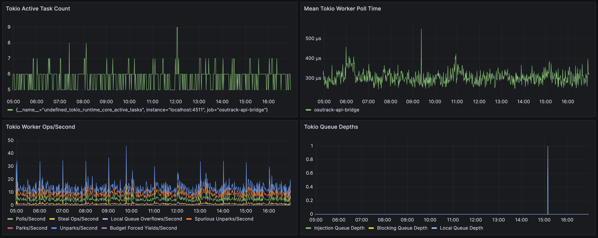

A couple of months ago, I happened across the [announcement blog post](https://blog.cloudflare.com/introducing-foundations-our-open-source-rust-service-foundation-library) from Cloudflare for their newly released [`foundations`](https://github.com/cloudflare/foundations) library for Rust.  It looked like something I'd definitely be interested in using, and I mentally marked it down as something to check out when a good opportunity came up.

Well, that opportunity recently came around - so I went ahead and tried it out!

I set up a small, self-contained, greenfield Rust project from scratch built with `foundations` from the very beginning.  That service is now running in production, and I feel like I can give some informed thoughts about `foundations` and what it's like to use it in practice.

## Background + Overview

<div class="note padded">
At a high level, <code>foundations</code> is a modular set of tools and utilities for building networked services/microservices in Rust.
</div>

The idea is to provide a re-usable and common toolkit containing the common pieces of functionality you'll need again and again when building server-side applications in Rust.  These include features like logging, metrics, tracing, security, settings, and more - a full list is available in their well-written [docs](https://docs.rs/foundations/latest/foundations/).  There are a few modules that have some support for working on the client side, but largely the focus is on server-side applications.

Here's the list they give in their own docs:

 * logging
 * distributed tracing
 * metrics
 * memory profiling and [jemalloc](https://github.com/jemalloc/jemalloc) allocator
 * security features, such as [seccomp](https://en.wikipedia.org/wiki/Seccomp)-based syscall sandboxing
 * service configuration with documentation
 * CLI helper that takes care of the configuration loading

Rather than providing a monolithic application platform or protocol-specific framework, its features are mostly independent and are set up individually by the programmer.  There's nothing in `foundations` for things like HTTP servers or gRPC endpoints; it's all a bit more generic than that.

## Initial Impressions + Observations

One of the first things I noticed while using this library was that

<div class="good padded">
<code>foundations</code> really is extremely modular and doesn't lie about being incrementally adoptable in existing codebases.
</div>

Every individual piece of functionality in the library is neatly split up and exposed behind a variety of well-documented feature flags.  I opted to disable all the default features and explicitly opt-in to all the functionality I wanted one by one.  While doing this, I was impressed by how I ran into no compilation issues or other problems while setting it up.

I've worked with feature-flagged code in Rust in the past, and it's very easy to introduce compilation failures or incompatibilities with certain combinations of flags.  `foundations` has theirs set up very well, though, and I experienced no such issues at all.

<div class="note padded">
Another thing I noticed is that <code>foundations</code> seems somewhat slanted towards enterprise use-cases compared to standalone applications or side projects.
</div>

Some of the features like tracing, syscall sandboxing, and others are mostly useful for larger dev teams maintaining dozens-hundreds of services.  This isn't that surprising since it's built by Cloudflare, originally for use in their [Oxy](https://blog.cloudflare.com/introducing-oxy) proxy service.

That being said, I think `foundations` is still very useful for smaller projects or solo developers (like I was for my project).  The previously mentioned modularity means you if one of the features isn't useful to you, you can easily choose to just not use it.

## Settings + CLI

One of the first things I set up with `foundations` was its settings file support.  This is for runtime parameters and application-specific config values.  `foundations` handles auto-generating a YAML file from your settings spec that will be loaded at runtime.

The code for setting that up for my application looks like this:

```rs
use foundations::{settings::settings, telemetry::settings::TelemetrySettings};

#[settings]
pub(crate) struct ServerSettings {
  /// Telemetry settings.
  pub(crate) telemetry: TelemetrySettings,

  /// Port that the HTTP server will listen on.
  #[serde(default = "default_u16::<4510>")]
  pub port: u16,
  /// Osu! OAuth client ID
  pub osu_client_id: u32,
  /// Osu! OAuth client secret
  pub osu_client_secret: String,
}
```

That generates a YAML file that looks like this:

```yml
---
# Telemetry settings.
telemetry:
  # <... many auto-generated settings for `foundations` telemetry ...>
# Port that the HTTP server will listen on.
port: 4510
# Osu! OAuth client ID
osu_client_id: 0
# Osu! OAuth client secret
osu_client_secret: ""
```

Overall, it all made sense and setting it up was straightforward.  As you can see, I had quite minimal needs for settings for my application, and it all worked as expected out of the box.

It makes use of `serde`, so all of the settings must be de/serializable.  This also leads to my main complaint about the settings module:

<div class="bad padded">
Setting default values for settings is pretty clunky and not supported out of the box.
</div>

For many settings, I ended up pulling in a helper crate called [`serde_default_utils`](https://docs.rs/serde_default_utils/latest/serde_default_utils/) to accomplish that.  Another option is to manually implement `Default` for your settings struct and provide defaults for all fields explicitly.

The only other complaint I had is that

<div class="bad padded">
Settings can't be set/overridden by environment variable
</div>

This is more of an opinion, and I know there are people out there that dislike the use of environment variables for application config, but I personally find that it's often a very useful feature to have.

There's an [open issue](https://github.com/cloudflare/foundations/issues/21) suggesting adding support for environment variable support in settings, and the library authors seem open to adding it, so there's a decent chance this support will come in the future.

## Telemetry

This is where things get kind of messy, but it's not really the fault of `foundations`.

### Logging

Internally, foundations uses [`slog`](https://docs.rs/slog/latest/slog/) to manage its logging.  Calls to `foundations::telemetry::log::info!()` and similar functions emit calls to the `slog` logger that `foundations` maintains under the hood.

`slog` has a lot of fancy features like expanded logging macros, support for forkable loggers, and a bunch of other complex features I don't fully understand.  It seems very well thought out and comprehensive.

<div class="good padded">
Out of the box, the logging built in to <code>foundations</code> works quite well on its own.
</div>

However, `slog` is not the only logging facade available in the Rust ecosystem.  The main alternatives that I'm familiar are [`log`](https://docs.rs/log/latest/log/) and [`tracing`](https://docs.rs/tracing/latest/tracing/) from the Tokio ecosystem.

These different libraries are not compatible with each other by default.  Libraries that are set up to log with `log` (also called stdlog) will have their log messages go into the void if a project has been configured with a different logger.

There are various adaptor crates available like [`tracing-slog`](https://docs.rs/tracing-slog/latest/tracing_slog/) for `slog`->`tracing`, [`slog-stdlog`](https://docs.rs/slog-stdlog/latest/slog_stdlog/) for `log`<->`slog`, [`tracing-log`](https://docs.rs/tracing-log/latest/tracing_log/) for `log`->`tracing`, etc.

<div class="bad padded">
Anyway, the whole Rust logging ecosystem seems to be very messy, fragmented, and confusing.
</div>

For my project, my logging needs were very simple.  I had an extremely minimal [`axum`](https://docs.rs/axum/latest/axum/) webserver with a single route that I wanted to log requests/responses for.  The idiomatic way to do that seems to be to add a [`TraceLayer`](https://docs.rs/tower-http/latest/tower_http/trace/struct.TraceLayer.html), which logs using `tracing`.

I spent a bunch of time trying to tweak the `TraceLayer` to work with the `slog` logger from `foundations` without luck.  I then tried to set up a shim to send logs from `tracing::info!()` etc. to `foundations`, but couldn't get that to work either.

I'm sure there's some arcane adapter library and config option that could make this work, but it was such a massive waste of time for this project that I decided to just drop `foundations` logging support and do all the logging myself with `tracing` and [`tracing-subscriber`](https://docs.rs/tracing-subscriber/latest/tracing_subscriber/) to get it to print to the console.

Although this part of the project was very annoying, I blame the pain on the fragmentation of the logging ecosystem rather than on some design flaw of `foundations`.  And at the end of the day, it was very easy to just turn off the logging features of `foundations` and handle that myself.

It looks like there are [future plans](https://github.com/cloudflare/foundations/issues/9#issuecomment-1938596027) to add support for funneling events from `tracing` into `foundations`, but those aren't implemented yet.  If that support lands, I expect it will greatly improve this situation.

### Metrics

<div class="good padded">
I didn't expect it, but setting up metrics was my favorite part of using <code>foundations</code>.
</div>

I'd never set up a proper metrics collection system in any of my projects previously, but I felt it was a good time to do it for this one in order to try out as much of `foundations` as possible.

The metrics functionality in `foundations` is focused around providing data in the format ingested by [Prometheus](https://prometheus.io/) - the most popular and commonly used open source metrics + monitoring solution out there right now.

I actually went ahead and set up a self-hosted Prometheus and Grafana instance myself running inside Docker.  To my surprise, that process was actually much easier than I expected, and it only took a few hours.

To start, `foundations` provides [a nice macro](https://docs.rs/foundations/latest/foundations/telemetry/metrics/attr.metrics.html) to define a set of metrics collectors for your application.  These can be things like event counters, latency histograms, or gauges to track values over time.

Defining a new metric is as easy as this:

```rs
#[metrics]
pub(crate) mod http_server {
  /// Number of HTTP requests.
  pub fn requests_total(endpoint_name: &'static str) -> Counter;
}
```

Recording values is very easy as well:

```rs
http_server::requests_total("get_hiscores").inc();
```

I defined a variety of metrics for my application, mostly to track HTTP response times and request counts of the API I was proxying requests to.

`foundations` handles all the bookkeeping for the various metrics, collating them into the format Prometheus understands, and exposing that on a HTTP server so they can be collected.  The docs were all excellent and made setting this up quite easy.


<div class="good padded">
Overall, the metrics collection features of <code>foundations</code> are excellent and easy to set up.
</div>

#### Advanced Tokio Metrics

In addition to manually-defined metrics for specific applications, `foundations` also provides support for exposing internal metrics for Tokio.  You currently have to set some special `RUSTFLAGS` and use the nightly Rust compiler, but setting it up wasn't too much of a hassle overall.

In return, you get really deep and interesting insights into the Tokio runtime itself.  I created graphs of some of these in Grafana and added them to the dashboard:



Since my API bridge is so simple, there's not a lot of deep info to be gleaned from these currently.  But for applications with more complex use-cases which make use of more advanced Tokio features, I could easily see these metrics being invaluable for diagnosing performance issues or spotting issues.

### Tracing

In addition to logging, `foundations` also has support for tracing that works with [Jaeger](https://www.jaegertracing.io/).  This includes advanced features like cross-service [trace stitching](https://docs.rs/foundations/latest/foundations/telemetry/tracing/fn.state_for_trace_stitching.html), forked tracing, and other fancy stuff like that.

I took a brief look into setting up Jaeger, but I quickly came to realize something:

<div class="note padded">
For a simple, mostly standalone application like mine, it doesn't make any sense at all to set up full-featured tracing like this.
</div>

This is something that I could see being extremely useful for an enterprise running dozens of interconnected services across multiple teams, but it's way overkill here.  Because of that, I didn't try out the tracing features of `foundations` myself.

## `jemalloc`

`jemalloc` is a powerful memory allocator which has many benefits compared to the system allocator.  It used to be included in Rust by default, but was eventually [removed](https://internals.rust-lang.org/t/jemalloc-was-just-removed-from-the-standard-library/8759) to lighten the binary size among other reasons.

Besides being a highly performant allocator, `jemalloc` is notable for its [efficiency](https://mjeanroy.dev/2021/04/19/Java-in-K8s-how-weve-reduced-memory-usage-without-changing-any-code.html) in long-running services.  It's one of the best allocators are reducing memory fragmentation, and I've anecdotally found that it's much better at other at returning unused memory to the operating system over time.  I've run into issues in the past where the system allocator would hold onto unused pages indefinitely after a temporary burst in usage, while `jemalloc` seems to do a good job at releasing them.

I often end up adding `jemalloc` manually to my projects for these reasons, so it's great that `foundations` offers out-of-the-box support for it.

## Other Features

There were a few other components of `foundations` that I didn't try out myself.

The main one is syscall sandboxing for security.  Although this is obviously a very powerful tool for applications with strict security needs, there's just no need for that for mine.

I also didn't try out the advanced memory profiling support through `jemalloc`.  That's something I could see myself using down the road, though.

## Conclusion

<div class="good padded">
Overall, I'm very happy with <code>foundations</code>. I plan to include it by default in all new Rust services I create in the future.
</div>

Since starting this blog post, I've set up `foundations` in two additional Rust services - one new and one old.  The process was largely very smooth, although I did run into similar issues with logging via the `tracing` crate as I mentioned.

I found that `foundations` delivers on all of its claims an promises for functionality, modularity, and its ability to be incrementally adopted in existing codebases without undue effort.

As an added bonus, it gave me the push I needed to go ahead and set up a real modern metrics + analytics system with Prometheus and Grafana for my services.

### The Future

<div class="good padded">
One other big plus that <code>foundations</code> has going for it is that it's actively used at Cloudflare in some of their core services.
<br/><br/>
As a result, it gets regular updates and active maintenance by their world-class engineering team.
</div>

Compared to other libraries out there, I feel much more confident that `foundations` won't just vanish or randomly go unmaintained one day.
