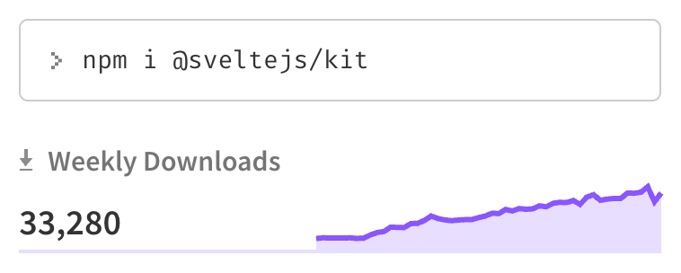
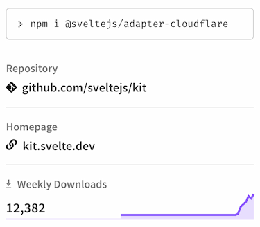
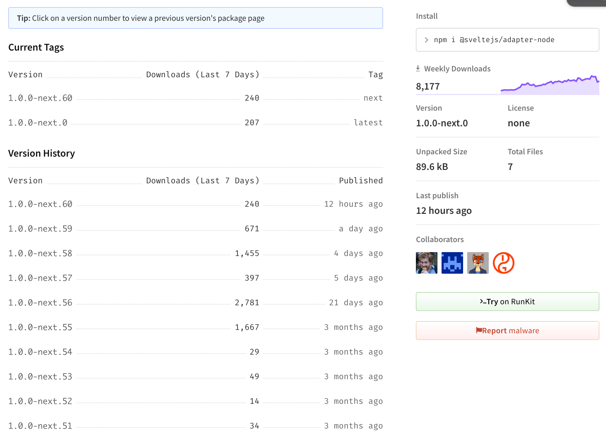
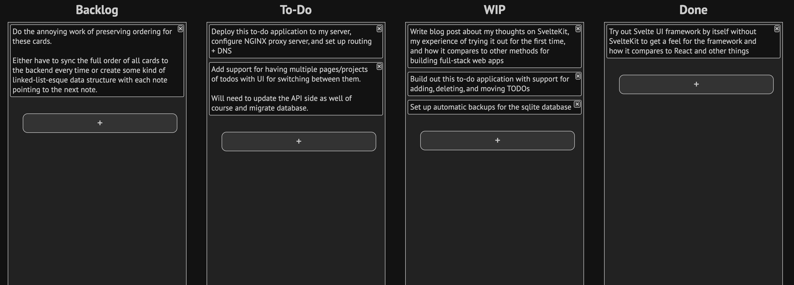
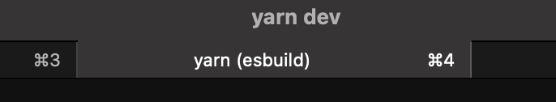
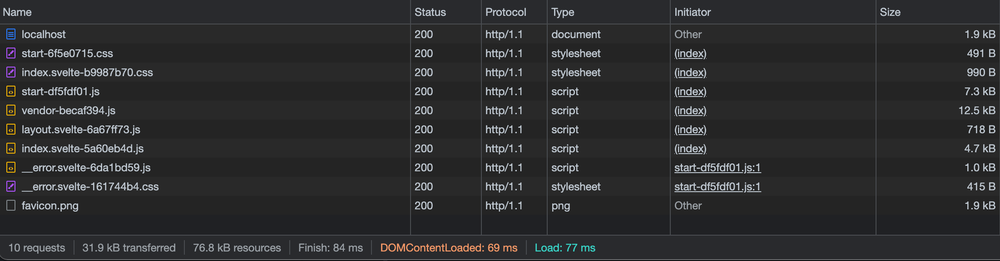

I recently tried out [SvelteKit](https://kit.svelte.dev/) for the first time.  This is a summary of my experience setting it up, some information I've collected while researching + learning it, and my thoughts on how it compares to other similar frameworks.

If you're not familiar with it, SvelteKit is a framework for building full stack web apps.  It builds on top of [Svelte](https://svelte.dev/) and provides a Jamstack environment with support for modern features like server-side rendering, link pre-loading, and static page pre-rendering out of the box.  Similar frameworks include [Next.JS](https://nextjs.org/) and [Gatsby](https://www.gatsbyjs.com/) which both use React, and [Nuxt.js](https://nuxtjs.org/) which uses Vue.

I'm not going to focus on individual features or provide a guide on how to use SvelteKit.  The official [SvelteKit docs](https://kit.svelte.dev/docs) have all of that in detail.

## TL;DR

SvelteKit presents a fresh take on modern web development with everything in one place.  It's quite opinionated like Svelte itself, but it's very well designed and has picked the best parts of the frameworks and tools that have come before it.  Experienced web developers should be able to adopt it and find familiar patterns.

The framework provides a lot of functionality for things like built-in API endpoints, server-side rendering, routing, and similar, but you only have to use the pieces you want.  It works just as well for simple, 100% static sites as it does for complex full stack apps with extensive backend logic.

It feels much like Rust vs. C++. Rather than adding layers upon layers to existing infinitely backwards-compatible software, it takes the best patterns and features and builds them from the ground up. The result is a vastly simpler, faster, leaner, and easier to use stack that's still familiar to users of most popular modern tooling.

That being said, as is made clear in docs and reference in many places,

SvelteKit is still unfinished and changing rapidly.

I'm reminded a lot of my experiences working with Rust nightly a few years ago and early versions the [Rust Language Server](https://github.com/rust-lang/rls).  API breakages still happen pretty often and bugs crop up in various pieces.  Adoption is still very low but growing rapidly.

Almost all of the issues I ran into are intensely fixable things and will likely be smoothed over as SvelteKit moves towards 1.0 and more people adopt the framework.

### Should You Use It?

If you're willing to deal with some early-adopter annoyances and potentially update your code to accommodate breaking changes, it's certainly very usable and probably easier to get started with than alternatives.

If you're thinking about trying it out at work or for some serious production application you're going to be stuck maintaining for the long term, maybe wait for the 1.0 release (coming sometime this year, I think).

I myself will be reaching for it as a first choice for the next personal project web apps I create in the future.  It's a joy to work with and it feels like a piece of the future of web development to me.

## Motivation

I'm an experienced full-stack web developer.  I've become very comfortable with my stack of choice (React + maybe Redux + WebPack for frontend, Rust + [Rocket](https://rocket.rs) for backend).  I can crank out React code like nobody's business and the patterns are burnt into my brain.

And that worries me a bit!  Frontend tech notoriously evolves at an extreme pace, and I love being ahead of the curve.  I recently read a [Cloudflare blog post](https://blog.cloudflare.com/cloudflare-pages-goes-full-stack/) announcing full-stack support for their Cloudflare Pages product.  One thing that stuck out to me was that they stated prominently that **Cloudflare Pages is integrated with SvelteKit out of the box**. I had heard of Svelte before, but I had never tried it out. This pushed me over the edge to give it a proper try.

I tried out Svelte by itself, building some small components for my [in-browser audio synthesis platform](https://synth.ameo.dev), and was very impressed.  The patterns were instantly familiar to me coming from a React background.  I also found some [great articles](https://css-tricks.com/svelte-for-the-experienced-react-dev/) available for learning Svelte for React devs that greatly accelerated my learning.

After that, I decided to give SvelteKit itself a try too, and this is the result!

## Ecosystem

SvelteKit is still in beta, and hasn't reached its big 1.0 milestone yet.  It is the successor to [Sapper](https://github.com/sveltejs/sapper), which isn't extremely popular itself with ~25k monthly downloads on StackOverflow and never hit 1.0 itself.

Right now, the amount of people and organizations using SvelteKit is quite low at the time of writing (early January 2022).

SvelteKit itself and most of the supporting libraries have very low weekly downloads on NPM and few Github stars.

As I mentioned earlier, the thing that got me to try out SvelteKit in the first place was a [Cloudflare blog post](https://blog.cloudflare.com/cloudflare-pages-goes-full-stack/) announcing full-stack support for their Cloudflare Pages platform which included out-of-the-box integration with SvelteKit.

That's a big endorsement; Cloudflare has been putting a ton of effort into evolving the state of the art in web app development and deployment, fleshing out their app platforms to compete with the big cloud providers, and bringing new paradigms to the mainstream.

I see Cloudflare betting on SvelteKit for their product at this early stage as a very positive signal.

Cloudflare's blog post's release date (2021-11-17) seems to coincide almost exactly with inflection points in the growth rate of all SvelteKit-related libraries on NPM, bringing lots of people (like me) into the ecosystem.  The `@sveltejs/adapter-cloudflare` package itself was released then and has seen fast growth ever since:

On the other hand, the efforts of Cloudflare and other commercial serverless providers seems to be exerting influence on the development priorities of SvelteKit.

The only ["officially-supported" SvelteKit adapters](https://github.com/sveltejs/kit/blob/master/documentation/docs/10-adapters.md#supported-environments) are for commercial serverless platforms including Cloudflare, Vercel, and Netlify.

These all have more weekly downloads than the node adapter, indicating to me that development of SvelteKit will likely continue focusing on these commercial platforms.

I enjoy [hosting my own software](https://cprimozic.net/blog/my-selfhosted-websites-architecture/), and being able to run my software independently of any given provider or host is important to me.  Although I had no trouble getting the standalone `@sveltejs/adapter-node` working and hosting it on my own server, this situation is something I'll continue to monitor going forward.

## Background + Demo Application

I decided to build a full-stack to-do application to test out SvelteKit.  I'd never actually built one before, but it's the de-facto demo application for a reason.

I was already sold on Svelte as a UI framework, and I wanted to focus on the things that make it unique so I didn't spend much time creating an elaborate frontend or adding a lot of features.  As a result, the UI really is nothing special:

Nonetheless, can try it out for yourself if you want and check out the generated code:

<https://sveltekit-todo.ameo.dev>

The full source code is here: <https://github.com/ameobea/svelte-todo>

I went with SQLite for a database to keep with the minimal theme, motivated by [a lobste.rs post](https://lobste.rs/s/0q9w7n/consider_sqlite) I read recently. I used the [`better-sqlite3`](https://www.npmjs.com/package/better-sqlite3) package, and it was easy enough getting it set up.  I'm sure I could have brought it in with an ORM or something if I wanted as well.

I used a bare-bones HTTP basic auth setup to authenticate mutable endpoints. Using basic auth was honestly really great and extremely simple to set up; I'll be using that again for demo or personal projects in the future for sure.

## SvelteKit's Stack

I come from a background of React + [webpack](https://webpack.js.org/), which I've been using since I first learned React around 2017.  I've also used Gatsby, which is more similar to SvelteKit and is what this blog was created with.  For Node.JS webservers, I've only ever used [express](https://expressjs.com/).

I was curious what kind of tooling SvelteKit was using under the hood, and I didn't see a ton of info in the various guides and readmes.  So, I dug a bit into the code.

### Build Tooling

At the top level, SvelteKit integrates tightly with something called [Vite](https://vitejs.dev/).  Vite is a build tool that covers much of the same functionality as webpack such as bundling, dev server hosting, and HMR along with a lot of things that are provided by webpack plugins.  It has a plugin interface that is compatible with [rollup](https://rollupjs.org/guide/en/), so you can use rollup plugins with Vite and I expect there's a good amount of crossover between the two communities.

Vite handles all the entrypoints for commands like `npm run dev` and `npm run build`.  The main integration between Vite and SvelteKit comes via [`vite-plugin-svelte`](https://github.com/sveltejs/vite-plugin-svelte).  This plugin handles compilation of Svelte code and a ton of other things to generate bundled and ready-to-deploy output for both the frontend and the backend.

Additionally, `vite-plugin-svelte` pulls in [`esbuild`](https://esbuild.github.io/), "an extremely fast JavaScript bundler" written in go, as a dependency.  I couldn't find exactly where it was used in the code or what it was doing, but it's what shows up in my terminal tab when I run `yarn dev` so it must be running down there somewhere.

This is a pretty tall stack compared to what I'm used to of just running `webpack build` or similar, and I'd never used any of its components before this.

Despite being a tall stack with lots of libraries and tools,

SvelteKit's build stack is _extremely_ fast for both dev and production builds.  Webpack builds have sped up 2-5x over the past couple of major versions for me, and this feels 10x faster than that.

A full production build of both the frontend and backend for my (admittedly trivial) todo app took 1.36 seconds.  Starting up the dev server takes well under a second, and hot reloads are just about as instant as I can perceive.

### Server Runtime

I was also curious about what kinds of software was being used to power the server that handles server-side rendering, dynamic backend API endpoints, and static file serving.

I'm using the `@sveltejs/adapter-node` adapter which creates a standalone webserver rather than integrating with Cloudflare Pages or similar.  Its [source code](https://github.com/sveltejs/kit/tree/master/packages/adapter-node) is actually very short, like ~300 lines short.  It uses a Node library called [polka](https://github.com/lukeed/polka) which describes itself as "a micro web server so fast, it'll make you dance".  The polka server wraps a handler created using [`sirv`](https://www.npmjs.com/package/sirv) for static file serving.  I was surprised to see that the Polka Github repository is very inactive with the last commit being 8 months ago.  Maybe that's just a sign that it's simple, stable, works well, and doesn't need much maintenence.

For endpoints and SSR, all of that is taken care of by SvelteKit itself.  I looked at the generated code in the `build/server` directory after running `npm run build` and discovered that it too was using polka to serve the backend endpoints and server-side rendering.

Gzip compression is enabled by default for the webserver, and cache headers were set on cachable assets by default too.

It seems that there is brotli support in there, and it even looks like it's [enabled explicitly in the source code](https://github.com/sveltejs/kit/blob/6c9b73977f7cb54902c55ccc395510b7ac3eb35b/packages/adapter-node/src/handler.js#L31) for the node adapter.  However, it doesn't seem to be working for whatever reason.  Maybe there's a magic config option to turn it on somewhere.

Everything is being served with HTTP/1 with no HTTP/2 let alone HTTP/3 support from the webserver and no apparent way to enable it

Because of this, you'll likely want to use SvelteKit behind a load balancer or proxy server that will set these things up if you're not going to use a commercial serverless provider like Cloudflare or Netlify.

Everything looked quite light-weight and minimal which was nice to see.  The layers between user-created code and the server framework are thin and clear.

### Frontend Runtime + Codegen

SvelteKit emits raw `import {...}` directives in the generated JS and generates code with `<script type="module">`.

This was a bit of a shock to me - I was under the impression that module support in browsers was still not good.

However, it seems I was very behind the times.  I was very surprised and happy to read that [JavaScript Modules](https://developer.mozilla.org/en-US/docs/Web/JavaScript/Guide/Modules) [have been supported since Chrome 61]((https://developer.mozilla.org/en-US/docs/Web/JavaScript/Guide/Modules#browser_support)) and are supported in all major browsers except IE.

Modern syntax like [optional chaining](https://developer.mozilla.org/en-US/docs/Web/JavaScript/Reference/Operators/Optional_chaining) (`a?.b`) works with SvelteKit by default and is automatically transformed.

But,

Even after a good bit of docs searching and code diving, I really couldn't figure out what library was actually performing that transpilation or how to configure it.

I found the [complete list of `svelte.config.js` configuration options](https://kit.svelte.dev/docs#configuration), but I didn't see anything related to transpiling.  It linked to the [Svelte compiler configuration docs](https://svelte.dev/docs#compile-time-svelte-compile) (although the hash anchor was broken), but I didn't find anything related to transpilation/transformation options there either.

With WebPack, I would have used [`babel-loader`](https://www.npmjs.com/package/babel-loader) which has lots of options for configuring transformations, selecting which browser versions to generate code for, and stuff like that.  I'd be very surprised if that same support doesn't exist for SvelteKit, but I really was unable to find it.

Adding to the confusion, there are [docs for `svelte-preprocess`](https://github.com/sveltejs/svelte-preprocess#modern-javascript-syntax) which give instructions on how to configure babel for transpiling Svelte components.  If I copy-paste their example babel config into my `svelte.config.js` file and run a build, I get an error `Cannot find module '@babel/core'` which makes it seem like babel isn't being used at all by default.

The entire frontend was only ~75KB, and ~32KB after gzip!

This is impressively small.  Even though my application is quite minimal after all with no images and very simple code, that amount of data is negligible even on bad mobile connections.

## Development Experience

Here's a rather scattered collection of notes I made while trying out SvelteKit for the first time, primarily using their [docs](https://kit.svelte.dev/docs) and Google to find my way.

It's important to note a few things:

- This is my first time ever using SvelteKit.  It's possible that some issues I ran into are 100% user error or me missing things in the docs.  I'd be willing to bet that if I were setting up WebPack, Next.JS, or something similar for the first time, my list of problems and confusions would be around as long as this.
- SvelteKit is developing VERY fast and things change from week to week.  It's possible that by the time you're trying this out, any of these things could be different.

OK, let's get to the list:

- Absolute imports aren't enabled by default, but they were easy to enable by adding in [a few lines](https://github.com/Ameobea/svelte-todo/blob/7b06e5a4555cae673c1fee691a01d8b145ba69e0/svelte.config.js#L27-L30) to my `svelte.config.js` file.

Getting Sass working was as easy as running `yarn add node-sass`, just like it was with Svelte by itself.

TypeScript worked perfectly out of the box; all I had to do was select "yes" while running the `npm init svelte@next my-app` command.

HMR works perfectly with zero effort or extra configuration.

The Svelte VS Code plugin works great with no configuration necessary after installation.  It's great >90% of the time, but there are a few annoying issues:

- The plugin can be quite slow at times, taking a while to catch up and populate autocomplete, type information, etc. after saving or editing.
- The plugin performs poorly when dealing with invalid syntax or incomplete lines.  I know this is a hard problem and [rust-analyzer](https://github.com/rust-analyzer/rust-analyzer) had to spend a bunch of effort to get good at this, but it's important for a good editing experience.
- "Go to type definition" functionality doesn't exist within `.svelte` files for some reason which is annoying since I use that quite often, especially when dealing with unfamiliar code or libraries.

^ These aren't strictly sveltekit-related, but they factor strongly into the experience of developing for it so I felt they were important to include.

There's support for importing static assets like images directly from `.svelte` files via [`svelte-preprocess-import-assets`](https://github.com/bluwy/svelte-preprocess-import-assets), which is functionality webpack has as well via various plugins.

However, the process of getting it working was a bit tricky and required considerable effort and trial + error

Adding `svelte-preprocess-import-assets` as a preprocessor in `svelte.config.js` broke TypeScript support and the build.

It turns out `svelte-preprocess-import-assets` only has 9 stars on Github and just over 100 weekly downloads on NPM; not exactly battle-tested stuff.

Found [a note](https://github.com/bluwy/svelte-preprocess-import-assets/commit/71084728bca5d3e7b259b64243698e068275bb1f#diff-b335630551682c19a781afebcf4d07bf978fb1f8ac04c6bf87428ed5106870f5R121) in the second-latest commit of the repo from 4 months ago mentioning incompatibility with `svelte-preprocess` by default. It linked [an RFC](https://github.com/sveltejs/rfcs/pull/56) for the svelte repo created in July discussing a rework of the preprocessing API.

It seems that the current preprocessing API for SvelteKit has limitations and problems, and a new design is being considered.  It's possible that these API changes will break currently existing preprocessing libraries, and with their current levels of activity and use it's possible they won't be updated to match it in the future.

As suggested by the author in the README, I tried out [`svelte-sequential-preprocessor`](https://github.com/pchynoweth/svelte-sequential-preprocessor) to work around the issue.

Using that and making sure to load `svelte-preprocess` first got the build working! `svelte-preprocess-import-assets` even had TypeScript support, properly typing the imported image as a string ready for insertion into the `src` of an ``.

However, once I actually added an image to test, the image wasn't served and the devserver returned a 403. There was a useful error message in console: `The request url "/Users/casey/svelte-todo/assets/img.png" is outside of Vite serving allow list.`

It also linked to [great docs](https://vitejs.dev/config/#server-fs-allow) linked on how to enable it.

After applying the small config change required, the devserver claimed to auto-reload, but it still didn't work and the same error message was printed. I manually killed and re-started the devserver, which fixed it. It was misleading that it said it was re-starting but didn't actually pick up that config change.

After that, it finally worked! Both devserver and prod builds worked great, and the filename was changed to include a hash in prod mode as well - very nice.

There looks to be support for automatic image optimization à la [`gatsby-plugin-image`](https://www.gatsbyjs.com/plugins/gatsby-plugin-image/) via [`sveltekit-image-plugin`](https://github.com/rodneylab/sveltekit-image-plugin/).

I didn't try this out myself, though, and the repository only has 32 weekly downloads on NPM + 6 stars on Github - not necessarily inspiring stuff.

I couldn't get source maps to generate for production builds even after extensive prodding.

Source maps worked great for dev builds, generating inline in the js source files.

Scouring various sources, I set options in my `tsconfig.json` and two different places in `svelte.config.json` to no avail.  I searched chat history in the Discord server and there were several config snippets from people that looked just like mine but nothing else.

In WebPack, there are lots of options for enabling source map generation and it's as simple as adding `devtool: 'eval-cheap-module-source-map'` or similar.  I wouldn't be surprised if there's some similar magic config option for SvelteKit or one of its stack's libraries that makes this work in one line, but I couldn't find it for the life of me.

This issue follows a similar theme to some others which about boils down to

It is sometimes difficult to find out how to do some more niche or complicated things with SvelteKit and associated tooling

This is largely due to a lack of existing StackOverflow, Github issues, and similar online and the speed at which things change in the ecosystem. I 100% expect this to improve as time goes on and more people post questions and docs online.

## Conclusion

Overall, I really enjoyed trying out SvelteKit and I'll almost certainly be bring it back out for new projects in the future.  The experience of starting with it from scratch was leagues better than the one I had when learning how to use Gatsby to build this site.  I will be keeping a closer eye on Svelte news in the future and looking out eagerly for SvelteKit's 1.0 release.

Also, I just want to say once again that this is my first time working with SvelteKit, and that I'm still very new to Svelte itself.  If I made any mistakes or posted any misinformation in this article, please let me know and I'll update it! (Contact link at the top of the page).
