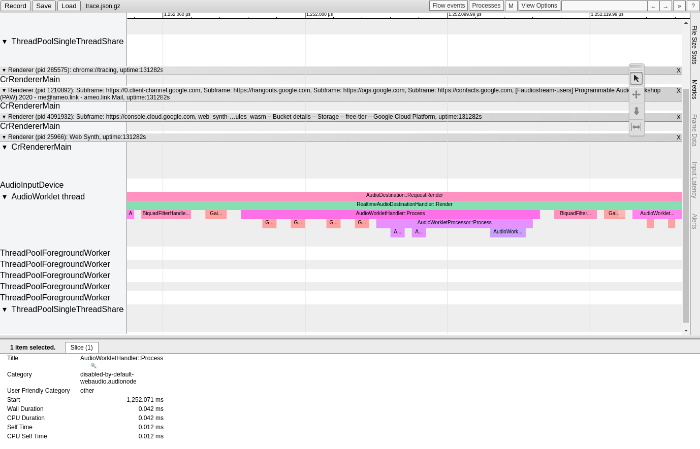

_TL;DR: There is a non-zero cost that scales linearly with the number of parameters `AudioWorkletProcessor`s have. If you are seeing issues with long execution times for `AudioWorkletProcessor::Process` with low execution times on the inner "(author script execution)" for the `process()` method itself, check if the total number of parameters you have on your AWPs is high. In my case, I reduced it from 544 to 96 which got rid of my performance issue entirely._

While working on my [browser-based audio synthesis tool](https://github.com/ameobea/web-synth), I encountered an issue where I was getting clicking and popping audio when playing a polyphonic [wavetable synthesizer](/blog/buliding-a-wavetable-synthesizer-with-rust-wasm-and-webaudio/). Clicking and popping audio is this kind of situation is usually due to the DSP code overrunning its time budget and missing frames which in turn causes buffer underruns where your the application outputs 0s and creates audible jank.

The core DSP code was written in Rust and compiled to WebAssembly so was pretty fast by default, and I'd spent some time tying to optimize that code in the past. Since I was getting kind of desperate, I spent some extra time optimizing the wrapper JavaScript code that handled copying parameter values and inputs + outputs into/out of the WebAssembly heap to use built in typed array methods like `.fill()` and `.set()` rather than doing things one value at a time. Even though the buffers are pretty small (only 128 \* 32bit floating point numbers for each), I thought maybe it would add up.

Unfortunatley, I didn't see success; clicks and pops still came through very badly. I tried reducing the voice count from 16 to 8 which fixed the clicking and popping, but it caused issues when playing notes with long decays since it meant that the old notes which were still playing sometimes had to be recycled before their decays had finished, which sounded even worse than the clicking and popping.

At that point, I figured it was time to break out the big guns. I opened the Google Chrome tracing tools (`chrome://tracing`) and, using the [guide from Google](https://web.dev/profiling-web-audio-apps-in-chrome/) specifically for this purpose, configured it to only record WebAudio-based events.

After drilling down into the profile for `AudioWorklet`s specifically, I was met with this flame chart:

For some context, `AudioDestination::RequestRender` is called periodically when the system needs new samples with which to fill its output buffer. It handles pulling on the WebAudio graph and recursively calling back all the way through to pull samples all the way from the start to the end. In Chrome, it currently seems to always pull 512 samples at a time.

Within that, the vast dominator is `AudioWorkletHandler::Process` which handles setting up the environment for the user-defined `AudioWorkletProcessor`. This consists of allocating (if necessary) and zeroing-out buffers, validating the arguments passed to the user-defined `process()` function inside the processor, and interfacing with the rest of the WebAudio graph. It also includes work involved with pulling from the graph for nodes before it like `GainNode`s, which is what those small salmon-colored marks are before the inner `AudioWorkletProcessor::Process` call.

We're at such a small scale here already that each of those gain nodes is only taking 0.001ms to run, according to the trace. However, for the default sample rate of 44,100hz, `RealtimeAudioDestinationHandler::Render` is called every 128 frames and then calls `AudioWorkletHandler::Process` for each `AudioWorkletProcessor` instance. Since we have 16 processors for each of the 16 voices, that means that it's called 5504 times a second. That means that if it's the only thing in the whole WebAudio graph, there's a budget of 0.18 milliseconds which leaves zero space for jitter and other randomness that comes from running inside a process inside a web browser on an operating system alongside hundreds of other things. There are also other things in the WebAudio graph like filters and gains and whatever other processing the user wants to add which need time to run as well.

None of that even matters, though, because the weird thing is that the actual user-defined `process()` function for the `AudioWorkletProcessor` (hlighted in blue) was only taking a small fraction of the total time to run. This was very surprising, and it meant that most of that optimization work I did didn't matter. The question now was what was taking so long?

Thankfully, Chromium is open source, so I was able to open the source code and find the [actual code](https://source.chromium.org/chromium/chromium/src/+/master:third_party/blink/renderer/modules/webaudio/audio_worklet_processor.cc;l=41;drc=2b7ce5974a172e1d75c3d95bce92c4692dcfd68d;bpv=0;bpt=1) that corresponded to the `AudioWorkletProcessor::Process` function. The two tiny marks at the beginning belonged to the `AudioWorkletProcessor::PortTopologyMatches` function which seems to verify that the JavaScript objects passed for the first two parameters to the `process()` function (`inputs` and `outputs`) are valid and correctly formed.

Literally the only thing between that and the traced call to the user-defined `process()` function itself is [`ParamValueMapMatchesToParamsObject`](https://source.chromium.org/chromium/chromium/src/+/master:third_party/blink/renderer/modules/webaudio/audio_worklet_processor.cc;l=370;drc=726f5faea8365a4c19469bbf379e90ac6ea854cd;bpv=1;bpt=1) for the third `params` object. When I found that code, it clicked: I had a large number of input parameters defined for each of the AWP instances - 34 in fact. Each of them was a-rate, meaning that it could have 128 different values each frame. The code involved looping them them all, allocating and copying some strings, hashmaps, V8 variables, and accessing values from a V8 object - not the cheapest things in the world when you're time budgets are as short as they are. There was also a TODO with a link to [crbug.com/1095113](https://crbug.com/1095113) which listed a potential improvement that could remove the need for an array iteration and comparison loop.

The fix turned out to be as simple as reducing the number of parameters that I used in my `AudioWorkletProcessor`. I had set the maximum number of wavetable dimensions to be 16, but I was only ever using two. That cut the number of parameters per instance from 34 to 6 and from 544 to 96 in total for all the voices. The result was that the clicking + popping went away entirely. The effect is clearly visible on a new trace that I took after making the fix:

The parent `AudioWorkletHandler::Process` call went down from taking an average of 0.055ms to 0.025ms, and `AudioWorkletProcessor::Process` call went down from taking 0.040ms to 0.013ms. The whole `AudioDestination::RequestRender` went down from an average of 5.936ms to 2.311ms - a more than 50% reduction in _total_ audio processing time.

I mostly wrote this in hopes that someone googling for webaudio / audio worklet performance issues who's struggling with the same issues I was will find it and have their time saved. This was my first time that the Chrome profile actually helped me out with a performance regression, and the first time reading browser source code helped as well. As I continue to work with WebAudio in more and more sophisticated ways, I've not yet encountered any issue that can't be be fixed or at least worked around, even for complicated use cases. It's a great foundation to use when building digital signal processing code, and it's been able to handle everything I've thrown at it so far.
