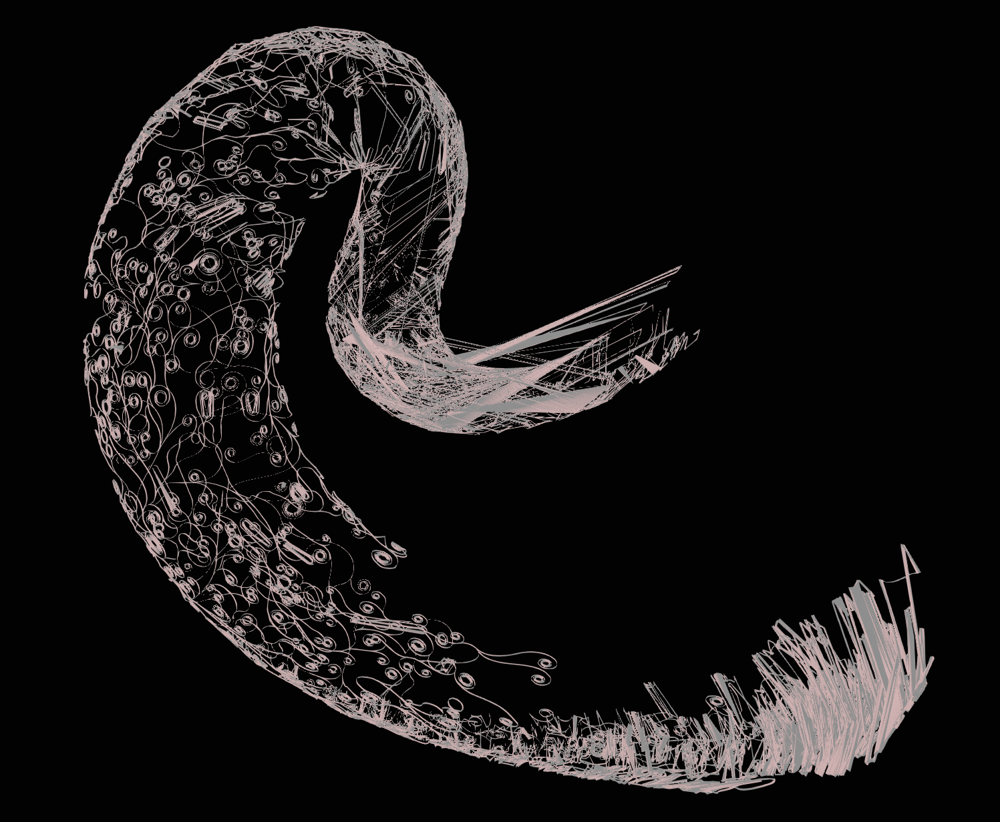

## Overview

I've been working on building a game engine of sorts in Three.JS, and along the way I've been creating some levels and demos for it.  My 3D modelling skills have come a long way but they're still quite bad, so I've been using procedural or semi-procedural generation a lot as part of my work.

For one level I was working on, I wanted to cover the surface of a large building with decorations to help give it a bit more character.  I wanted it to be part of the environment and have it span over large parts of the map, so creating it procedurally seemed like the best idea. I thought it would be cool to have it spread over the surface like vines.

Well, I did end up accomplishing that goal - but the process of getting there was much longer and more complex than I expected.  The solution involves a lot of cool techniques, though, so I figured I'd write this up to go over it.

## 2D Path Generation

The first step of the process involves generating a 2D path representing the structure that will eventually be wrapped around a target mesh.  I wanted to create a pattern that was detailed and intricate without looking random.

I played around with some ideas and eventually settled on something cool-looking.  The algorithm works like this:

 * Pick a starting point and angle as well as a randomized first and second derivative for angle
 * Draw line segments of a fixed length, connecting them end to end
 * With some probability, change the second derivative to a new value for future steps of the iteration
 * Repeat the above until the next segment would intersect some existing segment
 * Pick a random existing segment and start over again until a target number of subpaths have been created

The effect of this is that the trajectories of the paths end up taking tighter and tighter curves, forming those neat-looking spirals.  By changing the second derivative of their turn angle over time, some are able to swing off and take longer paths and expand the overall shape.  By preventing overlapping segments from getting generated, the structure of the generated paths stays clean and overall structure is preserved.


### Accelerating Segment Intersection Checks

For a given candidate segment, checking if it intersects any existing segment can get very expensive once the total segment count reaches the hundreds of thousands.  Since that check needs to be done for each segment that's added, this quickly became an enormous bottleneck to generation speed.

Luckily, this is a common problem.  This kind of thing needs to be done for things like gravity simulations and collision detections for games.  The most common solution is to use space partitioning to cut down on the number of individual collision checks that have to be run.

I chose to create an AABB (axis-aligned bounding box) tree, which is a generalization of a binary search tree that can be used for 2D (or 3D) space.

The idea is that every level you go down the tree, you split the remaining area roughly in half.  Here's a visualization of the tree that is built after generating several paths:


The boxes represent the area covered by one node of the AABB tree.  The color goes from green to red as the depth gets deeper.  The tiny pink boxes represent the AABBs of individual line segments.

By adding new segments to the tree as they're generated and periodically re-balancing the tree, intersection checking is sped up dramatically and the generation of the 2D path can be made quite efficient.

### Tessellation

So at this point, we have the positions of a bunch of line segments that make up the path.  The next step is converting it into a 2D shape that has area.

There's an awesome Rust crate called [`lyon`](https://nical.github.io/posts/lyon-intro.html) which is great for this.  It exposes a builder interface for constructing 2D paths with an interface reminiscent of the browser's `Canvas2D` API.  That can be used to construct a `Path` object which holds information about what space is within the path or outside of it.

`lyon` also has support for _tessellating_ the path.  This takes the abstract definition of the path - which might contain continuous features like bezier curves - and outputs a bunch of discrete triangles which can be rendered using standard graphics APIs.

This is what a small segment of the path looks like after tessellation:


## Geodesic Paths

So at this point, we have a bunch of 2D triangles that represent the path.  We want to wrap these triangles around the surface of some arbitrary mesh.

I looked into replicating what Blender does with its "shrink wrap" modifier.  There are some relatively simple methods like casting rays or snapping points to the closest point on the mesh surface.  None of these work very well for meshes with lots of dynamic, concave, or otherwise complex topology though.

I came up with an idea that is able to handle this a lot better.  There's a concept of a "geodesic path" which refers to the shortest path between two points along the surface of a 3D object.  Building on this, there are [algorithms](https://geometry-central.net/surface/algorithms/geodesic_paths/) for taking a starting point, direction, and distance and returning the point you'd end up on if you were to walk that way along a mesh surface.

Here's a video showing a geodesic path being traced over the surface of a mesh rendered by the [Geodesic Walker](https://markjgillespie.com/Demos/GeodesicWalker/html/) demo:

<div style="display: flex; justify-content: center">
<video controls style="max-width: 100%" poster="https://i.ameo.link/bkq.jpg">
<source src="https://i.ameo.link/bkp.mp4" type="video/mp4">
</video>
</div>

Since the surface is closed with no gaps or boundaries, the walk can continue forever.

If you pick some point on a 2D plane, you can represent any other point in terms of a direction and a distance; that's how polar coordinates work.  If you do this for each vertex of all of the 2D triangles, walk that direction and distance along the mesh surface from some starting point, and then create new triangles out of the resulting 3D points, you'll get a 3D mesh with all of its vertices anchored to the target mesh's surface.

And that's what I did!  I used a C++ library called [`geometry-central`](https://geometry-central.net/) (which is what the geodesic walker demo app from the video above uses) to perform the walks.  For extremely easy meshes like cubes or spheres, it works quite well.  However, it runs into issues with more complex meshes:



The results look quite good close to the starting point at the left side of the mesh, but massive distortion sets in as the walks get longer and longer.  Since the surface of the mesh is formed out of discrete triangles, there are places where a miniscule change in starting direction can cause a dramatically different path to evolve.  This can cause triangles' vertices to be skewed very far apart from each other, which looks extremely bad.

### Graph Traversal Walks

<div class="good">To combat this issue, I came up with the idea of treating the input 2D mesh as a graph and performing the walk as a graph traversal from vertex to vertex rather than walking from the same starting point to all vertices.</div>

This keeps the length of the average walk much shorter and helps cut down significantly on local distortion.  I chose to use a breadth-first search so that points near each other would be traversed at around the same time, again hopefully cutting down on distortion.

Implementing this ended up being a bit of a challenge.  When walking from vertex to vertex, we can compute the distance and direction we need to walk in 2D trivially using the same method as before.  However, since we're starting at the endpoint of a previous walk, that direction is different than the direction we have to walk along the mesh's surface.

To figure that out, we to know the angle in which we walked previously in 2D space, the angle in which we want to walk next in 2D space to get to the next vertex, and the incoming angle of the last walk in the current surface triangle's _tangent space_.

<div class="good">So rather than considering the new direction in absolute terms, we compute each turn as the difference between the old direction and the new direction</div>


Then, we add that to the incoming tangent space direction from the previous walk.  This yields the new outgoing direction in tangent space in which to start the next walk.

### Results

Using this graph traversal method does indeed go very far to solve the problem.  There is still some distortion, but it's immensely improved and more globally distributed than local.  A perfect mapping would preserve the non-self-intersecting property of the original 2D mesh, but that does get violated in a couple places as you can see below:


However, a perfect mapping from a non-flat 3D space to 2D that preserves both geodesic distances and completely avoids distortion [is impossible](https://en.wikipedia.org/wiki/Theorema_Egregium).  The approach that I developed is a tradeoff that works the best for my purposes with this project.

## Extruding to 3D

At this point, the 2D mesh has been mapped to 3D with each of its vertices mapped to some point on the surface of the target mesh.  However, it's still a flat mesh without any volume.  To make it a proper 3D shape, we have to extrude it.

To accomplish this, I used the exact same as the "Extrude Along Normals" operation from Blender.  First, the normal of every triangle in the mesh is computed.  The normal is a vector which is perpendicular, or "shooting out of" the face.  It's extremely useful in all kinds of 3D stuff and it's quite simple to compute.

Then, for each vertex, the normals of all faces it's a part of are summed up and averaged.  This produces a normal vector for each vertex.  Using the computed normal of each vertex, new vertices are created at `position + normal * extrusion_distance`.

The last step is to construct new triangles for the extruded faces as well as two new triangles for each extruded edge to fill them in as quads.  We only construct face bridges between edges that are only part of a single triangle to avoid creating internal faces.

Here's what the extruded mesh looks like as a wireframe:


## Web Worker + Three.JS Integration

As I mentioned, the whole reason I took on this project was so I could use it in my Three.JS game engine.  That means it has to run in the web browser.

### Compiling to WebAssembly

Luckily, `geometry-central` can be compiled to WebAssembly pretty much out of the box.  I had to manually patch a file from the `Eigen` linear algebra library which is used by `geometry-central` under the hood due to a weird issue with the compiler, but once I got that working I was able to generate a `.wasm` file and JavaScript bindings for it.  I adapted the CMake build script from the Geodesic Walker demo and wrote some C++ code of my own to handle taking the 2D mesh input, performing the graph traversal and walks, and generating output 3D coordinates.

As I mentioned before, I used Rust to implement the path generation and tessellation code.  Rust is even easier to compile to WebAssembly than C++, and getting that working was quite smooth.

So I had two Wasm modules - one from the Rust for mesh generation and extrusion, and one from the C++ for the geodesic walking.  The last part I wrote was some TypeScript to glue them together, manage buffers, and pass data back and forth between them.

### Vertex De-Duplication

For the target mesh, I took a `THREE.Mesh` and read its `position` and `index` attributes.  That provides typed arrays of vertex positions and indices which can be read directly by `geometry-central` to construct a surface to be walked.

However, I was running into errors from geometry central when I tried to load in some simple test meshes.  It was complaining that the meshes weren't manifold - meaning that it thought they had interior vertices, self-intersections, or other topology issues that would make the geodesic path walking algorithm fail.  The meshes really were quite simple though and I was sure that they had no such issues.

The issue turned out to be that there were duplicate vertices that had the exact same positions as each other.  This isn't an issue for 3D rendering since it just draws triangles independently.  However, since `geometry-central` needs to be able to interpret the mesh as a graph to carry out its work, it couldn't see that two points defined at exactly the same position were actually the same node in the graph.  This made it think there were disconnected or malformed edges and caused the errors.

<div class="note">The fix turned out to be very simple: Just de-duplicate all the vertices.</div>

If two vertices in the mesh's data are at exactly the same point, delete all but one of them and update the deleted indices to the retained one.  This solved the issues and got the meshes loading successfully.

### Web Worker

There's a decent amount of work that needs to be done to generate this, and I wanted to be able to perform it live when the user loaded the scene.

To avoid locking up the main thread and preventing the rest of the scene from loading, this use-case is a natural fit for a web worker.  As I have many times in the past, I made use of the excellent [`comlink`](https://github.com/GoogleChromeLabs/comlink) library to abstract over the message-passing interface of the web worker and generate a simple promise-based interface to interact with it.


I was also very happy that I was able to get `wasm-bindgen` working inside the web worker without jumping through any hoops.  I've previously run into issues where importing the `wasm-bindgen`-generated code wouldn't work in some browsers or cause CORS errors or similar, but this time it worked without a hitch.

### Three.JS integration

Last step!

At this point, we have generated 3D coordinates and indices for a bunch of triangles which make up the final 3D mesh.  Three.JS provides a class called `BufferGeometry` which lets us create a renderable object out of raw data like this.

This is actually the easiest part by far; here's the whole code for it:

```ts
// Object that we want to wrap our mesh around
const targetMesh: THREE.Mesh = scene.getObjectByName('torus');

const targetMeshIndices = targetMesh.geometry.index.array as Uint16Array;
const targetMeshVertices = targetMesh.geometry.attributes.position.array as Float32Array;

const { indices, vertices, vertexNormals } = await this.worker.generate({
  indices: targetMeshIndices,
  vertices: targetMeshVertices,
});

const geometry = new THREE.BufferGeometry();
geometry.setIndex(new THREE.BufferAttribute(indices, 1));
geometry.setAttribute('position', new THREE.BufferAttribute(vertices, 3));
geometry.setAttribute('normal', new THREE.BufferAttribute(vertexNormals, 3));

// Can use any material you want here
const material = new THREE.MeshStandardMaterial(...);

return new THREE.Mesh(geometry, material);
```

And that's it!  This mesh can be added to the scene, shaded, and rendered just like any other object in Three.JS.

## Interactive Demo

Since we're on the web right now, you can see the results for yourself:

<iframe src="https://3d.ameo.design/runeGenTest.html" loading="lazy" style="display: block; outline: none; border: 1px solid rgb(136, 136, 136); box-sizing: border-box; width: 99%; height: min(80vw, 600px); max-width: 800px; margin-bottom: 26px; overflow: hidden; margin-left: auto; margin-right: auto;"></iframe>

## Conclusion

This whole undertaking took just over a week to accomplish, from start to finish.  A lot of that time was spent dealing with implementation details like getting `geometry-central` compiled to Wasm, debugging issues with memory and buffers when passing data around, and stuff like that though.

In any case, I gained a lot of familiarity with some useful computational geometry concepts and was introduced to the great `geometry-central` library, which I have a feeling I'll be making use of again in the future.

And if I do say so myself, the results do look quite cool :)

The full source code for all of this stuff as well as the THREE.js game engine I'm developing is available [on Github](https://github.com/ameobea/sketches-3d).

----

I often put out updates and little demos of this kind of work as I do it.  If you're interested, you can subscribe to my blog via RSS at the top of the page, follow me on Twitter [@ameobea10](https://twitter.com/ameobea10), or Mastodon [@ameo@mastodon.ameo.dev](https://mastodon.ameo.dev/@ameo).

